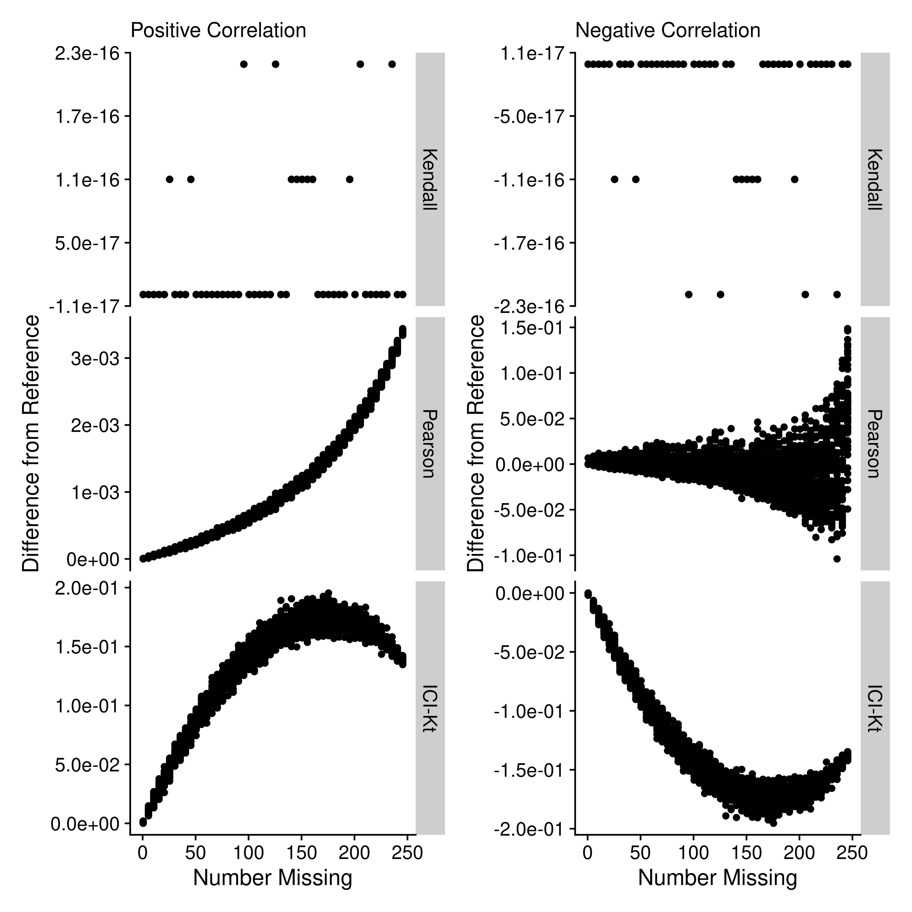
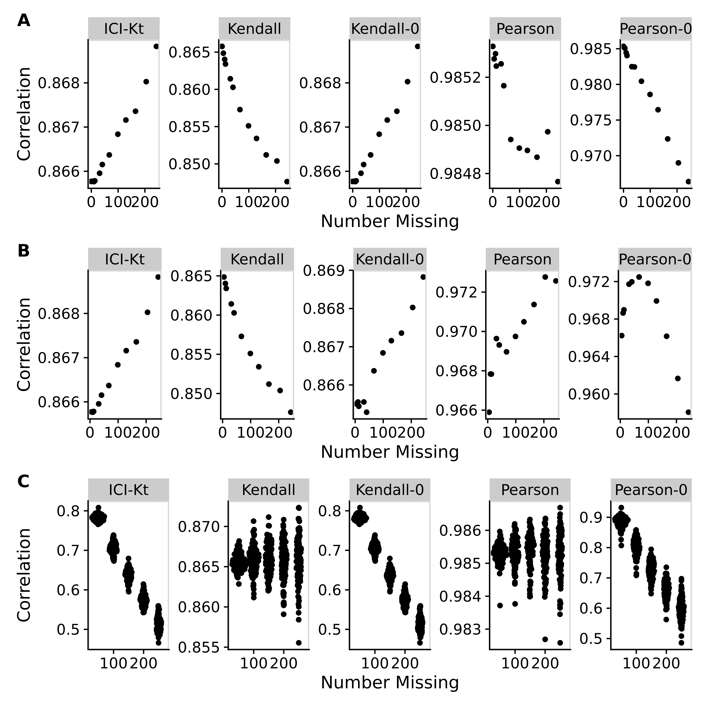

## Abstract

Almost all correlation measures currently available are unable to handle missing values.
Typically, missing values are either ignored completely by removing them or are imputed and used in the calculation of the correlation coefficient.
In both cases, the correlation value will be impacted based on a perspective that missing data represents no useful information.
However, missing values occur in real data sets for a variety of reasons. 
In omics data sets that are derived from analytical measurements, the primary reason for missing values is that a specific measurable phenomenon falls below the detection limits of the analytical instrumentation.
These missing data are not missing at random, but represent some information by their "missingness".
Therefore, we propose an information-content-informed Kendall-tau (ICI-Kt) correlation coefficient that allows missing values to carry explicit information in the determination of concordant and discordant pairs.
With both simulated and real data sets from RNA-seq experiments, we demonstrate that the ICI-Kt allows for the inclusion of missing data values as interpretable information, which allows improved determination of outlier samples prior to differential analysis of omics datasets.
Moreover, our implementation of ICI-Kt uses a mergesort-like algorithm that provides O(nlog(n)) computational performance, a significant improvement over the Kendall-tau correlation available in base R. 

The ICI-Kt correlation calculation is available in an R package and Python module on GitHub at https://github.com/moseleyBioinformaticsLab/ICIKendallTau and https://github.com/moseleyBioinformaticsLab/icikt, respectively.


## Introduction

Correlation as a measure of the relatedness or similarity of two or more sets of data has a long history, with the mathematical technique being used (and abused) in various scientific fields since it's introduction [@pearson_notes_1920; @rodgers_13_1988].
More recently, correlation calculations have become a cornerstone statistical method in the analysis and integration of varied omics' datasets, especially the big five omics: genomics, transcriptomics, proteomics, metabolomics, and epigenomics [@gu_complexheatmap_2016].
Correlation between biomolecular features (nucleotide variants, RNA transcripts, proteins, metabolites) may be used to evaluate the relationship strength between pairs of the features as well as to detect and derive correlative structures between groups of features [@fukushima_integratedomics_2009].
Moreover, feature-feature correlations can be used to evaluate a dataset based on expected biochemical correlations, for example higher feature-feature correlations within lipid categories versus between lipid categories [@mitchellUntargetedLipidomicsNonSmall2021].
Moreover, correlation is a foundational method for generating biomolecular feature-feature interaction networks, like those provided by STRING [@szklarczyk_string_2017], Genemania [@franz_genemania_2018], and WCGNA [@langfelder_wgcna_2008].
Feature-feature correlation may also be used to inform which features are used for imputation of missing values [@faquih_missingvalueworkflow_2020].

Often, the first step in omics level analyses is to examine the sample-sample (dis)similarities in various ways using exploratory data analysis or EDA.
This can include the examination of decomposition by principal components analysis (PCA), sample-sample pairwise distances, or sample-sample pairwise correlations to highlight biological and batch groups [@10.12688/f1000research.7035.2; @10.12688/f1000research.9005.3; @10.12688/f1000research.8987.2], double check that the appropriateness of planned analyses [@flight_timecourseexploration_2010], and check if any samples should be removed prior to statistical analysis (outlier detection and removal) [@gierlinski_statisticalmodels_2015].
Outlier detection, in particular, is often required for successful omics data analysis, as any misstep during the experimentation, sample collection, sample preparation, or analytical measurement of individual samples can inject high error and/or variance into the resulting data set [@10.12688/f1000research.7035.2; @10.12688/f1000research.9005.3; @10.12688/f1000research.8987.2; @moseleyErrorAnalysisPropagation2013; @gierlinski_statisticalmodels_2015].


All analytical methods, and in particular the analytical methods used in omics where many analytes are being measured simultaneously; suffer from missing measurements.
Of course some analytes will be missing at random because of random issues with either the instrument or the particular sample, but a larger number of missing measurements are left-censored due to analytes being below the effective detection limit of the instrument, as shown in Figure 1.
Some analytical instruments are purposely designed to floor measurements when they occur below a certain signal to noise ratio threshold.
Imputation of missing measurements in omics samples is an active area of research, which we will not cover here beyond to say that it is worthwhile and very necessary in many instances.
But when it comes to calculating correlation, there are very few methods that explicitly account for missing data that we know of.
In many cases, missing values may be either ignored and only those measurements that are common across all samples (complete) or common between two samples being compared (pairwise complete) used, or alternatively imputed to zero (or another value) and then included in the correlation calculation.
Each of these are likely to deviate from the real sample-sample correlation values, especially with respect to specific data interpretation perspectives.


Figure 1. 
Graphical description of the left-censored data problem.
An example density plot of the analyte concentrations for a single experimental sample is shown as a solid line. 
The true analyte concentration range covers the full range of the density distribution, with the minimum on the left, and the maximum on the right.
Below certain concentrations, shown by the red line, the instrument returns either missing values (NA), zeros, or some other floored values, resulting in a left-censored distribution.
Above certain concentrations, highlighted by the yellow line, typically the values returned will be identical (or flagged depending on the instrument).
Which analytes will have concentrations in the red region may vary from sample to sample due to the overall sample composition, as well as natural variances (non-systematic error) within each experimental sample.

Assuming that a majority of missing values are not missing at random, but rather result from left-censored distributions due to the analyte being below the effective detection limit (see Figure 1), we propose that these missing values do in fact encode useful information that can be incorporated into correlation calculations.

To create a correlation measure that is capable of working with missing values, we would not be interested in creating a completely new correlation metric from scratch, but modifying an existing one.
Of the three commonly used correlation measures, Pearson, Spearman, and Kendall-tau, Spearman and Kendall-tau seem most appropriate for modification as they solely use ranks in the calculation of their coefficients.
Modifying Pearson would either involve imputing new values, or finding a way to calculate the covariances **with** missingness included.
While Spearman uses ranks, many of the modifications for handling identical ranks and ties do not seem amenable to working with missing values.
In contrast, Kendall-tau's use of concordant and discordant pair counts seemed most amenable to the creation of new definitions that incorporate missingness while still working within the original definition of the correlation coefficient, as shown below.

In this manuscript, we propose new definitions of concordant and discordant rank pairs that include missing values, as well as methods for incorporating missing values into the number of tied values for the equivalent of the modified Kendall-tau coefficient.
We examine the effect of missing values on various simulated data-sets, comparing our information-content-informed Kendall-tau (ICI-Kt) method with other simpler methods of handling the missing values, namely removing them or imputing them to zero.
Given the detrimental effects of including outlier samples on differential analyses, we also evaluate the ability of ICI-Kt to capture sample-sample pairwise similarities and the determination of outlier samples prior to differential analyses.
Finally, we examine the ability to recapitulate ICI-Kt correlation values calculated on a large feature omics data set using feature subsets, which is useful when the execution time of very large feature data sets becomes computationally prohibitive.

All of the code used for this manuscript is available on zenodo [@flightManuscriptICIKendallTau2022].

## Methods

### Additional Definitions of Concordant and Discordant Pairs to Include Missingness

In the simplest form, the Kendall-tau correlation can be defined as:

$$\tau = \frac{ | pairs_{concordant}  | - | pairs_{discordant}  |}{\left | pairs_{concordant} \right | + \left | pairs_{discordant} \right |}$$
In this case a pair are any two x-y points, $x_i, y_i$ and $x_j, y_j$, with $i \neq j$, composed from two joint random variables X and Y, where $x_i$ represents the *ith value* in X and $y_i$ represents the *ith value* in Y.
In an omics context, X and Y can represent feature vectors for two experimental samples or two specific features across an ordered set of samples.
A concordant pair has the following classical definition:

  * $x_i > x_j$ and $y_i > y_j$ 
  * $x_i < x_j$ and $y_i < y_j$

A discordant pair has the following classical definition [@kendall_newmeasure_1938]:

  * $x_i > x_j$ and $y_i < y_j$
  * $x_i < x_j$ and $y_i > y_j$

We can expand the concordant and discordant pair definitions to include missing values (e.g. `NA` in R). 
Here $!x$ indicates a missing value and & is synonymous with "and".
The information-content-informed concordant pair definitions are below:

  * $x_i > x_j$ and $y_i > y_j$
  * $x_i < x_j$ and $y_i < y_j$
  * $x_i > x_j$ and $y_i \& !y_j$
  * $x_i < x_j$ and $!y_i \& y_j$
  * $x_i \& !x_j$ and $y_i > y_j$
  * $!x_i \& x_j$ and $y_i < y_j$ 
  * $x_i \& !x_j$ and $y_i \& !y_j$ 
  * $!x_i \& x_j$ and $!y_i \& y_j$ 
  
The information content informed discordant pair definitions are below:

  * $x_i > x_j$ and $y_i < y_j$ 
  * $x_i < x_j$ and $y_i > y_j$
  * $x_i > x_j$ and $!y_i \& y_j$ 
  * $x_i < x_j$ and $y_i \& !y_j$
  * $x_i \& !x_j$ and $y_i < y_j$
  * $!x_i \& x_j$ and $y_i > y_j$
  * $x_i \& !x_j$ and $!y_i \& y_j$
  * $!x_i \& x_j$ and $y_i \& !y_j$
  
These additional definitions make it possible to calculate a Kendall-tau correlation that **incorporates missing values**, information-content-informed Kendall-tau (ICI-Kt).

### Considering Ties

Tied values do not contribute to either of the concordant or discordant pair counts, and the original Kendall-tau formula which calculates the tau-a statistic does not consider the presence of tied values.
However, the related tau-b statistic does handle the presence of tied values by adding the tied $x$ and $y$ values to the denominator, and in our special case of missing data, we can add the ties that result from both of $(x_i, x_j)$ and $(y_i, y_j)$ being missing into $n_{xtie}$ and $n_{ytie}$ as well [@kendall_treatment_ties_1945; @kendall_rankcorrelationbook_1948].

$$\tau = \frac{\left | pairs_{concordant} \right | - \left | pairs_{discordant} \right |}{\sqrt{(n_0 - n_{xtie})(n_0 - n_{ytie})}}$$

We can also consider commonly missing values in X and Y specially as well.
In the first instance, we remove those x-y points where **both values** are missing.
We refer to this case as the "local" ICI-Kt correlation.
It is most appropriate for the comparison of only two experimental samples, where we are concerned with what values are present in the two experimental samples, with the odd case of missingness.

The other case, where we leave ties resulting from points with missing X and Y, we refer to as the "global" ICI-Kt correlation.
In this case, every single correlation over multiple comparisons with the same set of features will consider the same number of pair comparisons.
This is useful when analyzing and interpreting correlations from a large number of experimental samples, not just two feature vectors.

### Theoretical Maxima

The "global" case also provides an interesting property, whereby we can calculate the theoretical maximum correlation that would be possible to observe given the lowest number of shared missing values.
This value can be useful to scale the rest of the observed correlation values across many sample - sample correlations, providing a value that scales an entire dataset appropriately.
For any pairwise comparison of two vectors (from experimental samples for example), we can calculate the maximum possible Kendall-tau for that comparison by defining the maximum number of concordant pairs as:

$$tau_{max} = \frac{\left | pairsmax_{concordant} \right |}{
\sqrt{(n_0 - n_{xtie})(n_0 - n_{ytie})}
}$$

Where:

$$pairsmax_{concordant} = n_0 - n_{xtie} - n_{ytie} - n_{tie}$$

Calculating a set of $tau_{max}$ values between all experimental samples, we can take the maximum of those values, and use it to scale all of the obtained Kendall-tau values.

### Implementation Details

We produced an initial reference implementation in R [@rcoreteam_rlanguage_2020] where the various concordant and discordant pair definitions were written as simple logical tests to allow further exploration and validation of faster implementations.
In practice, it is possible to **replace the missing values with a value that is smaller than all of the values in the two sets of values under consideration**, and then do tests of signs to define concordant and discordant pairs (see the definitions of concordant and discordant pairs above).
We note here that this is **not imputation of missing values**

After this initial implementation, we used the *SciPy* [@virtanen_scipy_2020] *kendalltau* code as a model to create a mergesort based implementation that has a complexity of O(nlog(n)), in comparison to the pairwise testing that has a complexity of O(n^2) [@knight_mergesortkendall_1966].
This provides a 460X speedup of the runtime to compare two feature vectors with lengths of 40,000.
In comparison to directly counting the concordant and discordant pairs, some of the values in the mergesort implementation can reach the 32 bit default limit in C++.
Therefore, we used 64 bit integers and floats where necessary in the *Rcpp* code.

C++ (via *Rcpp* [@eddelbuettel_rcppseamless_2011; @eddelbuettel_seamlessbook_2013; @eddelbuettel_extendingrcpp_2018]) and R code implementations are in the src/kendallc.cpp and R/kendalltau.R files of the ICIKendallTau R package, hosted at https://github.com/MoseleyBioinformaticsLab/ICIKendallTau.
The version of the package used in this manuscript is available on zenodo [@flightICIKendallTau2022].

When a large number of samples need to be compared, it may be useful to split the comparisons across compute instances (across hyperthreaded cores, physical cores, or physical compute nodes).
The *furrr* R package makes the definition of compute clusters easy [@vaughanFurrrApplyMapping2021].
For a large correlation matrix computation, we first define the sample-sample comparisons to be performed, then check how many instances of compute are available (defined by a previous call to *furrr*), and finally split the comparisons into a list that can be easily distributed using the *furrr::future_map* function.

We also implemented a package in Python 3 with the same functionality and similar interface to the R package, hosted on GitHub (https://github.com/MoseleyBioinformaticsLab/icikt) and Python Package Index (https://pypi.org/project/icikt).
Appropriate portions of the package were *cythonized* to achieve similar execution performance to the R package.
We used the *multiprocessing* Python package to distribute the sample-sample comparisons calculations across cores with very little overhead.
This package includes both an application programming interface (API) with equivalent parameter options to the R package implementation and a command line interface (CLI) for generating straight-forward correlation matrix analyses without the need to write Python scripts.


### Simulated Data Sets

Simulated feature vectors (analytical samples) are generated by drawing 1000 random values from a log-normal distribution with a mean of 1 and standard deviation (sd) of 0.5 and sorting them in ascending order.
The negative analytical sample has values sorted in descending order.
Missing value indices are generated by randomly sampling up to 499 of the lowest values in each sample.
For the negative sample, the indices are also subtracted from 1000 to cause them to be at the lower end of the feature distribution.
Finally, missing indices were only inserted into one of the two samples being compared before calculating the correlation.
The missing indices are replaced with NA, and then correlations between the analytical samples are calculated.

Another, more realistic, simulated data set is generated by drawing 1000 random values from a log-normal distribution, and adding noise from a normal distribution with a mean of zero and sd of 0.2 to create two statistical samples.
Missing values are created in these statistical samples via two methods: 1) by creating intensity cutoffs from 0 to 1.5 in 0.1 increments, values below the cutoff set to missing or zero depending on the calculation; 2) randomly sampling locations in the two-sample matrix ranging from zero to 300 in increments of 50 and setting the indices to missing or zero.

### Brainson RNA-Seq Data Set

This RNA-Seq dataset is from null and knock-in EGFR mice mutants.
Genotypes include Null (no mutant-EGFR inducible expression), Heterozygous (only one copy of mutant-EGFR), Homozygous (two copies of mutant EGFR).
For each mutant, they were also grown in different ways and sequenced: (1) 2D plates; (2) 3D organoids; (3) cells sorted and selected using FACS; (4) total tumor without sorting.
See [@chenCellularOriginsEGFRDriven2021] for the full experimental details.

### Yeast RNA-Seq Data Set

Summarized gene level counts were obtained from a GitHub project maintained by the Barton group [@coleProfilingDifferentialGene2021].
It should be noted that the data are also available from two figshare repositories [@bartonSNF2KnockoutYeast2015; @bartonWildtypeYeastGene2015].
These data were generated and reported as part of two publications evaluating replicate data and differential gene expression [@gierlinski_statisticalmodels_2015; @schurchHowManyBiological2016].

The original outliers reported by Gierliński et al are based on a combination of median correlations, feature outliers, and RNA-seq coverage.
Given that we want to compare outliers based on correlation, we re-determined outliers using only correlation calculated by replacing zero counts with missing values and calculating sample - sample pairwise Pearson correlations on the raw feature counts using the genes present in both samples.

### Adenocarcinoma Recount RNA-Seq Data Set

We downloaded the recount2 TCGA lung cancer data [@collado-torres_recount2_2017], extracted the scaled counts, and trimmed to the Stage I adenocarcinoma samples, and those genes that have a non-zero count in at least one of the samples.

Pearson and Kendall-tau correlations are calculated with zero, as well as replacing zero values with NA.

### Completeness

As an addition to the correlation, we also calculate the *completeness* between any two samples.
We first measure the number of entries missing in either of the samples being compared, and subtract that from the total number of features in the samples.
This defines how many features are potentially *complete* between the two samples.
This number, over the total number of features defines the *completeness* fraction.

$$comp = \frac{n_{feat} - (miss_i | miss_j)}{n_{feat}}$$

### Computing Environment

Most calculations were run on a virtual machine with 80 virtual cores, and 1 TB of RAM.
The virtual machine is running on top of a 50 node cluster, each with 4 10-core processors, 3TB of RAM and an 8TB solid-state-drive array, provided by the Kentucky Research Informatics Cloud (KyRIC).
KyRIC manages the virtual machines via an OpenStack instance.
We used the *targets* package to manage calculation dependencies [@landau_drakepackage_2018].
For the comparisons of time taken using different numbers of samples to evaluate the algorithmic complexity, calculations were run on a single laptop Intel i7 core clocked at 2.2 GHz.

## Results


### Comparison To Other Correlation Measures

We compared the ICI-Kt correlation to both Pearson and regular Kendall-tau-b correlations as calculated by the built-in R functions using simulated data sets with missing values (Figures S1-S3).

We created two samples with 1000 observations each drawn from a log-normal distribution, and sorted in each case.
The *true* correlation for each of the Kendall and Pearson correlations were calculated, and then missingness was introduced in the lower range of values (see Methods).


<!-- -->

Figure 2. The effect on Kendall, Pearson and ICI-Kt correlations as increasing number of missing values in the bottom half of either sample for both positively and negatively correlated samples.
A subset of 10,000 points was used for visualization.
Pay attention to the orders of magnitude differences between the y-axis scales.

In Figure 2, we can see that as missing values are added, only the ICI-Kt correlation values change in any significant way.
As the number of missing values increase, the ICI-Kt values drop or increase by up to 0.2.
Similarly, Pearson correlation is also affected, but the degree of change in the correlation values are much less (notice the orders of magnitude differences in the y-axis scales), on the order of only 0.003 for the positive case and 0.1 for the negative case.
Also, the lack of symmetry in the Pearson negative comparisons is due to the lack of linear correlation between the samples.
These results demonstrate that the ICI-Kt correlation has quantitative sensitivity to missing values over the normal Kendall tau correlation and linear Pearson correlation where points with missing values are ignored (pairwise complete).

### Effect of Left Censoring VS Random Missing Data


<!-- -->

Figure 3. Effect of introducing missing values from a cutoff (A & B) or randomly (C) on different measures of correlation, including ICI-Kt, Kendall with pairwise complete, Kendall replacing missing with 0, Pearson with pairwise complete, and Pearson replacing missing with 0.
A) Missing values introduced by setting an increasing cutoff.
B) Missing values introduced by setting an increasing cutoff, and then log-transforming the values before calculating correlation.
C) Missing values introduced at random.
For the random case, each sample of random positions was repeated 100 times.

Figure 3 demonstrates the effect of introducing left-center versus random missingness in five different measures of correlation, including the ICI-Kt, the normal Kendall tau with pairwise complete, the normal Kendall tau replacing missing with 0, Pearson with pairwise complete, and Pearson replacing missing with 0.
The ICI-Kt correlation demonstrates a slight increase from the starting 0.86 correlation value with growing left-centered missingness caused by a slight reinforcement of the correlation, while with **growing random missingness**, the ICI-Kt correlation drops precipitously due to the large increase in discordant pairs caused by the random missing values.
The normal Kendall tau correlation with pairwise complete has a small decrease in the correlation value with growing left-centered missingness caused by a loss of supporting pairs, while this correlation has a near constant average value with growing random missingness.
The normal Kendall tau correlation replacing missing with 0 has identical behavior to the ICI-Kt correlation.
In contrast to ICI-Kt, the Pearson correlation calculated using only pairwise complete entries is **constant** over growing left-centered and random missingness.
When replacing missing values with zero, Pearson correlation demonstrates a small decrease in the correlation value with growing left-centered missingness due to the zero values causing some deviation from linearity. 
Pearson correlation drops precipitously with growing random missingness with a magnitude similar to the ICI-Kt and normal Kendall tau replacing missing with 0.
Overall, the ICI-Kt and the normal Kendall-tau replacing missing with zero have the desirable characteristics of maintaining the correlation with growing left-centered missing **while sharply dropping the correlation** with growing random missingness.
In a naive treatment of the left-centered missing data, if the values below the cutoff are set to missing followed by log-transforming the values and subsequently setting missing values to 0, then the Kendall tau correlation replacing missing with 0 will show some very odd patterns at low intensity cutoffs due to the introduction of discordant pairs.
Likewise, Pearson correlation replacing missing with 0 shows a parabolic effect with increasing missing values.

We note here that the typical way we've observed of handling missing data in correlation calculations is to ignore them completely and use the pairwise complete cases to calculate the Pearson correlation coefficient.
As shown in Figure 3C, this results in a complete misestimation of the changed correlative structure introduced by missing at random (MAR) entries.
ICI-Kt, in contrast, incorporates the missingness in a sensical way, and the resulting correlation values fall as MAR entries are introduced.

### Performance

We compared the performance of our *Rcpp* *mergesort* implementation to the base R *cor* function using both "pearson" and "kendall" methods on a single core with increasing numbers of features.


Figure 4A shows that base R `cor` "kendall" method is the slowest by far.
Zoomed out (inset), the ICI-Kt appears as fast as using "pearson", but upon zooming in, it's possible to see that ICI-Kt is using increasing amounts of time much faster than "pearson".
In fact, regressing the time to number of samples using a formula with the expected algorithmic complexity, "pearson" shows O(n), ICI-Kt is O(nlog(n)), and "kendall" is O(n^2) (see Figure S4).

As we implemented a relatively easy way to make use of multiple cores using `future`, we also verified that increases in run time using multiple cores was reasonable as well.
Figure 4B shows that as samples are added, the run time quickly increases logarithmically, similar to increasing samples on a single core (see Figure 4A).

<!-- -->

Figure 4. (A) Comparison of the *Rcpp* *mergesort* *ici_kt*, and base R's *cor* function using the "pearson" and "kendall" methods as the number of features are increased from 100 to 5000.
Inset is the expanded view showing the full range of computation time in seconds.
(B) Log of time taken to calculate all pairwise comparisons for different numbers of samples in multicore processing.


### Utility in Large Omics' Data Sets

#### Detecting Outlier Samples


We analyzed three RNA-Seq datasets for possible outliers using a variety of  different correlation and correlation-related metrics: (1) ICI-Kt; (2) ICI-Kt scaled by *completeness* (see Methods); (3) Pearson correlation; (4) Pearson using pairwise complete features; (5) Pearson on log(value + 1); (6) Pearson on log(value); and (7) Kendall-tau.
We primarily concentrate on the ICI-Kt, ICI-Kt * completeness, and Pearson log(x + 1) here, but all outliers by method are shown in the Supplemental materials (Figures S5-S7, Tables S1, S2).
Additionally, we compared how the outliers change if we require that a feature is present in at least a certain fraction of samples of a class with each different correlation measure (Figures S8-S16).
For each dataset and correlation-related metric, the median correlation for a sample was calculated amongst the samples for each sub-group of samples corresponding to an experimental condition of interest (disease, mutant, how cells were grown).


<!-- -->

Figure 5.
Median correlations for each of the yeast RNA-Seq sample to all other samples in the same group, using either ICI-Kt, ICI-Kt * completeness or Pearson Log(x + 1) correlation.


Table 1.
Yeast dataset median correlation values and outlier determination for each outlier from each of the correlation methods.


``````{=openxml}

<w:tbl xmlns:w="http://schemas.openxmlformats.org/wordprocessingml/2006/main" xmlns:r="http://schemas.openxmlformats.org/officeDocument/2006/relationships" xmlns:w14="http://schemas.microsoft.com/office/word/2010/wordml" xmlns:wp="http://schemas.openxmlformats.org/drawingml/2006/wordprocessingDrawing" xmlns:a="http://schemas.openxmlformats.org/drawingml/2006/main" xmlns:pic="http://schemas.openxmlformats.org/drawingml/2006/picture"><w:tblPr><w:tblLayout w:type="fixed"/><w:jc w:val="center"/><w:tblLook w:firstRow="1" w:lastRow="0" w:firstColumn="0" w:lastColumn="0" w:noHBand="0" w:noVBand="1"/></w:tblPr><w:tblGrid><w:gridCol w:w="1080"/><w:gridCol w:w="1152"/><w:gridCol w:w="1440"/><w:gridCol w:w="1152"/><w:gridCol w:w="1440"/><w:gridCol w:w="1152"/><w:gridCol w:w="1440"/></w:tblGrid><w:tr><w:trPr><w:trHeight w:val="360" w:hRule="auto"/><w:tblHeader/></w:trPr>header 1<w:tc><w:tcPr><w:tcBorders><w:bottom w:val="single" w:sz="12" w:space="0" w:color="666666"/><w:top w:val="single" w:sz="12" w:space="0" w:color="666666"/><w:left w:val="none" w:sz="0" w:space="0" w:color="000000"/><w:right w:val="none" w:sz="0" w:space="0" w:color="000000"/></w:tcBorders><w:shd w:val="clear" w:color="auto" w:fill="FFFFFF"/><w:tcMar><w:top w:w="0" w:type="dxa"/><w:bottom w:w="0" w:type="dxa"/><w:left w:w="0" w:type="dxa"/><w:right w:w="0" w:type="dxa"/></w:tcMar><w:vAlign w:val="center"/></w:tcPr><w:p><w:pPr><w:pStyle w:val="Normal"/><w:jc w:val="left"/><w:pBdr><w:bottom w:val="none" w:sz="0" w:space="0" w:color="000000"/><w:top w:val="none" w:sz="0" w:space="0" w:color="000000"/><w:left w:val="none" w:sz="0" w:space="0" w:color="000000"/><w:right w:val="none" w:sz="0" w:space="0" w:color="000000"/></w:pBdr><w:spacing w:after="100" w:before="100" w:line="240"/><w:ind w:left="100" w:right="100" w:firstLine="0" w:firstLineChars="0"/></w:pPr><w:r xmlns:w="http://schemas.openxmlformats.org/wordprocessingml/2006/main" xmlns:wp="http://schemas.openxmlformats.org/drawingml/2006/wordprocessingDrawing" xmlns:r="http://schemas.openxmlformats.org/officeDocument/2006/relationships" xmlns:w14="http://schemas.microsoft.com/office/word/2010/wordml"><w:rPr><w:rFonts w:ascii="DejaVu Sans" w:hAnsi="DejaVu Sans" w:eastAsia="DejaVu Sans" w:cs="DejaVu Sans"/><w:i w:val="false"/><w:b w:val="false"/><w:u w:val="none"/><w:sz w:val="22"/><w:szCs w:val="22"/><w:color w:val="000000"/></w:rPr><w:t xml:space="preserve"></w:t></w:r></w:p></w:tc><w:tc><w:tcPr><w:gridSpan w:val="2"/><w:tcBorders><w:bottom w:val="single" w:sz="12" w:space="0" w:color="666666"/><w:top w:val="single" w:sz="12" w:space="0" w:color="666666"/><w:left w:val="none" w:sz="0" w:space="0" w:color="000000"/><w:right w:val="none" w:sz="0" w:space="0" w:color="000000"/></w:tcBorders><w:shd w:val="clear" w:color="auto" w:fill="FFFFFF"/><w:tcMar><w:top w:w="0" w:type="dxa"/><w:bottom w:w="0" w:type="dxa"/><w:left w:w="0" w:type="dxa"/><w:right w:w="0" w:type="dxa"/></w:tcMar><w:vAlign w:val="center"/></w:tcPr><w:p><w:pPr><w:pStyle w:val="Normal"/><w:jc w:val="left"/><w:pBdr><w:bottom w:val="none" w:sz="0" w:space="0" w:color="000000"/><w:top w:val="none" w:sz="0" w:space="0" w:color="000000"/><w:left w:val="none" w:sz="0" w:space="0" w:color="000000"/><w:right w:val="none" w:sz="0" w:space="0" w:color="000000"/></w:pBdr><w:spacing w:after="100" w:before="100" w:line="240"/><w:ind w:left="100" w:right="100" w:firstLine="0" w:firstLineChars="0"/></w:pPr><w:r xmlns:w="http://schemas.openxmlformats.org/wordprocessingml/2006/main" xmlns:wp="http://schemas.openxmlformats.org/drawingml/2006/wordprocessingDrawing" xmlns:r="http://schemas.openxmlformats.org/officeDocument/2006/relationships" xmlns:w14="http://schemas.microsoft.com/office/word/2010/wordml"><w:rPr><w:rFonts w:ascii="DejaVu Sans" w:hAnsi="DejaVu Sans" w:eastAsia="DejaVu Sans" w:cs="DejaVu Sans"/><w:i w:val="false"/><w:b w:val="false"/><w:u w:val="none"/><w:sz w:val="22"/><w:szCs w:val="22"/><w:color w:val="000000"/></w:rPr><w:t xml:space="preserve">ICI-Kt</w:t></w:r></w:p></w:tc><w:tc><w:tcPr><w:gridSpan w:val="2"/><w:tcBorders><w:bottom w:val="single" w:sz="12" w:space="0" w:color="666666"/><w:top w:val="single" w:sz="12" w:space="0" w:color="666666"/><w:left w:val="none" w:sz="0" w:space="0" w:color="000000"/><w:right w:val="none" w:sz="0" w:space="0" w:color="000000"/></w:tcBorders><w:shd w:val="clear" w:color="auto" w:fill="FFFFFF"/><w:tcMar><w:top w:w="0" w:type="dxa"/><w:bottom w:w="0" w:type="dxa"/><w:left w:w="0" w:type="dxa"/><w:right w:w="0" w:type="dxa"/></w:tcMar><w:vAlign w:val="center"/></w:tcPr><w:p><w:pPr><w:pStyle w:val="Normal"/><w:jc w:val="left"/><w:pBdr><w:bottom w:val="none" w:sz="0" w:space="0" w:color="000000"/><w:top w:val="none" w:sz="0" w:space="0" w:color="000000"/><w:left w:val="none" w:sz="0" w:space="0" w:color="000000"/><w:right w:val="none" w:sz="0" w:space="0" w:color="000000"/></w:pBdr><w:spacing w:after="100" w:before="100" w:line="240"/><w:ind w:left="100" w:right="100" w:firstLine="0" w:firstLineChars="0"/></w:pPr><w:r xmlns:w="http://schemas.openxmlformats.org/wordprocessingml/2006/main" xmlns:wp="http://schemas.openxmlformats.org/drawingml/2006/wordprocessingDrawing" xmlns:r="http://schemas.openxmlformats.org/officeDocument/2006/relationships" xmlns:w14="http://schemas.microsoft.com/office/word/2010/wordml"><w:rPr><w:rFonts w:ascii="DejaVu Sans" w:hAnsi="DejaVu Sans" w:eastAsia="DejaVu Sans" w:cs="DejaVu Sans"/><w:i w:val="false"/><w:b w:val="false"/><w:u w:val="none"/><w:sz w:val="22"/><w:szCs w:val="22"/><w:color w:val="000000"/></w:rPr><w:t xml:space="preserve">ICI-Kt * Completeness</w:t></w:r></w:p></w:tc><w:tc><w:tcPr><w:gridSpan w:val="2"/><w:tcBorders><w:bottom w:val="single" w:sz="12" w:space="0" w:color="666666"/><w:top w:val="single" w:sz="12" w:space="0" w:color="666666"/><w:left w:val="none" w:sz="0" w:space="0" w:color="000000"/><w:right w:val="none" w:sz="0" w:space="0" w:color="000000"/></w:tcBorders><w:shd w:val="clear" w:color="auto" w:fill="FFFFFF"/><w:tcMar><w:top w:w="0" w:type="dxa"/><w:bottom w:w="0" w:type="dxa"/><w:left w:w="0" w:type="dxa"/><w:right w:w="0" w:type="dxa"/></w:tcMar><w:vAlign w:val="center"/></w:tcPr><w:p><w:pPr><w:pStyle w:val="Normal"/><w:jc w:val="left"/><w:pBdr><w:bottom w:val="none" w:sz="0" w:space="0" w:color="000000"/><w:top w:val="none" w:sz="0" w:space="0" w:color="000000"/><w:left w:val="none" w:sz="0" w:space="0" w:color="000000"/><w:right w:val="none" w:sz="0" w:space="0" w:color="000000"/></w:pBdr><w:spacing w:after="100" w:before="100" w:line="240"/><w:ind w:left="100" w:right="100" w:firstLine="0" w:firstLineChars="0"/></w:pPr><w:r xmlns:w="http://schemas.openxmlformats.org/wordprocessingml/2006/main" xmlns:wp="http://schemas.openxmlformats.org/drawingml/2006/wordprocessingDrawing" xmlns:r="http://schemas.openxmlformats.org/officeDocument/2006/relationships" xmlns:w14="http://schemas.microsoft.com/office/word/2010/wordml"><w:rPr><w:rFonts w:ascii="DejaVu Sans" w:hAnsi="DejaVu Sans" w:eastAsia="DejaVu Sans" w:cs="DejaVu Sans"/><w:i w:val="false"/><w:b w:val="false"/><w:u w:val="none"/><w:sz w:val="22"/><w:szCs w:val="22"/><w:color w:val="000000"/></w:rPr><w:t xml:space="preserve">Pearson Log(x + 1)</w:t></w:r></w:p></w:tc></w:tr><w:tr><w:trPr><w:trHeight w:val="360" w:hRule="auto"/><w:tblHeader/></w:trPr>header 2<w:tc><w:tcPr><w:tcBorders><w:bottom w:val="single" w:sz="12" w:space="0" w:color="666666"/><w:top w:val="single" w:sz="12" w:space="0" w:color="666666"/><w:left w:val="none" w:sz="0" w:space="0" w:color="000000"/><w:right w:val="none" w:sz="0" w:space="0" w:color="000000"/></w:tcBorders><w:shd w:val="clear" w:color="auto" w:fill="FFFFFF"/><w:tcMar><w:top w:w="0" w:type="dxa"/><w:bottom w:w="0" w:type="dxa"/><w:left w:w="0" w:type="dxa"/><w:right w:w="0" w:type="dxa"/></w:tcMar><w:vAlign w:val="center"/></w:tcPr><w:p><w:pPr><w:pStyle w:val="Normal"/><w:jc w:val="left"/><w:pBdr><w:bottom w:val="none" w:sz="0" w:space="0" w:color="000000"/><w:top w:val="none" w:sz="0" w:space="0" w:color="000000"/><w:left w:val="none" w:sz="0" w:space="0" w:color="000000"/><w:right w:val="none" w:sz="0" w:space="0" w:color="000000"/></w:pBdr><w:spacing w:after="100" w:before="100" w:line="240"/><w:ind w:left="100" w:right="100" w:firstLine="0" w:firstLineChars="0"/></w:pPr><w:r xmlns:w="http://schemas.openxmlformats.org/wordprocessingml/2006/main" xmlns:wp="http://schemas.openxmlformats.org/drawingml/2006/wordprocessingDrawing" xmlns:r="http://schemas.openxmlformats.org/officeDocument/2006/relationships" xmlns:w14="http://schemas.microsoft.com/office/word/2010/wordml"><w:rPr><w:rFonts w:ascii="DejaVu Sans" w:hAnsi="DejaVu Sans" w:eastAsia="DejaVu Sans" w:cs="DejaVu Sans"/><w:i w:val="false"/><w:b w:val="false"/><w:u w:val="none"/><w:sz w:val="22"/><w:szCs w:val="22"/><w:color w:val="000000"/></w:rPr><w:t xml:space="preserve">Sample</w:t></w:r></w:p></w:tc><w:tc><w:tcPr><w:tcBorders><w:bottom w:val="single" w:sz="12" w:space="0" w:color="666666"/><w:top w:val="single" w:sz="12" w:space="0" w:color="666666"/><w:left w:val="none" w:sz="0" w:space="0" w:color="000000"/><w:right w:val="none" w:sz="0" w:space="0" w:color="000000"/></w:tcBorders><w:shd w:val="clear" w:color="auto" w:fill="FFFFFF"/><w:tcMar><w:top w:w="0" w:type="dxa"/><w:bottom w:w="0" w:type="dxa"/><w:left w:w="0" w:type="dxa"/><w:right w:w="0" w:type="dxa"/></w:tcMar><w:vAlign w:val="center"/></w:tcPr><w:p><w:pPr><w:pStyle w:val="Normal"/><w:jc w:val="left"/><w:pBdr><w:bottom w:val="none" w:sz="0" w:space="0" w:color="000000"/><w:top w:val="none" w:sz="0" w:space="0" w:color="000000"/><w:left w:val="none" w:sz="0" w:space="0" w:color="000000"/><w:right w:val="none" w:sz="0" w:space="0" w:color="000000"/></w:pBdr><w:spacing w:after="100" w:before="100" w:line="240"/><w:ind w:left="100" w:right="100" w:firstLine="0" w:firstLineChars="0"/></w:pPr><w:r xmlns:w="http://schemas.openxmlformats.org/wordprocessingml/2006/main" xmlns:wp="http://schemas.openxmlformats.org/drawingml/2006/wordprocessingDrawing" xmlns:r="http://schemas.openxmlformats.org/officeDocument/2006/relationships" xmlns:w14="http://schemas.microsoft.com/office/word/2010/wordml"><w:rPr><w:rFonts w:ascii="DejaVu Sans" w:hAnsi="DejaVu Sans" w:eastAsia="DejaVu Sans" w:cs="DejaVu Sans"/><w:i w:val="false"/><w:b w:val="false"/><w:u w:val="none"/><w:sz w:val="22"/><w:szCs w:val="22"/><w:color w:val="000000"/></w:rPr><w:t xml:space="preserve">Outlier</w:t></w:r></w:p></w:tc><w:tc><w:tcPr><w:tcBorders><w:bottom w:val="single" w:sz="12" w:space="0" w:color="666666"/><w:top w:val="single" w:sz="12" w:space="0" w:color="666666"/><w:left w:val="none" w:sz="0" w:space="0" w:color="000000"/><w:right w:val="none" w:sz="0" w:space="0" w:color="000000"/></w:tcBorders><w:shd w:val="clear" w:color="auto" w:fill="FFFFFF"/><w:tcMar><w:top w:w="0" w:type="dxa"/><w:bottom w:w="0" w:type="dxa"/><w:left w:w="0" w:type="dxa"/><w:right w:w="0" w:type="dxa"/></w:tcMar><w:vAlign w:val="center"/></w:tcPr><w:p><w:pPr><w:pStyle w:val="Normal"/><w:jc w:val="right"/><w:pBdr><w:bottom w:val="none" w:sz="0" w:space="0" w:color="000000"/><w:top w:val="none" w:sz="0" w:space="0" w:color="000000"/><w:left w:val="none" w:sz="0" w:space="0" w:color="000000"/><w:right w:val="none" w:sz="0" w:space="0" w:color="000000"/></w:pBdr><w:spacing w:after="100" w:before="100" w:line="240"/><w:ind w:left="100" w:right="100" w:firstLine="0" w:firstLineChars="0"/></w:pPr><w:r xmlns:w="http://schemas.openxmlformats.org/wordprocessingml/2006/main" xmlns:wp="http://schemas.openxmlformats.org/drawingml/2006/wordprocessingDrawing" xmlns:r="http://schemas.openxmlformats.org/officeDocument/2006/relationships" xmlns:w14="http://schemas.microsoft.com/office/word/2010/wordml"><w:rPr><w:rFonts w:ascii="DejaVu Sans" w:hAnsi="DejaVu Sans" w:eastAsia="DejaVu Sans" w:cs="DejaVu Sans"/><w:i w:val="false"/><w:b w:val="false"/><w:u w:val="none"/><w:sz w:val="22"/><w:szCs w:val="22"/><w:color w:val="000000"/></w:rPr><w:t xml:space="preserve">Correlation</w:t></w:r></w:p></w:tc><w:tc><w:tcPr><w:tcBorders><w:bottom w:val="single" w:sz="12" w:space="0" w:color="666666"/><w:top w:val="single" w:sz="12" w:space="0" w:color="666666"/><w:left w:val="none" w:sz="0" w:space="0" w:color="000000"/><w:right w:val="none" w:sz="0" w:space="0" w:color="000000"/></w:tcBorders><w:shd w:val="clear" w:color="auto" w:fill="FFFFFF"/><w:tcMar><w:top w:w="0" w:type="dxa"/><w:bottom w:w="0" w:type="dxa"/><w:left w:w="0" w:type="dxa"/><w:right w:w="0" w:type="dxa"/></w:tcMar><w:vAlign w:val="center"/></w:tcPr><w:p><w:pPr><w:pStyle w:val="Normal"/><w:jc w:val="left"/><w:pBdr><w:bottom w:val="none" w:sz="0" w:space="0" w:color="000000"/><w:top w:val="none" w:sz="0" w:space="0" w:color="000000"/><w:left w:val="none" w:sz="0" w:space="0" w:color="000000"/><w:right w:val="none" w:sz="0" w:space="0" w:color="000000"/></w:pBdr><w:spacing w:after="100" w:before="100" w:line="240"/><w:ind w:left="100" w:right="100" w:firstLine="0" w:firstLineChars="0"/></w:pPr><w:r xmlns:w="http://schemas.openxmlformats.org/wordprocessingml/2006/main" xmlns:wp="http://schemas.openxmlformats.org/drawingml/2006/wordprocessingDrawing" xmlns:r="http://schemas.openxmlformats.org/officeDocument/2006/relationships" xmlns:w14="http://schemas.microsoft.com/office/word/2010/wordml"><w:rPr><w:rFonts w:ascii="DejaVu Sans" w:hAnsi="DejaVu Sans" w:eastAsia="DejaVu Sans" w:cs="DejaVu Sans"/><w:i w:val="false"/><w:b w:val="false"/><w:u w:val="none"/><w:sz w:val="22"/><w:szCs w:val="22"/><w:color w:val="000000"/></w:rPr><w:t xml:space="preserve">Outlier</w:t></w:r></w:p></w:tc><w:tc><w:tcPr><w:tcBorders><w:bottom w:val="single" w:sz="12" w:space="0" w:color="666666"/><w:top w:val="single" w:sz="12" w:space="0" w:color="666666"/><w:left w:val="none" w:sz="0" w:space="0" w:color="000000"/><w:right w:val="none" w:sz="0" w:space="0" w:color="000000"/></w:tcBorders><w:shd w:val="clear" w:color="auto" w:fill="FFFFFF"/><w:tcMar><w:top w:w="0" w:type="dxa"/><w:bottom w:w="0" w:type="dxa"/><w:left w:w="0" w:type="dxa"/><w:right w:w="0" w:type="dxa"/></w:tcMar><w:vAlign w:val="center"/></w:tcPr><w:p><w:pPr><w:pStyle w:val="Normal"/><w:jc w:val="right"/><w:pBdr><w:bottom w:val="none" w:sz="0" w:space="0" w:color="000000"/><w:top w:val="none" w:sz="0" w:space="0" w:color="000000"/><w:left w:val="none" w:sz="0" w:space="0" w:color="000000"/><w:right w:val="none" w:sz="0" w:space="0" w:color="000000"/></w:pBdr><w:spacing w:after="100" w:before="100" w:line="240"/><w:ind w:left="100" w:right="100" w:firstLine="0" w:firstLineChars="0"/></w:pPr><w:r xmlns:w="http://schemas.openxmlformats.org/wordprocessingml/2006/main" xmlns:wp="http://schemas.openxmlformats.org/drawingml/2006/wordprocessingDrawing" xmlns:r="http://schemas.openxmlformats.org/officeDocument/2006/relationships" xmlns:w14="http://schemas.microsoft.com/office/word/2010/wordml"><w:rPr><w:rFonts w:ascii="DejaVu Sans" w:hAnsi="DejaVu Sans" w:eastAsia="DejaVu Sans" w:cs="DejaVu Sans"/><w:i w:val="false"/><w:b w:val="false"/><w:u w:val="none"/><w:sz w:val="22"/><w:szCs w:val="22"/><w:color w:val="000000"/></w:rPr><w:t xml:space="preserve">Correlation</w:t></w:r></w:p></w:tc><w:tc><w:tcPr><w:tcBorders><w:bottom w:val="single" w:sz="12" w:space="0" w:color="666666"/><w:top w:val="single" w:sz="12" w:space="0" w:color="666666"/><w:left w:val="none" w:sz="0" w:space="0" w:color="000000"/><w:right w:val="none" w:sz="0" w:space="0" w:color="000000"/></w:tcBorders><w:shd w:val="clear" w:color="auto" w:fill="FFFFFF"/><w:tcMar><w:top w:w="0" w:type="dxa"/><w:bottom w:w="0" w:type="dxa"/><w:left w:w="0" w:type="dxa"/><w:right w:w="0" w:type="dxa"/></w:tcMar><w:vAlign w:val="center"/></w:tcPr><w:p><w:pPr><w:pStyle w:val="Normal"/><w:jc w:val="left"/><w:pBdr><w:bottom w:val="none" w:sz="0" w:space="0" w:color="000000"/><w:top w:val="none" w:sz="0" w:space="0" w:color="000000"/><w:left w:val="none" w:sz="0" w:space="0" w:color="000000"/><w:right w:val="none" w:sz="0" w:space="0" w:color="000000"/></w:pBdr><w:spacing w:after="100" w:before="100" w:line="240"/><w:ind w:left="100" w:right="100" w:firstLine="0" w:firstLineChars="0"/></w:pPr><w:r xmlns:w="http://schemas.openxmlformats.org/wordprocessingml/2006/main" xmlns:wp="http://schemas.openxmlformats.org/drawingml/2006/wordprocessingDrawing" xmlns:r="http://schemas.openxmlformats.org/officeDocument/2006/relationships" xmlns:w14="http://schemas.microsoft.com/office/word/2010/wordml"><w:rPr><w:rFonts w:ascii="DejaVu Sans" w:hAnsi="DejaVu Sans" w:eastAsia="DejaVu Sans" w:cs="DejaVu Sans"/><w:i w:val="false"/><w:b w:val="false"/><w:u w:val="none"/><w:sz w:val="22"/><w:szCs w:val="22"/><w:color w:val="000000"/></w:rPr><w:t xml:space="preserve">Outlier</w:t></w:r></w:p></w:tc><w:tc><w:tcPr><w:tcBorders><w:bottom w:val="single" w:sz="12" w:space="0" w:color="666666"/><w:top w:val="single" w:sz="12" w:space="0" w:color="666666"/><w:left w:val="none" w:sz="0" w:space="0" w:color="000000"/><w:right w:val="none" w:sz="0" w:space="0" w:color="000000"/></w:tcBorders><w:shd w:val="clear" w:color="auto" w:fill="FFFFFF"/><w:tcMar><w:top w:w="0" w:type="dxa"/><w:bottom w:w="0" w:type="dxa"/><w:left w:w="0" w:type="dxa"/><w:right w:w="0" w:type="dxa"/></w:tcMar><w:vAlign w:val="center"/></w:tcPr><w:p><w:pPr><w:pStyle w:val="Normal"/><w:jc w:val="right"/><w:pBdr><w:bottom w:val="none" w:sz="0" w:space="0" w:color="000000"/><w:top w:val="none" w:sz="0" w:space="0" w:color="000000"/><w:left w:val="none" w:sz="0" w:space="0" w:color="000000"/><w:right w:val="none" w:sz="0" w:space="0" w:color="000000"/></w:pBdr><w:spacing w:after="100" w:before="100" w:line="240"/><w:ind w:left="100" w:right="100" w:firstLine="0" w:firstLineChars="0"/></w:pPr><w:r xmlns:w="http://schemas.openxmlformats.org/wordprocessingml/2006/main" xmlns:wp="http://schemas.openxmlformats.org/drawingml/2006/wordprocessingDrawing" xmlns:r="http://schemas.openxmlformats.org/officeDocument/2006/relationships" xmlns:w14="http://schemas.microsoft.com/office/word/2010/wordml"><w:rPr><w:rFonts w:ascii="DejaVu Sans" w:hAnsi="DejaVu Sans" w:eastAsia="DejaVu Sans" w:cs="DejaVu Sans"/><w:i w:val="false"/><w:b w:val="false"/><w:u w:val="none"/><w:sz w:val="22"/><w:szCs w:val="22"/><w:color w:val="000000"/></w:rPr><w:t xml:space="preserve">Correlation</w:t></w:r></w:p></w:tc></w:tr><w:tr><w:trPr><w:trHeight w:val="360" w:hRule="auto"/></w:trPr>body 1<w:tc><w:tcPr><w:tcBorders><w:bottom w:val="none" w:sz="0" w:space="0" w:color="000000"/><w:top w:val="single" w:sz="12" w:space="0" w:color="666666"/><w:left w:val="none" w:sz="0" w:space="0" w:color="000000"/><w:right w:val="none" w:sz="0" w:space="0" w:color="000000"/></w:tcBorders><w:shd w:val="clear" w:color="auto" w:fill="FFFFFF"/><w:tcMar><w:top w:w="0" w:type="dxa"/><w:bottom w:w="0" w:type="dxa"/><w:left w:w="0" w:type="dxa"/><w:right w:w="0" w:type="dxa"/></w:tcMar><w:vAlign w:val="center"/></w:tcPr><w:p><w:pPr><w:pStyle w:val="Normal"/><w:jc w:val="left"/><w:pBdr><w:bottom w:val="none" w:sz="0" w:space="0" w:color="000000"/><w:top w:val="none" w:sz="0" w:space="0" w:color="000000"/><w:left w:val="none" w:sz="0" w:space="0" w:color="000000"/><w:right w:val="none" w:sz="0" w:space="0" w:color="000000"/></w:pBdr><w:spacing w:after="100" w:before="100" w:line="240"/><w:ind w:left="100" w:right="100" w:firstLine="0" w:firstLineChars="0"/></w:pPr><w:r xmlns:w="http://schemas.openxmlformats.org/wordprocessingml/2006/main" xmlns:wp="http://schemas.openxmlformats.org/drawingml/2006/wordprocessingDrawing" xmlns:r="http://schemas.openxmlformats.org/officeDocument/2006/relationships" xmlns:w14="http://schemas.microsoft.com/office/word/2010/wordml"><w:rPr><w:rFonts w:ascii="DejaVu Sans" w:hAnsi="DejaVu Sans" w:eastAsia="DejaVu Sans" w:cs="DejaVu Sans"/><w:i w:val="false"/><w:b w:val="false"/><w:u w:val="none"/><w:sz w:val="22"/><w:szCs w:val="22"/><w:color w:val="000000"/></w:rPr><w:t xml:space="preserve">Snf2.10</w:t></w:r></w:p></w:tc><w:tc><w:tcPr><w:tcBorders><w:bottom w:val="none" w:sz="0" w:space="0" w:color="000000"/><w:top w:val="single" w:sz="12" w:space="0" w:color="666666"/><w:left w:val="none" w:sz="0" w:space="0" w:color="000000"/><w:right w:val="none" w:sz="0" w:space="0" w:color="000000"/></w:tcBorders><w:shd w:val="clear" w:color="auto" w:fill="FFFFFF"/><w:tcMar><w:top w:w="0" w:type="dxa"/><w:bottom w:w="0" w:type="dxa"/><w:left w:w="0" w:type="dxa"/><w:right w:w="0" w:type="dxa"/></w:tcMar><w:vAlign w:val="center"/></w:tcPr><w:p><w:pPr><w:pStyle w:val="Normal"/><w:jc w:val="right"/><w:pBdr><w:bottom w:val="none" w:sz="0" w:space="0" w:color="000000"/><w:top w:val="none" w:sz="0" w:space="0" w:color="000000"/><w:left w:val="none" w:sz="0" w:space="0" w:color="000000"/><w:right w:val="none" w:sz="0" w:space="0" w:color="000000"/></w:pBdr><w:spacing w:after="100" w:before="100" w:line="240"/><w:ind w:left="100" w:right="100" w:firstLine="0" w:firstLineChars="0"/></w:pPr><w:r xmlns:w="http://schemas.openxmlformats.org/wordprocessingml/2006/main" xmlns:wp="http://schemas.openxmlformats.org/drawingml/2006/wordprocessingDrawing" xmlns:r="http://schemas.openxmlformats.org/officeDocument/2006/relationships" xmlns:w14="http://schemas.microsoft.com/office/word/2010/wordml"><w:rPr><w:rFonts w:ascii="DejaVu Sans" w:hAnsi="DejaVu Sans" w:eastAsia="DejaVu Sans" w:cs="DejaVu Sans"/><w:i w:val="false"/><w:b w:val="false"/><w:u w:val="none"/><w:sz w:val="22"/><w:szCs w:val="22"/><w:color w:val="000000"/></w:rPr><w:t xml:space="preserve">X</w:t></w:r></w:p></w:tc><w:tc><w:tcPr><w:tcBorders><w:bottom w:val="none" w:sz="0" w:space="0" w:color="000000"/><w:top w:val="single" w:sz="12" w:space="0" w:color="666666"/><w:left w:val="none" w:sz="0" w:space="0" w:color="000000"/><w:right w:val="none" w:sz="0" w:space="0" w:color="000000"/></w:tcBorders><w:shd w:val="clear" w:color="auto" w:fill="FFFFFF"/><w:tcMar><w:top w:w="0" w:type="dxa"/><w:bottom w:w="0" w:type="dxa"/><w:left w:w="0" w:type="dxa"/><w:right w:w="0" w:type="dxa"/></w:tcMar><w:vAlign w:val="center"/></w:tcPr><w:p><w:pPr><w:pStyle w:val="Normal"/><w:jc w:val="right"/><w:pBdr><w:bottom w:val="none" w:sz="0" w:space="0" w:color="000000"/><w:top w:val="none" w:sz="0" w:space="0" w:color="000000"/><w:left w:val="none" w:sz="0" w:space="0" w:color="000000"/><w:right w:val="none" w:sz="0" w:space="0" w:color="000000"/></w:pBdr><w:spacing w:after="100" w:before="100" w:line="240"/><w:ind w:left="100" w:right="100" w:firstLine="0" w:firstLineChars="0"/></w:pPr><w:r xmlns:w="http://schemas.openxmlformats.org/wordprocessingml/2006/main" xmlns:wp="http://schemas.openxmlformats.org/drawingml/2006/wordprocessingDrawing" xmlns:r="http://schemas.openxmlformats.org/officeDocument/2006/relationships" xmlns:w14="http://schemas.microsoft.com/office/word/2010/wordml"><w:rPr><w:rFonts w:ascii="DejaVu Sans" w:hAnsi="DejaVu Sans" w:eastAsia="DejaVu Sans" w:cs="DejaVu Sans"/><w:i w:val="false"/><w:b w:val="false"/><w:u w:val="none"/><w:sz w:val="22"/><w:szCs w:val="22"/><w:color w:val="000000"/></w:rPr><w:t xml:space="preserve">0.91</w:t></w:r></w:p></w:tc><w:tc><w:tcPr><w:tcBorders><w:bottom w:val="none" w:sz="0" w:space="0" w:color="000000"/><w:top w:val="single" w:sz="12" w:space="0" w:color="666666"/><w:left w:val="none" w:sz="0" w:space="0" w:color="000000"/><w:right w:val="none" w:sz="0" w:space="0" w:color="000000"/></w:tcBorders><w:shd w:val="clear" w:color="auto" w:fill="FFFFFF"/><w:tcMar><w:top w:w="0" w:type="dxa"/><w:bottom w:w="0" w:type="dxa"/><w:left w:w="0" w:type="dxa"/><w:right w:w="0" w:type="dxa"/></w:tcMar><w:vAlign w:val="center"/></w:tcPr><w:p><w:pPr><w:pStyle w:val="Normal"/><w:jc w:val="right"/><w:pBdr><w:bottom w:val="none" w:sz="0" w:space="0" w:color="000000"/><w:top w:val="none" w:sz="0" w:space="0" w:color="000000"/><w:left w:val="none" w:sz="0" w:space="0" w:color="000000"/><w:right w:val="none" w:sz="0" w:space="0" w:color="000000"/></w:pBdr><w:spacing w:after="100" w:before="100" w:line="240"/><w:ind w:left="100" w:right="100" w:firstLine="0" w:firstLineChars="0"/></w:pPr><w:r xmlns:w="http://schemas.openxmlformats.org/wordprocessingml/2006/main" xmlns:wp="http://schemas.openxmlformats.org/drawingml/2006/wordprocessingDrawing" xmlns:r="http://schemas.openxmlformats.org/officeDocument/2006/relationships" xmlns:w14="http://schemas.microsoft.com/office/word/2010/wordml"><w:rPr><w:rFonts w:ascii="DejaVu Sans" w:hAnsi="DejaVu Sans" w:eastAsia="DejaVu Sans" w:cs="DejaVu Sans"/><w:i w:val="false"/><w:b w:val="false"/><w:u w:val="none"/><w:sz w:val="22"/><w:szCs w:val="22"/><w:color w:val="000000"/></w:rPr><w:t xml:space="preserve">X</w:t></w:r></w:p></w:tc><w:tc><w:tcPr><w:tcBorders><w:bottom w:val="none" w:sz="0" w:space="0" w:color="000000"/><w:top w:val="single" w:sz="12" w:space="0" w:color="666666"/><w:left w:val="none" w:sz="0" w:space="0" w:color="000000"/><w:right w:val="none" w:sz="0" w:space="0" w:color="000000"/></w:tcBorders><w:shd w:val="clear" w:color="auto" w:fill="FFFFFF"/><w:tcMar><w:top w:w="0" w:type="dxa"/><w:bottom w:w="0" w:type="dxa"/><w:left w:w="0" w:type="dxa"/><w:right w:w="0" w:type="dxa"/></w:tcMar><w:vAlign w:val="center"/></w:tcPr><w:p><w:pPr><w:pStyle w:val="Normal"/><w:jc w:val="right"/><w:pBdr><w:bottom w:val="none" w:sz="0" w:space="0" w:color="000000"/><w:top w:val="none" w:sz="0" w:space="0" w:color="000000"/><w:left w:val="none" w:sz="0" w:space="0" w:color="000000"/><w:right w:val="none" w:sz="0" w:space="0" w:color="000000"/></w:pBdr><w:spacing w:after="100" w:before="100" w:line="240"/><w:ind w:left="100" w:right="100" w:firstLine="0" w:firstLineChars="0"/></w:pPr><w:r xmlns:w="http://schemas.openxmlformats.org/wordprocessingml/2006/main" xmlns:wp="http://schemas.openxmlformats.org/drawingml/2006/wordprocessingDrawing" xmlns:r="http://schemas.openxmlformats.org/officeDocument/2006/relationships" xmlns:w14="http://schemas.microsoft.com/office/word/2010/wordml"><w:rPr><w:rFonts w:ascii="DejaVu Sans" w:hAnsi="DejaVu Sans" w:eastAsia="DejaVu Sans" w:cs="DejaVu Sans"/><w:i w:val="false"/><w:b w:val="false"/><w:u w:val="none"/><w:sz w:val="22"/><w:szCs w:val="22"/><w:color w:val="000000"/></w:rPr><w:t xml:space="preserve">0.85</w:t></w:r></w:p></w:tc><w:tc><w:tcPr><w:tcBorders><w:bottom w:val="none" w:sz="0" w:space="0" w:color="000000"/><w:top w:val="single" w:sz="12" w:space="0" w:color="666666"/><w:left w:val="none" w:sz="0" w:space="0" w:color="000000"/><w:right w:val="none" w:sz="0" w:space="0" w:color="000000"/></w:tcBorders><w:shd w:val="clear" w:color="auto" w:fill="FFFFFF"/><w:tcMar><w:top w:w="0" w:type="dxa"/><w:bottom w:w="0" w:type="dxa"/><w:left w:w="0" w:type="dxa"/><w:right w:w="0" w:type="dxa"/></w:tcMar><w:vAlign w:val="center"/></w:tcPr><w:p><w:pPr><w:pStyle w:val="Normal"/><w:jc w:val="right"/><w:pBdr><w:bottom w:val="none" w:sz="0" w:space="0" w:color="000000"/><w:top w:val="none" w:sz="0" w:space="0" w:color="000000"/><w:left w:val="none" w:sz="0" w:space="0" w:color="000000"/><w:right w:val="none" w:sz="0" w:space="0" w:color="000000"/></w:pBdr><w:spacing w:after="100" w:before="100" w:line="240"/><w:ind w:left="100" w:right="100" w:firstLine="0" w:firstLineChars="0"/></w:pPr><w:r xmlns:w="http://schemas.openxmlformats.org/wordprocessingml/2006/main" xmlns:wp="http://schemas.openxmlformats.org/drawingml/2006/wordprocessingDrawing" xmlns:r="http://schemas.openxmlformats.org/officeDocument/2006/relationships" xmlns:w14="http://schemas.microsoft.com/office/word/2010/wordml"><w:rPr><w:rFonts w:ascii="DejaVu Sans" w:hAnsi="DejaVu Sans" w:eastAsia="DejaVu Sans" w:cs="DejaVu Sans"/><w:i w:val="false"/><w:b w:val="false"/><w:u w:val="none"/><w:sz w:val="22"/><w:szCs w:val="22"/><w:color w:val="000000"/></w:rPr><w:t xml:space="preserve">X</w:t></w:r></w:p></w:tc><w:tc><w:tcPr><w:tcBorders><w:bottom w:val="none" w:sz="0" w:space="0" w:color="000000"/><w:top w:val="single" w:sz="12" w:space="0" w:color="666666"/><w:left w:val="none" w:sz="0" w:space="0" w:color="000000"/><w:right w:val="none" w:sz="0" w:space="0" w:color="000000"/></w:tcBorders><w:shd w:val="clear" w:color="auto" w:fill="FFFFFF"/><w:tcMar><w:top w:w="0" w:type="dxa"/><w:bottom w:w="0" w:type="dxa"/><w:left w:w="0" w:type="dxa"/><w:right w:w="0" w:type="dxa"/></w:tcMar><w:vAlign w:val="center"/></w:tcPr><w:p><w:pPr><w:pStyle w:val="Normal"/><w:jc w:val="right"/><w:pBdr><w:bottom w:val="none" w:sz="0" w:space="0" w:color="000000"/><w:top w:val="none" w:sz="0" w:space="0" w:color="000000"/><w:left w:val="none" w:sz="0" w:space="0" w:color="000000"/><w:right w:val="none" w:sz="0" w:space="0" w:color="000000"/></w:pBdr><w:spacing w:after="100" w:before="100" w:line="240"/><w:ind w:left="100" w:right="100" w:firstLine="0" w:firstLineChars="0"/></w:pPr><w:r xmlns:w="http://schemas.openxmlformats.org/wordprocessingml/2006/main" xmlns:wp="http://schemas.openxmlformats.org/drawingml/2006/wordprocessingDrawing" xmlns:r="http://schemas.openxmlformats.org/officeDocument/2006/relationships" xmlns:w14="http://schemas.microsoft.com/office/word/2010/wordml"><w:rPr><w:rFonts w:ascii="DejaVu Sans" w:hAnsi="DejaVu Sans" w:eastAsia="DejaVu Sans" w:cs="DejaVu Sans"/><w:i w:val="false"/><w:b w:val="false"/><w:u w:val="none"/><w:sz w:val="22"/><w:szCs w:val="22"/><w:color w:val="000000"/></w:rPr><w:t xml:space="preserve">0.99</w:t></w:r></w:p></w:tc></w:tr><w:tr><w:trPr><w:trHeight w:val="360" w:hRule="auto"/></w:trPr>body 2<w:tc><w:tcPr><w:tcBorders><w:bottom w:val="none" w:sz="0" w:space="0" w:color="000000"/><w:top w:val="none" w:sz="0" w:space="0" w:color="000000"/><w:left w:val="none" w:sz="0" w:space="0" w:color="000000"/><w:right w:val="none" w:sz="0" w:space="0" w:color="000000"/></w:tcBorders><w:shd w:val="clear" w:color="auto" w:fill="FFFFFF"/><w:tcMar><w:top w:w="0" w:type="dxa"/><w:bottom w:w="0" w:type="dxa"/><w:left w:w="0" w:type="dxa"/><w:right w:w="0" w:type="dxa"/></w:tcMar><w:vAlign w:val="center"/></w:tcPr><w:p><w:pPr><w:pStyle w:val="Normal"/><w:jc w:val="left"/><w:pBdr><w:bottom w:val="none" w:sz="0" w:space="0" w:color="000000"/><w:top w:val="none" w:sz="0" w:space="0" w:color="000000"/><w:left w:val="none" w:sz="0" w:space="0" w:color="000000"/><w:right w:val="none" w:sz="0" w:space="0" w:color="000000"/></w:pBdr><w:spacing w:after="100" w:before="100" w:line="240"/><w:ind w:left="100" w:right="100" w:firstLine="0" w:firstLineChars="0"/></w:pPr><w:r xmlns:w="http://schemas.openxmlformats.org/wordprocessingml/2006/main" xmlns:wp="http://schemas.openxmlformats.org/drawingml/2006/wordprocessingDrawing" xmlns:r="http://schemas.openxmlformats.org/officeDocument/2006/relationships" xmlns:w14="http://schemas.microsoft.com/office/word/2010/wordml"><w:rPr><w:rFonts w:ascii="DejaVu Sans" w:hAnsi="DejaVu Sans" w:eastAsia="DejaVu Sans" w:cs="DejaVu Sans"/><w:i w:val="false"/><w:b w:val="false"/><w:u w:val="none"/><w:sz w:val="22"/><w:szCs w:val="22"/><w:color w:val="000000"/></w:rPr><w:t xml:space="preserve">Snf2.15</w:t></w:r></w:p></w:tc><w:tc><w:tcPr><w:tcBorders><w:bottom w:val="none" w:sz="0" w:space="0" w:color="000000"/><w:top w:val="none" w:sz="0" w:space="0" w:color="000000"/><w:left w:val="none" w:sz="0" w:space="0" w:color="000000"/><w:right w:val="none" w:sz="0" w:space="0" w:color="000000"/></w:tcBorders><w:shd w:val="clear" w:color="auto" w:fill="FFFFFF"/><w:tcMar><w:top w:w="0" w:type="dxa"/><w:bottom w:w="0" w:type="dxa"/><w:left w:w="0" w:type="dxa"/><w:right w:w="0" w:type="dxa"/></w:tcMar><w:vAlign w:val="center"/></w:tcPr><w:p><w:pPr><w:pStyle w:val="Normal"/><w:jc w:val="right"/><w:pBdr><w:bottom w:val="none" w:sz="0" w:space="0" w:color="000000"/><w:top w:val="none" w:sz="0" w:space="0" w:color="000000"/><w:left w:val="none" w:sz="0" w:space="0" w:color="000000"/><w:right w:val="none" w:sz="0" w:space="0" w:color="000000"/></w:pBdr><w:spacing w:after="100" w:before="100" w:line="240"/><w:ind w:left="100" w:right="100" w:firstLine="0" w:firstLineChars="0"/></w:pPr><w:r xmlns:w="http://schemas.openxmlformats.org/wordprocessingml/2006/main" xmlns:wp="http://schemas.openxmlformats.org/drawingml/2006/wordprocessingDrawing" xmlns:r="http://schemas.openxmlformats.org/officeDocument/2006/relationships" xmlns:w14="http://schemas.microsoft.com/office/word/2010/wordml"><w:rPr><w:rFonts w:ascii="DejaVu Sans" w:hAnsi="DejaVu Sans" w:eastAsia="DejaVu Sans" w:cs="DejaVu Sans"/><w:i w:val="false"/><w:b w:val="false"/><w:u w:val="none"/><w:sz w:val="22"/><w:szCs w:val="22"/><w:color w:val="000000"/></w:rPr><w:t xml:space="preserve">X</w:t></w:r></w:p></w:tc><w:tc><w:tcPr><w:tcBorders><w:bottom w:val="none" w:sz="0" w:space="0" w:color="000000"/><w:top w:val="none" w:sz="0" w:space="0" w:color="000000"/><w:left w:val="none" w:sz="0" w:space="0" w:color="000000"/><w:right w:val="none" w:sz="0" w:space="0" w:color="000000"/></w:tcBorders><w:shd w:val="clear" w:color="auto" w:fill="FFFFFF"/><w:tcMar><w:top w:w="0" w:type="dxa"/><w:bottom w:w="0" w:type="dxa"/><w:left w:w="0" w:type="dxa"/><w:right w:w="0" w:type="dxa"/></w:tcMar><w:vAlign w:val="center"/></w:tcPr><w:p><w:pPr><w:pStyle w:val="Normal"/><w:jc w:val="right"/><w:pBdr><w:bottom w:val="none" w:sz="0" w:space="0" w:color="000000"/><w:top w:val="none" w:sz="0" w:space="0" w:color="000000"/><w:left w:val="none" w:sz="0" w:space="0" w:color="000000"/><w:right w:val="none" w:sz="0" w:space="0" w:color="000000"/></w:pBdr><w:spacing w:after="100" w:before="100" w:line="240"/><w:ind w:left="100" w:right="100" w:firstLine="0" w:firstLineChars="0"/></w:pPr><w:r xmlns:w="http://schemas.openxmlformats.org/wordprocessingml/2006/main" xmlns:wp="http://schemas.openxmlformats.org/drawingml/2006/wordprocessingDrawing" xmlns:r="http://schemas.openxmlformats.org/officeDocument/2006/relationships" xmlns:w14="http://schemas.microsoft.com/office/word/2010/wordml"><w:rPr><w:rFonts w:ascii="DejaVu Sans" w:hAnsi="DejaVu Sans" w:eastAsia="DejaVu Sans" w:cs="DejaVu Sans"/><w:i w:val="false"/><w:b w:val="false"/><w:u w:val="none"/><w:sz w:val="22"/><w:szCs w:val="22"/><w:color w:val="000000"/></w:rPr><w:t xml:space="preserve">0.90</w:t></w:r></w:p></w:tc><w:tc><w:tcPr><w:tcBorders><w:bottom w:val="none" w:sz="0" w:space="0" w:color="000000"/><w:top w:val="none" w:sz="0" w:space="0" w:color="000000"/><w:left w:val="none" w:sz="0" w:space="0" w:color="000000"/><w:right w:val="none" w:sz="0" w:space="0" w:color="000000"/></w:tcBorders><w:shd w:val="clear" w:color="auto" w:fill="FFFFFF"/><w:tcMar><w:top w:w="0" w:type="dxa"/><w:bottom w:w="0" w:type="dxa"/><w:left w:w="0" w:type="dxa"/><w:right w:w="0" w:type="dxa"/></w:tcMar><w:vAlign w:val="center"/></w:tcPr><w:p><w:pPr><w:pStyle w:val="Normal"/><w:jc w:val="right"/><w:pBdr><w:bottom w:val="none" w:sz="0" w:space="0" w:color="000000"/><w:top w:val="none" w:sz="0" w:space="0" w:color="000000"/><w:left w:val="none" w:sz="0" w:space="0" w:color="000000"/><w:right w:val="none" w:sz="0" w:space="0" w:color="000000"/></w:pBdr><w:spacing w:after="100" w:before="100" w:line="240"/><w:ind w:left="100" w:right="100" w:firstLine="0" w:firstLineChars="0"/></w:pPr><w:r xmlns:w="http://schemas.openxmlformats.org/wordprocessingml/2006/main" xmlns:wp="http://schemas.openxmlformats.org/drawingml/2006/wordprocessingDrawing" xmlns:r="http://schemas.openxmlformats.org/officeDocument/2006/relationships" xmlns:w14="http://schemas.microsoft.com/office/word/2010/wordml"><w:rPr><w:rFonts w:ascii="DejaVu Sans" w:hAnsi="DejaVu Sans" w:eastAsia="DejaVu Sans" w:cs="DejaVu Sans"/><w:i w:val="false"/><w:b w:val="false"/><w:u w:val="none"/><w:sz w:val="22"/><w:szCs w:val="22"/><w:color w:val="000000"/></w:rPr><w:t xml:space="preserve">X</w:t></w:r></w:p></w:tc><w:tc><w:tcPr><w:tcBorders><w:bottom w:val="none" w:sz="0" w:space="0" w:color="000000"/><w:top w:val="none" w:sz="0" w:space="0" w:color="000000"/><w:left w:val="none" w:sz="0" w:space="0" w:color="000000"/><w:right w:val="none" w:sz="0" w:space="0" w:color="000000"/></w:tcBorders><w:shd w:val="clear" w:color="auto" w:fill="FFFFFF"/><w:tcMar><w:top w:w="0" w:type="dxa"/><w:bottom w:w="0" w:type="dxa"/><w:left w:w="0" w:type="dxa"/><w:right w:w="0" w:type="dxa"/></w:tcMar><w:vAlign w:val="center"/></w:tcPr><w:p><w:pPr><w:pStyle w:val="Normal"/><w:jc w:val="right"/><w:pBdr><w:bottom w:val="none" w:sz="0" w:space="0" w:color="000000"/><w:top w:val="none" w:sz="0" w:space="0" w:color="000000"/><w:left w:val="none" w:sz="0" w:space="0" w:color="000000"/><w:right w:val="none" w:sz="0" w:space="0" w:color="000000"/></w:pBdr><w:spacing w:after="100" w:before="100" w:line="240"/><w:ind w:left="100" w:right="100" w:firstLine="0" w:firstLineChars="0"/></w:pPr><w:r xmlns:w="http://schemas.openxmlformats.org/wordprocessingml/2006/main" xmlns:wp="http://schemas.openxmlformats.org/drawingml/2006/wordprocessingDrawing" xmlns:r="http://schemas.openxmlformats.org/officeDocument/2006/relationships" xmlns:w14="http://schemas.microsoft.com/office/word/2010/wordml"><w:rPr><w:rFonts w:ascii="DejaVu Sans" w:hAnsi="DejaVu Sans" w:eastAsia="DejaVu Sans" w:cs="DejaVu Sans"/><w:i w:val="false"/><w:b w:val="false"/><w:u w:val="none"/><w:sz w:val="22"/><w:szCs w:val="22"/><w:color w:val="000000"/></w:rPr><w:t xml:space="preserve">0.85</w:t></w:r></w:p></w:tc><w:tc><w:tcPr><w:tcBorders><w:bottom w:val="none" w:sz="0" w:space="0" w:color="000000"/><w:top w:val="none" w:sz="0" w:space="0" w:color="000000"/><w:left w:val="none" w:sz="0" w:space="0" w:color="000000"/><w:right w:val="none" w:sz="0" w:space="0" w:color="000000"/></w:tcBorders><w:shd w:val="clear" w:color="auto" w:fill="FFFFFF"/><w:tcMar><w:top w:w="0" w:type="dxa"/><w:bottom w:w="0" w:type="dxa"/><w:left w:w="0" w:type="dxa"/><w:right w:w="0" w:type="dxa"/></w:tcMar><w:vAlign w:val="center"/></w:tcPr><w:p><w:pPr><w:pStyle w:val="Normal"/><w:jc w:val="right"/><w:pBdr><w:bottom w:val="none" w:sz="0" w:space="0" w:color="000000"/><w:top w:val="none" w:sz="0" w:space="0" w:color="000000"/><w:left w:val="none" w:sz="0" w:space="0" w:color="000000"/><w:right w:val="none" w:sz="0" w:space="0" w:color="000000"/></w:pBdr><w:spacing w:after="100" w:before="100" w:line="240"/><w:ind w:left="100" w:right="100" w:firstLine="0" w:firstLineChars="0"/></w:pPr><w:r xmlns:w="http://schemas.openxmlformats.org/wordprocessingml/2006/main" xmlns:wp="http://schemas.openxmlformats.org/drawingml/2006/wordprocessingDrawing" xmlns:r="http://schemas.openxmlformats.org/officeDocument/2006/relationships" xmlns:w14="http://schemas.microsoft.com/office/word/2010/wordml"><w:rPr><w:rFonts w:ascii="DejaVu Sans" w:hAnsi="DejaVu Sans" w:eastAsia="DejaVu Sans" w:cs="DejaVu Sans"/><w:i w:val="false"/><w:b w:val="false"/><w:u w:val="none"/><w:sz w:val="22"/><w:szCs w:val="22"/><w:color w:val="000000"/></w:rPr><w:t xml:space="preserve">X</w:t></w:r></w:p></w:tc><w:tc><w:tcPr><w:tcBorders><w:bottom w:val="none" w:sz="0" w:space="0" w:color="000000"/><w:top w:val="none" w:sz="0" w:space="0" w:color="000000"/><w:left w:val="none" w:sz="0" w:space="0" w:color="000000"/><w:right w:val="none" w:sz="0" w:space="0" w:color="000000"/></w:tcBorders><w:shd w:val="clear" w:color="auto" w:fill="FFFFFF"/><w:tcMar><w:top w:w="0" w:type="dxa"/><w:bottom w:w="0" w:type="dxa"/><w:left w:w="0" w:type="dxa"/><w:right w:w="0" w:type="dxa"/></w:tcMar><w:vAlign w:val="center"/></w:tcPr><w:p><w:pPr><w:pStyle w:val="Normal"/><w:jc w:val="right"/><w:pBdr><w:bottom w:val="none" w:sz="0" w:space="0" w:color="000000"/><w:top w:val="none" w:sz="0" w:space="0" w:color="000000"/><w:left w:val="none" w:sz="0" w:space="0" w:color="000000"/><w:right w:val="none" w:sz="0" w:space="0" w:color="000000"/></w:pBdr><w:spacing w:after="100" w:before="100" w:line="240"/><w:ind w:left="100" w:right="100" w:firstLine="0" w:firstLineChars="0"/></w:pPr><w:r xmlns:w="http://schemas.openxmlformats.org/wordprocessingml/2006/main" xmlns:wp="http://schemas.openxmlformats.org/drawingml/2006/wordprocessingDrawing" xmlns:r="http://schemas.openxmlformats.org/officeDocument/2006/relationships" xmlns:w14="http://schemas.microsoft.com/office/word/2010/wordml"><w:rPr><w:rFonts w:ascii="DejaVu Sans" w:hAnsi="DejaVu Sans" w:eastAsia="DejaVu Sans" w:cs="DejaVu Sans"/><w:i w:val="false"/><w:b w:val="false"/><w:u w:val="none"/><w:sz w:val="22"/><w:szCs w:val="22"/><w:color w:val="000000"/></w:rPr><w:t xml:space="preserve">0.99</w:t></w:r></w:p></w:tc></w:tr><w:tr><w:trPr><w:trHeight w:val="360" w:hRule="auto"/></w:trPr>body 3<w:tc><w:tcPr><w:tcBorders><w:bottom w:val="none" w:sz="0" w:space="0" w:color="000000"/><w:top w:val="none" w:sz="0" w:space="0" w:color="000000"/><w:left w:val="none" w:sz="0" w:space="0" w:color="000000"/><w:right w:val="none" w:sz="0" w:space="0" w:color="000000"/></w:tcBorders><w:shd w:val="clear" w:color="auto" w:fill="FFFFFF"/><w:tcMar><w:top w:w="0" w:type="dxa"/><w:bottom w:w="0" w:type="dxa"/><w:left w:w="0" w:type="dxa"/><w:right w:w="0" w:type="dxa"/></w:tcMar><w:vAlign w:val="center"/></w:tcPr><w:p><w:pPr><w:pStyle w:val="Normal"/><w:jc w:val="left"/><w:pBdr><w:bottom w:val="none" w:sz="0" w:space="0" w:color="000000"/><w:top w:val="none" w:sz="0" w:space="0" w:color="000000"/><w:left w:val="none" w:sz="0" w:space="0" w:color="000000"/><w:right w:val="none" w:sz="0" w:space="0" w:color="000000"/></w:pBdr><w:spacing w:after="100" w:before="100" w:line="240"/><w:ind w:left="100" w:right="100" w:firstLine="0" w:firstLineChars="0"/></w:pPr><w:r xmlns:w="http://schemas.openxmlformats.org/wordprocessingml/2006/main" xmlns:wp="http://schemas.openxmlformats.org/drawingml/2006/wordprocessingDrawing" xmlns:r="http://schemas.openxmlformats.org/officeDocument/2006/relationships" xmlns:w14="http://schemas.microsoft.com/office/word/2010/wordml"><w:rPr><w:rFonts w:ascii="DejaVu Sans" w:hAnsi="DejaVu Sans" w:eastAsia="DejaVu Sans" w:cs="DejaVu Sans"/><w:i w:val="false"/><w:b w:val="false"/><w:u w:val="none"/><w:sz w:val="22"/><w:szCs w:val="22"/><w:color w:val="000000"/></w:rPr><w:t xml:space="preserve">Snf2.31</w:t></w:r></w:p></w:tc><w:tc><w:tcPr><w:tcBorders><w:bottom w:val="none" w:sz="0" w:space="0" w:color="000000"/><w:top w:val="none" w:sz="0" w:space="0" w:color="000000"/><w:left w:val="none" w:sz="0" w:space="0" w:color="000000"/><w:right w:val="none" w:sz="0" w:space="0" w:color="000000"/></w:tcBorders><w:shd w:val="clear" w:color="auto" w:fill="FFFFFF"/><w:tcMar><w:top w:w="0" w:type="dxa"/><w:bottom w:w="0" w:type="dxa"/><w:left w:w="0" w:type="dxa"/><w:right w:w="0" w:type="dxa"/></w:tcMar><w:vAlign w:val="center"/></w:tcPr><w:p><w:pPr><w:pStyle w:val="Normal"/><w:jc w:val="right"/><w:pBdr><w:bottom w:val="none" w:sz="0" w:space="0" w:color="000000"/><w:top w:val="none" w:sz="0" w:space="0" w:color="000000"/><w:left w:val="none" w:sz="0" w:space="0" w:color="000000"/><w:right w:val="none" w:sz="0" w:space="0" w:color="000000"/></w:pBdr><w:spacing w:after="100" w:before="100" w:line="240"/><w:ind w:left="100" w:right="100" w:firstLine="0" w:firstLineChars="0"/></w:pPr><w:r xmlns:w="http://schemas.openxmlformats.org/wordprocessingml/2006/main" xmlns:wp="http://schemas.openxmlformats.org/drawingml/2006/wordprocessingDrawing" xmlns:r="http://schemas.openxmlformats.org/officeDocument/2006/relationships" xmlns:w14="http://schemas.microsoft.com/office/word/2010/wordml"><w:rPr><w:rFonts w:ascii="DejaVu Sans" w:hAnsi="DejaVu Sans" w:eastAsia="DejaVu Sans" w:cs="DejaVu Sans"/><w:i w:val="false"/><w:b w:val="false"/><w:u w:val="none"/><w:sz w:val="22"/><w:szCs w:val="22"/><w:color w:val="000000"/></w:rPr><w:t xml:space="preserve">X</w:t></w:r></w:p></w:tc><w:tc><w:tcPr><w:tcBorders><w:bottom w:val="none" w:sz="0" w:space="0" w:color="000000"/><w:top w:val="none" w:sz="0" w:space="0" w:color="000000"/><w:left w:val="none" w:sz="0" w:space="0" w:color="000000"/><w:right w:val="none" w:sz="0" w:space="0" w:color="000000"/></w:tcBorders><w:shd w:val="clear" w:color="auto" w:fill="FFFFFF"/><w:tcMar><w:top w:w="0" w:type="dxa"/><w:bottom w:w="0" w:type="dxa"/><w:left w:w="0" w:type="dxa"/><w:right w:w="0" w:type="dxa"/></w:tcMar><w:vAlign w:val="center"/></w:tcPr><w:p><w:pPr><w:pStyle w:val="Normal"/><w:jc w:val="right"/><w:pBdr><w:bottom w:val="none" w:sz="0" w:space="0" w:color="000000"/><w:top w:val="none" w:sz="0" w:space="0" w:color="000000"/><w:left w:val="none" w:sz="0" w:space="0" w:color="000000"/><w:right w:val="none" w:sz="0" w:space="0" w:color="000000"/></w:pBdr><w:spacing w:after="100" w:before="100" w:line="240"/><w:ind w:left="100" w:right="100" w:firstLine="0" w:firstLineChars="0"/></w:pPr><w:r xmlns:w="http://schemas.openxmlformats.org/wordprocessingml/2006/main" xmlns:wp="http://schemas.openxmlformats.org/drawingml/2006/wordprocessingDrawing" xmlns:r="http://schemas.openxmlformats.org/officeDocument/2006/relationships" xmlns:w14="http://schemas.microsoft.com/office/word/2010/wordml"><w:rPr><w:rFonts w:ascii="DejaVu Sans" w:hAnsi="DejaVu Sans" w:eastAsia="DejaVu Sans" w:cs="DejaVu Sans"/><w:i w:val="false"/><w:b w:val="false"/><w:u w:val="none"/><w:sz w:val="22"/><w:szCs w:val="22"/><w:color w:val="000000"/></w:rPr><w:t xml:space="preserve">0.90</w:t></w:r></w:p></w:tc><w:tc><w:tcPr><w:tcBorders><w:bottom w:val="none" w:sz="0" w:space="0" w:color="000000"/><w:top w:val="none" w:sz="0" w:space="0" w:color="000000"/><w:left w:val="none" w:sz="0" w:space="0" w:color="000000"/><w:right w:val="none" w:sz="0" w:space="0" w:color="000000"/></w:tcBorders><w:shd w:val="clear" w:color="auto" w:fill="FFFFFF"/><w:tcMar><w:top w:w="0" w:type="dxa"/><w:bottom w:w="0" w:type="dxa"/><w:left w:w="0" w:type="dxa"/><w:right w:w="0" w:type="dxa"/></w:tcMar><w:vAlign w:val="center"/></w:tcPr><w:p><w:pPr><w:pStyle w:val="Normal"/><w:jc w:val="right"/><w:pBdr><w:bottom w:val="none" w:sz="0" w:space="0" w:color="000000"/><w:top w:val="none" w:sz="0" w:space="0" w:color="000000"/><w:left w:val="none" w:sz="0" w:space="0" w:color="000000"/><w:right w:val="none" w:sz="0" w:space="0" w:color="000000"/></w:pBdr><w:spacing w:after="100" w:before="100" w:line="240"/><w:ind w:left="100" w:right="100" w:firstLine="0" w:firstLineChars="0"/></w:pPr><w:r xmlns:w="http://schemas.openxmlformats.org/wordprocessingml/2006/main" xmlns:wp="http://schemas.openxmlformats.org/drawingml/2006/wordprocessingDrawing" xmlns:r="http://schemas.openxmlformats.org/officeDocument/2006/relationships" xmlns:w14="http://schemas.microsoft.com/office/word/2010/wordml"><w:rPr><w:rFonts w:ascii="DejaVu Sans" w:hAnsi="DejaVu Sans" w:eastAsia="DejaVu Sans" w:cs="DejaVu Sans"/><w:i w:val="false"/><w:b w:val="false"/><w:u w:val="none"/><w:sz w:val="22"/><w:szCs w:val="22"/><w:color w:val="000000"/></w:rPr><w:t xml:space="preserve">X</w:t></w:r></w:p></w:tc><w:tc><w:tcPr><w:tcBorders><w:bottom w:val="none" w:sz="0" w:space="0" w:color="000000"/><w:top w:val="none" w:sz="0" w:space="0" w:color="000000"/><w:left w:val="none" w:sz="0" w:space="0" w:color="000000"/><w:right w:val="none" w:sz="0" w:space="0" w:color="000000"/></w:tcBorders><w:shd w:val="clear" w:color="auto" w:fill="FFFFFF"/><w:tcMar><w:top w:w="0" w:type="dxa"/><w:bottom w:w="0" w:type="dxa"/><w:left w:w="0" w:type="dxa"/><w:right w:w="0" w:type="dxa"/></w:tcMar><w:vAlign w:val="center"/></w:tcPr><w:p><w:pPr><w:pStyle w:val="Normal"/><w:jc w:val="right"/><w:pBdr><w:bottom w:val="none" w:sz="0" w:space="0" w:color="000000"/><w:top w:val="none" w:sz="0" w:space="0" w:color="000000"/><w:left w:val="none" w:sz="0" w:space="0" w:color="000000"/><w:right w:val="none" w:sz="0" w:space="0" w:color="000000"/></w:pBdr><w:spacing w:after="100" w:before="100" w:line="240"/><w:ind w:left="100" w:right="100" w:firstLine="0" w:firstLineChars="0"/></w:pPr><w:r xmlns:w="http://schemas.openxmlformats.org/wordprocessingml/2006/main" xmlns:wp="http://schemas.openxmlformats.org/drawingml/2006/wordprocessingDrawing" xmlns:r="http://schemas.openxmlformats.org/officeDocument/2006/relationships" xmlns:w14="http://schemas.microsoft.com/office/word/2010/wordml"><w:rPr><w:rFonts w:ascii="DejaVu Sans" w:hAnsi="DejaVu Sans" w:eastAsia="DejaVu Sans" w:cs="DejaVu Sans"/><w:i w:val="false"/><w:b w:val="false"/><w:u w:val="none"/><w:sz w:val="22"/><w:szCs w:val="22"/><w:color w:val="000000"/></w:rPr><w:t xml:space="preserve">0.85</w:t></w:r></w:p></w:tc><w:tc><w:tcPr><w:tcBorders><w:bottom w:val="none" w:sz="0" w:space="0" w:color="000000"/><w:top w:val="none" w:sz="0" w:space="0" w:color="000000"/><w:left w:val="none" w:sz="0" w:space="0" w:color="000000"/><w:right w:val="none" w:sz="0" w:space="0" w:color="000000"/></w:tcBorders><w:shd w:val="clear" w:color="auto" w:fill="FFFFFF"/><w:tcMar><w:top w:w="0" w:type="dxa"/><w:bottom w:w="0" w:type="dxa"/><w:left w:w="0" w:type="dxa"/><w:right w:w="0" w:type="dxa"/></w:tcMar><w:vAlign w:val="center"/></w:tcPr><w:p><w:pPr><w:pStyle w:val="Normal"/><w:jc w:val="right"/><w:pBdr><w:bottom w:val="none" w:sz="0" w:space="0" w:color="000000"/><w:top w:val="none" w:sz="0" w:space="0" w:color="000000"/><w:left w:val="none" w:sz="0" w:space="0" w:color="000000"/><w:right w:val="none" w:sz="0" w:space="0" w:color="000000"/></w:pBdr><w:spacing w:after="100" w:before="100" w:line="240"/><w:ind w:left="100" w:right="100" w:firstLine="0" w:firstLineChars="0"/></w:pPr><w:r xmlns:w="http://schemas.openxmlformats.org/wordprocessingml/2006/main" xmlns:wp="http://schemas.openxmlformats.org/drawingml/2006/wordprocessingDrawing" xmlns:r="http://schemas.openxmlformats.org/officeDocument/2006/relationships" xmlns:w14="http://schemas.microsoft.com/office/word/2010/wordml"><w:rPr><w:rFonts w:ascii="DejaVu Sans" w:hAnsi="DejaVu Sans" w:eastAsia="DejaVu Sans" w:cs="DejaVu Sans"/><w:i w:val="false"/><w:b w:val="false"/><w:u w:val="none"/><w:sz w:val="22"/><w:szCs w:val="22"/><w:color w:val="000000"/></w:rPr><w:t xml:space="preserve">X</w:t></w:r></w:p></w:tc><w:tc><w:tcPr><w:tcBorders><w:bottom w:val="none" w:sz="0" w:space="0" w:color="000000"/><w:top w:val="none" w:sz="0" w:space="0" w:color="000000"/><w:left w:val="none" w:sz="0" w:space="0" w:color="000000"/><w:right w:val="none" w:sz="0" w:space="0" w:color="000000"/></w:tcBorders><w:shd w:val="clear" w:color="auto" w:fill="FFFFFF"/><w:tcMar><w:top w:w="0" w:type="dxa"/><w:bottom w:w="0" w:type="dxa"/><w:left w:w="0" w:type="dxa"/><w:right w:w="0" w:type="dxa"/></w:tcMar><w:vAlign w:val="center"/></w:tcPr><w:p><w:pPr><w:pStyle w:val="Normal"/><w:jc w:val="right"/><w:pBdr><w:bottom w:val="none" w:sz="0" w:space="0" w:color="000000"/><w:top w:val="none" w:sz="0" w:space="0" w:color="000000"/><w:left w:val="none" w:sz="0" w:space="0" w:color="000000"/><w:right w:val="none" w:sz="0" w:space="0" w:color="000000"/></w:pBdr><w:spacing w:after="100" w:before="100" w:line="240"/><w:ind w:left="100" w:right="100" w:firstLine="0" w:firstLineChars="0"/></w:pPr><w:r xmlns:w="http://schemas.openxmlformats.org/wordprocessingml/2006/main" xmlns:wp="http://schemas.openxmlformats.org/drawingml/2006/wordprocessingDrawing" xmlns:r="http://schemas.openxmlformats.org/officeDocument/2006/relationships" xmlns:w14="http://schemas.microsoft.com/office/word/2010/wordml"><w:rPr><w:rFonts w:ascii="DejaVu Sans" w:hAnsi="DejaVu Sans" w:eastAsia="DejaVu Sans" w:cs="DejaVu Sans"/><w:i w:val="false"/><w:b w:val="false"/><w:u w:val="none"/><w:sz w:val="22"/><w:szCs w:val="22"/><w:color w:val="000000"/></w:rPr><w:t xml:space="preserve">0.99</w:t></w:r></w:p></w:tc></w:tr><w:tr><w:trPr><w:trHeight w:val="360" w:hRule="auto"/></w:trPr>body 4<w:tc><w:tcPr><w:tcBorders><w:bottom w:val="none" w:sz="0" w:space="0" w:color="000000"/><w:top w:val="none" w:sz="0" w:space="0" w:color="000000"/><w:left w:val="none" w:sz="0" w:space="0" w:color="000000"/><w:right w:val="none" w:sz="0" w:space="0" w:color="000000"/></w:tcBorders><w:shd w:val="clear" w:color="auto" w:fill="FFFFFF"/><w:tcMar><w:top w:w="0" w:type="dxa"/><w:bottom w:w="0" w:type="dxa"/><w:left w:w="0" w:type="dxa"/><w:right w:w="0" w:type="dxa"/></w:tcMar><w:vAlign w:val="center"/></w:tcPr><w:p><w:pPr><w:pStyle w:val="Normal"/><w:jc w:val="left"/><w:pBdr><w:bottom w:val="none" w:sz="0" w:space="0" w:color="000000"/><w:top w:val="none" w:sz="0" w:space="0" w:color="000000"/><w:left w:val="none" w:sz="0" w:space="0" w:color="000000"/><w:right w:val="none" w:sz="0" w:space="0" w:color="000000"/></w:pBdr><w:spacing w:after="100" w:before="100" w:line="240"/><w:ind w:left="100" w:right="100" w:firstLine="0" w:firstLineChars="0"/></w:pPr><w:r xmlns:w="http://schemas.openxmlformats.org/wordprocessingml/2006/main" xmlns:wp="http://schemas.openxmlformats.org/drawingml/2006/wordprocessingDrawing" xmlns:r="http://schemas.openxmlformats.org/officeDocument/2006/relationships" xmlns:w14="http://schemas.microsoft.com/office/word/2010/wordml"><w:rPr><w:rFonts w:ascii="DejaVu Sans" w:hAnsi="DejaVu Sans" w:eastAsia="DejaVu Sans" w:cs="DejaVu Sans"/><w:i w:val="false"/><w:b w:val="false"/><w:u w:val="none"/><w:sz w:val="22"/><w:szCs w:val="22"/><w:color w:val="000000"/></w:rPr><w:t xml:space="preserve">Snf2.35</w:t></w:r></w:p></w:tc><w:tc><w:tcPr><w:tcBorders><w:bottom w:val="none" w:sz="0" w:space="0" w:color="000000"/><w:top w:val="none" w:sz="0" w:space="0" w:color="000000"/><w:left w:val="none" w:sz="0" w:space="0" w:color="000000"/><w:right w:val="none" w:sz="0" w:space="0" w:color="000000"/></w:tcBorders><w:shd w:val="clear" w:color="auto" w:fill="FFFFFF"/><w:tcMar><w:top w:w="0" w:type="dxa"/><w:bottom w:w="0" w:type="dxa"/><w:left w:w="0" w:type="dxa"/><w:right w:w="0" w:type="dxa"/></w:tcMar><w:vAlign w:val="center"/></w:tcPr><w:p><w:pPr><w:pStyle w:val="Normal"/><w:jc w:val="right"/><w:pBdr><w:bottom w:val="none" w:sz="0" w:space="0" w:color="000000"/><w:top w:val="none" w:sz="0" w:space="0" w:color="000000"/><w:left w:val="none" w:sz="0" w:space="0" w:color="000000"/><w:right w:val="none" w:sz="0" w:space="0" w:color="000000"/></w:pBdr><w:spacing w:after="100" w:before="100" w:line="240"/><w:ind w:left="100" w:right="100" w:firstLine="0" w:firstLineChars="0"/></w:pPr><w:r xmlns:w="http://schemas.openxmlformats.org/wordprocessingml/2006/main" xmlns:wp="http://schemas.openxmlformats.org/drawingml/2006/wordprocessingDrawing" xmlns:r="http://schemas.openxmlformats.org/officeDocument/2006/relationships" xmlns:w14="http://schemas.microsoft.com/office/word/2010/wordml"><w:rPr><w:rFonts w:ascii="DejaVu Sans" w:hAnsi="DejaVu Sans" w:eastAsia="DejaVu Sans" w:cs="DejaVu Sans"/><w:i w:val="false"/><w:b w:val="false"/><w:u w:val="none"/><w:sz w:val="22"/><w:szCs w:val="22"/><w:color w:val="000000"/></w:rPr><w:t xml:space="preserve">X</w:t></w:r></w:p></w:tc><w:tc><w:tcPr><w:tcBorders><w:bottom w:val="none" w:sz="0" w:space="0" w:color="000000"/><w:top w:val="none" w:sz="0" w:space="0" w:color="000000"/><w:left w:val="none" w:sz="0" w:space="0" w:color="000000"/><w:right w:val="none" w:sz="0" w:space="0" w:color="000000"/></w:tcBorders><w:shd w:val="clear" w:color="auto" w:fill="FFFFFF"/><w:tcMar><w:top w:w="0" w:type="dxa"/><w:bottom w:w="0" w:type="dxa"/><w:left w:w="0" w:type="dxa"/><w:right w:w="0" w:type="dxa"/></w:tcMar><w:vAlign w:val="center"/></w:tcPr><w:p><w:pPr><w:pStyle w:val="Normal"/><w:jc w:val="right"/><w:pBdr><w:bottom w:val="none" w:sz="0" w:space="0" w:color="000000"/><w:top w:val="none" w:sz="0" w:space="0" w:color="000000"/><w:left w:val="none" w:sz="0" w:space="0" w:color="000000"/><w:right w:val="none" w:sz="0" w:space="0" w:color="000000"/></w:pBdr><w:spacing w:after="100" w:before="100" w:line="240"/><w:ind w:left="100" w:right="100" w:firstLine="0" w:firstLineChars="0"/></w:pPr><w:r xmlns:w="http://schemas.openxmlformats.org/wordprocessingml/2006/main" xmlns:wp="http://schemas.openxmlformats.org/drawingml/2006/wordprocessingDrawing" xmlns:r="http://schemas.openxmlformats.org/officeDocument/2006/relationships" xmlns:w14="http://schemas.microsoft.com/office/word/2010/wordml"><w:rPr><w:rFonts w:ascii="DejaVu Sans" w:hAnsi="DejaVu Sans" w:eastAsia="DejaVu Sans" w:cs="DejaVu Sans"/><w:i w:val="false"/><w:b w:val="false"/><w:u w:val="none"/><w:sz w:val="22"/><w:szCs w:val="22"/><w:color w:val="000000"/></w:rPr><w:t xml:space="preserve">0.91</w:t></w:r></w:p></w:tc><w:tc><w:tcPr><w:tcBorders><w:bottom w:val="none" w:sz="0" w:space="0" w:color="000000"/><w:top w:val="none" w:sz="0" w:space="0" w:color="000000"/><w:left w:val="none" w:sz="0" w:space="0" w:color="000000"/><w:right w:val="none" w:sz="0" w:space="0" w:color="000000"/></w:tcBorders><w:shd w:val="clear" w:color="auto" w:fill="FFFFFF"/><w:tcMar><w:top w:w="0" w:type="dxa"/><w:bottom w:w="0" w:type="dxa"/><w:left w:w="0" w:type="dxa"/><w:right w:w="0" w:type="dxa"/></w:tcMar><w:vAlign w:val="center"/></w:tcPr><w:p><w:pPr><w:pStyle w:val="Normal"/><w:jc w:val="right"/><w:pBdr><w:bottom w:val="none" w:sz="0" w:space="0" w:color="000000"/><w:top w:val="none" w:sz="0" w:space="0" w:color="000000"/><w:left w:val="none" w:sz="0" w:space="0" w:color="000000"/><w:right w:val="none" w:sz="0" w:space="0" w:color="000000"/></w:pBdr><w:spacing w:after="100" w:before="100" w:line="240"/><w:ind w:left="100" w:right="100" w:firstLine="0" w:firstLineChars="0"/></w:pPr><w:r xmlns:w="http://schemas.openxmlformats.org/wordprocessingml/2006/main" xmlns:wp="http://schemas.openxmlformats.org/drawingml/2006/wordprocessingDrawing" xmlns:r="http://schemas.openxmlformats.org/officeDocument/2006/relationships" xmlns:w14="http://schemas.microsoft.com/office/word/2010/wordml"><w:rPr><w:rFonts w:ascii="DejaVu Sans" w:hAnsi="DejaVu Sans" w:eastAsia="DejaVu Sans" w:cs="DejaVu Sans"/><w:i w:val="false"/><w:b w:val="false"/><w:u w:val="none"/><w:sz w:val="22"/><w:szCs w:val="22"/><w:color w:val="000000"/></w:rPr><w:t xml:space="preserve">X</w:t></w:r></w:p></w:tc><w:tc><w:tcPr><w:tcBorders><w:bottom w:val="none" w:sz="0" w:space="0" w:color="000000"/><w:top w:val="none" w:sz="0" w:space="0" w:color="000000"/><w:left w:val="none" w:sz="0" w:space="0" w:color="000000"/><w:right w:val="none" w:sz="0" w:space="0" w:color="000000"/></w:tcBorders><w:shd w:val="clear" w:color="auto" w:fill="FFFFFF"/><w:tcMar><w:top w:w="0" w:type="dxa"/><w:bottom w:w="0" w:type="dxa"/><w:left w:w="0" w:type="dxa"/><w:right w:w="0" w:type="dxa"/></w:tcMar><w:vAlign w:val="center"/></w:tcPr><w:p><w:pPr><w:pStyle w:val="Normal"/><w:jc w:val="right"/><w:pBdr><w:bottom w:val="none" w:sz="0" w:space="0" w:color="000000"/><w:top w:val="none" w:sz="0" w:space="0" w:color="000000"/><w:left w:val="none" w:sz="0" w:space="0" w:color="000000"/><w:right w:val="none" w:sz="0" w:space="0" w:color="000000"/></w:pBdr><w:spacing w:after="100" w:before="100" w:line="240"/><w:ind w:left="100" w:right="100" w:firstLine="0" w:firstLineChars="0"/></w:pPr><w:r xmlns:w="http://schemas.openxmlformats.org/wordprocessingml/2006/main" xmlns:wp="http://schemas.openxmlformats.org/drawingml/2006/wordprocessingDrawing" xmlns:r="http://schemas.openxmlformats.org/officeDocument/2006/relationships" xmlns:w14="http://schemas.microsoft.com/office/word/2010/wordml"><w:rPr><w:rFonts w:ascii="DejaVu Sans" w:hAnsi="DejaVu Sans" w:eastAsia="DejaVu Sans" w:cs="DejaVu Sans"/><w:i w:val="false"/><w:b w:val="false"/><w:u w:val="none"/><w:sz w:val="22"/><w:szCs w:val="22"/><w:color w:val="000000"/></w:rPr><w:t xml:space="preserve">0.86</w:t></w:r></w:p></w:tc><w:tc><w:tcPr><w:tcBorders><w:bottom w:val="none" w:sz="0" w:space="0" w:color="000000"/><w:top w:val="none" w:sz="0" w:space="0" w:color="000000"/><w:left w:val="none" w:sz="0" w:space="0" w:color="000000"/><w:right w:val="none" w:sz="0" w:space="0" w:color="000000"/></w:tcBorders><w:shd w:val="clear" w:color="auto" w:fill="FFFFFF"/><w:tcMar><w:top w:w="0" w:type="dxa"/><w:bottom w:w="0" w:type="dxa"/><w:left w:w="0" w:type="dxa"/><w:right w:w="0" w:type="dxa"/></w:tcMar><w:vAlign w:val="center"/></w:tcPr><w:p><w:pPr><w:pStyle w:val="Normal"/><w:jc w:val="right"/><w:pBdr><w:bottom w:val="none" w:sz="0" w:space="0" w:color="000000"/><w:top w:val="none" w:sz="0" w:space="0" w:color="000000"/><w:left w:val="none" w:sz="0" w:space="0" w:color="000000"/><w:right w:val="none" w:sz="0" w:space="0" w:color="000000"/></w:pBdr><w:spacing w:after="100" w:before="100" w:line="240"/><w:ind w:left="100" w:right="100" w:firstLine="0" w:firstLineChars="0"/></w:pPr><w:r xmlns:w="http://schemas.openxmlformats.org/wordprocessingml/2006/main" xmlns:wp="http://schemas.openxmlformats.org/drawingml/2006/wordprocessingDrawing" xmlns:r="http://schemas.openxmlformats.org/officeDocument/2006/relationships" xmlns:w14="http://schemas.microsoft.com/office/word/2010/wordml"><w:rPr><w:rFonts w:ascii="DejaVu Sans" w:hAnsi="DejaVu Sans" w:eastAsia="DejaVu Sans" w:cs="DejaVu Sans"/><w:i w:val="false"/><w:b w:val="false"/><w:u w:val="none"/><w:sz w:val="22"/><w:szCs w:val="22"/><w:color w:val="000000"/></w:rPr><w:t xml:space="preserve">X</w:t></w:r></w:p></w:tc><w:tc><w:tcPr><w:tcBorders><w:bottom w:val="none" w:sz="0" w:space="0" w:color="000000"/><w:top w:val="none" w:sz="0" w:space="0" w:color="000000"/><w:left w:val="none" w:sz="0" w:space="0" w:color="000000"/><w:right w:val="none" w:sz="0" w:space="0" w:color="000000"/></w:tcBorders><w:shd w:val="clear" w:color="auto" w:fill="FFFFFF"/><w:tcMar><w:top w:w="0" w:type="dxa"/><w:bottom w:w="0" w:type="dxa"/><w:left w:w="0" w:type="dxa"/><w:right w:w="0" w:type="dxa"/></w:tcMar><w:vAlign w:val="center"/></w:tcPr><w:p><w:pPr><w:pStyle w:val="Normal"/><w:jc w:val="right"/><w:pBdr><w:bottom w:val="none" w:sz="0" w:space="0" w:color="000000"/><w:top w:val="none" w:sz="0" w:space="0" w:color="000000"/><w:left w:val="none" w:sz="0" w:space="0" w:color="000000"/><w:right w:val="none" w:sz="0" w:space="0" w:color="000000"/></w:pBdr><w:spacing w:after="100" w:before="100" w:line="240"/><w:ind w:left="100" w:right="100" w:firstLine="0" w:firstLineChars="0"/></w:pPr><w:r xmlns:w="http://schemas.openxmlformats.org/wordprocessingml/2006/main" xmlns:wp="http://schemas.openxmlformats.org/drawingml/2006/wordprocessingDrawing" xmlns:r="http://schemas.openxmlformats.org/officeDocument/2006/relationships" xmlns:w14="http://schemas.microsoft.com/office/word/2010/wordml"><w:rPr><w:rFonts w:ascii="DejaVu Sans" w:hAnsi="DejaVu Sans" w:eastAsia="DejaVu Sans" w:cs="DejaVu Sans"/><w:i w:val="false"/><w:b w:val="false"/><w:u w:val="none"/><w:sz w:val="22"/><w:szCs w:val="22"/><w:color w:val="000000"/></w:rPr><w:t xml:space="preserve">0.99</w:t></w:r></w:p></w:tc></w:tr><w:tr><w:trPr><w:trHeight w:val="360" w:hRule="auto"/></w:trPr>body 5<w:tc><w:tcPr><w:tcBorders><w:bottom w:val="none" w:sz="0" w:space="0" w:color="000000"/><w:top w:val="none" w:sz="0" w:space="0" w:color="000000"/><w:left w:val="none" w:sz="0" w:space="0" w:color="000000"/><w:right w:val="none" w:sz="0" w:space="0" w:color="000000"/></w:tcBorders><w:shd w:val="clear" w:color="auto" w:fill="FFFFFF"/><w:tcMar><w:top w:w="0" w:type="dxa"/><w:bottom w:w="0" w:type="dxa"/><w:left w:w="0" w:type="dxa"/><w:right w:w="0" w:type="dxa"/></w:tcMar><w:vAlign w:val="center"/></w:tcPr><w:p><w:pPr><w:pStyle w:val="Normal"/><w:jc w:val="left"/><w:pBdr><w:bottom w:val="none" w:sz="0" w:space="0" w:color="000000"/><w:top w:val="none" w:sz="0" w:space="0" w:color="000000"/><w:left w:val="none" w:sz="0" w:space="0" w:color="000000"/><w:right w:val="none" w:sz="0" w:space="0" w:color="000000"/></w:pBdr><w:spacing w:after="100" w:before="100" w:line="240"/><w:ind w:left="100" w:right="100" w:firstLine="0" w:firstLineChars="0"/></w:pPr><w:r xmlns:w="http://schemas.openxmlformats.org/wordprocessingml/2006/main" xmlns:wp="http://schemas.openxmlformats.org/drawingml/2006/wordprocessingDrawing" xmlns:r="http://schemas.openxmlformats.org/officeDocument/2006/relationships" xmlns:w14="http://schemas.microsoft.com/office/word/2010/wordml"><w:rPr><w:rFonts w:ascii="DejaVu Sans" w:hAnsi="DejaVu Sans" w:eastAsia="DejaVu Sans" w:cs="DejaVu Sans"/><w:i w:val="false"/><w:b w:val="false"/><w:u w:val="none"/><w:sz w:val="22"/><w:szCs w:val="22"/><w:color w:val="000000"/></w:rPr><w:t xml:space="preserve">Snf2.25</w:t></w:r></w:p></w:tc><w:tc><w:tcPr><w:tcBorders><w:bottom w:val="none" w:sz="0" w:space="0" w:color="000000"/><w:top w:val="none" w:sz="0" w:space="0" w:color="000000"/><w:left w:val="none" w:sz="0" w:space="0" w:color="000000"/><w:right w:val="none" w:sz="0" w:space="0" w:color="000000"/></w:tcBorders><w:shd w:val="clear" w:color="auto" w:fill="FFFFFF"/><w:tcMar><w:top w:w="0" w:type="dxa"/><w:bottom w:w="0" w:type="dxa"/><w:left w:w="0" w:type="dxa"/><w:right w:w="0" w:type="dxa"/></w:tcMar><w:vAlign w:val="center"/></w:tcPr><w:p><w:pPr><w:pStyle w:val="Normal"/><w:jc w:val="right"/><w:pBdr><w:bottom w:val="none" w:sz="0" w:space="0" w:color="000000"/><w:top w:val="none" w:sz="0" w:space="0" w:color="000000"/><w:left w:val="none" w:sz="0" w:space="0" w:color="000000"/><w:right w:val="none" w:sz="0" w:space="0" w:color="000000"/></w:pBdr><w:spacing w:after="100" w:before="100" w:line="240"/><w:ind w:left="100" w:right="100" w:firstLine="0" w:firstLineChars="0"/></w:pPr><w:r xmlns:w="http://schemas.openxmlformats.org/wordprocessingml/2006/main" xmlns:wp="http://schemas.openxmlformats.org/drawingml/2006/wordprocessingDrawing" xmlns:r="http://schemas.openxmlformats.org/officeDocument/2006/relationships" xmlns:w14="http://schemas.microsoft.com/office/word/2010/wordml"><w:rPr><w:rFonts w:ascii="DejaVu Sans" w:hAnsi="DejaVu Sans" w:eastAsia="DejaVu Sans" w:cs="DejaVu Sans"/><w:i w:val="false"/><w:b w:val="false"/><w:u w:val="none"/><w:sz w:val="22"/><w:szCs w:val="22"/><w:color w:val="000000"/></w:rPr><w:t xml:space="preserve">X</w:t></w:r></w:p></w:tc><w:tc><w:tcPr><w:tcBorders><w:bottom w:val="none" w:sz="0" w:space="0" w:color="000000"/><w:top w:val="none" w:sz="0" w:space="0" w:color="000000"/><w:left w:val="none" w:sz="0" w:space="0" w:color="000000"/><w:right w:val="none" w:sz="0" w:space="0" w:color="000000"/></w:tcBorders><w:shd w:val="clear" w:color="auto" w:fill="FFFFFF"/><w:tcMar><w:top w:w="0" w:type="dxa"/><w:bottom w:w="0" w:type="dxa"/><w:left w:w="0" w:type="dxa"/><w:right w:w="0" w:type="dxa"/></w:tcMar><w:vAlign w:val="center"/></w:tcPr><w:p><w:pPr><w:pStyle w:val="Normal"/><w:jc w:val="right"/><w:pBdr><w:bottom w:val="none" w:sz="0" w:space="0" w:color="000000"/><w:top w:val="none" w:sz="0" w:space="0" w:color="000000"/><w:left w:val="none" w:sz="0" w:space="0" w:color="000000"/><w:right w:val="none" w:sz="0" w:space="0" w:color="000000"/></w:pBdr><w:spacing w:after="100" w:before="100" w:line="240"/><w:ind w:left="100" w:right="100" w:firstLine="0" w:firstLineChars="0"/></w:pPr><w:r xmlns:w="http://schemas.openxmlformats.org/wordprocessingml/2006/main" xmlns:wp="http://schemas.openxmlformats.org/drawingml/2006/wordprocessingDrawing" xmlns:r="http://schemas.openxmlformats.org/officeDocument/2006/relationships" xmlns:w14="http://schemas.microsoft.com/office/word/2010/wordml"><w:rPr><w:rFonts w:ascii="DejaVu Sans" w:hAnsi="DejaVu Sans" w:eastAsia="DejaVu Sans" w:cs="DejaVu Sans"/><w:i w:val="false"/><w:b w:val="false"/><w:u w:val="none"/><w:sz w:val="22"/><w:szCs w:val="22"/><w:color w:val="000000"/></w:rPr><w:t xml:space="preserve">0.88</w:t></w:r></w:p></w:tc><w:tc><w:tcPr><w:tcBorders><w:bottom w:val="none" w:sz="0" w:space="0" w:color="000000"/><w:top w:val="none" w:sz="0" w:space="0" w:color="000000"/><w:left w:val="none" w:sz="0" w:space="0" w:color="000000"/><w:right w:val="none" w:sz="0" w:space="0" w:color="000000"/></w:tcBorders><w:shd w:val="clear" w:color="auto" w:fill="FFFFFF"/><w:tcMar><w:top w:w="0" w:type="dxa"/><w:bottom w:w="0" w:type="dxa"/><w:left w:w="0" w:type="dxa"/><w:right w:w="0" w:type="dxa"/></w:tcMar><w:vAlign w:val="center"/></w:tcPr><w:p><w:pPr><w:pStyle w:val="Normal"/><w:jc w:val="right"/><w:pBdr><w:bottom w:val="none" w:sz="0" w:space="0" w:color="000000"/><w:top w:val="none" w:sz="0" w:space="0" w:color="000000"/><w:left w:val="none" w:sz="0" w:space="0" w:color="000000"/><w:right w:val="none" w:sz="0" w:space="0" w:color="000000"/></w:pBdr><w:spacing w:after="100" w:before="100" w:line="240"/><w:ind w:left="100" w:right="100" w:firstLine="0" w:firstLineChars="0"/></w:pPr><w:r xmlns:w="http://schemas.openxmlformats.org/wordprocessingml/2006/main" xmlns:wp="http://schemas.openxmlformats.org/drawingml/2006/wordprocessingDrawing" xmlns:r="http://schemas.openxmlformats.org/officeDocument/2006/relationships" xmlns:w14="http://schemas.microsoft.com/office/word/2010/wordml"><w:rPr><w:rFonts w:ascii="DejaVu Sans" w:hAnsi="DejaVu Sans" w:eastAsia="DejaVu Sans" w:cs="DejaVu Sans"/><w:i w:val="false"/><w:b w:val="false"/><w:u w:val="none"/><w:sz w:val="22"/><w:szCs w:val="22"/><w:color w:val="000000"/></w:rPr><w:t xml:space="preserve">X</w:t></w:r></w:p></w:tc><w:tc><w:tcPr><w:tcBorders><w:bottom w:val="none" w:sz="0" w:space="0" w:color="000000"/><w:top w:val="none" w:sz="0" w:space="0" w:color="000000"/><w:left w:val="none" w:sz="0" w:space="0" w:color="000000"/><w:right w:val="none" w:sz="0" w:space="0" w:color="000000"/></w:tcBorders><w:shd w:val="clear" w:color="auto" w:fill="FFFFFF"/><w:tcMar><w:top w:w="0" w:type="dxa"/><w:bottom w:w="0" w:type="dxa"/><w:left w:w="0" w:type="dxa"/><w:right w:w="0" w:type="dxa"/></w:tcMar><w:vAlign w:val="center"/></w:tcPr><w:p><w:pPr><w:pStyle w:val="Normal"/><w:jc w:val="right"/><w:pBdr><w:bottom w:val="none" w:sz="0" w:space="0" w:color="000000"/><w:top w:val="none" w:sz="0" w:space="0" w:color="000000"/><w:left w:val="none" w:sz="0" w:space="0" w:color="000000"/><w:right w:val="none" w:sz="0" w:space="0" w:color="000000"/></w:pBdr><w:spacing w:after="100" w:before="100" w:line="240"/><w:ind w:left="100" w:right="100" w:firstLine="0" w:firstLineChars="0"/></w:pPr><w:r xmlns:w="http://schemas.openxmlformats.org/wordprocessingml/2006/main" xmlns:wp="http://schemas.openxmlformats.org/drawingml/2006/wordprocessingDrawing" xmlns:r="http://schemas.openxmlformats.org/officeDocument/2006/relationships" xmlns:w14="http://schemas.microsoft.com/office/word/2010/wordml"><w:rPr><w:rFonts w:ascii="DejaVu Sans" w:hAnsi="DejaVu Sans" w:eastAsia="DejaVu Sans" w:cs="DejaVu Sans"/><w:i w:val="false"/><w:b w:val="false"/><w:u w:val="none"/><w:sz w:val="22"/><w:szCs w:val="22"/><w:color w:val="000000"/></w:rPr><w:t xml:space="preserve">0.83</w:t></w:r></w:p></w:tc><w:tc><w:tcPr><w:tcBorders><w:bottom w:val="none" w:sz="0" w:space="0" w:color="000000"/><w:top w:val="none" w:sz="0" w:space="0" w:color="000000"/><w:left w:val="none" w:sz="0" w:space="0" w:color="000000"/><w:right w:val="none" w:sz="0" w:space="0" w:color="000000"/></w:tcBorders><w:shd w:val="clear" w:color="auto" w:fill="FFFFFF"/><w:tcMar><w:top w:w="0" w:type="dxa"/><w:bottom w:w="0" w:type="dxa"/><w:left w:w="0" w:type="dxa"/><w:right w:w="0" w:type="dxa"/></w:tcMar><w:vAlign w:val="center"/></w:tcPr><w:p><w:pPr><w:pStyle w:val="Normal"/><w:jc w:val="right"/><w:pBdr><w:bottom w:val="none" w:sz="0" w:space="0" w:color="000000"/><w:top w:val="none" w:sz="0" w:space="0" w:color="000000"/><w:left w:val="none" w:sz="0" w:space="0" w:color="000000"/><w:right w:val="none" w:sz="0" w:space="0" w:color="000000"/></w:pBdr><w:spacing w:after="100" w:before="100" w:line="240"/><w:ind w:left="100" w:right="100" w:firstLine="0" w:firstLineChars="0"/></w:pPr><w:r xmlns:w="http://schemas.openxmlformats.org/wordprocessingml/2006/main" xmlns:wp="http://schemas.openxmlformats.org/drawingml/2006/wordprocessingDrawing" xmlns:r="http://schemas.openxmlformats.org/officeDocument/2006/relationships" xmlns:w14="http://schemas.microsoft.com/office/word/2010/wordml"><w:rPr><w:rFonts w:ascii="DejaVu Sans" w:hAnsi="DejaVu Sans" w:eastAsia="DejaVu Sans" w:cs="DejaVu Sans"/><w:i w:val="false"/><w:b w:val="false"/><w:u w:val="none"/><w:sz w:val="22"/><w:szCs w:val="22"/><w:color w:val="000000"/></w:rPr><w:t xml:space="preserve">X</w:t></w:r></w:p></w:tc><w:tc><w:tcPr><w:tcBorders><w:bottom w:val="none" w:sz="0" w:space="0" w:color="000000"/><w:top w:val="none" w:sz="0" w:space="0" w:color="000000"/><w:left w:val="none" w:sz="0" w:space="0" w:color="000000"/><w:right w:val="none" w:sz="0" w:space="0" w:color="000000"/></w:tcBorders><w:shd w:val="clear" w:color="auto" w:fill="FFFFFF"/><w:tcMar><w:top w:w="0" w:type="dxa"/><w:bottom w:w="0" w:type="dxa"/><w:left w:w="0" w:type="dxa"/><w:right w:w="0" w:type="dxa"/></w:tcMar><w:vAlign w:val="center"/></w:tcPr><w:p><w:pPr><w:pStyle w:val="Normal"/><w:jc w:val="right"/><w:pBdr><w:bottom w:val="none" w:sz="0" w:space="0" w:color="000000"/><w:top w:val="none" w:sz="0" w:space="0" w:color="000000"/><w:left w:val="none" w:sz="0" w:space="0" w:color="000000"/><w:right w:val="none" w:sz="0" w:space="0" w:color="000000"/></w:pBdr><w:spacing w:after="100" w:before="100" w:line="240"/><w:ind w:left="100" w:right="100" w:firstLine="0" w:firstLineChars="0"/></w:pPr><w:r xmlns:w="http://schemas.openxmlformats.org/wordprocessingml/2006/main" xmlns:wp="http://schemas.openxmlformats.org/drawingml/2006/wordprocessingDrawing" xmlns:r="http://schemas.openxmlformats.org/officeDocument/2006/relationships" xmlns:w14="http://schemas.microsoft.com/office/word/2010/wordml"><w:rPr><w:rFonts w:ascii="DejaVu Sans" w:hAnsi="DejaVu Sans" w:eastAsia="DejaVu Sans" w:cs="DejaVu Sans"/><w:i w:val="false"/><w:b w:val="false"/><w:u w:val="none"/><w:sz w:val="22"/><w:szCs w:val="22"/><w:color w:val="000000"/></w:rPr><w:t xml:space="preserve">0.98</w:t></w:r></w:p></w:tc></w:tr><w:tr><w:trPr><w:trHeight w:val="360" w:hRule="auto"/></w:trPr>body 6<w:tc><w:tcPr><w:tcBorders><w:bottom w:val="none" w:sz="0" w:space="0" w:color="000000"/><w:top w:val="none" w:sz="0" w:space="0" w:color="000000"/><w:left w:val="none" w:sz="0" w:space="0" w:color="000000"/><w:right w:val="none" w:sz="0" w:space="0" w:color="000000"/></w:tcBorders><w:shd w:val="clear" w:color="auto" w:fill="FFFFFF"/><w:tcMar><w:top w:w="0" w:type="dxa"/><w:bottom w:w="0" w:type="dxa"/><w:left w:w="0" w:type="dxa"/><w:right w:w="0" w:type="dxa"/></w:tcMar><w:vAlign w:val="center"/></w:tcPr><w:p><w:pPr><w:pStyle w:val="Normal"/><w:jc w:val="left"/><w:pBdr><w:bottom w:val="none" w:sz="0" w:space="0" w:color="000000"/><w:top w:val="none" w:sz="0" w:space="0" w:color="000000"/><w:left w:val="none" w:sz="0" w:space="0" w:color="000000"/><w:right w:val="none" w:sz="0" w:space="0" w:color="000000"/></w:pBdr><w:spacing w:after="100" w:before="100" w:line="240"/><w:ind w:left="100" w:right="100" w:firstLine="0" w:firstLineChars="0"/></w:pPr><w:r xmlns:w="http://schemas.openxmlformats.org/wordprocessingml/2006/main" xmlns:wp="http://schemas.openxmlformats.org/drawingml/2006/wordprocessingDrawing" xmlns:r="http://schemas.openxmlformats.org/officeDocument/2006/relationships" xmlns:w14="http://schemas.microsoft.com/office/word/2010/wordml"><w:rPr><w:rFonts w:ascii="DejaVu Sans" w:hAnsi="DejaVu Sans" w:eastAsia="DejaVu Sans" w:cs="DejaVu Sans"/><w:i w:val="false"/><w:b w:val="false"/><w:u w:val="none"/><w:sz w:val="22"/><w:szCs w:val="22"/><w:color w:val="000000"/></w:rPr><w:t xml:space="preserve">Snf2.13</w:t></w:r></w:p></w:tc><w:tc><w:tcPr><w:tcBorders><w:bottom w:val="none" w:sz="0" w:space="0" w:color="000000"/><w:top w:val="none" w:sz="0" w:space="0" w:color="000000"/><w:left w:val="none" w:sz="0" w:space="0" w:color="000000"/><w:right w:val="none" w:sz="0" w:space="0" w:color="000000"/></w:tcBorders><w:shd w:val="clear" w:color="auto" w:fill="FFFFFF"/><w:tcMar><w:top w:w="0" w:type="dxa"/><w:bottom w:w="0" w:type="dxa"/><w:left w:w="0" w:type="dxa"/><w:right w:w="0" w:type="dxa"/></w:tcMar><w:vAlign w:val="center"/></w:tcPr><w:p><w:pPr><w:pStyle w:val="Normal"/><w:jc w:val="right"/><w:pBdr><w:bottom w:val="none" w:sz="0" w:space="0" w:color="000000"/><w:top w:val="none" w:sz="0" w:space="0" w:color="000000"/><w:left w:val="none" w:sz="0" w:space="0" w:color="000000"/><w:right w:val="none" w:sz="0" w:space="0" w:color="000000"/></w:pBdr><w:spacing w:after="100" w:before="100" w:line="240"/><w:ind w:left="100" w:right="100" w:firstLine="0" w:firstLineChars="0"/></w:pPr><w:r xmlns:w="http://schemas.openxmlformats.org/wordprocessingml/2006/main" xmlns:wp="http://schemas.openxmlformats.org/drawingml/2006/wordprocessingDrawing" xmlns:r="http://schemas.openxmlformats.org/officeDocument/2006/relationships" xmlns:w14="http://schemas.microsoft.com/office/word/2010/wordml"><w:rPr><w:rFonts w:ascii="DejaVu Sans" w:hAnsi="DejaVu Sans" w:eastAsia="DejaVu Sans" w:cs="DejaVu Sans"/><w:i w:val="false"/><w:b w:val="false"/><w:u w:val="none"/><w:sz w:val="22"/><w:szCs w:val="22"/><w:color w:val="000000"/></w:rPr><w:t xml:space="preserve">X</w:t></w:r></w:p></w:tc><w:tc><w:tcPr><w:tcBorders><w:bottom w:val="none" w:sz="0" w:space="0" w:color="000000"/><w:top w:val="none" w:sz="0" w:space="0" w:color="000000"/><w:left w:val="none" w:sz="0" w:space="0" w:color="000000"/><w:right w:val="none" w:sz="0" w:space="0" w:color="000000"/></w:tcBorders><w:shd w:val="clear" w:color="auto" w:fill="FFFFFF"/><w:tcMar><w:top w:w="0" w:type="dxa"/><w:bottom w:w="0" w:type="dxa"/><w:left w:w="0" w:type="dxa"/><w:right w:w="0" w:type="dxa"/></w:tcMar><w:vAlign w:val="center"/></w:tcPr><w:p><w:pPr><w:pStyle w:val="Normal"/><w:jc w:val="right"/><w:pBdr><w:bottom w:val="none" w:sz="0" w:space="0" w:color="000000"/><w:top w:val="none" w:sz="0" w:space="0" w:color="000000"/><w:left w:val="none" w:sz="0" w:space="0" w:color="000000"/><w:right w:val="none" w:sz="0" w:space="0" w:color="000000"/></w:pBdr><w:spacing w:after="100" w:before="100" w:line="240"/><w:ind w:left="100" w:right="100" w:firstLine="0" w:firstLineChars="0"/></w:pPr><w:r xmlns:w="http://schemas.openxmlformats.org/wordprocessingml/2006/main" xmlns:wp="http://schemas.openxmlformats.org/drawingml/2006/wordprocessingDrawing" xmlns:r="http://schemas.openxmlformats.org/officeDocument/2006/relationships" xmlns:w14="http://schemas.microsoft.com/office/word/2010/wordml"><w:rPr><w:rFonts w:ascii="DejaVu Sans" w:hAnsi="DejaVu Sans" w:eastAsia="DejaVu Sans" w:cs="DejaVu Sans"/><w:i w:val="false"/><w:b w:val="false"/><w:u w:val="none"/><w:sz w:val="22"/><w:szCs w:val="22"/><w:color w:val="000000"/></w:rPr><w:t xml:space="preserve">0.83</w:t></w:r></w:p></w:tc><w:tc><w:tcPr><w:tcBorders><w:bottom w:val="none" w:sz="0" w:space="0" w:color="000000"/><w:top w:val="none" w:sz="0" w:space="0" w:color="000000"/><w:left w:val="none" w:sz="0" w:space="0" w:color="000000"/><w:right w:val="none" w:sz="0" w:space="0" w:color="000000"/></w:tcBorders><w:shd w:val="clear" w:color="auto" w:fill="FFFFFF"/><w:tcMar><w:top w:w="0" w:type="dxa"/><w:bottom w:w="0" w:type="dxa"/><w:left w:w="0" w:type="dxa"/><w:right w:w="0" w:type="dxa"/></w:tcMar><w:vAlign w:val="center"/></w:tcPr><w:p><w:pPr><w:pStyle w:val="Normal"/><w:jc w:val="right"/><w:pBdr><w:bottom w:val="none" w:sz="0" w:space="0" w:color="000000"/><w:top w:val="none" w:sz="0" w:space="0" w:color="000000"/><w:left w:val="none" w:sz="0" w:space="0" w:color="000000"/><w:right w:val="none" w:sz="0" w:space="0" w:color="000000"/></w:pBdr><w:spacing w:after="100" w:before="100" w:line="240"/><w:ind w:left="100" w:right="100" w:firstLine="0" w:firstLineChars="0"/></w:pPr><w:r xmlns:w="http://schemas.openxmlformats.org/wordprocessingml/2006/main" xmlns:wp="http://schemas.openxmlformats.org/drawingml/2006/wordprocessingDrawing" xmlns:r="http://schemas.openxmlformats.org/officeDocument/2006/relationships" xmlns:w14="http://schemas.microsoft.com/office/word/2010/wordml"><w:rPr><w:rFonts w:ascii="DejaVu Sans" w:hAnsi="DejaVu Sans" w:eastAsia="DejaVu Sans" w:cs="DejaVu Sans"/><w:i w:val="false"/><w:b w:val="false"/><w:u w:val="none"/><w:sz w:val="22"/><w:szCs w:val="22"/><w:color w:val="000000"/></w:rPr><w:t xml:space="preserve">X</w:t></w:r></w:p></w:tc><w:tc><w:tcPr><w:tcBorders><w:bottom w:val="none" w:sz="0" w:space="0" w:color="000000"/><w:top w:val="none" w:sz="0" w:space="0" w:color="000000"/><w:left w:val="none" w:sz="0" w:space="0" w:color="000000"/><w:right w:val="none" w:sz="0" w:space="0" w:color="000000"/></w:tcBorders><w:shd w:val="clear" w:color="auto" w:fill="FFFFFF"/><w:tcMar><w:top w:w="0" w:type="dxa"/><w:bottom w:w="0" w:type="dxa"/><w:left w:w="0" w:type="dxa"/><w:right w:w="0" w:type="dxa"/></w:tcMar><w:vAlign w:val="center"/></w:tcPr><w:p><w:pPr><w:pStyle w:val="Normal"/><w:jc w:val="right"/><w:pBdr><w:bottom w:val="none" w:sz="0" w:space="0" w:color="000000"/><w:top w:val="none" w:sz="0" w:space="0" w:color="000000"/><w:left w:val="none" w:sz="0" w:space="0" w:color="000000"/><w:right w:val="none" w:sz="0" w:space="0" w:color="000000"/></w:pBdr><w:spacing w:after="100" w:before="100" w:line="240"/><w:ind w:left="100" w:right="100" w:firstLine="0" w:firstLineChars="0"/></w:pPr><w:r xmlns:w="http://schemas.openxmlformats.org/wordprocessingml/2006/main" xmlns:wp="http://schemas.openxmlformats.org/drawingml/2006/wordprocessingDrawing" xmlns:r="http://schemas.openxmlformats.org/officeDocument/2006/relationships" xmlns:w14="http://schemas.microsoft.com/office/word/2010/wordml"><w:rPr><w:rFonts w:ascii="DejaVu Sans" w:hAnsi="DejaVu Sans" w:eastAsia="DejaVu Sans" w:cs="DejaVu Sans"/><w:i w:val="false"/><w:b w:val="false"/><w:u w:val="none"/><w:sz w:val="22"/><w:szCs w:val="22"/><w:color w:val="000000"/></w:rPr><w:t xml:space="preserve">0.78</w:t></w:r></w:p></w:tc><w:tc><w:tcPr><w:tcBorders><w:bottom w:val="none" w:sz="0" w:space="0" w:color="000000"/><w:top w:val="none" w:sz="0" w:space="0" w:color="000000"/><w:left w:val="none" w:sz="0" w:space="0" w:color="000000"/><w:right w:val="none" w:sz="0" w:space="0" w:color="000000"/></w:tcBorders><w:shd w:val="clear" w:color="auto" w:fill="FFFFFF"/><w:tcMar><w:top w:w="0" w:type="dxa"/><w:bottom w:w="0" w:type="dxa"/><w:left w:w="0" w:type="dxa"/><w:right w:w="0" w:type="dxa"/></w:tcMar><w:vAlign w:val="center"/></w:tcPr><w:p><w:pPr><w:pStyle w:val="Normal"/><w:jc w:val="right"/><w:pBdr><w:bottom w:val="none" w:sz="0" w:space="0" w:color="000000"/><w:top w:val="none" w:sz="0" w:space="0" w:color="000000"/><w:left w:val="none" w:sz="0" w:space="0" w:color="000000"/><w:right w:val="none" w:sz="0" w:space="0" w:color="000000"/></w:pBdr><w:spacing w:after="100" w:before="100" w:line="240"/><w:ind w:left="100" w:right="100" w:firstLine="0" w:firstLineChars="0"/></w:pPr><w:r xmlns:w="http://schemas.openxmlformats.org/wordprocessingml/2006/main" xmlns:wp="http://schemas.openxmlformats.org/drawingml/2006/wordprocessingDrawing" xmlns:r="http://schemas.openxmlformats.org/officeDocument/2006/relationships" xmlns:w14="http://schemas.microsoft.com/office/word/2010/wordml"><w:rPr><w:rFonts w:ascii="DejaVu Sans" w:hAnsi="DejaVu Sans" w:eastAsia="DejaVu Sans" w:cs="DejaVu Sans"/><w:i w:val="false"/><w:b w:val="false"/><w:u w:val="none"/><w:sz w:val="22"/><w:szCs w:val="22"/><w:color w:val="000000"/></w:rPr><w:t xml:space="preserve">X</w:t></w:r></w:p></w:tc><w:tc><w:tcPr><w:tcBorders><w:bottom w:val="none" w:sz="0" w:space="0" w:color="000000"/><w:top w:val="none" w:sz="0" w:space="0" w:color="000000"/><w:left w:val="none" w:sz="0" w:space="0" w:color="000000"/><w:right w:val="none" w:sz="0" w:space="0" w:color="000000"/></w:tcBorders><w:shd w:val="clear" w:color="auto" w:fill="FFFFFF"/><w:tcMar><w:top w:w="0" w:type="dxa"/><w:bottom w:w="0" w:type="dxa"/><w:left w:w="0" w:type="dxa"/><w:right w:w="0" w:type="dxa"/></w:tcMar><w:vAlign w:val="center"/></w:tcPr><w:p><w:pPr><w:pStyle w:val="Normal"/><w:jc w:val="right"/><w:pBdr><w:bottom w:val="none" w:sz="0" w:space="0" w:color="000000"/><w:top w:val="none" w:sz="0" w:space="0" w:color="000000"/><w:left w:val="none" w:sz="0" w:space="0" w:color="000000"/><w:right w:val="none" w:sz="0" w:space="0" w:color="000000"/></w:pBdr><w:spacing w:after="100" w:before="100" w:line="240"/><w:ind w:left="100" w:right="100" w:firstLine="0" w:firstLineChars="0"/></w:pPr><w:r xmlns:w="http://schemas.openxmlformats.org/wordprocessingml/2006/main" xmlns:wp="http://schemas.openxmlformats.org/drawingml/2006/wordprocessingDrawing" xmlns:r="http://schemas.openxmlformats.org/officeDocument/2006/relationships" xmlns:w14="http://schemas.microsoft.com/office/word/2010/wordml"><w:rPr><w:rFonts w:ascii="DejaVu Sans" w:hAnsi="DejaVu Sans" w:eastAsia="DejaVu Sans" w:cs="DejaVu Sans"/><w:i w:val="false"/><w:b w:val="false"/><w:u w:val="none"/><w:sz w:val="22"/><w:szCs w:val="22"/><w:color w:val="000000"/></w:rPr><w:t xml:space="preserve">0.97</w:t></w:r></w:p></w:tc></w:tr><w:tr><w:trPr><w:trHeight w:val="360" w:hRule="auto"/></w:trPr>body 7<w:tc><w:tcPr><w:tcBorders><w:bottom w:val="none" w:sz="0" w:space="0" w:color="000000"/><w:top w:val="none" w:sz="0" w:space="0" w:color="000000"/><w:left w:val="none" w:sz="0" w:space="0" w:color="000000"/><w:right w:val="none" w:sz="0" w:space="0" w:color="000000"/></w:tcBorders><w:shd w:val="clear" w:color="auto" w:fill="FFFFFF"/><w:tcMar><w:top w:w="0" w:type="dxa"/><w:bottom w:w="0" w:type="dxa"/><w:left w:w="0" w:type="dxa"/><w:right w:w="0" w:type="dxa"/></w:tcMar><w:vAlign w:val="center"/></w:tcPr><w:p><w:pPr><w:pStyle w:val="Normal"/><w:jc w:val="left"/><w:pBdr><w:bottom w:val="none" w:sz="0" w:space="0" w:color="000000"/><w:top w:val="none" w:sz="0" w:space="0" w:color="000000"/><w:left w:val="none" w:sz="0" w:space="0" w:color="000000"/><w:right w:val="none" w:sz="0" w:space="0" w:color="000000"/></w:pBdr><w:spacing w:after="100" w:before="100" w:line="240"/><w:ind w:left="100" w:right="100" w:firstLine="0" w:firstLineChars="0"/></w:pPr><w:r xmlns:w="http://schemas.openxmlformats.org/wordprocessingml/2006/main" xmlns:wp="http://schemas.openxmlformats.org/drawingml/2006/wordprocessingDrawing" xmlns:r="http://schemas.openxmlformats.org/officeDocument/2006/relationships" xmlns:w14="http://schemas.microsoft.com/office/word/2010/wordml"><w:rPr><w:rFonts w:ascii="DejaVu Sans" w:hAnsi="DejaVu Sans" w:eastAsia="DejaVu Sans" w:cs="DejaVu Sans"/><w:i w:val="false"/><w:b w:val="false"/><w:u w:val="none"/><w:sz w:val="22"/><w:szCs w:val="22"/><w:color w:val="000000"/></w:rPr><w:t xml:space="preserve">Snf2.06</w:t></w:r></w:p></w:tc><w:tc><w:tcPr><w:tcBorders><w:bottom w:val="none" w:sz="0" w:space="0" w:color="000000"/><w:top w:val="none" w:sz="0" w:space="0" w:color="000000"/><w:left w:val="none" w:sz="0" w:space="0" w:color="000000"/><w:right w:val="none" w:sz="0" w:space="0" w:color="000000"/></w:tcBorders><w:shd w:val="clear" w:color="auto" w:fill="FFFFFF"/><w:tcMar><w:top w:w="0" w:type="dxa"/><w:bottom w:w="0" w:type="dxa"/><w:left w:w="0" w:type="dxa"/><w:right w:w="0" w:type="dxa"/></w:tcMar><w:vAlign w:val="center"/></w:tcPr><w:p><w:pPr><w:pStyle w:val="Normal"/><w:jc w:val="right"/><w:pBdr><w:bottom w:val="none" w:sz="0" w:space="0" w:color="000000"/><w:top w:val="none" w:sz="0" w:space="0" w:color="000000"/><w:left w:val="none" w:sz="0" w:space="0" w:color="000000"/><w:right w:val="none" w:sz="0" w:space="0" w:color="000000"/></w:pBdr><w:spacing w:after="100" w:before="100" w:line="240"/><w:ind w:left="100" w:right="100" w:firstLine="0" w:firstLineChars="0"/></w:pPr><w:r xmlns:w="http://schemas.openxmlformats.org/wordprocessingml/2006/main" xmlns:wp="http://schemas.openxmlformats.org/drawingml/2006/wordprocessingDrawing" xmlns:r="http://schemas.openxmlformats.org/officeDocument/2006/relationships" xmlns:w14="http://schemas.microsoft.com/office/word/2010/wordml"><w:rPr><w:rFonts w:ascii="DejaVu Sans" w:hAnsi="DejaVu Sans" w:eastAsia="DejaVu Sans" w:cs="DejaVu Sans"/><w:i w:val="false"/><w:b w:val="false"/><w:u w:val="none"/><w:sz w:val="22"/><w:szCs w:val="22"/><w:color w:val="000000"/></w:rPr><w:t xml:space="preserve">X</w:t></w:r></w:p></w:tc><w:tc><w:tcPr><w:tcBorders><w:bottom w:val="none" w:sz="0" w:space="0" w:color="000000"/><w:top w:val="none" w:sz="0" w:space="0" w:color="000000"/><w:left w:val="none" w:sz="0" w:space="0" w:color="000000"/><w:right w:val="none" w:sz="0" w:space="0" w:color="000000"/></w:tcBorders><w:shd w:val="clear" w:color="auto" w:fill="FFFFFF"/><w:tcMar><w:top w:w="0" w:type="dxa"/><w:bottom w:w="0" w:type="dxa"/><w:left w:w="0" w:type="dxa"/><w:right w:w="0" w:type="dxa"/></w:tcMar><w:vAlign w:val="center"/></w:tcPr><w:p><w:pPr><w:pStyle w:val="Normal"/><w:jc w:val="right"/><w:pBdr><w:bottom w:val="none" w:sz="0" w:space="0" w:color="000000"/><w:top w:val="none" w:sz="0" w:space="0" w:color="000000"/><w:left w:val="none" w:sz="0" w:space="0" w:color="000000"/><w:right w:val="none" w:sz="0" w:space="0" w:color="000000"/></w:pBdr><w:spacing w:after="100" w:before="100" w:line="240"/><w:ind w:left="100" w:right="100" w:firstLine="0" w:firstLineChars="0"/></w:pPr><w:r xmlns:w="http://schemas.openxmlformats.org/wordprocessingml/2006/main" xmlns:wp="http://schemas.openxmlformats.org/drawingml/2006/wordprocessingDrawing" xmlns:r="http://schemas.openxmlformats.org/officeDocument/2006/relationships" xmlns:w14="http://schemas.microsoft.com/office/word/2010/wordml"><w:rPr><w:rFonts w:ascii="DejaVu Sans" w:hAnsi="DejaVu Sans" w:eastAsia="DejaVu Sans" w:cs="DejaVu Sans"/><w:i w:val="false"/><w:b w:val="false"/><w:u w:val="none"/><w:sz w:val="22"/><w:szCs w:val="22"/><w:color w:val="000000"/></w:rPr><w:t xml:space="preserve">0.74</w:t></w:r></w:p></w:tc><w:tc><w:tcPr><w:tcBorders><w:bottom w:val="none" w:sz="0" w:space="0" w:color="000000"/><w:top w:val="none" w:sz="0" w:space="0" w:color="000000"/><w:left w:val="none" w:sz="0" w:space="0" w:color="000000"/><w:right w:val="none" w:sz="0" w:space="0" w:color="000000"/></w:tcBorders><w:shd w:val="clear" w:color="auto" w:fill="FFFFFF"/><w:tcMar><w:top w:w="0" w:type="dxa"/><w:bottom w:w="0" w:type="dxa"/><w:left w:w="0" w:type="dxa"/><w:right w:w="0" w:type="dxa"/></w:tcMar><w:vAlign w:val="center"/></w:tcPr><w:p><w:pPr><w:pStyle w:val="Normal"/><w:jc w:val="right"/><w:pBdr><w:bottom w:val="none" w:sz="0" w:space="0" w:color="000000"/><w:top w:val="none" w:sz="0" w:space="0" w:color="000000"/><w:left w:val="none" w:sz="0" w:space="0" w:color="000000"/><w:right w:val="none" w:sz="0" w:space="0" w:color="000000"/></w:pBdr><w:spacing w:after="100" w:before="100" w:line="240"/><w:ind w:left="100" w:right="100" w:firstLine="0" w:firstLineChars="0"/></w:pPr><w:r xmlns:w="http://schemas.openxmlformats.org/wordprocessingml/2006/main" xmlns:wp="http://schemas.openxmlformats.org/drawingml/2006/wordprocessingDrawing" xmlns:r="http://schemas.openxmlformats.org/officeDocument/2006/relationships" xmlns:w14="http://schemas.microsoft.com/office/word/2010/wordml"><w:rPr><w:rFonts w:ascii="DejaVu Sans" w:hAnsi="DejaVu Sans" w:eastAsia="DejaVu Sans" w:cs="DejaVu Sans"/><w:i w:val="false"/><w:b w:val="false"/><w:u w:val="none"/><w:sz w:val="22"/><w:szCs w:val="22"/><w:color w:val="000000"/></w:rPr><w:t xml:space="preserve">X</w:t></w:r></w:p></w:tc><w:tc><w:tcPr><w:tcBorders><w:bottom w:val="none" w:sz="0" w:space="0" w:color="000000"/><w:top w:val="none" w:sz="0" w:space="0" w:color="000000"/><w:left w:val="none" w:sz="0" w:space="0" w:color="000000"/><w:right w:val="none" w:sz="0" w:space="0" w:color="000000"/></w:tcBorders><w:shd w:val="clear" w:color="auto" w:fill="FFFFFF"/><w:tcMar><w:top w:w="0" w:type="dxa"/><w:bottom w:w="0" w:type="dxa"/><w:left w:w="0" w:type="dxa"/><w:right w:w="0" w:type="dxa"/></w:tcMar><w:vAlign w:val="center"/></w:tcPr><w:p><w:pPr><w:pStyle w:val="Normal"/><w:jc w:val="right"/><w:pBdr><w:bottom w:val="none" w:sz="0" w:space="0" w:color="000000"/><w:top w:val="none" w:sz="0" w:space="0" w:color="000000"/><w:left w:val="none" w:sz="0" w:space="0" w:color="000000"/><w:right w:val="none" w:sz="0" w:space="0" w:color="000000"/></w:pBdr><w:spacing w:after="100" w:before="100" w:line="240"/><w:ind w:left="100" w:right="100" w:firstLine="0" w:firstLineChars="0"/></w:pPr><w:r xmlns:w="http://schemas.openxmlformats.org/wordprocessingml/2006/main" xmlns:wp="http://schemas.openxmlformats.org/drawingml/2006/wordprocessingDrawing" xmlns:r="http://schemas.openxmlformats.org/officeDocument/2006/relationships" xmlns:w14="http://schemas.microsoft.com/office/word/2010/wordml"><w:rPr><w:rFonts w:ascii="DejaVu Sans" w:hAnsi="DejaVu Sans" w:eastAsia="DejaVu Sans" w:cs="DejaVu Sans"/><w:i w:val="false"/><w:b w:val="false"/><w:u w:val="none"/><w:sz w:val="22"/><w:szCs w:val="22"/><w:color w:val="000000"/></w:rPr><w:t xml:space="preserve">0.69</w:t></w:r></w:p></w:tc><w:tc><w:tcPr><w:tcBorders><w:bottom w:val="none" w:sz="0" w:space="0" w:color="000000"/><w:top w:val="none" w:sz="0" w:space="0" w:color="000000"/><w:left w:val="none" w:sz="0" w:space="0" w:color="000000"/><w:right w:val="none" w:sz="0" w:space="0" w:color="000000"/></w:tcBorders><w:shd w:val="clear" w:color="auto" w:fill="FFFFFF"/><w:tcMar><w:top w:w="0" w:type="dxa"/><w:bottom w:w="0" w:type="dxa"/><w:left w:w="0" w:type="dxa"/><w:right w:w="0" w:type="dxa"/></w:tcMar><w:vAlign w:val="center"/></w:tcPr><w:p><w:pPr><w:pStyle w:val="Normal"/><w:jc w:val="right"/><w:pBdr><w:bottom w:val="none" w:sz="0" w:space="0" w:color="000000"/><w:top w:val="none" w:sz="0" w:space="0" w:color="000000"/><w:left w:val="none" w:sz="0" w:space="0" w:color="000000"/><w:right w:val="none" w:sz="0" w:space="0" w:color="000000"/></w:pBdr><w:spacing w:after="100" w:before="100" w:line="240"/><w:ind w:left="100" w:right="100" w:firstLine="0" w:firstLineChars="0"/></w:pPr><w:r xmlns:w="http://schemas.openxmlformats.org/wordprocessingml/2006/main" xmlns:wp="http://schemas.openxmlformats.org/drawingml/2006/wordprocessingDrawing" xmlns:r="http://schemas.openxmlformats.org/officeDocument/2006/relationships" xmlns:w14="http://schemas.microsoft.com/office/word/2010/wordml"><w:rPr><w:rFonts w:ascii="DejaVu Sans" w:hAnsi="DejaVu Sans" w:eastAsia="DejaVu Sans" w:cs="DejaVu Sans"/><w:i w:val="false"/><w:b w:val="false"/><w:u w:val="none"/><w:sz w:val="22"/><w:szCs w:val="22"/><w:color w:val="000000"/></w:rPr><w:t xml:space="preserve">X</w:t></w:r></w:p></w:tc><w:tc><w:tcPr><w:tcBorders><w:bottom w:val="none" w:sz="0" w:space="0" w:color="000000"/><w:top w:val="none" w:sz="0" w:space="0" w:color="000000"/><w:left w:val="none" w:sz="0" w:space="0" w:color="000000"/><w:right w:val="none" w:sz="0" w:space="0" w:color="000000"/></w:tcBorders><w:shd w:val="clear" w:color="auto" w:fill="FFFFFF"/><w:tcMar><w:top w:w="0" w:type="dxa"/><w:bottom w:w="0" w:type="dxa"/><w:left w:w="0" w:type="dxa"/><w:right w:w="0" w:type="dxa"/></w:tcMar><w:vAlign w:val="center"/></w:tcPr><w:p><w:pPr><w:pStyle w:val="Normal"/><w:jc w:val="right"/><w:pBdr><w:bottom w:val="none" w:sz="0" w:space="0" w:color="000000"/><w:top w:val="none" w:sz="0" w:space="0" w:color="000000"/><w:left w:val="none" w:sz="0" w:space="0" w:color="000000"/><w:right w:val="none" w:sz="0" w:space="0" w:color="000000"/></w:pBdr><w:spacing w:after="100" w:before="100" w:line="240"/><w:ind w:left="100" w:right="100" w:firstLine="0" w:firstLineChars="0"/></w:pPr><w:r xmlns:w="http://schemas.openxmlformats.org/wordprocessingml/2006/main" xmlns:wp="http://schemas.openxmlformats.org/drawingml/2006/wordprocessingDrawing" xmlns:r="http://schemas.openxmlformats.org/officeDocument/2006/relationships" xmlns:w14="http://schemas.microsoft.com/office/word/2010/wordml"><w:rPr><w:rFonts w:ascii="DejaVu Sans" w:hAnsi="DejaVu Sans" w:eastAsia="DejaVu Sans" w:cs="DejaVu Sans"/><w:i w:val="false"/><w:b w:val="false"/><w:u w:val="none"/><w:sz w:val="22"/><w:szCs w:val="22"/><w:color w:val="000000"/></w:rPr><w:t xml:space="preserve">0.94</w:t></w:r></w:p></w:tc></w:tr><w:tr><w:trPr><w:trHeight w:val="360" w:hRule="auto"/></w:trPr>body 8<w:tc><w:tcPr><w:tcBorders><w:bottom w:val="none" w:sz="0" w:space="0" w:color="000000"/><w:top w:val="none" w:sz="0" w:space="0" w:color="000000"/><w:left w:val="none" w:sz="0" w:space="0" w:color="000000"/><w:right w:val="none" w:sz="0" w:space="0" w:color="000000"/></w:tcBorders><w:shd w:val="clear" w:color="auto" w:fill="FFFFFF"/><w:tcMar><w:top w:w="0" w:type="dxa"/><w:bottom w:w="0" w:type="dxa"/><w:left w:w="0" w:type="dxa"/><w:right w:w="0" w:type="dxa"/></w:tcMar><w:vAlign w:val="center"/></w:tcPr><w:p><w:pPr><w:pStyle w:val="Normal"/><w:jc w:val="left"/><w:pBdr><w:bottom w:val="none" w:sz="0" w:space="0" w:color="000000"/><w:top w:val="none" w:sz="0" w:space="0" w:color="000000"/><w:left w:val="none" w:sz="0" w:space="0" w:color="000000"/><w:right w:val="none" w:sz="0" w:space="0" w:color="000000"/></w:pBdr><w:spacing w:after="100" w:before="100" w:line="240"/><w:ind w:left="100" w:right="100" w:firstLine="0" w:firstLineChars="0"/></w:pPr><w:r xmlns:w="http://schemas.openxmlformats.org/wordprocessingml/2006/main" xmlns:wp="http://schemas.openxmlformats.org/drawingml/2006/wordprocessingDrawing" xmlns:r="http://schemas.openxmlformats.org/officeDocument/2006/relationships" xmlns:w14="http://schemas.microsoft.com/office/word/2010/wordml"><w:rPr><w:rFonts w:ascii="DejaVu Sans" w:hAnsi="DejaVu Sans" w:eastAsia="DejaVu Sans" w:cs="DejaVu Sans"/><w:i w:val="false"/><w:b w:val="false"/><w:u w:val="none"/><w:sz w:val="22"/><w:szCs w:val="22"/><w:color w:val="000000"/></w:rPr><w:t xml:space="preserve">WT.36</w:t></w:r></w:p></w:tc><w:tc><w:tcPr><w:tcBorders><w:bottom w:val="none" w:sz="0" w:space="0" w:color="000000"/><w:top w:val="none" w:sz="0" w:space="0" w:color="000000"/><w:left w:val="none" w:sz="0" w:space="0" w:color="000000"/><w:right w:val="none" w:sz="0" w:space="0" w:color="000000"/></w:tcBorders><w:shd w:val="clear" w:color="auto" w:fill="FFFFFF"/><w:tcMar><w:top w:w="0" w:type="dxa"/><w:bottom w:w="0" w:type="dxa"/><w:left w:w="0" w:type="dxa"/><w:right w:w="0" w:type="dxa"/></w:tcMar><w:vAlign w:val="center"/></w:tcPr><w:p><w:pPr><w:pStyle w:val="Normal"/><w:jc w:val="right"/><w:pBdr><w:bottom w:val="none" w:sz="0" w:space="0" w:color="000000"/><w:top w:val="none" w:sz="0" w:space="0" w:color="000000"/><w:left w:val="none" w:sz="0" w:space="0" w:color="000000"/><w:right w:val="none" w:sz="0" w:space="0" w:color="000000"/></w:pBdr><w:spacing w:after="100" w:before="100" w:line="240"/><w:ind w:left="100" w:right="100" w:firstLine="0" w:firstLineChars="0"/></w:pPr><w:r xmlns:w="http://schemas.openxmlformats.org/wordprocessingml/2006/main" xmlns:wp="http://schemas.openxmlformats.org/drawingml/2006/wordprocessingDrawing" xmlns:r="http://schemas.openxmlformats.org/officeDocument/2006/relationships" xmlns:w14="http://schemas.microsoft.com/office/word/2010/wordml"><w:rPr><w:rFonts w:ascii="DejaVu Sans" w:hAnsi="DejaVu Sans" w:eastAsia="DejaVu Sans" w:cs="DejaVu Sans"/><w:i w:val="false"/><w:b w:val="false"/><w:u w:val="none"/><w:sz w:val="22"/><w:szCs w:val="22"/><w:color w:val="000000"/></w:rPr><w:t xml:space="preserve"> </w:t></w:r></w:p></w:tc><w:tc><w:tcPr><w:tcBorders><w:bottom w:val="none" w:sz="0" w:space="0" w:color="000000"/><w:top w:val="none" w:sz="0" w:space="0" w:color="000000"/><w:left w:val="none" w:sz="0" w:space="0" w:color="000000"/><w:right w:val="none" w:sz="0" w:space="0" w:color="000000"/></w:tcBorders><w:shd w:val="clear" w:color="auto" w:fill="FFFFFF"/><w:tcMar><w:top w:w="0" w:type="dxa"/><w:bottom w:w="0" w:type="dxa"/><w:left w:w="0" w:type="dxa"/><w:right w:w="0" w:type="dxa"/></w:tcMar><w:vAlign w:val="center"/></w:tcPr><w:p><w:pPr><w:pStyle w:val="Normal"/><w:jc w:val="right"/><w:pBdr><w:bottom w:val="none" w:sz="0" w:space="0" w:color="000000"/><w:top w:val="none" w:sz="0" w:space="0" w:color="000000"/><w:left w:val="none" w:sz="0" w:space="0" w:color="000000"/><w:right w:val="none" w:sz="0" w:space="0" w:color="000000"/></w:pBdr><w:spacing w:after="100" w:before="100" w:line="240"/><w:ind w:left="100" w:right="100" w:firstLine="0" w:firstLineChars="0"/></w:pPr><w:r xmlns:w="http://schemas.openxmlformats.org/wordprocessingml/2006/main" xmlns:wp="http://schemas.openxmlformats.org/drawingml/2006/wordprocessingDrawing" xmlns:r="http://schemas.openxmlformats.org/officeDocument/2006/relationships" xmlns:w14="http://schemas.microsoft.com/office/word/2010/wordml"><w:rPr><w:rFonts w:ascii="DejaVu Sans" w:hAnsi="DejaVu Sans" w:eastAsia="DejaVu Sans" w:cs="DejaVu Sans"/><w:i w:val="false"/><w:b w:val="false"/><w:u w:val="none"/><w:sz w:val="22"/><w:szCs w:val="22"/><w:color w:val="000000"/></w:rPr><w:t xml:space="preserve">0.86</w:t></w:r></w:p></w:tc><w:tc><w:tcPr><w:tcBorders><w:bottom w:val="none" w:sz="0" w:space="0" w:color="000000"/><w:top w:val="none" w:sz="0" w:space="0" w:color="000000"/><w:left w:val="none" w:sz="0" w:space="0" w:color="000000"/><w:right w:val="none" w:sz="0" w:space="0" w:color="000000"/></w:tcBorders><w:shd w:val="clear" w:color="auto" w:fill="FFFFFF"/><w:tcMar><w:top w:w="0" w:type="dxa"/><w:bottom w:w="0" w:type="dxa"/><w:left w:w="0" w:type="dxa"/><w:right w:w="0" w:type="dxa"/></w:tcMar><w:vAlign w:val="center"/></w:tcPr><w:p><w:pPr><w:pStyle w:val="Normal"/><w:jc w:val="right"/><w:pBdr><w:bottom w:val="none" w:sz="0" w:space="0" w:color="000000"/><w:top w:val="none" w:sz="0" w:space="0" w:color="000000"/><w:left w:val="none" w:sz="0" w:space="0" w:color="000000"/><w:right w:val="none" w:sz="0" w:space="0" w:color="000000"/></w:pBdr><w:spacing w:after="100" w:before="100" w:line="240"/><w:ind w:left="100" w:right="100" w:firstLine="0" w:firstLineChars="0"/></w:pPr><w:r xmlns:w="http://schemas.openxmlformats.org/wordprocessingml/2006/main" xmlns:wp="http://schemas.openxmlformats.org/drawingml/2006/wordprocessingDrawing" xmlns:r="http://schemas.openxmlformats.org/officeDocument/2006/relationships" xmlns:w14="http://schemas.microsoft.com/office/word/2010/wordml"><w:rPr><w:rFonts w:ascii="DejaVu Sans" w:hAnsi="DejaVu Sans" w:eastAsia="DejaVu Sans" w:cs="DejaVu Sans"/><w:i w:val="false"/><w:b w:val="false"/><w:u w:val="none"/><w:sz w:val="22"/><w:szCs w:val="22"/><w:color w:val="000000"/></w:rPr><w:t xml:space="preserve"> </w:t></w:r></w:p></w:tc><w:tc><w:tcPr><w:tcBorders><w:bottom w:val="none" w:sz="0" w:space="0" w:color="000000"/><w:top w:val="none" w:sz="0" w:space="0" w:color="000000"/><w:left w:val="none" w:sz="0" w:space="0" w:color="000000"/><w:right w:val="none" w:sz="0" w:space="0" w:color="000000"/></w:tcBorders><w:shd w:val="clear" w:color="auto" w:fill="FFFFFF"/><w:tcMar><w:top w:w="0" w:type="dxa"/><w:bottom w:w="0" w:type="dxa"/><w:left w:w="0" w:type="dxa"/><w:right w:w="0" w:type="dxa"/></w:tcMar><w:vAlign w:val="center"/></w:tcPr><w:p><w:pPr><w:pStyle w:val="Normal"/><w:jc w:val="right"/><w:pBdr><w:bottom w:val="none" w:sz="0" w:space="0" w:color="000000"/><w:top w:val="none" w:sz="0" w:space="0" w:color="000000"/><w:left w:val="none" w:sz="0" w:space="0" w:color="000000"/><w:right w:val="none" w:sz="0" w:space="0" w:color="000000"/></w:pBdr><w:spacing w:after="100" w:before="100" w:line="240"/><w:ind w:left="100" w:right="100" w:firstLine="0" w:firstLineChars="0"/></w:pPr><w:r xmlns:w="http://schemas.openxmlformats.org/wordprocessingml/2006/main" xmlns:wp="http://schemas.openxmlformats.org/drawingml/2006/wordprocessingDrawing" xmlns:r="http://schemas.openxmlformats.org/officeDocument/2006/relationships" xmlns:w14="http://schemas.microsoft.com/office/word/2010/wordml"><w:rPr><w:rFonts w:ascii="DejaVu Sans" w:hAnsi="DejaVu Sans" w:eastAsia="DejaVu Sans" w:cs="DejaVu Sans"/><w:i w:val="false"/><w:b w:val="false"/><w:u w:val="none"/><w:sz w:val="22"/><w:szCs w:val="22"/><w:color w:val="000000"/></w:rPr><w:t xml:space="preserve">0.81</w:t></w:r></w:p></w:tc><w:tc><w:tcPr><w:tcBorders><w:bottom w:val="none" w:sz="0" w:space="0" w:color="000000"/><w:top w:val="none" w:sz="0" w:space="0" w:color="000000"/><w:left w:val="none" w:sz="0" w:space="0" w:color="000000"/><w:right w:val="none" w:sz="0" w:space="0" w:color="000000"/></w:tcBorders><w:shd w:val="clear" w:color="auto" w:fill="FFFFFF"/><w:tcMar><w:top w:w="0" w:type="dxa"/><w:bottom w:w="0" w:type="dxa"/><w:left w:w="0" w:type="dxa"/><w:right w:w="0" w:type="dxa"/></w:tcMar><w:vAlign w:val="center"/></w:tcPr><w:p><w:pPr><w:pStyle w:val="Normal"/><w:jc w:val="right"/><w:pBdr><w:bottom w:val="none" w:sz="0" w:space="0" w:color="000000"/><w:top w:val="none" w:sz="0" w:space="0" w:color="000000"/><w:left w:val="none" w:sz="0" w:space="0" w:color="000000"/><w:right w:val="none" w:sz="0" w:space="0" w:color="000000"/></w:pBdr><w:spacing w:after="100" w:before="100" w:line="240"/><w:ind w:left="100" w:right="100" w:firstLine="0" w:firstLineChars="0"/></w:pPr><w:r xmlns:w="http://schemas.openxmlformats.org/wordprocessingml/2006/main" xmlns:wp="http://schemas.openxmlformats.org/drawingml/2006/wordprocessingDrawing" xmlns:r="http://schemas.openxmlformats.org/officeDocument/2006/relationships" xmlns:w14="http://schemas.microsoft.com/office/word/2010/wordml"><w:rPr><w:rFonts w:ascii="DejaVu Sans" w:hAnsi="DejaVu Sans" w:eastAsia="DejaVu Sans" w:cs="DejaVu Sans"/><w:i w:val="false"/><w:b w:val="false"/><w:u w:val="none"/><w:sz w:val="22"/><w:szCs w:val="22"/><w:color w:val="000000"/></w:rPr><w:t xml:space="preserve">X</w:t></w:r></w:p></w:tc><w:tc><w:tcPr><w:tcBorders><w:bottom w:val="none" w:sz="0" w:space="0" w:color="000000"/><w:top w:val="none" w:sz="0" w:space="0" w:color="000000"/><w:left w:val="none" w:sz="0" w:space="0" w:color="000000"/><w:right w:val="none" w:sz="0" w:space="0" w:color="000000"/></w:tcBorders><w:shd w:val="clear" w:color="auto" w:fill="FFFFFF"/><w:tcMar><w:top w:w="0" w:type="dxa"/><w:bottom w:w="0" w:type="dxa"/><w:left w:w="0" w:type="dxa"/><w:right w:w="0" w:type="dxa"/></w:tcMar><w:vAlign w:val="center"/></w:tcPr><w:p><w:pPr><w:pStyle w:val="Normal"/><w:jc w:val="right"/><w:pBdr><w:bottom w:val="none" w:sz="0" w:space="0" w:color="000000"/><w:top w:val="none" w:sz="0" w:space="0" w:color="000000"/><w:left w:val="none" w:sz="0" w:space="0" w:color="000000"/><w:right w:val="none" w:sz="0" w:space="0" w:color="000000"/></w:pBdr><w:spacing w:after="100" w:before="100" w:line="240"/><w:ind w:left="100" w:right="100" w:firstLine="0" w:firstLineChars="0"/></w:pPr><w:r xmlns:w="http://schemas.openxmlformats.org/wordprocessingml/2006/main" xmlns:wp="http://schemas.openxmlformats.org/drawingml/2006/wordprocessingDrawing" xmlns:r="http://schemas.openxmlformats.org/officeDocument/2006/relationships" xmlns:w14="http://schemas.microsoft.com/office/word/2010/wordml"><w:rPr><w:rFonts w:ascii="DejaVu Sans" w:hAnsi="DejaVu Sans" w:eastAsia="DejaVu Sans" w:cs="DejaVu Sans"/><w:i w:val="false"/><w:b w:val="false"/><w:u w:val="none"/><w:sz w:val="22"/><w:szCs w:val="22"/><w:color w:val="000000"/></w:rPr><w:t xml:space="preserve">0.98</w:t></w:r></w:p></w:tc></w:tr><w:tr><w:trPr><w:trHeight w:val="360" w:hRule="auto"/></w:trPr>body 9<w:tc><w:tcPr><w:tcBorders><w:bottom w:val="none" w:sz="0" w:space="0" w:color="000000"/><w:top w:val="none" w:sz="0" w:space="0" w:color="000000"/><w:left w:val="none" w:sz="0" w:space="0" w:color="000000"/><w:right w:val="none" w:sz="0" w:space="0" w:color="000000"/></w:tcBorders><w:shd w:val="clear" w:color="auto" w:fill="FFFFFF"/><w:tcMar><w:top w:w="0" w:type="dxa"/><w:bottom w:w="0" w:type="dxa"/><w:left w:w="0" w:type="dxa"/><w:right w:w="0" w:type="dxa"/></w:tcMar><w:vAlign w:val="center"/></w:tcPr><w:p><w:pPr><w:pStyle w:val="Normal"/><w:jc w:val="left"/><w:pBdr><w:bottom w:val="none" w:sz="0" w:space="0" w:color="000000"/><w:top w:val="none" w:sz="0" w:space="0" w:color="000000"/><w:left w:val="none" w:sz="0" w:space="0" w:color="000000"/><w:right w:val="none" w:sz="0" w:space="0" w:color="000000"/></w:pBdr><w:spacing w:after="100" w:before="100" w:line="240"/><w:ind w:left="100" w:right="100" w:firstLine="0" w:firstLineChars="0"/></w:pPr><w:r xmlns:w="http://schemas.openxmlformats.org/wordprocessingml/2006/main" xmlns:wp="http://schemas.openxmlformats.org/drawingml/2006/wordprocessingDrawing" xmlns:r="http://schemas.openxmlformats.org/officeDocument/2006/relationships" xmlns:w14="http://schemas.microsoft.com/office/word/2010/wordml"><w:rPr><w:rFonts w:ascii="DejaVu Sans" w:hAnsi="DejaVu Sans" w:eastAsia="DejaVu Sans" w:cs="DejaVu Sans"/><w:i w:val="false"/><w:b w:val="false"/><w:u w:val="none"/><w:sz w:val="22"/><w:szCs w:val="22"/><w:color w:val="000000"/></w:rPr><w:t xml:space="preserve">WT.28</w:t></w:r></w:p></w:tc><w:tc><w:tcPr><w:tcBorders><w:bottom w:val="none" w:sz="0" w:space="0" w:color="000000"/><w:top w:val="none" w:sz="0" w:space="0" w:color="000000"/><w:left w:val="none" w:sz="0" w:space="0" w:color="000000"/><w:right w:val="none" w:sz="0" w:space="0" w:color="000000"/></w:tcBorders><w:shd w:val="clear" w:color="auto" w:fill="FFFFFF"/><w:tcMar><w:top w:w="0" w:type="dxa"/><w:bottom w:w="0" w:type="dxa"/><w:left w:w="0" w:type="dxa"/><w:right w:w="0" w:type="dxa"/></w:tcMar><w:vAlign w:val="center"/></w:tcPr><w:p><w:pPr><w:pStyle w:val="Normal"/><w:jc w:val="right"/><w:pBdr><w:bottom w:val="none" w:sz="0" w:space="0" w:color="000000"/><w:top w:val="none" w:sz="0" w:space="0" w:color="000000"/><w:left w:val="none" w:sz="0" w:space="0" w:color="000000"/><w:right w:val="none" w:sz="0" w:space="0" w:color="000000"/></w:pBdr><w:spacing w:after="100" w:before="100" w:line="240"/><w:ind w:left="100" w:right="100" w:firstLine="0" w:firstLineChars="0"/></w:pPr><w:r xmlns:w="http://schemas.openxmlformats.org/wordprocessingml/2006/main" xmlns:wp="http://schemas.openxmlformats.org/drawingml/2006/wordprocessingDrawing" xmlns:r="http://schemas.openxmlformats.org/officeDocument/2006/relationships" xmlns:w14="http://schemas.microsoft.com/office/word/2010/wordml"><w:rPr><w:rFonts w:ascii="DejaVu Sans" w:hAnsi="DejaVu Sans" w:eastAsia="DejaVu Sans" w:cs="DejaVu Sans"/><w:i w:val="false"/><w:b w:val="false"/><w:u w:val="none"/><w:sz w:val="22"/><w:szCs w:val="22"/><w:color w:val="000000"/></w:rPr><w:t xml:space="preserve"> </w:t></w:r></w:p></w:tc><w:tc><w:tcPr><w:tcBorders><w:bottom w:val="none" w:sz="0" w:space="0" w:color="000000"/><w:top w:val="none" w:sz="0" w:space="0" w:color="000000"/><w:left w:val="none" w:sz="0" w:space="0" w:color="000000"/><w:right w:val="none" w:sz="0" w:space="0" w:color="000000"/></w:tcBorders><w:shd w:val="clear" w:color="auto" w:fill="FFFFFF"/><w:tcMar><w:top w:w="0" w:type="dxa"/><w:bottom w:w="0" w:type="dxa"/><w:left w:w="0" w:type="dxa"/><w:right w:w="0" w:type="dxa"/></w:tcMar><w:vAlign w:val="center"/></w:tcPr><w:p><w:pPr><w:pStyle w:val="Normal"/><w:jc w:val="right"/><w:pBdr><w:bottom w:val="none" w:sz="0" w:space="0" w:color="000000"/><w:top w:val="none" w:sz="0" w:space="0" w:color="000000"/><w:left w:val="none" w:sz="0" w:space="0" w:color="000000"/><w:right w:val="none" w:sz="0" w:space="0" w:color="000000"/></w:pBdr><w:spacing w:after="100" w:before="100" w:line="240"/><w:ind w:left="100" w:right="100" w:firstLine="0" w:firstLineChars="0"/></w:pPr><w:r xmlns:w="http://schemas.openxmlformats.org/wordprocessingml/2006/main" xmlns:wp="http://schemas.openxmlformats.org/drawingml/2006/wordprocessingDrawing" xmlns:r="http://schemas.openxmlformats.org/officeDocument/2006/relationships" xmlns:w14="http://schemas.microsoft.com/office/word/2010/wordml"><w:rPr><w:rFonts w:ascii="DejaVu Sans" w:hAnsi="DejaVu Sans" w:eastAsia="DejaVu Sans" w:cs="DejaVu Sans"/><w:i w:val="false"/><w:b w:val="false"/><w:u w:val="none"/><w:sz w:val="22"/><w:szCs w:val="22"/><w:color w:val="000000"/></w:rPr><w:t xml:space="preserve">0.86</w:t></w:r></w:p></w:tc><w:tc><w:tcPr><w:tcBorders><w:bottom w:val="none" w:sz="0" w:space="0" w:color="000000"/><w:top w:val="none" w:sz="0" w:space="0" w:color="000000"/><w:left w:val="none" w:sz="0" w:space="0" w:color="000000"/><w:right w:val="none" w:sz="0" w:space="0" w:color="000000"/></w:tcBorders><w:shd w:val="clear" w:color="auto" w:fill="FFFFFF"/><w:tcMar><w:top w:w="0" w:type="dxa"/><w:bottom w:w="0" w:type="dxa"/><w:left w:w="0" w:type="dxa"/><w:right w:w="0" w:type="dxa"/></w:tcMar><w:vAlign w:val="center"/></w:tcPr><w:p><w:pPr><w:pStyle w:val="Normal"/><w:jc w:val="right"/><w:pBdr><w:bottom w:val="none" w:sz="0" w:space="0" w:color="000000"/><w:top w:val="none" w:sz="0" w:space="0" w:color="000000"/><w:left w:val="none" w:sz="0" w:space="0" w:color="000000"/><w:right w:val="none" w:sz="0" w:space="0" w:color="000000"/></w:pBdr><w:spacing w:after="100" w:before="100" w:line="240"/><w:ind w:left="100" w:right="100" w:firstLine="0" w:firstLineChars="0"/></w:pPr><w:r xmlns:w="http://schemas.openxmlformats.org/wordprocessingml/2006/main" xmlns:wp="http://schemas.openxmlformats.org/drawingml/2006/wordprocessingDrawing" xmlns:r="http://schemas.openxmlformats.org/officeDocument/2006/relationships" xmlns:w14="http://schemas.microsoft.com/office/word/2010/wordml"><w:rPr><w:rFonts w:ascii="DejaVu Sans" w:hAnsi="DejaVu Sans" w:eastAsia="DejaVu Sans" w:cs="DejaVu Sans"/><w:i w:val="false"/><w:b w:val="false"/><w:u w:val="none"/><w:sz w:val="22"/><w:szCs w:val="22"/><w:color w:val="000000"/></w:rPr><w:t xml:space="preserve"> </w:t></w:r></w:p></w:tc><w:tc><w:tcPr><w:tcBorders><w:bottom w:val="none" w:sz="0" w:space="0" w:color="000000"/><w:top w:val="none" w:sz="0" w:space="0" w:color="000000"/><w:left w:val="none" w:sz="0" w:space="0" w:color="000000"/><w:right w:val="none" w:sz="0" w:space="0" w:color="000000"/></w:tcBorders><w:shd w:val="clear" w:color="auto" w:fill="FFFFFF"/><w:tcMar><w:top w:w="0" w:type="dxa"/><w:bottom w:w="0" w:type="dxa"/><w:left w:w="0" w:type="dxa"/><w:right w:w="0" w:type="dxa"/></w:tcMar><w:vAlign w:val="center"/></w:tcPr><w:p><w:pPr><w:pStyle w:val="Normal"/><w:jc w:val="right"/><w:pBdr><w:bottom w:val="none" w:sz="0" w:space="0" w:color="000000"/><w:top w:val="none" w:sz="0" w:space="0" w:color="000000"/><w:left w:val="none" w:sz="0" w:space="0" w:color="000000"/><w:right w:val="none" w:sz="0" w:space="0" w:color="000000"/></w:pBdr><w:spacing w:after="100" w:before="100" w:line="240"/><w:ind w:left="100" w:right="100" w:firstLine="0" w:firstLineChars="0"/></w:pPr><w:r xmlns:w="http://schemas.openxmlformats.org/wordprocessingml/2006/main" xmlns:wp="http://schemas.openxmlformats.org/drawingml/2006/wordprocessingDrawing" xmlns:r="http://schemas.openxmlformats.org/officeDocument/2006/relationships" xmlns:w14="http://schemas.microsoft.com/office/word/2010/wordml"><w:rPr><w:rFonts w:ascii="DejaVu Sans" w:hAnsi="DejaVu Sans" w:eastAsia="DejaVu Sans" w:cs="DejaVu Sans"/><w:i w:val="false"/><w:b w:val="false"/><w:u w:val="none"/><w:sz w:val="22"/><w:szCs w:val="22"/><w:color w:val="000000"/></w:rPr><w:t xml:space="preserve">0.80</w:t></w:r></w:p></w:tc><w:tc><w:tcPr><w:tcBorders><w:bottom w:val="none" w:sz="0" w:space="0" w:color="000000"/><w:top w:val="none" w:sz="0" w:space="0" w:color="000000"/><w:left w:val="none" w:sz="0" w:space="0" w:color="000000"/><w:right w:val="none" w:sz="0" w:space="0" w:color="000000"/></w:tcBorders><w:shd w:val="clear" w:color="auto" w:fill="FFFFFF"/><w:tcMar><w:top w:w="0" w:type="dxa"/><w:bottom w:w="0" w:type="dxa"/><w:left w:w="0" w:type="dxa"/><w:right w:w="0" w:type="dxa"/></w:tcMar><w:vAlign w:val="center"/></w:tcPr><w:p><w:pPr><w:pStyle w:val="Normal"/><w:jc w:val="right"/><w:pBdr><w:bottom w:val="none" w:sz="0" w:space="0" w:color="000000"/><w:top w:val="none" w:sz="0" w:space="0" w:color="000000"/><w:left w:val="none" w:sz="0" w:space="0" w:color="000000"/><w:right w:val="none" w:sz="0" w:space="0" w:color="000000"/></w:pBdr><w:spacing w:after="100" w:before="100" w:line="240"/><w:ind w:left="100" w:right="100" w:firstLine="0" w:firstLineChars="0"/></w:pPr><w:r xmlns:w="http://schemas.openxmlformats.org/wordprocessingml/2006/main" xmlns:wp="http://schemas.openxmlformats.org/drawingml/2006/wordprocessingDrawing" xmlns:r="http://schemas.openxmlformats.org/officeDocument/2006/relationships" xmlns:w14="http://schemas.microsoft.com/office/word/2010/wordml"><w:rPr><w:rFonts w:ascii="DejaVu Sans" w:hAnsi="DejaVu Sans" w:eastAsia="DejaVu Sans" w:cs="DejaVu Sans"/><w:i w:val="false"/><w:b w:val="false"/><w:u w:val="none"/><w:sz w:val="22"/><w:szCs w:val="22"/><w:color w:val="000000"/></w:rPr><w:t xml:space="preserve">X</w:t></w:r></w:p></w:tc><w:tc><w:tcPr><w:tcBorders><w:bottom w:val="none" w:sz="0" w:space="0" w:color="000000"/><w:top w:val="none" w:sz="0" w:space="0" w:color="000000"/><w:left w:val="none" w:sz="0" w:space="0" w:color="000000"/><w:right w:val="none" w:sz="0" w:space="0" w:color="000000"/></w:tcBorders><w:shd w:val="clear" w:color="auto" w:fill="FFFFFF"/><w:tcMar><w:top w:w="0" w:type="dxa"/><w:bottom w:w="0" w:type="dxa"/><w:left w:w="0" w:type="dxa"/><w:right w:w="0" w:type="dxa"/></w:tcMar><w:vAlign w:val="center"/></w:tcPr><w:p><w:pPr><w:pStyle w:val="Normal"/><w:jc w:val="right"/><w:pBdr><w:bottom w:val="none" w:sz="0" w:space="0" w:color="000000"/><w:top w:val="none" w:sz="0" w:space="0" w:color="000000"/><w:left w:val="none" w:sz="0" w:space="0" w:color="000000"/><w:right w:val="none" w:sz="0" w:space="0" w:color="000000"/></w:pBdr><w:spacing w:after="100" w:before="100" w:line="240"/><w:ind w:left="100" w:right="100" w:firstLine="0" w:firstLineChars="0"/></w:pPr><w:r xmlns:w="http://schemas.openxmlformats.org/wordprocessingml/2006/main" xmlns:wp="http://schemas.openxmlformats.org/drawingml/2006/wordprocessingDrawing" xmlns:r="http://schemas.openxmlformats.org/officeDocument/2006/relationships" xmlns:w14="http://schemas.microsoft.com/office/word/2010/wordml"><w:rPr><w:rFonts w:ascii="DejaVu Sans" w:hAnsi="DejaVu Sans" w:eastAsia="DejaVu Sans" w:cs="DejaVu Sans"/><w:i w:val="false"/><w:b w:val="false"/><w:u w:val="none"/><w:sz w:val="22"/><w:szCs w:val="22"/><w:color w:val="000000"/></w:rPr><w:t xml:space="preserve">0.98</w:t></w:r></w:p></w:tc></w:tr><w:tr><w:trPr><w:trHeight w:val="360" w:hRule="auto"/></w:trPr>body10<w:tc><w:tcPr><w:tcBorders><w:bottom w:val="none" w:sz="0" w:space="0" w:color="000000"/><w:top w:val="none" w:sz="0" w:space="0" w:color="000000"/><w:left w:val="none" w:sz="0" w:space="0" w:color="000000"/><w:right w:val="none" w:sz="0" w:space="0" w:color="000000"/></w:tcBorders><w:shd w:val="clear" w:color="auto" w:fill="FFFFFF"/><w:tcMar><w:top w:w="0" w:type="dxa"/><w:bottom w:w="0" w:type="dxa"/><w:left w:w="0" w:type="dxa"/><w:right w:w="0" w:type="dxa"/></w:tcMar><w:vAlign w:val="center"/></w:tcPr><w:p><w:pPr><w:pStyle w:val="Normal"/><w:jc w:val="left"/><w:pBdr><w:bottom w:val="none" w:sz="0" w:space="0" w:color="000000"/><w:top w:val="none" w:sz="0" w:space="0" w:color="000000"/><w:left w:val="none" w:sz="0" w:space="0" w:color="000000"/><w:right w:val="none" w:sz="0" w:space="0" w:color="000000"/></w:pBdr><w:spacing w:after="100" w:before="100" w:line="240"/><w:ind w:left="100" w:right="100" w:firstLine="0" w:firstLineChars="0"/></w:pPr><w:r xmlns:w="http://schemas.openxmlformats.org/wordprocessingml/2006/main" xmlns:wp="http://schemas.openxmlformats.org/drawingml/2006/wordprocessingDrawing" xmlns:r="http://schemas.openxmlformats.org/officeDocument/2006/relationships" xmlns:w14="http://schemas.microsoft.com/office/word/2010/wordml"><w:rPr><w:rFonts w:ascii="DejaVu Sans" w:hAnsi="DejaVu Sans" w:eastAsia="DejaVu Sans" w:cs="DejaVu Sans"/><w:i w:val="false"/><w:b w:val="false"/><w:u w:val="none"/><w:sz w:val="22"/><w:szCs w:val="22"/><w:color w:val="000000"/></w:rPr><w:t xml:space="preserve">WT.34</w:t></w:r></w:p></w:tc><w:tc><w:tcPr><w:tcBorders><w:bottom w:val="none" w:sz="0" w:space="0" w:color="000000"/><w:top w:val="none" w:sz="0" w:space="0" w:color="000000"/><w:left w:val="none" w:sz="0" w:space="0" w:color="000000"/><w:right w:val="none" w:sz="0" w:space="0" w:color="000000"/></w:tcBorders><w:shd w:val="clear" w:color="auto" w:fill="FFFFFF"/><w:tcMar><w:top w:w="0" w:type="dxa"/><w:bottom w:w="0" w:type="dxa"/><w:left w:w="0" w:type="dxa"/><w:right w:w="0" w:type="dxa"/></w:tcMar><w:vAlign w:val="center"/></w:tcPr><w:p><w:pPr><w:pStyle w:val="Normal"/><w:jc w:val="right"/><w:pBdr><w:bottom w:val="none" w:sz="0" w:space="0" w:color="000000"/><w:top w:val="none" w:sz="0" w:space="0" w:color="000000"/><w:left w:val="none" w:sz="0" w:space="0" w:color="000000"/><w:right w:val="none" w:sz="0" w:space="0" w:color="000000"/></w:pBdr><w:spacing w:after="100" w:before="100" w:line="240"/><w:ind w:left="100" w:right="100" w:firstLine="0" w:firstLineChars="0"/></w:pPr><w:r xmlns:w="http://schemas.openxmlformats.org/wordprocessingml/2006/main" xmlns:wp="http://schemas.openxmlformats.org/drawingml/2006/wordprocessingDrawing" xmlns:r="http://schemas.openxmlformats.org/officeDocument/2006/relationships" xmlns:w14="http://schemas.microsoft.com/office/word/2010/wordml"><w:rPr><w:rFonts w:ascii="DejaVu Sans" w:hAnsi="DejaVu Sans" w:eastAsia="DejaVu Sans" w:cs="DejaVu Sans"/><w:i w:val="false"/><w:b w:val="false"/><w:u w:val="none"/><w:sz w:val="22"/><w:szCs w:val="22"/><w:color w:val="000000"/></w:rPr><w:t xml:space="preserve">X</w:t></w:r></w:p></w:tc><w:tc><w:tcPr><w:tcBorders><w:bottom w:val="none" w:sz="0" w:space="0" w:color="000000"/><w:top w:val="none" w:sz="0" w:space="0" w:color="000000"/><w:left w:val="none" w:sz="0" w:space="0" w:color="000000"/><w:right w:val="none" w:sz="0" w:space="0" w:color="000000"/></w:tcBorders><w:shd w:val="clear" w:color="auto" w:fill="FFFFFF"/><w:tcMar><w:top w:w="0" w:type="dxa"/><w:bottom w:w="0" w:type="dxa"/><w:left w:w="0" w:type="dxa"/><w:right w:w="0" w:type="dxa"/></w:tcMar><w:vAlign w:val="center"/></w:tcPr><w:p><w:pPr><w:pStyle w:val="Normal"/><w:jc w:val="right"/><w:pBdr><w:bottom w:val="none" w:sz="0" w:space="0" w:color="000000"/><w:top w:val="none" w:sz="0" w:space="0" w:color="000000"/><w:left w:val="none" w:sz="0" w:space="0" w:color="000000"/><w:right w:val="none" w:sz="0" w:space="0" w:color="000000"/></w:pBdr><w:spacing w:after="100" w:before="100" w:line="240"/><w:ind w:left="100" w:right="100" w:firstLine="0" w:firstLineChars="0"/></w:pPr><w:r xmlns:w="http://schemas.openxmlformats.org/wordprocessingml/2006/main" xmlns:wp="http://schemas.openxmlformats.org/drawingml/2006/wordprocessingDrawing" xmlns:r="http://schemas.openxmlformats.org/officeDocument/2006/relationships" xmlns:w14="http://schemas.microsoft.com/office/word/2010/wordml"><w:rPr><w:rFonts w:ascii="DejaVu Sans" w:hAnsi="DejaVu Sans" w:eastAsia="DejaVu Sans" w:cs="DejaVu Sans"/><w:i w:val="false"/><w:b w:val="false"/><w:u w:val="none"/><w:sz w:val="22"/><w:szCs w:val="22"/><w:color w:val="000000"/></w:rPr><w:t xml:space="preserve">0.84</w:t></w:r></w:p></w:tc><w:tc><w:tcPr><w:tcBorders><w:bottom w:val="none" w:sz="0" w:space="0" w:color="000000"/><w:top w:val="none" w:sz="0" w:space="0" w:color="000000"/><w:left w:val="none" w:sz="0" w:space="0" w:color="000000"/><w:right w:val="none" w:sz="0" w:space="0" w:color="000000"/></w:tcBorders><w:shd w:val="clear" w:color="auto" w:fill="FFFFFF"/><w:tcMar><w:top w:w="0" w:type="dxa"/><w:bottom w:w="0" w:type="dxa"/><w:left w:w="0" w:type="dxa"/><w:right w:w="0" w:type="dxa"/></w:tcMar><w:vAlign w:val="center"/></w:tcPr><w:p><w:pPr><w:pStyle w:val="Normal"/><w:jc w:val="right"/><w:pBdr><w:bottom w:val="none" w:sz="0" w:space="0" w:color="000000"/><w:top w:val="none" w:sz="0" w:space="0" w:color="000000"/><w:left w:val="none" w:sz="0" w:space="0" w:color="000000"/><w:right w:val="none" w:sz="0" w:space="0" w:color="000000"/></w:pBdr><w:spacing w:after="100" w:before="100" w:line="240"/><w:ind w:left="100" w:right="100" w:firstLine="0" w:firstLineChars="0"/></w:pPr><w:r xmlns:w="http://schemas.openxmlformats.org/wordprocessingml/2006/main" xmlns:wp="http://schemas.openxmlformats.org/drawingml/2006/wordprocessingDrawing" xmlns:r="http://schemas.openxmlformats.org/officeDocument/2006/relationships" xmlns:w14="http://schemas.microsoft.com/office/word/2010/wordml"><w:rPr><w:rFonts w:ascii="DejaVu Sans" w:hAnsi="DejaVu Sans" w:eastAsia="DejaVu Sans" w:cs="DejaVu Sans"/><w:i w:val="false"/><w:b w:val="false"/><w:u w:val="none"/><w:sz w:val="22"/><w:szCs w:val="22"/><w:color w:val="000000"/></w:rPr><w:t xml:space="preserve">X</w:t></w:r></w:p></w:tc><w:tc><w:tcPr><w:tcBorders><w:bottom w:val="none" w:sz="0" w:space="0" w:color="000000"/><w:top w:val="none" w:sz="0" w:space="0" w:color="000000"/><w:left w:val="none" w:sz="0" w:space="0" w:color="000000"/><w:right w:val="none" w:sz="0" w:space="0" w:color="000000"/></w:tcBorders><w:shd w:val="clear" w:color="auto" w:fill="FFFFFF"/><w:tcMar><w:top w:w="0" w:type="dxa"/><w:bottom w:w="0" w:type="dxa"/><w:left w:w="0" w:type="dxa"/><w:right w:w="0" w:type="dxa"/></w:tcMar><w:vAlign w:val="center"/></w:tcPr><w:p><w:pPr><w:pStyle w:val="Normal"/><w:jc w:val="right"/><w:pBdr><w:bottom w:val="none" w:sz="0" w:space="0" w:color="000000"/><w:top w:val="none" w:sz="0" w:space="0" w:color="000000"/><w:left w:val="none" w:sz="0" w:space="0" w:color="000000"/><w:right w:val="none" w:sz="0" w:space="0" w:color="000000"/></w:pBdr><w:spacing w:after="100" w:before="100" w:line="240"/><w:ind w:left="100" w:right="100" w:firstLine="0" w:firstLineChars="0"/></w:pPr><w:r xmlns:w="http://schemas.openxmlformats.org/wordprocessingml/2006/main" xmlns:wp="http://schemas.openxmlformats.org/drawingml/2006/wordprocessingDrawing" xmlns:r="http://schemas.openxmlformats.org/officeDocument/2006/relationships" xmlns:w14="http://schemas.microsoft.com/office/word/2010/wordml"><w:rPr><w:rFonts w:ascii="DejaVu Sans" w:hAnsi="DejaVu Sans" w:eastAsia="DejaVu Sans" w:cs="DejaVu Sans"/><w:i w:val="false"/><w:b w:val="false"/><w:u w:val="none"/><w:sz w:val="22"/><w:szCs w:val="22"/><w:color w:val="000000"/></w:rPr><w:t xml:space="preserve">0.79</w:t></w:r></w:p></w:tc><w:tc><w:tcPr><w:tcBorders><w:bottom w:val="none" w:sz="0" w:space="0" w:color="000000"/><w:top w:val="none" w:sz="0" w:space="0" w:color="000000"/><w:left w:val="none" w:sz="0" w:space="0" w:color="000000"/><w:right w:val="none" w:sz="0" w:space="0" w:color="000000"/></w:tcBorders><w:shd w:val="clear" w:color="auto" w:fill="FFFFFF"/><w:tcMar><w:top w:w="0" w:type="dxa"/><w:bottom w:w="0" w:type="dxa"/><w:left w:w="0" w:type="dxa"/><w:right w:w="0" w:type="dxa"/></w:tcMar><w:vAlign w:val="center"/></w:tcPr><w:p><w:pPr><w:pStyle w:val="Normal"/><w:jc w:val="right"/><w:pBdr><w:bottom w:val="none" w:sz="0" w:space="0" w:color="000000"/><w:top w:val="none" w:sz="0" w:space="0" w:color="000000"/><w:left w:val="none" w:sz="0" w:space="0" w:color="000000"/><w:right w:val="none" w:sz="0" w:space="0" w:color="000000"/></w:pBdr><w:spacing w:after="100" w:before="100" w:line="240"/><w:ind w:left="100" w:right="100" w:firstLine="0" w:firstLineChars="0"/></w:pPr><w:r xmlns:w="http://schemas.openxmlformats.org/wordprocessingml/2006/main" xmlns:wp="http://schemas.openxmlformats.org/drawingml/2006/wordprocessingDrawing" xmlns:r="http://schemas.openxmlformats.org/officeDocument/2006/relationships" xmlns:w14="http://schemas.microsoft.com/office/word/2010/wordml"><w:rPr><w:rFonts w:ascii="DejaVu Sans" w:hAnsi="DejaVu Sans" w:eastAsia="DejaVu Sans" w:cs="DejaVu Sans"/><w:i w:val="false"/><w:b w:val="false"/><w:u w:val="none"/><w:sz w:val="22"/><w:szCs w:val="22"/><w:color w:val="000000"/></w:rPr><w:t xml:space="preserve">X</w:t></w:r></w:p></w:tc><w:tc><w:tcPr><w:tcBorders><w:bottom w:val="none" w:sz="0" w:space="0" w:color="000000"/><w:top w:val="none" w:sz="0" w:space="0" w:color="000000"/><w:left w:val="none" w:sz="0" w:space="0" w:color="000000"/><w:right w:val="none" w:sz="0" w:space="0" w:color="000000"/></w:tcBorders><w:shd w:val="clear" w:color="auto" w:fill="FFFFFF"/><w:tcMar><w:top w:w="0" w:type="dxa"/><w:bottom w:w="0" w:type="dxa"/><w:left w:w="0" w:type="dxa"/><w:right w:w="0" w:type="dxa"/></w:tcMar><w:vAlign w:val="center"/></w:tcPr><w:p><w:pPr><w:pStyle w:val="Normal"/><w:jc w:val="right"/><w:pBdr><w:bottom w:val="none" w:sz="0" w:space="0" w:color="000000"/><w:top w:val="none" w:sz="0" w:space="0" w:color="000000"/><w:left w:val="none" w:sz="0" w:space="0" w:color="000000"/><w:right w:val="none" w:sz="0" w:space="0" w:color="000000"/></w:pBdr><w:spacing w:after="100" w:before="100" w:line="240"/><w:ind w:left="100" w:right="100" w:firstLine="0" w:firstLineChars="0"/></w:pPr><w:r xmlns:w="http://schemas.openxmlformats.org/wordprocessingml/2006/main" xmlns:wp="http://schemas.openxmlformats.org/drawingml/2006/wordprocessingDrawing" xmlns:r="http://schemas.openxmlformats.org/officeDocument/2006/relationships" xmlns:w14="http://schemas.microsoft.com/office/word/2010/wordml"><w:rPr><w:rFonts w:ascii="DejaVu Sans" w:hAnsi="DejaVu Sans" w:eastAsia="DejaVu Sans" w:cs="DejaVu Sans"/><w:i w:val="false"/><w:b w:val="false"/><w:u w:val="none"/><w:sz w:val="22"/><w:szCs w:val="22"/><w:color w:val="000000"/></w:rPr><w:t xml:space="preserve">0.97</w:t></w:r></w:p></w:tc></w:tr><w:tr><w:trPr><w:trHeight w:val="360" w:hRule="auto"/></w:trPr>body11<w:tc><w:tcPr><w:tcBorders><w:bottom w:val="none" w:sz="0" w:space="0" w:color="000000"/><w:top w:val="none" w:sz="0" w:space="0" w:color="000000"/><w:left w:val="none" w:sz="0" w:space="0" w:color="000000"/><w:right w:val="none" w:sz="0" w:space="0" w:color="000000"/></w:tcBorders><w:shd w:val="clear" w:color="auto" w:fill="FFFFFF"/><w:tcMar><w:top w:w="0" w:type="dxa"/><w:bottom w:w="0" w:type="dxa"/><w:left w:w="0" w:type="dxa"/><w:right w:w="0" w:type="dxa"/></w:tcMar><w:vAlign w:val="center"/></w:tcPr><w:p><w:pPr><w:pStyle w:val="Normal"/><w:jc w:val="left"/><w:pBdr><w:bottom w:val="none" w:sz="0" w:space="0" w:color="000000"/><w:top w:val="none" w:sz="0" w:space="0" w:color="000000"/><w:left w:val="none" w:sz="0" w:space="0" w:color="000000"/><w:right w:val="none" w:sz="0" w:space="0" w:color="000000"/></w:pBdr><w:spacing w:after="100" w:before="100" w:line="240"/><w:ind w:left="100" w:right="100" w:firstLine="0" w:firstLineChars="0"/></w:pPr><w:r xmlns:w="http://schemas.openxmlformats.org/wordprocessingml/2006/main" xmlns:wp="http://schemas.openxmlformats.org/drawingml/2006/wordprocessingDrawing" xmlns:r="http://schemas.openxmlformats.org/officeDocument/2006/relationships" xmlns:w14="http://schemas.microsoft.com/office/word/2010/wordml"><w:rPr><w:rFonts w:ascii="DejaVu Sans" w:hAnsi="DejaVu Sans" w:eastAsia="DejaVu Sans" w:cs="DejaVu Sans"/><w:i w:val="false"/><w:b w:val="false"/><w:u w:val="none"/><w:sz w:val="22"/><w:szCs w:val="22"/><w:color w:val="000000"/></w:rPr><w:t xml:space="preserve">WT.25</w:t></w:r></w:p></w:tc><w:tc><w:tcPr><w:tcBorders><w:bottom w:val="none" w:sz="0" w:space="0" w:color="000000"/><w:top w:val="none" w:sz="0" w:space="0" w:color="000000"/><w:left w:val="none" w:sz="0" w:space="0" w:color="000000"/><w:right w:val="none" w:sz="0" w:space="0" w:color="000000"/></w:tcBorders><w:shd w:val="clear" w:color="auto" w:fill="FFFFFF"/><w:tcMar><w:top w:w="0" w:type="dxa"/><w:bottom w:w="0" w:type="dxa"/><w:left w:w="0" w:type="dxa"/><w:right w:w="0" w:type="dxa"/></w:tcMar><w:vAlign w:val="center"/></w:tcPr><w:p><w:pPr><w:pStyle w:val="Normal"/><w:jc w:val="right"/><w:pBdr><w:bottom w:val="none" w:sz="0" w:space="0" w:color="000000"/><w:top w:val="none" w:sz="0" w:space="0" w:color="000000"/><w:left w:val="none" w:sz="0" w:space="0" w:color="000000"/><w:right w:val="none" w:sz="0" w:space="0" w:color="000000"/></w:pBdr><w:spacing w:after="100" w:before="100" w:line="240"/><w:ind w:left="100" w:right="100" w:firstLine="0" w:firstLineChars="0"/></w:pPr><w:r xmlns:w="http://schemas.openxmlformats.org/wordprocessingml/2006/main" xmlns:wp="http://schemas.openxmlformats.org/drawingml/2006/wordprocessingDrawing" xmlns:r="http://schemas.openxmlformats.org/officeDocument/2006/relationships" xmlns:w14="http://schemas.microsoft.com/office/word/2010/wordml"><w:rPr><w:rFonts w:ascii="DejaVu Sans" w:hAnsi="DejaVu Sans" w:eastAsia="DejaVu Sans" w:cs="DejaVu Sans"/><w:i w:val="false"/><w:b w:val="false"/><w:u w:val="none"/><w:sz w:val="22"/><w:szCs w:val="22"/><w:color w:val="000000"/></w:rPr><w:t xml:space="preserve">X</w:t></w:r></w:p></w:tc><w:tc><w:tcPr><w:tcBorders><w:bottom w:val="none" w:sz="0" w:space="0" w:color="000000"/><w:top w:val="none" w:sz="0" w:space="0" w:color="000000"/><w:left w:val="none" w:sz="0" w:space="0" w:color="000000"/><w:right w:val="none" w:sz="0" w:space="0" w:color="000000"/></w:tcBorders><w:shd w:val="clear" w:color="auto" w:fill="FFFFFF"/><w:tcMar><w:top w:w="0" w:type="dxa"/><w:bottom w:w="0" w:type="dxa"/><w:left w:w="0" w:type="dxa"/><w:right w:w="0" w:type="dxa"/></w:tcMar><w:vAlign w:val="center"/></w:tcPr><w:p><w:pPr><w:pStyle w:val="Normal"/><w:jc w:val="right"/><w:pBdr><w:bottom w:val="none" w:sz="0" w:space="0" w:color="000000"/><w:top w:val="none" w:sz="0" w:space="0" w:color="000000"/><w:left w:val="none" w:sz="0" w:space="0" w:color="000000"/><w:right w:val="none" w:sz="0" w:space="0" w:color="000000"/></w:pBdr><w:spacing w:after="100" w:before="100" w:line="240"/><w:ind w:left="100" w:right="100" w:firstLine="0" w:firstLineChars="0"/></w:pPr><w:r xmlns:w="http://schemas.openxmlformats.org/wordprocessingml/2006/main" xmlns:wp="http://schemas.openxmlformats.org/drawingml/2006/wordprocessingDrawing" xmlns:r="http://schemas.openxmlformats.org/officeDocument/2006/relationships" xmlns:w14="http://schemas.microsoft.com/office/word/2010/wordml"><w:rPr><w:rFonts w:ascii="DejaVu Sans" w:hAnsi="DejaVu Sans" w:eastAsia="DejaVu Sans" w:cs="DejaVu Sans"/><w:i w:val="false"/><w:b w:val="false"/><w:u w:val="none"/><w:sz w:val="22"/><w:szCs w:val="22"/><w:color w:val="000000"/></w:rPr><w:t xml:space="preserve">0.84</w:t></w:r></w:p></w:tc><w:tc><w:tcPr><w:tcBorders><w:bottom w:val="none" w:sz="0" w:space="0" w:color="000000"/><w:top w:val="none" w:sz="0" w:space="0" w:color="000000"/><w:left w:val="none" w:sz="0" w:space="0" w:color="000000"/><w:right w:val="none" w:sz="0" w:space="0" w:color="000000"/></w:tcBorders><w:shd w:val="clear" w:color="auto" w:fill="FFFFFF"/><w:tcMar><w:top w:w="0" w:type="dxa"/><w:bottom w:w="0" w:type="dxa"/><w:left w:w="0" w:type="dxa"/><w:right w:w="0" w:type="dxa"/></w:tcMar><w:vAlign w:val="center"/></w:tcPr><w:p><w:pPr><w:pStyle w:val="Normal"/><w:jc w:val="right"/><w:pBdr><w:bottom w:val="none" w:sz="0" w:space="0" w:color="000000"/><w:top w:val="none" w:sz="0" w:space="0" w:color="000000"/><w:left w:val="none" w:sz="0" w:space="0" w:color="000000"/><w:right w:val="none" w:sz="0" w:space="0" w:color="000000"/></w:pBdr><w:spacing w:after="100" w:before="100" w:line="240"/><w:ind w:left="100" w:right="100" w:firstLine="0" w:firstLineChars="0"/></w:pPr><w:r xmlns:w="http://schemas.openxmlformats.org/wordprocessingml/2006/main" xmlns:wp="http://schemas.openxmlformats.org/drawingml/2006/wordprocessingDrawing" xmlns:r="http://schemas.openxmlformats.org/officeDocument/2006/relationships" xmlns:w14="http://schemas.microsoft.com/office/word/2010/wordml"><w:rPr><w:rFonts w:ascii="DejaVu Sans" w:hAnsi="DejaVu Sans" w:eastAsia="DejaVu Sans" w:cs="DejaVu Sans"/><w:i w:val="false"/><w:b w:val="false"/><w:u w:val="none"/><w:sz w:val="22"/><w:szCs w:val="22"/><w:color w:val="000000"/></w:rPr><w:t xml:space="preserve">X</w:t></w:r></w:p></w:tc><w:tc><w:tcPr><w:tcBorders><w:bottom w:val="none" w:sz="0" w:space="0" w:color="000000"/><w:top w:val="none" w:sz="0" w:space="0" w:color="000000"/><w:left w:val="none" w:sz="0" w:space="0" w:color="000000"/><w:right w:val="none" w:sz="0" w:space="0" w:color="000000"/></w:tcBorders><w:shd w:val="clear" w:color="auto" w:fill="FFFFFF"/><w:tcMar><w:top w:w="0" w:type="dxa"/><w:bottom w:w="0" w:type="dxa"/><w:left w:w="0" w:type="dxa"/><w:right w:w="0" w:type="dxa"/></w:tcMar><w:vAlign w:val="center"/></w:tcPr><w:p><w:pPr><w:pStyle w:val="Normal"/><w:jc w:val="right"/><w:pBdr><w:bottom w:val="none" w:sz="0" w:space="0" w:color="000000"/><w:top w:val="none" w:sz="0" w:space="0" w:color="000000"/><w:left w:val="none" w:sz="0" w:space="0" w:color="000000"/><w:right w:val="none" w:sz="0" w:space="0" w:color="000000"/></w:pBdr><w:spacing w:after="100" w:before="100" w:line="240"/><w:ind w:left="100" w:right="100" w:firstLine="0" w:firstLineChars="0"/></w:pPr><w:r xmlns:w="http://schemas.openxmlformats.org/wordprocessingml/2006/main" xmlns:wp="http://schemas.openxmlformats.org/drawingml/2006/wordprocessingDrawing" xmlns:r="http://schemas.openxmlformats.org/officeDocument/2006/relationships" xmlns:w14="http://schemas.microsoft.com/office/word/2010/wordml"><w:rPr><w:rFonts w:ascii="DejaVu Sans" w:hAnsi="DejaVu Sans" w:eastAsia="DejaVu Sans" w:cs="DejaVu Sans"/><w:i w:val="false"/><w:b w:val="false"/><w:u w:val="none"/><w:sz w:val="22"/><w:szCs w:val="22"/><w:color w:val="000000"/></w:rPr><w:t xml:space="preserve">0.79</w:t></w:r></w:p></w:tc><w:tc><w:tcPr><w:tcBorders><w:bottom w:val="none" w:sz="0" w:space="0" w:color="000000"/><w:top w:val="none" w:sz="0" w:space="0" w:color="000000"/><w:left w:val="none" w:sz="0" w:space="0" w:color="000000"/><w:right w:val="none" w:sz="0" w:space="0" w:color="000000"/></w:tcBorders><w:shd w:val="clear" w:color="auto" w:fill="FFFFFF"/><w:tcMar><w:top w:w="0" w:type="dxa"/><w:bottom w:w="0" w:type="dxa"/><w:left w:w="0" w:type="dxa"/><w:right w:w="0" w:type="dxa"/></w:tcMar><w:vAlign w:val="center"/></w:tcPr><w:p><w:pPr><w:pStyle w:val="Normal"/><w:jc w:val="right"/><w:pBdr><w:bottom w:val="none" w:sz="0" w:space="0" w:color="000000"/><w:top w:val="none" w:sz="0" w:space="0" w:color="000000"/><w:left w:val="none" w:sz="0" w:space="0" w:color="000000"/><w:right w:val="none" w:sz="0" w:space="0" w:color="000000"/></w:pBdr><w:spacing w:after="100" w:before="100" w:line="240"/><w:ind w:left="100" w:right="100" w:firstLine="0" w:firstLineChars="0"/></w:pPr><w:r xmlns:w="http://schemas.openxmlformats.org/wordprocessingml/2006/main" xmlns:wp="http://schemas.openxmlformats.org/drawingml/2006/wordprocessingDrawing" xmlns:r="http://schemas.openxmlformats.org/officeDocument/2006/relationships" xmlns:w14="http://schemas.microsoft.com/office/word/2010/wordml"><w:rPr><w:rFonts w:ascii="DejaVu Sans" w:hAnsi="DejaVu Sans" w:eastAsia="DejaVu Sans" w:cs="DejaVu Sans"/><w:i w:val="false"/><w:b w:val="false"/><w:u w:val="none"/><w:sz w:val="22"/><w:szCs w:val="22"/><w:color w:val="000000"/></w:rPr><w:t xml:space="preserve">X</w:t></w:r></w:p></w:tc><w:tc><w:tcPr><w:tcBorders><w:bottom w:val="none" w:sz="0" w:space="0" w:color="000000"/><w:top w:val="none" w:sz="0" w:space="0" w:color="000000"/><w:left w:val="none" w:sz="0" w:space="0" w:color="000000"/><w:right w:val="none" w:sz="0" w:space="0" w:color="000000"/></w:tcBorders><w:shd w:val="clear" w:color="auto" w:fill="FFFFFF"/><w:tcMar><w:top w:w="0" w:type="dxa"/><w:bottom w:w="0" w:type="dxa"/><w:left w:w="0" w:type="dxa"/><w:right w:w="0" w:type="dxa"/></w:tcMar><w:vAlign w:val="center"/></w:tcPr><w:p><w:pPr><w:pStyle w:val="Normal"/><w:jc w:val="right"/><w:pBdr><w:bottom w:val="none" w:sz="0" w:space="0" w:color="000000"/><w:top w:val="none" w:sz="0" w:space="0" w:color="000000"/><w:left w:val="none" w:sz="0" w:space="0" w:color="000000"/><w:right w:val="none" w:sz="0" w:space="0" w:color="000000"/></w:pBdr><w:spacing w:after="100" w:before="100" w:line="240"/><w:ind w:left="100" w:right="100" w:firstLine="0" w:firstLineChars="0"/></w:pPr><w:r xmlns:w="http://schemas.openxmlformats.org/wordprocessingml/2006/main" xmlns:wp="http://schemas.openxmlformats.org/drawingml/2006/wordprocessingDrawing" xmlns:r="http://schemas.openxmlformats.org/officeDocument/2006/relationships" xmlns:w14="http://schemas.microsoft.com/office/word/2010/wordml"><w:rPr><w:rFonts w:ascii="DejaVu Sans" w:hAnsi="DejaVu Sans" w:eastAsia="DejaVu Sans" w:cs="DejaVu Sans"/><w:i w:val="false"/><w:b w:val="false"/><w:u w:val="none"/><w:sz w:val="22"/><w:szCs w:val="22"/><w:color w:val="000000"/></w:rPr><w:t xml:space="preserve">0.97</w:t></w:r></w:p></w:tc></w:tr><w:tr><w:trPr><w:trHeight w:val="360" w:hRule="auto"/></w:trPr>body12<w:tc><w:tcPr><w:tcBorders><w:bottom w:val="single" w:sz="12" w:space="0" w:color="666666"/><w:top w:val="none" w:sz="0" w:space="0" w:color="000000"/><w:left w:val="none" w:sz="0" w:space="0" w:color="000000"/><w:right w:val="none" w:sz="0" w:space="0" w:color="000000"/></w:tcBorders><w:shd w:val="clear" w:color="auto" w:fill="FFFFFF"/><w:tcMar><w:top w:w="0" w:type="dxa"/><w:bottom w:w="0" w:type="dxa"/><w:left w:w="0" w:type="dxa"/><w:right w:w="0" w:type="dxa"/></w:tcMar><w:vAlign w:val="center"/></w:tcPr><w:p><w:pPr><w:pStyle w:val="Normal"/><w:jc w:val="left"/><w:pBdr><w:bottom w:val="none" w:sz="0" w:space="0" w:color="000000"/><w:top w:val="none" w:sz="0" w:space="0" w:color="000000"/><w:left w:val="none" w:sz="0" w:space="0" w:color="000000"/><w:right w:val="none" w:sz="0" w:space="0" w:color="000000"/></w:pBdr><w:spacing w:after="100" w:before="100" w:line="240"/><w:ind w:left="100" w:right="100" w:firstLine="0" w:firstLineChars="0"/></w:pPr><w:r xmlns:w="http://schemas.openxmlformats.org/wordprocessingml/2006/main" xmlns:wp="http://schemas.openxmlformats.org/drawingml/2006/wordprocessingDrawing" xmlns:r="http://schemas.openxmlformats.org/officeDocument/2006/relationships" xmlns:w14="http://schemas.microsoft.com/office/word/2010/wordml"><w:rPr><w:rFonts w:ascii="DejaVu Sans" w:hAnsi="DejaVu Sans" w:eastAsia="DejaVu Sans" w:cs="DejaVu Sans"/><w:i w:val="false"/><w:b w:val="false"/><w:u w:val="none"/><w:sz w:val="22"/><w:szCs w:val="22"/><w:color w:val="000000"/></w:rPr><w:t xml:space="preserve">WT.21</w:t></w:r></w:p></w:tc><w:tc><w:tcPr><w:tcBorders><w:bottom w:val="single" w:sz="12" w:space="0" w:color="666666"/><w:top w:val="none" w:sz="0" w:space="0" w:color="000000"/><w:left w:val="none" w:sz="0" w:space="0" w:color="000000"/><w:right w:val="none" w:sz="0" w:space="0" w:color="000000"/></w:tcBorders><w:shd w:val="clear" w:color="auto" w:fill="FFFFFF"/><w:tcMar><w:top w:w="0" w:type="dxa"/><w:bottom w:w="0" w:type="dxa"/><w:left w:w="0" w:type="dxa"/><w:right w:w="0" w:type="dxa"/></w:tcMar><w:vAlign w:val="center"/></w:tcPr><w:p><w:pPr><w:pStyle w:val="Normal"/><w:jc w:val="right"/><w:pBdr><w:bottom w:val="none" w:sz="0" w:space="0" w:color="000000"/><w:top w:val="none" w:sz="0" w:space="0" w:color="000000"/><w:left w:val="none" w:sz="0" w:space="0" w:color="000000"/><w:right w:val="none" w:sz="0" w:space="0" w:color="000000"/></w:pBdr><w:spacing w:after="100" w:before="100" w:line="240"/><w:ind w:left="100" w:right="100" w:firstLine="0" w:firstLineChars="0"/></w:pPr><w:r xmlns:w="http://schemas.openxmlformats.org/wordprocessingml/2006/main" xmlns:wp="http://schemas.openxmlformats.org/drawingml/2006/wordprocessingDrawing" xmlns:r="http://schemas.openxmlformats.org/officeDocument/2006/relationships" xmlns:w14="http://schemas.microsoft.com/office/word/2010/wordml"><w:rPr><w:rFonts w:ascii="DejaVu Sans" w:hAnsi="DejaVu Sans" w:eastAsia="DejaVu Sans" w:cs="DejaVu Sans"/><w:i w:val="false"/><w:b w:val="false"/><w:u w:val="none"/><w:sz w:val="22"/><w:szCs w:val="22"/><w:color w:val="000000"/></w:rPr><w:t xml:space="preserve">X</w:t></w:r></w:p></w:tc><w:tc><w:tcPr><w:tcBorders><w:bottom w:val="single" w:sz="12" w:space="0" w:color="666666"/><w:top w:val="none" w:sz="0" w:space="0" w:color="000000"/><w:left w:val="none" w:sz="0" w:space="0" w:color="000000"/><w:right w:val="none" w:sz="0" w:space="0" w:color="000000"/></w:tcBorders><w:shd w:val="clear" w:color="auto" w:fill="FFFFFF"/><w:tcMar><w:top w:w="0" w:type="dxa"/><w:bottom w:w="0" w:type="dxa"/><w:left w:w="0" w:type="dxa"/><w:right w:w="0" w:type="dxa"/></w:tcMar><w:vAlign w:val="center"/></w:tcPr><w:p><w:pPr><w:pStyle w:val="Normal"/><w:jc w:val="right"/><w:pBdr><w:bottom w:val="none" w:sz="0" w:space="0" w:color="000000"/><w:top w:val="none" w:sz="0" w:space="0" w:color="000000"/><w:left w:val="none" w:sz="0" w:space="0" w:color="000000"/><w:right w:val="none" w:sz="0" w:space="0" w:color="000000"/></w:pBdr><w:spacing w:after="100" w:before="100" w:line="240"/><w:ind w:left="100" w:right="100" w:firstLine="0" w:firstLineChars="0"/></w:pPr><w:r xmlns:w="http://schemas.openxmlformats.org/wordprocessingml/2006/main" xmlns:wp="http://schemas.openxmlformats.org/drawingml/2006/wordprocessingDrawing" xmlns:r="http://schemas.openxmlformats.org/officeDocument/2006/relationships" xmlns:w14="http://schemas.microsoft.com/office/word/2010/wordml"><w:rPr><w:rFonts w:ascii="DejaVu Sans" w:hAnsi="DejaVu Sans" w:eastAsia="DejaVu Sans" w:cs="DejaVu Sans"/><w:i w:val="false"/><w:b w:val="false"/><w:u w:val="none"/><w:sz w:val="22"/><w:szCs w:val="22"/><w:color w:val="000000"/></w:rPr><w:t xml:space="preserve">0.80</w:t></w:r></w:p></w:tc><w:tc><w:tcPr><w:tcBorders><w:bottom w:val="single" w:sz="12" w:space="0" w:color="666666"/><w:top w:val="none" w:sz="0" w:space="0" w:color="000000"/><w:left w:val="none" w:sz="0" w:space="0" w:color="000000"/><w:right w:val="none" w:sz="0" w:space="0" w:color="000000"/></w:tcBorders><w:shd w:val="clear" w:color="auto" w:fill="FFFFFF"/><w:tcMar><w:top w:w="0" w:type="dxa"/><w:bottom w:w="0" w:type="dxa"/><w:left w:w="0" w:type="dxa"/><w:right w:w="0" w:type="dxa"/></w:tcMar><w:vAlign w:val="center"/></w:tcPr><w:p><w:pPr><w:pStyle w:val="Normal"/><w:jc w:val="right"/><w:pBdr><w:bottom w:val="none" w:sz="0" w:space="0" w:color="000000"/><w:top w:val="none" w:sz="0" w:space="0" w:color="000000"/><w:left w:val="none" w:sz="0" w:space="0" w:color="000000"/><w:right w:val="none" w:sz="0" w:space="0" w:color="000000"/></w:pBdr><w:spacing w:after="100" w:before="100" w:line="240"/><w:ind w:left="100" w:right="100" w:firstLine="0" w:firstLineChars="0"/></w:pPr><w:r xmlns:w="http://schemas.openxmlformats.org/wordprocessingml/2006/main" xmlns:wp="http://schemas.openxmlformats.org/drawingml/2006/wordprocessingDrawing" xmlns:r="http://schemas.openxmlformats.org/officeDocument/2006/relationships" xmlns:w14="http://schemas.microsoft.com/office/word/2010/wordml"><w:rPr><w:rFonts w:ascii="DejaVu Sans" w:hAnsi="DejaVu Sans" w:eastAsia="DejaVu Sans" w:cs="DejaVu Sans"/><w:i w:val="false"/><w:b w:val="false"/><w:u w:val="none"/><w:sz w:val="22"/><w:szCs w:val="22"/><w:color w:val="000000"/></w:rPr><w:t xml:space="preserve">X</w:t></w:r></w:p></w:tc><w:tc><w:tcPr><w:tcBorders><w:bottom w:val="single" w:sz="12" w:space="0" w:color="666666"/><w:top w:val="none" w:sz="0" w:space="0" w:color="000000"/><w:left w:val="none" w:sz="0" w:space="0" w:color="000000"/><w:right w:val="none" w:sz="0" w:space="0" w:color="000000"/></w:tcBorders><w:shd w:val="clear" w:color="auto" w:fill="FFFFFF"/><w:tcMar><w:top w:w="0" w:type="dxa"/><w:bottom w:w="0" w:type="dxa"/><w:left w:w="0" w:type="dxa"/><w:right w:w="0" w:type="dxa"/></w:tcMar><w:vAlign w:val="center"/></w:tcPr><w:p><w:pPr><w:pStyle w:val="Normal"/><w:jc w:val="right"/><w:pBdr><w:bottom w:val="none" w:sz="0" w:space="0" w:color="000000"/><w:top w:val="none" w:sz="0" w:space="0" w:color="000000"/><w:left w:val="none" w:sz="0" w:space="0" w:color="000000"/><w:right w:val="none" w:sz="0" w:space="0" w:color="000000"/></w:pBdr><w:spacing w:after="100" w:before="100" w:line="240"/><w:ind w:left="100" w:right="100" w:firstLine="0" w:firstLineChars="0"/></w:pPr><w:r xmlns:w="http://schemas.openxmlformats.org/wordprocessingml/2006/main" xmlns:wp="http://schemas.openxmlformats.org/drawingml/2006/wordprocessingDrawing" xmlns:r="http://schemas.openxmlformats.org/officeDocument/2006/relationships" xmlns:w14="http://schemas.microsoft.com/office/word/2010/wordml"><w:rPr><w:rFonts w:ascii="DejaVu Sans" w:hAnsi="DejaVu Sans" w:eastAsia="DejaVu Sans" w:cs="DejaVu Sans"/><w:i w:val="false"/><w:b w:val="false"/><w:u w:val="none"/><w:sz w:val="22"/><w:szCs w:val="22"/><w:color w:val="000000"/></w:rPr><w:t xml:space="preserve">0.75</w:t></w:r></w:p></w:tc><w:tc><w:tcPr><w:tcBorders><w:bottom w:val="single" w:sz="12" w:space="0" w:color="666666"/><w:top w:val="none" w:sz="0" w:space="0" w:color="000000"/><w:left w:val="none" w:sz="0" w:space="0" w:color="000000"/><w:right w:val="none" w:sz="0" w:space="0" w:color="000000"/></w:tcBorders><w:shd w:val="clear" w:color="auto" w:fill="FFFFFF"/><w:tcMar><w:top w:w="0" w:type="dxa"/><w:bottom w:w="0" w:type="dxa"/><w:left w:w="0" w:type="dxa"/><w:right w:w="0" w:type="dxa"/></w:tcMar><w:vAlign w:val="center"/></w:tcPr><w:p><w:pPr><w:pStyle w:val="Normal"/><w:jc w:val="right"/><w:pBdr><w:bottom w:val="none" w:sz="0" w:space="0" w:color="000000"/><w:top w:val="none" w:sz="0" w:space="0" w:color="000000"/><w:left w:val="none" w:sz="0" w:space="0" w:color="000000"/><w:right w:val="none" w:sz="0" w:space="0" w:color="000000"/></w:pBdr><w:spacing w:after="100" w:before="100" w:line="240"/><w:ind w:left="100" w:right="100" w:firstLine="0" w:firstLineChars="0"/></w:pPr><w:r xmlns:w="http://schemas.openxmlformats.org/wordprocessingml/2006/main" xmlns:wp="http://schemas.openxmlformats.org/drawingml/2006/wordprocessingDrawing" xmlns:r="http://schemas.openxmlformats.org/officeDocument/2006/relationships" xmlns:w14="http://schemas.microsoft.com/office/word/2010/wordml"><w:rPr><w:rFonts w:ascii="DejaVu Sans" w:hAnsi="DejaVu Sans" w:eastAsia="DejaVu Sans" w:cs="DejaVu Sans"/><w:i w:val="false"/><w:b w:val="false"/><w:u w:val="none"/><w:sz w:val="22"/><w:szCs w:val="22"/><w:color w:val="000000"/></w:rPr><w:t xml:space="preserve">X</w:t></w:r></w:p></w:tc><w:tc><w:tcPr><w:tcBorders><w:bottom w:val="single" w:sz="12" w:space="0" w:color="666666"/><w:top w:val="none" w:sz="0" w:space="0" w:color="000000"/><w:left w:val="none" w:sz="0" w:space="0" w:color="000000"/><w:right w:val="none" w:sz="0" w:space="0" w:color="000000"/></w:tcBorders><w:shd w:val="clear" w:color="auto" w:fill="FFFFFF"/><w:tcMar><w:top w:w="0" w:type="dxa"/><w:bottom w:w="0" w:type="dxa"/><w:left w:w="0" w:type="dxa"/><w:right w:w="0" w:type="dxa"/></w:tcMar><w:vAlign w:val="center"/></w:tcPr><w:p><w:pPr><w:pStyle w:val="Normal"/><w:jc w:val="right"/><w:pBdr><w:bottom w:val="none" w:sz="0" w:space="0" w:color="000000"/><w:top w:val="none" w:sz="0" w:space="0" w:color="000000"/><w:left w:val="none" w:sz="0" w:space="0" w:color="000000"/><w:right w:val="none" w:sz="0" w:space="0" w:color="000000"/></w:pBdr><w:spacing w:after="100" w:before="100" w:line="240"/><w:ind w:left="100" w:right="100" w:firstLine="0" w:firstLineChars="0"/></w:pPr><w:r xmlns:w="http://schemas.openxmlformats.org/wordprocessingml/2006/main" xmlns:wp="http://schemas.openxmlformats.org/drawingml/2006/wordprocessingDrawing" xmlns:r="http://schemas.openxmlformats.org/officeDocument/2006/relationships" xmlns:w14="http://schemas.microsoft.com/office/word/2010/wordml"><w:rPr><w:rFonts w:ascii="DejaVu Sans" w:hAnsi="DejaVu Sans" w:eastAsia="DejaVu Sans" w:cs="DejaVu Sans"/><w:i w:val="false"/><w:b w:val="false"/><w:u w:val="none"/><w:sz w:val="22"/><w:szCs w:val="22"/><w:color w:val="000000"/></w:rPr><w:t xml:space="preserve">0.96</w:t></w:r></w:p></w:tc></w:tr></w:tbl>
``````


Figure 5 visualizes the sample-specific median of each correlation-related metric calculated from the Yeast RNA-Seq data set. 
Table 1 lists the outliers detected based on each sample-specific median metric value.  
In this example, ICI-Kt shows superior sensitivity for outlier detection as compared to the other metrics and is likely related to the increased spread of median metric values as compared to Pearson.
We also note that these outliers seem to be a superset of the outliers noted by Gierliński et al. (see Figure S5 and Table S1).


<!-- -->

Figure 6. 
Median correlations for each of the Brainson RNA-Seq samples to all other samples in the same group, using either ICI-Kt, ICI-Kt * completeness or Pearson Log(x + 1) correlation.

Table 2.
Brainson dataset median correlation values and outlier determination for each outlier from each of the correlation methods.


``````{=openxml}

<w:tbl xmlns:w="http://schemas.openxmlformats.org/wordprocessingml/2006/main" xmlns:r="http://schemas.openxmlformats.org/officeDocument/2006/relationships" xmlns:w14="http://schemas.microsoft.com/office/word/2010/wordml" xmlns:wp="http://schemas.openxmlformats.org/drawingml/2006/wordprocessingDrawing" xmlns:a="http://schemas.openxmlformats.org/drawingml/2006/main" xmlns:pic="http://schemas.openxmlformats.org/drawingml/2006/picture"><w:tblPr><w:tblLayout w:type="fixed"/><w:jc w:val="center"/><w:tblLook w:firstRow="1" w:lastRow="0" w:firstColumn="0" w:lastColumn="0" w:noHBand="0" w:noVBand="1"/></w:tblPr><w:tblGrid><w:gridCol w:w="2160"/><w:gridCol w:w="1152"/><w:gridCol w:w="1440"/><w:gridCol w:w="1152"/><w:gridCol w:w="1440"/><w:gridCol w:w="1152"/><w:gridCol w:w="1440"/></w:tblGrid><w:tr><w:trPr><w:trHeight w:val="360" w:hRule="auto"/><w:tblHeader/></w:trPr>header1<w:tc><w:tcPr><w:tcBorders><w:bottom w:val="single" w:sz="12" w:space="0" w:color="666666"/><w:top w:val="single" w:sz="12" w:space="0" w:color="666666"/><w:left w:val="none" w:sz="0" w:space="0" w:color="000000"/><w:right w:val="none" w:sz="0" w:space="0" w:color="000000"/></w:tcBorders><w:shd w:val="clear" w:color="auto" w:fill="FFFFFF"/><w:tcMar><w:top w:w="0" w:type="dxa"/><w:bottom w:w="0" w:type="dxa"/><w:left w:w="0" w:type="dxa"/><w:right w:w="0" w:type="dxa"/></w:tcMar><w:vAlign w:val="center"/></w:tcPr><w:p><w:pPr><w:pStyle w:val="Normal"/><w:jc w:val="left"/><w:pBdr><w:bottom w:val="none" w:sz="0" w:space="0" w:color="000000"/><w:top w:val="none" w:sz="0" w:space="0" w:color="000000"/><w:left w:val="none" w:sz="0" w:space="0" w:color="000000"/><w:right w:val="none" w:sz="0" w:space="0" w:color="000000"/></w:pBdr><w:spacing w:after="100" w:before="100" w:line="240"/><w:ind w:left="100" w:right="100" w:firstLine="0" w:firstLineChars="0"/></w:pPr><w:r xmlns:w="http://schemas.openxmlformats.org/wordprocessingml/2006/main" xmlns:wp="http://schemas.openxmlformats.org/drawingml/2006/wordprocessingDrawing" xmlns:r="http://schemas.openxmlformats.org/officeDocument/2006/relationships" xmlns:w14="http://schemas.microsoft.com/office/word/2010/wordml"><w:rPr><w:rFonts w:ascii="DejaVu Sans" w:hAnsi="DejaVu Sans" w:eastAsia="DejaVu Sans" w:cs="DejaVu Sans"/><w:i w:val="false"/><w:b w:val="false"/><w:u w:val="none"/><w:sz w:val="22"/><w:szCs w:val="22"/><w:color w:val="000000"/></w:rPr><w:t xml:space="preserve"></w:t></w:r></w:p></w:tc><w:tc><w:tcPr><w:gridSpan w:val="2"/><w:tcBorders><w:bottom w:val="single" w:sz="12" w:space="0" w:color="666666"/><w:top w:val="single" w:sz="12" w:space="0" w:color="666666"/><w:left w:val="none" w:sz="0" w:space="0" w:color="000000"/><w:right w:val="none" w:sz="0" w:space="0" w:color="000000"/></w:tcBorders><w:shd w:val="clear" w:color="auto" w:fill="FFFFFF"/><w:tcMar><w:top w:w="0" w:type="dxa"/><w:bottom w:w="0" w:type="dxa"/><w:left w:w="0" w:type="dxa"/><w:right w:w="0" w:type="dxa"/></w:tcMar><w:vAlign w:val="center"/></w:tcPr><w:p><w:pPr><w:pStyle w:val="Normal"/><w:jc w:val="left"/><w:pBdr><w:bottom w:val="none" w:sz="0" w:space="0" w:color="000000"/><w:top w:val="none" w:sz="0" w:space="0" w:color="000000"/><w:left w:val="none" w:sz="0" w:space="0" w:color="000000"/><w:right w:val="none" w:sz="0" w:space="0" w:color="000000"/></w:pBdr><w:spacing w:after="100" w:before="100" w:line="240"/><w:ind w:left="100" w:right="100" w:firstLine="0" w:firstLineChars="0"/></w:pPr><w:r xmlns:w="http://schemas.openxmlformats.org/wordprocessingml/2006/main" xmlns:wp="http://schemas.openxmlformats.org/drawingml/2006/wordprocessingDrawing" xmlns:r="http://schemas.openxmlformats.org/officeDocument/2006/relationships" xmlns:w14="http://schemas.microsoft.com/office/word/2010/wordml"><w:rPr><w:rFonts w:ascii="DejaVu Sans" w:hAnsi="DejaVu Sans" w:eastAsia="DejaVu Sans" w:cs="DejaVu Sans"/><w:i w:val="false"/><w:b w:val="false"/><w:u w:val="none"/><w:sz w:val="22"/><w:szCs w:val="22"/><w:color w:val="000000"/></w:rPr><w:t xml:space="preserve">ICI-Kt</w:t></w:r></w:p></w:tc><w:tc><w:tcPr><w:gridSpan w:val="2"/><w:tcBorders><w:bottom w:val="single" w:sz="12" w:space="0" w:color="666666"/><w:top w:val="single" w:sz="12" w:space="0" w:color="666666"/><w:left w:val="none" w:sz="0" w:space="0" w:color="000000"/><w:right w:val="none" w:sz="0" w:space="0" w:color="000000"/></w:tcBorders><w:shd w:val="clear" w:color="auto" w:fill="FFFFFF"/><w:tcMar><w:top w:w="0" w:type="dxa"/><w:bottom w:w="0" w:type="dxa"/><w:left w:w="0" w:type="dxa"/><w:right w:w="0" w:type="dxa"/></w:tcMar><w:vAlign w:val="center"/></w:tcPr><w:p><w:pPr><w:pStyle w:val="Normal"/><w:jc w:val="left"/><w:pBdr><w:bottom w:val="none" w:sz="0" w:space="0" w:color="000000"/><w:top w:val="none" w:sz="0" w:space="0" w:color="000000"/><w:left w:val="none" w:sz="0" w:space="0" w:color="000000"/><w:right w:val="none" w:sz="0" w:space="0" w:color="000000"/></w:pBdr><w:spacing w:after="100" w:before="100" w:line="240"/><w:ind w:left="100" w:right="100" w:firstLine="0" w:firstLineChars="0"/></w:pPr><w:r xmlns:w="http://schemas.openxmlformats.org/wordprocessingml/2006/main" xmlns:wp="http://schemas.openxmlformats.org/drawingml/2006/wordprocessingDrawing" xmlns:r="http://schemas.openxmlformats.org/officeDocument/2006/relationships" xmlns:w14="http://schemas.microsoft.com/office/word/2010/wordml"><w:rPr><w:rFonts w:ascii="DejaVu Sans" w:hAnsi="DejaVu Sans" w:eastAsia="DejaVu Sans" w:cs="DejaVu Sans"/><w:i w:val="false"/><w:b w:val="false"/><w:u w:val="none"/><w:sz w:val="22"/><w:szCs w:val="22"/><w:color w:val="000000"/></w:rPr><w:t xml:space="preserve">ICI-Kt * Completeness</w:t></w:r></w:p></w:tc><w:tc><w:tcPr><w:gridSpan w:val="2"/><w:tcBorders><w:bottom w:val="single" w:sz="12" w:space="0" w:color="666666"/><w:top w:val="single" w:sz="12" w:space="0" w:color="666666"/><w:left w:val="none" w:sz="0" w:space="0" w:color="000000"/><w:right w:val="none" w:sz="0" w:space="0" w:color="000000"/></w:tcBorders><w:shd w:val="clear" w:color="auto" w:fill="FFFFFF"/><w:tcMar><w:top w:w="0" w:type="dxa"/><w:bottom w:w="0" w:type="dxa"/><w:left w:w="0" w:type="dxa"/><w:right w:w="0" w:type="dxa"/></w:tcMar><w:vAlign w:val="center"/></w:tcPr><w:p><w:pPr><w:pStyle w:val="Normal"/><w:jc w:val="left"/><w:pBdr><w:bottom w:val="none" w:sz="0" w:space="0" w:color="000000"/><w:top w:val="none" w:sz="0" w:space="0" w:color="000000"/><w:left w:val="none" w:sz="0" w:space="0" w:color="000000"/><w:right w:val="none" w:sz="0" w:space="0" w:color="000000"/></w:pBdr><w:spacing w:after="100" w:before="100" w:line="240"/><w:ind w:left="100" w:right="100" w:firstLine="0" w:firstLineChars="0"/></w:pPr><w:r xmlns:w="http://schemas.openxmlformats.org/wordprocessingml/2006/main" xmlns:wp="http://schemas.openxmlformats.org/drawingml/2006/wordprocessingDrawing" xmlns:r="http://schemas.openxmlformats.org/officeDocument/2006/relationships" xmlns:w14="http://schemas.microsoft.com/office/word/2010/wordml"><w:rPr><w:rFonts w:ascii="DejaVu Sans" w:hAnsi="DejaVu Sans" w:eastAsia="DejaVu Sans" w:cs="DejaVu Sans"/><w:i w:val="false"/><w:b w:val="false"/><w:u w:val="none"/><w:sz w:val="22"/><w:szCs w:val="22"/><w:color w:val="000000"/></w:rPr><w:t xml:space="preserve">Pearson Log(x + 1)</w:t></w:r></w:p></w:tc></w:tr><w:tr><w:trPr><w:trHeight w:val="360" w:hRule="auto"/><w:tblHeader/></w:trPr>header2<w:tc><w:tcPr><w:tcBorders><w:bottom w:val="single" w:sz="12" w:space="0" w:color="666666"/><w:top w:val="single" w:sz="12" w:space="0" w:color="666666"/><w:left w:val="none" w:sz="0" w:space="0" w:color="000000"/><w:right w:val="none" w:sz="0" w:space="0" w:color="000000"/></w:tcBorders><w:shd w:val="clear" w:color="auto" w:fill="FFFFFF"/><w:tcMar><w:top w:w="0" w:type="dxa"/><w:bottom w:w="0" w:type="dxa"/><w:left w:w="0" w:type="dxa"/><w:right w:w="0" w:type="dxa"/></w:tcMar><w:vAlign w:val="center"/></w:tcPr><w:p><w:pPr><w:pStyle w:val="Normal"/><w:jc w:val="left"/><w:pBdr><w:bottom w:val="none" w:sz="0" w:space="0" w:color="000000"/><w:top w:val="none" w:sz="0" w:space="0" w:color="000000"/><w:left w:val="none" w:sz="0" w:space="0" w:color="000000"/><w:right w:val="none" w:sz="0" w:space="0" w:color="000000"/></w:pBdr><w:spacing w:after="100" w:before="100" w:line="240"/><w:ind w:left="100" w:right="100" w:firstLine="0" w:firstLineChars="0"/></w:pPr><w:r xmlns:w="http://schemas.openxmlformats.org/wordprocessingml/2006/main" xmlns:wp="http://schemas.openxmlformats.org/drawingml/2006/wordprocessingDrawing" xmlns:r="http://schemas.openxmlformats.org/officeDocument/2006/relationships" xmlns:w14="http://schemas.microsoft.com/office/word/2010/wordml"><w:rPr><w:rFonts w:ascii="DejaVu Sans" w:hAnsi="DejaVu Sans" w:eastAsia="DejaVu Sans" w:cs="DejaVu Sans"/><w:i w:val="false"/><w:b w:val="false"/><w:u w:val="none"/><w:sz w:val="22"/><w:szCs w:val="22"/><w:color w:val="000000"/></w:rPr><w:t xml:space="preserve">Sample</w:t></w:r></w:p></w:tc><w:tc><w:tcPr><w:tcBorders><w:bottom w:val="single" w:sz="12" w:space="0" w:color="666666"/><w:top w:val="single" w:sz="12" w:space="0" w:color="666666"/><w:left w:val="none" w:sz="0" w:space="0" w:color="000000"/><w:right w:val="none" w:sz="0" w:space="0" w:color="000000"/></w:tcBorders><w:shd w:val="clear" w:color="auto" w:fill="FFFFFF"/><w:tcMar><w:top w:w="0" w:type="dxa"/><w:bottom w:w="0" w:type="dxa"/><w:left w:w="0" w:type="dxa"/><w:right w:w="0" w:type="dxa"/></w:tcMar><w:vAlign w:val="center"/></w:tcPr><w:p><w:pPr><w:pStyle w:val="Normal"/><w:jc w:val="left"/><w:pBdr><w:bottom w:val="none" w:sz="0" w:space="0" w:color="000000"/><w:top w:val="none" w:sz="0" w:space="0" w:color="000000"/><w:left w:val="none" w:sz="0" w:space="0" w:color="000000"/><w:right w:val="none" w:sz="0" w:space="0" w:color="000000"/></w:pBdr><w:spacing w:after="100" w:before="100" w:line="240"/><w:ind w:left="100" w:right="100" w:firstLine="0" w:firstLineChars="0"/></w:pPr><w:r xmlns:w="http://schemas.openxmlformats.org/wordprocessingml/2006/main" xmlns:wp="http://schemas.openxmlformats.org/drawingml/2006/wordprocessingDrawing" xmlns:r="http://schemas.openxmlformats.org/officeDocument/2006/relationships" xmlns:w14="http://schemas.microsoft.com/office/word/2010/wordml"><w:rPr><w:rFonts w:ascii="DejaVu Sans" w:hAnsi="DejaVu Sans" w:eastAsia="DejaVu Sans" w:cs="DejaVu Sans"/><w:i w:val="false"/><w:b w:val="false"/><w:u w:val="none"/><w:sz w:val="22"/><w:szCs w:val="22"/><w:color w:val="000000"/></w:rPr><w:t xml:space="preserve">Outlier</w:t></w:r></w:p></w:tc><w:tc><w:tcPr><w:tcBorders><w:bottom w:val="single" w:sz="12" w:space="0" w:color="666666"/><w:top w:val="single" w:sz="12" w:space="0" w:color="666666"/><w:left w:val="none" w:sz="0" w:space="0" w:color="000000"/><w:right w:val="none" w:sz="0" w:space="0" w:color="000000"/></w:tcBorders><w:shd w:val="clear" w:color="auto" w:fill="FFFFFF"/><w:tcMar><w:top w:w="0" w:type="dxa"/><w:bottom w:w="0" w:type="dxa"/><w:left w:w="0" w:type="dxa"/><w:right w:w="0" w:type="dxa"/></w:tcMar><w:vAlign w:val="center"/></w:tcPr><w:p><w:pPr><w:pStyle w:val="Normal"/><w:jc w:val="right"/><w:pBdr><w:bottom w:val="none" w:sz="0" w:space="0" w:color="000000"/><w:top w:val="none" w:sz="0" w:space="0" w:color="000000"/><w:left w:val="none" w:sz="0" w:space="0" w:color="000000"/><w:right w:val="none" w:sz="0" w:space="0" w:color="000000"/></w:pBdr><w:spacing w:after="100" w:before="100" w:line="240"/><w:ind w:left="100" w:right="100" w:firstLine="0" w:firstLineChars="0"/></w:pPr><w:r xmlns:w="http://schemas.openxmlformats.org/wordprocessingml/2006/main" xmlns:wp="http://schemas.openxmlformats.org/drawingml/2006/wordprocessingDrawing" xmlns:r="http://schemas.openxmlformats.org/officeDocument/2006/relationships" xmlns:w14="http://schemas.microsoft.com/office/word/2010/wordml"><w:rPr><w:rFonts w:ascii="DejaVu Sans" w:hAnsi="DejaVu Sans" w:eastAsia="DejaVu Sans" w:cs="DejaVu Sans"/><w:i w:val="false"/><w:b w:val="false"/><w:u w:val="none"/><w:sz w:val="22"/><w:szCs w:val="22"/><w:color w:val="000000"/></w:rPr><w:t xml:space="preserve">Correlation</w:t></w:r></w:p></w:tc><w:tc><w:tcPr><w:tcBorders><w:bottom w:val="single" w:sz="12" w:space="0" w:color="666666"/><w:top w:val="single" w:sz="12" w:space="0" w:color="666666"/><w:left w:val="none" w:sz="0" w:space="0" w:color="000000"/><w:right w:val="none" w:sz="0" w:space="0" w:color="000000"/></w:tcBorders><w:shd w:val="clear" w:color="auto" w:fill="FFFFFF"/><w:tcMar><w:top w:w="0" w:type="dxa"/><w:bottom w:w="0" w:type="dxa"/><w:left w:w="0" w:type="dxa"/><w:right w:w="0" w:type="dxa"/></w:tcMar><w:vAlign w:val="center"/></w:tcPr><w:p><w:pPr><w:pStyle w:val="Normal"/><w:jc w:val="left"/><w:pBdr><w:bottom w:val="none" w:sz="0" w:space="0" w:color="000000"/><w:top w:val="none" w:sz="0" w:space="0" w:color="000000"/><w:left w:val="none" w:sz="0" w:space="0" w:color="000000"/><w:right w:val="none" w:sz="0" w:space="0" w:color="000000"/></w:pBdr><w:spacing w:after="100" w:before="100" w:line="240"/><w:ind w:left="100" w:right="100" w:firstLine="0" w:firstLineChars="0"/></w:pPr><w:r xmlns:w="http://schemas.openxmlformats.org/wordprocessingml/2006/main" xmlns:wp="http://schemas.openxmlformats.org/drawingml/2006/wordprocessingDrawing" xmlns:r="http://schemas.openxmlformats.org/officeDocument/2006/relationships" xmlns:w14="http://schemas.microsoft.com/office/word/2010/wordml"><w:rPr><w:rFonts w:ascii="DejaVu Sans" w:hAnsi="DejaVu Sans" w:eastAsia="DejaVu Sans" w:cs="DejaVu Sans"/><w:i w:val="false"/><w:b w:val="false"/><w:u w:val="none"/><w:sz w:val="22"/><w:szCs w:val="22"/><w:color w:val="000000"/></w:rPr><w:t xml:space="preserve">Outlier</w:t></w:r></w:p></w:tc><w:tc><w:tcPr><w:tcBorders><w:bottom w:val="single" w:sz="12" w:space="0" w:color="666666"/><w:top w:val="single" w:sz="12" w:space="0" w:color="666666"/><w:left w:val="none" w:sz="0" w:space="0" w:color="000000"/><w:right w:val="none" w:sz="0" w:space="0" w:color="000000"/></w:tcBorders><w:shd w:val="clear" w:color="auto" w:fill="FFFFFF"/><w:tcMar><w:top w:w="0" w:type="dxa"/><w:bottom w:w="0" w:type="dxa"/><w:left w:w="0" w:type="dxa"/><w:right w:w="0" w:type="dxa"/></w:tcMar><w:vAlign w:val="center"/></w:tcPr><w:p><w:pPr><w:pStyle w:val="Normal"/><w:jc w:val="right"/><w:pBdr><w:bottom w:val="none" w:sz="0" w:space="0" w:color="000000"/><w:top w:val="none" w:sz="0" w:space="0" w:color="000000"/><w:left w:val="none" w:sz="0" w:space="0" w:color="000000"/><w:right w:val="none" w:sz="0" w:space="0" w:color="000000"/></w:pBdr><w:spacing w:after="100" w:before="100" w:line="240"/><w:ind w:left="100" w:right="100" w:firstLine="0" w:firstLineChars="0"/></w:pPr><w:r xmlns:w="http://schemas.openxmlformats.org/wordprocessingml/2006/main" xmlns:wp="http://schemas.openxmlformats.org/drawingml/2006/wordprocessingDrawing" xmlns:r="http://schemas.openxmlformats.org/officeDocument/2006/relationships" xmlns:w14="http://schemas.microsoft.com/office/word/2010/wordml"><w:rPr><w:rFonts w:ascii="DejaVu Sans" w:hAnsi="DejaVu Sans" w:eastAsia="DejaVu Sans" w:cs="DejaVu Sans"/><w:i w:val="false"/><w:b w:val="false"/><w:u w:val="none"/><w:sz w:val="22"/><w:szCs w:val="22"/><w:color w:val="000000"/></w:rPr><w:t xml:space="preserve">Correlation</w:t></w:r></w:p></w:tc><w:tc><w:tcPr><w:tcBorders><w:bottom w:val="single" w:sz="12" w:space="0" w:color="666666"/><w:top w:val="single" w:sz="12" w:space="0" w:color="666666"/><w:left w:val="none" w:sz="0" w:space="0" w:color="000000"/><w:right w:val="none" w:sz="0" w:space="0" w:color="000000"/></w:tcBorders><w:shd w:val="clear" w:color="auto" w:fill="FFFFFF"/><w:tcMar><w:top w:w="0" w:type="dxa"/><w:bottom w:w="0" w:type="dxa"/><w:left w:w="0" w:type="dxa"/><w:right w:w="0" w:type="dxa"/></w:tcMar><w:vAlign w:val="center"/></w:tcPr><w:p><w:pPr><w:pStyle w:val="Normal"/><w:jc w:val="left"/><w:pBdr><w:bottom w:val="none" w:sz="0" w:space="0" w:color="000000"/><w:top w:val="none" w:sz="0" w:space="0" w:color="000000"/><w:left w:val="none" w:sz="0" w:space="0" w:color="000000"/><w:right w:val="none" w:sz="0" w:space="0" w:color="000000"/></w:pBdr><w:spacing w:after="100" w:before="100" w:line="240"/><w:ind w:left="100" w:right="100" w:firstLine="0" w:firstLineChars="0"/></w:pPr><w:r xmlns:w="http://schemas.openxmlformats.org/wordprocessingml/2006/main" xmlns:wp="http://schemas.openxmlformats.org/drawingml/2006/wordprocessingDrawing" xmlns:r="http://schemas.openxmlformats.org/officeDocument/2006/relationships" xmlns:w14="http://schemas.microsoft.com/office/word/2010/wordml"><w:rPr><w:rFonts w:ascii="DejaVu Sans" w:hAnsi="DejaVu Sans" w:eastAsia="DejaVu Sans" w:cs="DejaVu Sans"/><w:i w:val="false"/><w:b w:val="false"/><w:u w:val="none"/><w:sz w:val="22"/><w:szCs w:val="22"/><w:color w:val="000000"/></w:rPr><w:t xml:space="preserve">Outlier</w:t></w:r></w:p></w:tc><w:tc><w:tcPr><w:tcBorders><w:bottom w:val="single" w:sz="12" w:space="0" w:color="666666"/><w:top w:val="single" w:sz="12" w:space="0" w:color="666666"/><w:left w:val="none" w:sz="0" w:space="0" w:color="000000"/><w:right w:val="none" w:sz="0" w:space="0" w:color="000000"/></w:tcBorders><w:shd w:val="clear" w:color="auto" w:fill="FFFFFF"/><w:tcMar><w:top w:w="0" w:type="dxa"/><w:bottom w:w="0" w:type="dxa"/><w:left w:w="0" w:type="dxa"/><w:right w:w="0" w:type="dxa"/></w:tcMar><w:vAlign w:val="center"/></w:tcPr><w:p><w:pPr><w:pStyle w:val="Normal"/><w:jc w:val="right"/><w:pBdr><w:bottom w:val="none" w:sz="0" w:space="0" w:color="000000"/><w:top w:val="none" w:sz="0" w:space="0" w:color="000000"/><w:left w:val="none" w:sz="0" w:space="0" w:color="000000"/><w:right w:val="none" w:sz="0" w:space="0" w:color="000000"/></w:pBdr><w:spacing w:after="100" w:before="100" w:line="240"/><w:ind w:left="100" w:right="100" w:firstLine="0" w:firstLineChars="0"/></w:pPr><w:r xmlns:w="http://schemas.openxmlformats.org/wordprocessingml/2006/main" xmlns:wp="http://schemas.openxmlformats.org/drawingml/2006/wordprocessingDrawing" xmlns:r="http://schemas.openxmlformats.org/officeDocument/2006/relationships" xmlns:w14="http://schemas.microsoft.com/office/word/2010/wordml"><w:rPr><w:rFonts w:ascii="DejaVu Sans" w:hAnsi="DejaVu Sans" w:eastAsia="DejaVu Sans" w:cs="DejaVu Sans"/><w:i w:val="false"/><w:b w:val="false"/><w:u w:val="none"/><w:sz w:val="22"/><w:szCs w:val="22"/><w:color w:val="000000"/></w:rPr><w:t xml:space="preserve">Correlation</w:t></w:r></w:p></w:tc></w:tr><w:tr><w:trPr><w:trHeight w:val="360" w:hRule="auto"/></w:trPr>body1<w:tc><w:tcPr><w:tcBorders><w:bottom w:val="none" w:sz="0" w:space="0" w:color="000000"/><w:top w:val="single" w:sz="12" w:space="0" w:color="666666"/><w:left w:val="none" w:sz="0" w:space="0" w:color="000000"/><w:right w:val="none" w:sz="0" w:space="0" w:color="000000"/></w:tcBorders><w:shd w:val="clear" w:color="auto" w:fill="FFFFFF"/><w:tcMar><w:top w:w="0" w:type="dxa"/><w:bottom w:w="0" w:type="dxa"/><w:left w:w="0" w:type="dxa"/><w:right w:w="0" w:type="dxa"/></w:tcMar><w:vAlign w:val="center"/></w:tcPr><w:p><w:pPr><w:pStyle w:val="Normal"/><w:jc w:val="left"/><w:pBdr><w:bottom w:val="none" w:sz="0" w:space="0" w:color="000000"/><w:top w:val="none" w:sz="0" w:space="0" w:color="000000"/><w:left w:val="none" w:sz="0" w:space="0" w:color="000000"/><w:right w:val="none" w:sz="0" w:space="0" w:color="000000"/></w:pBdr><w:spacing w:after="100" w:before="100" w:line="240"/><w:ind w:left="100" w:right="100" w:firstLine="0" w:firstLineChars="0"/></w:pPr><w:r xmlns:w="http://schemas.openxmlformats.org/wordprocessingml/2006/main" xmlns:wp="http://schemas.openxmlformats.org/drawingml/2006/wordprocessingDrawing" xmlns:r="http://schemas.openxmlformats.org/officeDocument/2006/relationships" xmlns:w14="http://schemas.microsoft.com/office/word/2010/wordml"><w:rPr><w:rFonts w:ascii="DejaVu Sans" w:hAnsi="DejaVu Sans" w:eastAsia="DejaVu Sans" w:cs="DejaVu Sans"/><w:i w:val="false"/><w:b w:val="false"/><w:u w:val="none"/><w:sz w:val="22"/><w:szCs w:val="22"/><w:color w:val="000000"/></w:rPr><w:t xml:space="preserve">1004-het.sorted</w:t></w:r></w:p></w:tc><w:tc><w:tcPr><w:tcBorders><w:bottom w:val="none" w:sz="0" w:space="0" w:color="000000"/><w:top w:val="single" w:sz="12" w:space="0" w:color="666666"/><w:left w:val="none" w:sz="0" w:space="0" w:color="000000"/><w:right w:val="none" w:sz="0" w:space="0" w:color="000000"/></w:tcBorders><w:shd w:val="clear" w:color="auto" w:fill="FFFFFF"/><w:tcMar><w:top w:w="0" w:type="dxa"/><w:bottom w:w="0" w:type="dxa"/><w:left w:w="0" w:type="dxa"/><w:right w:w="0" w:type="dxa"/></w:tcMar><w:vAlign w:val="center"/></w:tcPr><w:p><w:pPr><w:pStyle w:val="Normal"/><w:jc w:val="right"/><w:pBdr><w:bottom w:val="none" w:sz="0" w:space="0" w:color="000000"/><w:top w:val="none" w:sz="0" w:space="0" w:color="000000"/><w:left w:val="none" w:sz="0" w:space="0" w:color="000000"/><w:right w:val="none" w:sz="0" w:space="0" w:color="000000"/></w:pBdr><w:spacing w:after="100" w:before="100" w:line="240"/><w:ind w:left="100" w:right="100" w:firstLine="0" w:firstLineChars="0"/></w:pPr><w:r xmlns:w="http://schemas.openxmlformats.org/wordprocessingml/2006/main" xmlns:wp="http://schemas.openxmlformats.org/drawingml/2006/wordprocessingDrawing" xmlns:r="http://schemas.openxmlformats.org/officeDocument/2006/relationships" xmlns:w14="http://schemas.microsoft.com/office/word/2010/wordml"><w:rPr><w:rFonts w:ascii="DejaVu Sans" w:hAnsi="DejaVu Sans" w:eastAsia="DejaVu Sans" w:cs="DejaVu Sans"/><w:i w:val="false"/><w:b w:val="false"/><w:u w:val="none"/><w:sz w:val="22"/><w:szCs w:val="22"/><w:color w:val="000000"/></w:rPr><w:t xml:space="preserve">X</w:t></w:r></w:p></w:tc><w:tc><w:tcPr><w:tcBorders><w:bottom w:val="none" w:sz="0" w:space="0" w:color="000000"/><w:top w:val="single" w:sz="12" w:space="0" w:color="666666"/><w:left w:val="none" w:sz="0" w:space="0" w:color="000000"/><w:right w:val="none" w:sz="0" w:space="0" w:color="000000"/></w:tcBorders><w:shd w:val="clear" w:color="auto" w:fill="FFFFFF"/><w:tcMar><w:top w:w="0" w:type="dxa"/><w:bottom w:w="0" w:type="dxa"/><w:left w:w="0" w:type="dxa"/><w:right w:w="0" w:type="dxa"/></w:tcMar><w:vAlign w:val="center"/></w:tcPr><w:p><w:pPr><w:pStyle w:val="Normal"/><w:jc w:val="right"/><w:pBdr><w:bottom w:val="none" w:sz="0" w:space="0" w:color="000000"/><w:top w:val="none" w:sz="0" w:space="0" w:color="000000"/><w:left w:val="none" w:sz="0" w:space="0" w:color="000000"/><w:right w:val="none" w:sz="0" w:space="0" w:color="000000"/></w:pBdr><w:spacing w:after="100" w:before="100" w:line="240"/><w:ind w:left="100" w:right="100" w:firstLine="0" w:firstLineChars="0"/></w:pPr><w:r xmlns:w="http://schemas.openxmlformats.org/wordprocessingml/2006/main" xmlns:wp="http://schemas.openxmlformats.org/drawingml/2006/wordprocessingDrawing" xmlns:r="http://schemas.openxmlformats.org/officeDocument/2006/relationships" xmlns:w14="http://schemas.microsoft.com/office/word/2010/wordml"><w:rPr><w:rFonts w:ascii="DejaVu Sans" w:hAnsi="DejaVu Sans" w:eastAsia="DejaVu Sans" w:cs="DejaVu Sans"/><w:i w:val="false"/><w:b w:val="false"/><w:u w:val="none"/><w:sz w:val="22"/><w:szCs w:val="22"/><w:color w:val="000000"/></w:rPr><w:t xml:space="preserve">0.94</w:t></w:r></w:p></w:tc><w:tc><w:tcPr><w:tcBorders><w:bottom w:val="none" w:sz="0" w:space="0" w:color="000000"/><w:top w:val="single" w:sz="12" w:space="0" w:color="666666"/><w:left w:val="none" w:sz="0" w:space="0" w:color="000000"/><w:right w:val="none" w:sz="0" w:space="0" w:color="000000"/></w:tcBorders><w:shd w:val="clear" w:color="auto" w:fill="FFFFFF"/><w:tcMar><w:top w:w="0" w:type="dxa"/><w:bottom w:w="0" w:type="dxa"/><w:left w:w="0" w:type="dxa"/><w:right w:w="0" w:type="dxa"/></w:tcMar><w:vAlign w:val="center"/></w:tcPr><w:p><w:pPr><w:pStyle w:val="Normal"/><w:jc w:val="right"/><w:pBdr><w:bottom w:val="none" w:sz="0" w:space="0" w:color="000000"/><w:top w:val="none" w:sz="0" w:space="0" w:color="000000"/><w:left w:val="none" w:sz="0" w:space="0" w:color="000000"/><w:right w:val="none" w:sz="0" w:space="0" w:color="000000"/></w:pBdr><w:spacing w:after="100" w:before="100" w:line="240"/><w:ind w:left="100" w:right="100" w:firstLine="0" w:firstLineChars="0"/></w:pPr><w:r xmlns:w="http://schemas.openxmlformats.org/wordprocessingml/2006/main" xmlns:wp="http://schemas.openxmlformats.org/drawingml/2006/wordprocessingDrawing" xmlns:r="http://schemas.openxmlformats.org/officeDocument/2006/relationships" xmlns:w14="http://schemas.microsoft.com/office/word/2010/wordml"><w:rPr><w:rFonts w:ascii="DejaVu Sans" w:hAnsi="DejaVu Sans" w:eastAsia="DejaVu Sans" w:cs="DejaVu Sans"/><w:i w:val="false"/><w:b w:val="false"/><w:u w:val="none"/><w:sz w:val="22"/><w:szCs w:val="22"/><w:color w:val="000000"/></w:rPr><w:t xml:space="preserve">X</w:t></w:r></w:p></w:tc><w:tc><w:tcPr><w:tcBorders><w:bottom w:val="none" w:sz="0" w:space="0" w:color="000000"/><w:top w:val="single" w:sz="12" w:space="0" w:color="666666"/><w:left w:val="none" w:sz="0" w:space="0" w:color="000000"/><w:right w:val="none" w:sz="0" w:space="0" w:color="000000"/></w:tcBorders><w:shd w:val="clear" w:color="auto" w:fill="FFFFFF"/><w:tcMar><w:top w:w="0" w:type="dxa"/><w:bottom w:w="0" w:type="dxa"/><w:left w:w="0" w:type="dxa"/><w:right w:w="0" w:type="dxa"/></w:tcMar><w:vAlign w:val="center"/></w:tcPr><w:p><w:pPr><w:pStyle w:val="Normal"/><w:jc w:val="right"/><w:pBdr><w:bottom w:val="none" w:sz="0" w:space="0" w:color="000000"/><w:top w:val="none" w:sz="0" w:space="0" w:color="000000"/><w:left w:val="none" w:sz="0" w:space="0" w:color="000000"/><w:right w:val="none" w:sz="0" w:space="0" w:color="000000"/></w:pBdr><w:spacing w:after="100" w:before="100" w:line="240"/><w:ind w:left="100" w:right="100" w:firstLine="0" w:firstLineChars="0"/></w:pPr><w:r xmlns:w="http://schemas.openxmlformats.org/wordprocessingml/2006/main" xmlns:wp="http://schemas.openxmlformats.org/drawingml/2006/wordprocessingDrawing" xmlns:r="http://schemas.openxmlformats.org/officeDocument/2006/relationships" xmlns:w14="http://schemas.microsoft.com/office/word/2010/wordml"><w:rPr><w:rFonts w:ascii="DejaVu Sans" w:hAnsi="DejaVu Sans" w:eastAsia="DejaVu Sans" w:cs="DejaVu Sans"/><w:i w:val="false"/><w:b w:val="false"/><w:u w:val="none"/><w:sz w:val="22"/><w:szCs w:val="22"/><w:color w:val="000000"/></w:rPr><w:t xml:space="preserve">0.42</w:t></w:r></w:p></w:tc><w:tc><w:tcPr><w:tcBorders><w:bottom w:val="none" w:sz="0" w:space="0" w:color="000000"/><w:top w:val="single" w:sz="12" w:space="0" w:color="666666"/><w:left w:val="none" w:sz="0" w:space="0" w:color="000000"/><w:right w:val="none" w:sz="0" w:space="0" w:color="000000"/></w:tcBorders><w:shd w:val="clear" w:color="auto" w:fill="FFFFFF"/><w:tcMar><w:top w:w="0" w:type="dxa"/><w:bottom w:w="0" w:type="dxa"/><w:left w:w="0" w:type="dxa"/><w:right w:w="0" w:type="dxa"/></w:tcMar><w:vAlign w:val="center"/></w:tcPr><w:p><w:pPr><w:pStyle w:val="Normal"/><w:jc w:val="right"/><w:pBdr><w:bottom w:val="none" w:sz="0" w:space="0" w:color="000000"/><w:top w:val="none" w:sz="0" w:space="0" w:color="000000"/><w:left w:val="none" w:sz="0" w:space="0" w:color="000000"/><w:right w:val="none" w:sz="0" w:space="0" w:color="000000"/></w:pBdr><w:spacing w:after="100" w:before="100" w:line="240"/><w:ind w:left="100" w:right="100" w:firstLine="0" w:firstLineChars="0"/></w:pPr><w:r xmlns:w="http://schemas.openxmlformats.org/wordprocessingml/2006/main" xmlns:wp="http://schemas.openxmlformats.org/drawingml/2006/wordprocessingDrawing" xmlns:r="http://schemas.openxmlformats.org/officeDocument/2006/relationships" xmlns:w14="http://schemas.microsoft.com/office/word/2010/wordml"><w:rPr><w:rFonts w:ascii="DejaVu Sans" w:hAnsi="DejaVu Sans" w:eastAsia="DejaVu Sans" w:cs="DejaVu Sans"/><w:i w:val="false"/><w:b w:val="false"/><w:u w:val="none"/><w:sz w:val="22"/><w:szCs w:val="22"/><w:color w:val="000000"/></w:rPr><w:t xml:space="preserve">X</w:t></w:r></w:p></w:tc><w:tc><w:tcPr><w:tcBorders><w:bottom w:val="none" w:sz="0" w:space="0" w:color="000000"/><w:top w:val="single" w:sz="12" w:space="0" w:color="666666"/><w:left w:val="none" w:sz="0" w:space="0" w:color="000000"/><w:right w:val="none" w:sz="0" w:space="0" w:color="000000"/></w:tcBorders><w:shd w:val="clear" w:color="auto" w:fill="FFFFFF"/><w:tcMar><w:top w:w="0" w:type="dxa"/><w:bottom w:w="0" w:type="dxa"/><w:left w:w="0" w:type="dxa"/><w:right w:w="0" w:type="dxa"/></w:tcMar><w:vAlign w:val="center"/></w:tcPr><w:p><w:pPr><w:pStyle w:val="Normal"/><w:jc w:val="right"/><w:pBdr><w:bottom w:val="none" w:sz="0" w:space="0" w:color="000000"/><w:top w:val="none" w:sz="0" w:space="0" w:color="000000"/><w:left w:val="none" w:sz="0" w:space="0" w:color="000000"/><w:right w:val="none" w:sz="0" w:space="0" w:color="000000"/></w:pBdr><w:spacing w:after="100" w:before="100" w:line="240"/><w:ind w:left="100" w:right="100" w:firstLine="0" w:firstLineChars="0"/></w:pPr><w:r xmlns:w="http://schemas.openxmlformats.org/wordprocessingml/2006/main" xmlns:wp="http://schemas.openxmlformats.org/drawingml/2006/wordprocessingDrawing" xmlns:r="http://schemas.openxmlformats.org/officeDocument/2006/relationships" xmlns:w14="http://schemas.microsoft.com/office/word/2010/wordml"><w:rPr><w:rFonts w:ascii="DejaVu Sans" w:hAnsi="DejaVu Sans" w:eastAsia="DejaVu Sans" w:cs="DejaVu Sans"/><w:i w:val="false"/><w:b w:val="false"/><w:u w:val="none"/><w:sz w:val="22"/><w:szCs w:val="22"/><w:color w:val="000000"/></w:rPr><w:t xml:space="preserve">0.99</w:t></w:r></w:p></w:tc></w:tr><w:tr><w:trPr><w:trHeight w:val="360" w:hRule="auto"/></w:trPr>body2<w:tc><w:tcPr><w:tcBorders><w:bottom w:val="none" w:sz="0" w:space="0" w:color="000000"/><w:top w:val="none" w:sz="0" w:space="0" w:color="000000"/><w:left w:val="none" w:sz="0" w:space="0" w:color="000000"/><w:right w:val="none" w:sz="0" w:space="0" w:color="000000"/></w:tcBorders><w:shd w:val="clear" w:color="auto" w:fill="FFFFFF"/><w:tcMar><w:top w:w="0" w:type="dxa"/><w:bottom w:w="0" w:type="dxa"/><w:left w:w="0" w:type="dxa"/><w:right w:w="0" w:type="dxa"/></w:tcMar><w:vAlign w:val="center"/></w:tcPr><w:p><w:pPr><w:pStyle w:val="Normal"/><w:jc w:val="left"/><w:pBdr><w:bottom w:val="none" w:sz="0" w:space="0" w:color="000000"/><w:top w:val="none" w:sz="0" w:space="0" w:color="000000"/><w:left w:val="none" w:sz="0" w:space="0" w:color="000000"/><w:right w:val="none" w:sz="0" w:space="0" w:color="000000"/></w:pBdr><w:spacing w:after="100" w:before="100" w:line="240"/><w:ind w:left="100" w:right="100" w:firstLine="0" w:firstLineChars="0"/></w:pPr><w:r xmlns:w="http://schemas.openxmlformats.org/wordprocessingml/2006/main" xmlns:wp="http://schemas.openxmlformats.org/drawingml/2006/wordprocessingDrawing" xmlns:r="http://schemas.openxmlformats.org/officeDocument/2006/relationships" xmlns:w14="http://schemas.microsoft.com/office/word/2010/wordml"><w:rPr><w:rFonts w:ascii="DejaVu Sans" w:hAnsi="DejaVu Sans" w:eastAsia="DejaVu Sans" w:cs="DejaVu Sans"/><w:i w:val="false"/><w:b w:val="false"/><w:u w:val="none"/><w:sz w:val="22"/><w:szCs w:val="22"/><w:color w:val="000000"/></w:rPr><w:t xml:space="preserve">783-het.sorted</w:t></w:r></w:p></w:tc><w:tc><w:tcPr><w:tcBorders><w:bottom w:val="none" w:sz="0" w:space="0" w:color="000000"/><w:top w:val="none" w:sz="0" w:space="0" w:color="000000"/><w:left w:val="none" w:sz="0" w:space="0" w:color="000000"/><w:right w:val="none" w:sz="0" w:space="0" w:color="000000"/></w:tcBorders><w:shd w:val="clear" w:color="auto" w:fill="FFFFFF"/><w:tcMar><w:top w:w="0" w:type="dxa"/><w:bottom w:w="0" w:type="dxa"/><w:left w:w="0" w:type="dxa"/><w:right w:w="0" w:type="dxa"/></w:tcMar><w:vAlign w:val="center"/></w:tcPr><w:p><w:pPr><w:pStyle w:val="Normal"/><w:jc w:val="right"/><w:pBdr><w:bottom w:val="none" w:sz="0" w:space="0" w:color="000000"/><w:top w:val="none" w:sz="0" w:space="0" w:color="000000"/><w:left w:val="none" w:sz="0" w:space="0" w:color="000000"/><w:right w:val="none" w:sz="0" w:space="0" w:color="000000"/></w:pBdr><w:spacing w:after="100" w:before="100" w:line="240"/><w:ind w:left="100" w:right="100" w:firstLine="0" w:firstLineChars="0"/></w:pPr><w:r xmlns:w="http://schemas.openxmlformats.org/wordprocessingml/2006/main" xmlns:wp="http://schemas.openxmlformats.org/drawingml/2006/wordprocessingDrawing" xmlns:r="http://schemas.openxmlformats.org/officeDocument/2006/relationships" xmlns:w14="http://schemas.microsoft.com/office/word/2010/wordml"><w:rPr><w:rFonts w:ascii="DejaVu Sans" w:hAnsi="DejaVu Sans" w:eastAsia="DejaVu Sans" w:cs="DejaVu Sans"/><w:i w:val="false"/><w:b w:val="false"/><w:u w:val="none"/><w:sz w:val="22"/><w:szCs w:val="22"/><w:color w:val="000000"/></w:rPr><w:t xml:space="preserve">X</w:t></w:r></w:p></w:tc><w:tc><w:tcPr><w:tcBorders><w:bottom w:val="none" w:sz="0" w:space="0" w:color="000000"/><w:top w:val="none" w:sz="0" w:space="0" w:color="000000"/><w:left w:val="none" w:sz="0" w:space="0" w:color="000000"/><w:right w:val="none" w:sz="0" w:space="0" w:color="000000"/></w:tcBorders><w:shd w:val="clear" w:color="auto" w:fill="FFFFFF"/><w:tcMar><w:top w:w="0" w:type="dxa"/><w:bottom w:w="0" w:type="dxa"/><w:left w:w="0" w:type="dxa"/><w:right w:w="0" w:type="dxa"/></w:tcMar><w:vAlign w:val="center"/></w:tcPr><w:p><w:pPr><w:pStyle w:val="Normal"/><w:jc w:val="right"/><w:pBdr><w:bottom w:val="none" w:sz="0" w:space="0" w:color="000000"/><w:top w:val="none" w:sz="0" w:space="0" w:color="000000"/><w:left w:val="none" w:sz="0" w:space="0" w:color="000000"/><w:right w:val="none" w:sz="0" w:space="0" w:color="000000"/></w:pBdr><w:spacing w:after="100" w:before="100" w:line="240"/><w:ind w:left="100" w:right="100" w:firstLine="0" w:firstLineChars="0"/></w:pPr><w:r xmlns:w="http://schemas.openxmlformats.org/wordprocessingml/2006/main" xmlns:wp="http://schemas.openxmlformats.org/drawingml/2006/wordprocessingDrawing" xmlns:r="http://schemas.openxmlformats.org/officeDocument/2006/relationships" xmlns:w14="http://schemas.microsoft.com/office/word/2010/wordml"><w:rPr><w:rFonts w:ascii="DejaVu Sans" w:hAnsi="DejaVu Sans" w:eastAsia="DejaVu Sans" w:cs="DejaVu Sans"/><w:i w:val="false"/><w:b w:val="false"/><w:u w:val="none"/><w:sz w:val="22"/><w:szCs w:val="22"/><w:color w:val="000000"/></w:rPr><w:t xml:space="preserve">0.94</w:t></w:r></w:p></w:tc><w:tc><w:tcPr><w:tcBorders><w:bottom w:val="none" w:sz="0" w:space="0" w:color="000000"/><w:top w:val="none" w:sz="0" w:space="0" w:color="000000"/><w:left w:val="none" w:sz="0" w:space="0" w:color="000000"/><w:right w:val="none" w:sz="0" w:space="0" w:color="000000"/></w:tcBorders><w:shd w:val="clear" w:color="auto" w:fill="FFFFFF"/><w:tcMar><w:top w:w="0" w:type="dxa"/><w:bottom w:w="0" w:type="dxa"/><w:left w:w="0" w:type="dxa"/><w:right w:w="0" w:type="dxa"/></w:tcMar><w:vAlign w:val="center"/></w:tcPr><w:p><w:pPr><w:pStyle w:val="Normal"/><w:jc w:val="right"/><w:pBdr><w:bottom w:val="none" w:sz="0" w:space="0" w:color="000000"/><w:top w:val="none" w:sz="0" w:space="0" w:color="000000"/><w:left w:val="none" w:sz="0" w:space="0" w:color="000000"/><w:right w:val="none" w:sz="0" w:space="0" w:color="000000"/></w:pBdr><w:spacing w:after="100" w:before="100" w:line="240"/><w:ind w:left="100" w:right="100" w:firstLine="0" w:firstLineChars="0"/></w:pPr><w:r xmlns:w="http://schemas.openxmlformats.org/wordprocessingml/2006/main" xmlns:wp="http://schemas.openxmlformats.org/drawingml/2006/wordprocessingDrawing" xmlns:r="http://schemas.openxmlformats.org/officeDocument/2006/relationships" xmlns:w14="http://schemas.microsoft.com/office/word/2010/wordml"><w:rPr><w:rFonts w:ascii="DejaVu Sans" w:hAnsi="DejaVu Sans" w:eastAsia="DejaVu Sans" w:cs="DejaVu Sans"/><w:i w:val="false"/><w:b w:val="false"/><w:u w:val="none"/><w:sz w:val="22"/><w:szCs w:val="22"/><w:color w:val="000000"/></w:rPr><w:t xml:space="preserve">X</w:t></w:r></w:p></w:tc><w:tc><w:tcPr><w:tcBorders><w:bottom w:val="none" w:sz="0" w:space="0" w:color="000000"/><w:top w:val="none" w:sz="0" w:space="0" w:color="000000"/><w:left w:val="none" w:sz="0" w:space="0" w:color="000000"/><w:right w:val="none" w:sz="0" w:space="0" w:color="000000"/></w:tcBorders><w:shd w:val="clear" w:color="auto" w:fill="FFFFFF"/><w:tcMar><w:top w:w="0" w:type="dxa"/><w:bottom w:w="0" w:type="dxa"/><w:left w:w="0" w:type="dxa"/><w:right w:w="0" w:type="dxa"/></w:tcMar><w:vAlign w:val="center"/></w:tcPr><w:p><w:pPr><w:pStyle w:val="Normal"/><w:jc w:val="right"/><w:pBdr><w:bottom w:val="none" w:sz="0" w:space="0" w:color="000000"/><w:top w:val="none" w:sz="0" w:space="0" w:color="000000"/><w:left w:val="none" w:sz="0" w:space="0" w:color="000000"/><w:right w:val="none" w:sz="0" w:space="0" w:color="000000"/></w:pBdr><w:spacing w:after="100" w:before="100" w:line="240"/><w:ind w:left="100" w:right="100" w:firstLine="0" w:firstLineChars="0"/></w:pPr><w:r xmlns:w="http://schemas.openxmlformats.org/wordprocessingml/2006/main" xmlns:wp="http://schemas.openxmlformats.org/drawingml/2006/wordprocessingDrawing" xmlns:r="http://schemas.openxmlformats.org/officeDocument/2006/relationships" xmlns:w14="http://schemas.microsoft.com/office/word/2010/wordml"><w:rPr><w:rFonts w:ascii="DejaVu Sans" w:hAnsi="DejaVu Sans" w:eastAsia="DejaVu Sans" w:cs="DejaVu Sans"/><w:i w:val="false"/><w:b w:val="false"/><w:u w:val="none"/><w:sz w:val="22"/><w:szCs w:val="22"/><w:color w:val="000000"/></w:rPr><w:t xml:space="preserve">0.41</w:t></w:r></w:p></w:tc><w:tc><w:tcPr><w:tcBorders><w:bottom w:val="none" w:sz="0" w:space="0" w:color="000000"/><w:top w:val="none" w:sz="0" w:space="0" w:color="000000"/><w:left w:val="none" w:sz="0" w:space="0" w:color="000000"/><w:right w:val="none" w:sz="0" w:space="0" w:color="000000"/></w:tcBorders><w:shd w:val="clear" w:color="auto" w:fill="FFFFFF"/><w:tcMar><w:top w:w="0" w:type="dxa"/><w:bottom w:w="0" w:type="dxa"/><w:left w:w="0" w:type="dxa"/><w:right w:w="0" w:type="dxa"/></w:tcMar><w:vAlign w:val="center"/></w:tcPr><w:p><w:pPr><w:pStyle w:val="Normal"/><w:jc w:val="right"/><w:pBdr><w:bottom w:val="none" w:sz="0" w:space="0" w:color="000000"/><w:top w:val="none" w:sz="0" w:space="0" w:color="000000"/><w:left w:val="none" w:sz="0" w:space="0" w:color="000000"/><w:right w:val="none" w:sz="0" w:space="0" w:color="000000"/></w:pBdr><w:spacing w:after="100" w:before="100" w:line="240"/><w:ind w:left="100" w:right="100" w:firstLine="0" w:firstLineChars="0"/></w:pPr><w:r xmlns:w="http://schemas.openxmlformats.org/wordprocessingml/2006/main" xmlns:wp="http://schemas.openxmlformats.org/drawingml/2006/wordprocessingDrawing" xmlns:r="http://schemas.openxmlformats.org/officeDocument/2006/relationships" xmlns:w14="http://schemas.microsoft.com/office/word/2010/wordml"><w:rPr><w:rFonts w:ascii="DejaVu Sans" w:hAnsi="DejaVu Sans" w:eastAsia="DejaVu Sans" w:cs="DejaVu Sans"/><w:i w:val="false"/><w:b w:val="false"/><w:u w:val="none"/><w:sz w:val="22"/><w:szCs w:val="22"/><w:color w:val="000000"/></w:rPr><w:t xml:space="preserve">X</w:t></w:r></w:p></w:tc><w:tc><w:tcPr><w:tcBorders><w:bottom w:val="none" w:sz="0" w:space="0" w:color="000000"/><w:top w:val="none" w:sz="0" w:space="0" w:color="000000"/><w:left w:val="none" w:sz="0" w:space="0" w:color="000000"/><w:right w:val="none" w:sz="0" w:space="0" w:color="000000"/></w:tcBorders><w:shd w:val="clear" w:color="auto" w:fill="FFFFFF"/><w:tcMar><w:top w:w="0" w:type="dxa"/><w:bottom w:w="0" w:type="dxa"/><w:left w:w="0" w:type="dxa"/><w:right w:w="0" w:type="dxa"/></w:tcMar><w:vAlign w:val="center"/></w:tcPr><w:p><w:pPr><w:pStyle w:val="Normal"/><w:jc w:val="right"/><w:pBdr><w:bottom w:val="none" w:sz="0" w:space="0" w:color="000000"/><w:top w:val="none" w:sz="0" w:space="0" w:color="000000"/><w:left w:val="none" w:sz="0" w:space="0" w:color="000000"/><w:right w:val="none" w:sz="0" w:space="0" w:color="000000"/></w:pBdr><w:spacing w:after="100" w:before="100" w:line="240"/><w:ind w:left="100" w:right="100" w:firstLine="0" w:firstLineChars="0"/></w:pPr><w:r xmlns:w="http://schemas.openxmlformats.org/wordprocessingml/2006/main" xmlns:wp="http://schemas.openxmlformats.org/drawingml/2006/wordprocessingDrawing" xmlns:r="http://schemas.openxmlformats.org/officeDocument/2006/relationships" xmlns:w14="http://schemas.microsoft.com/office/word/2010/wordml"><w:rPr><w:rFonts w:ascii="DejaVu Sans" w:hAnsi="DejaVu Sans" w:eastAsia="DejaVu Sans" w:cs="DejaVu Sans"/><w:i w:val="false"/><w:b w:val="false"/><w:u w:val="none"/><w:sz w:val="22"/><w:szCs w:val="22"/><w:color w:val="000000"/></w:rPr><w:t xml:space="preserve">0.98</w:t></w:r></w:p></w:tc></w:tr><w:tr><w:trPr><w:trHeight w:val="360" w:hRule="auto"/></w:trPr>body3<w:tc><w:tcPr><w:tcBorders><w:bottom w:val="single" w:sz="12" w:space="0" w:color="666666"/><w:top w:val="none" w:sz="0" w:space="0" w:color="000000"/><w:left w:val="none" w:sz="0" w:space="0" w:color="000000"/><w:right w:val="none" w:sz="0" w:space="0" w:color="000000"/></w:tcBorders><w:shd w:val="clear" w:color="auto" w:fill="FFFFFF"/><w:tcMar><w:top w:w="0" w:type="dxa"/><w:bottom w:w="0" w:type="dxa"/><w:left w:w="0" w:type="dxa"/><w:right w:w="0" w:type="dxa"/></w:tcMar><w:vAlign w:val="center"/></w:tcPr><w:p><w:pPr><w:pStyle w:val="Normal"/><w:jc w:val="left"/><w:pBdr><w:bottom w:val="none" w:sz="0" w:space="0" w:color="000000"/><w:top w:val="none" w:sz="0" w:space="0" w:color="000000"/><w:left w:val="none" w:sz="0" w:space="0" w:color="000000"/><w:right w:val="none" w:sz="0" w:space="0" w:color="000000"/></w:pBdr><w:spacing w:after="100" w:before="100" w:line="240"/><w:ind w:left="100" w:right="100" w:firstLine="0" w:firstLineChars="0"/></w:pPr><w:r xmlns:w="http://schemas.openxmlformats.org/wordprocessingml/2006/main" xmlns:wp="http://schemas.openxmlformats.org/drawingml/2006/wordprocessingDrawing" xmlns:r="http://schemas.openxmlformats.org/officeDocument/2006/relationships" xmlns:w14="http://schemas.microsoft.com/office/word/2010/wordml"><w:rPr><w:rFonts w:ascii="DejaVu Sans" w:hAnsi="DejaVu Sans" w:eastAsia="DejaVu Sans" w:cs="DejaVu Sans"/><w:i w:val="false"/><w:b w:val="false"/><w:u w:val="none"/><w:sz w:val="22"/><w:szCs w:val="22"/><w:color w:val="000000"/></w:rPr><w:t xml:space="preserve">1263wt_S1.total</w:t></w:r></w:p></w:tc><w:tc><w:tcPr><w:tcBorders><w:bottom w:val="single" w:sz="12" w:space="0" w:color="666666"/><w:top w:val="none" w:sz="0" w:space="0" w:color="000000"/><w:left w:val="none" w:sz="0" w:space="0" w:color="000000"/><w:right w:val="none" w:sz="0" w:space="0" w:color="000000"/></w:tcBorders><w:shd w:val="clear" w:color="auto" w:fill="FFFFFF"/><w:tcMar><w:top w:w="0" w:type="dxa"/><w:bottom w:w="0" w:type="dxa"/><w:left w:w="0" w:type="dxa"/><w:right w:w="0" w:type="dxa"/></w:tcMar><w:vAlign w:val="center"/></w:tcPr><w:p><w:pPr><w:pStyle w:val="Normal"/><w:jc w:val="right"/><w:pBdr><w:bottom w:val="none" w:sz="0" w:space="0" w:color="000000"/><w:top w:val="none" w:sz="0" w:space="0" w:color="000000"/><w:left w:val="none" w:sz="0" w:space="0" w:color="000000"/><w:right w:val="none" w:sz="0" w:space="0" w:color="000000"/></w:pBdr><w:spacing w:after="100" w:before="100" w:line="240"/><w:ind w:left="100" w:right="100" w:firstLine="0" w:firstLineChars="0"/></w:pPr><w:r xmlns:w="http://schemas.openxmlformats.org/wordprocessingml/2006/main" xmlns:wp="http://schemas.openxmlformats.org/drawingml/2006/wordprocessingDrawing" xmlns:r="http://schemas.openxmlformats.org/officeDocument/2006/relationships" xmlns:w14="http://schemas.microsoft.com/office/word/2010/wordml"><w:rPr><w:rFonts w:ascii="DejaVu Sans" w:hAnsi="DejaVu Sans" w:eastAsia="DejaVu Sans" w:cs="DejaVu Sans"/><w:i w:val="false"/><w:b w:val="false"/><w:u w:val="none"/><w:sz w:val="22"/><w:szCs w:val="22"/><w:color w:val="000000"/></w:rPr><w:t xml:space="preserve">X</w:t></w:r></w:p></w:tc><w:tc><w:tcPr><w:tcBorders><w:bottom w:val="single" w:sz="12" w:space="0" w:color="666666"/><w:top w:val="none" w:sz="0" w:space="0" w:color="000000"/><w:left w:val="none" w:sz="0" w:space="0" w:color="000000"/><w:right w:val="none" w:sz="0" w:space="0" w:color="000000"/></w:tcBorders><w:shd w:val="clear" w:color="auto" w:fill="FFFFFF"/><w:tcMar><w:top w:w="0" w:type="dxa"/><w:bottom w:w="0" w:type="dxa"/><w:left w:w="0" w:type="dxa"/><w:right w:w="0" w:type="dxa"/></w:tcMar><w:vAlign w:val="center"/></w:tcPr><w:p><w:pPr><w:pStyle w:val="Normal"/><w:jc w:val="right"/><w:pBdr><w:bottom w:val="none" w:sz="0" w:space="0" w:color="000000"/><w:top w:val="none" w:sz="0" w:space="0" w:color="000000"/><w:left w:val="none" w:sz="0" w:space="0" w:color="000000"/><w:right w:val="none" w:sz="0" w:space="0" w:color="000000"/></w:pBdr><w:spacing w:after="100" w:before="100" w:line="240"/><w:ind w:left="100" w:right="100" w:firstLine="0" w:firstLineChars="0"/></w:pPr><w:r xmlns:w="http://schemas.openxmlformats.org/wordprocessingml/2006/main" xmlns:wp="http://schemas.openxmlformats.org/drawingml/2006/wordprocessingDrawing" xmlns:r="http://schemas.openxmlformats.org/officeDocument/2006/relationships" xmlns:w14="http://schemas.microsoft.com/office/word/2010/wordml"><w:rPr><w:rFonts w:ascii="DejaVu Sans" w:hAnsi="DejaVu Sans" w:eastAsia="DejaVu Sans" w:cs="DejaVu Sans"/><w:i w:val="false"/><w:b w:val="false"/><w:u w:val="none"/><w:sz w:val="22"/><w:szCs w:val="22"/><w:color w:val="000000"/></w:rPr><w:t xml:space="preserve">0.83</w:t></w:r></w:p></w:tc><w:tc><w:tcPr><w:tcBorders><w:bottom w:val="single" w:sz="12" w:space="0" w:color="666666"/><w:top w:val="none" w:sz="0" w:space="0" w:color="000000"/><w:left w:val="none" w:sz="0" w:space="0" w:color="000000"/><w:right w:val="none" w:sz="0" w:space="0" w:color="000000"/></w:tcBorders><w:shd w:val="clear" w:color="auto" w:fill="FFFFFF"/><w:tcMar><w:top w:w="0" w:type="dxa"/><w:bottom w:w="0" w:type="dxa"/><w:left w:w="0" w:type="dxa"/><w:right w:w="0" w:type="dxa"/></w:tcMar><w:vAlign w:val="center"/></w:tcPr><w:p><w:pPr><w:pStyle w:val="Normal"/><w:jc w:val="right"/><w:pBdr><w:bottom w:val="none" w:sz="0" w:space="0" w:color="000000"/><w:top w:val="none" w:sz="0" w:space="0" w:color="000000"/><w:left w:val="none" w:sz="0" w:space="0" w:color="000000"/><w:right w:val="none" w:sz="0" w:space="0" w:color="000000"/></w:pBdr><w:spacing w:after="100" w:before="100" w:line="240"/><w:ind w:left="100" w:right="100" w:firstLine="0" w:firstLineChars="0"/></w:pPr><w:r xmlns:w="http://schemas.openxmlformats.org/wordprocessingml/2006/main" xmlns:wp="http://schemas.openxmlformats.org/drawingml/2006/wordprocessingDrawing" xmlns:r="http://schemas.openxmlformats.org/officeDocument/2006/relationships" xmlns:w14="http://schemas.microsoft.com/office/word/2010/wordml"><w:rPr><w:rFonts w:ascii="DejaVu Sans" w:hAnsi="DejaVu Sans" w:eastAsia="DejaVu Sans" w:cs="DejaVu Sans"/><w:i w:val="false"/><w:b w:val="false"/><w:u w:val="none"/><w:sz w:val="22"/><w:szCs w:val="22"/><w:color w:val="000000"/></w:rPr><w:t xml:space="preserve"> </w:t></w:r></w:p></w:tc><w:tc><w:tcPr><w:tcBorders><w:bottom w:val="single" w:sz="12" w:space="0" w:color="666666"/><w:top w:val="none" w:sz="0" w:space="0" w:color="000000"/><w:left w:val="none" w:sz="0" w:space="0" w:color="000000"/><w:right w:val="none" w:sz="0" w:space="0" w:color="000000"/></w:tcBorders><w:shd w:val="clear" w:color="auto" w:fill="FFFFFF"/><w:tcMar><w:top w:w="0" w:type="dxa"/><w:bottom w:w="0" w:type="dxa"/><w:left w:w="0" w:type="dxa"/><w:right w:w="0" w:type="dxa"/></w:tcMar><w:vAlign w:val="center"/></w:tcPr><w:p><w:pPr><w:pStyle w:val="Normal"/><w:jc w:val="right"/><w:pBdr><w:bottom w:val="none" w:sz="0" w:space="0" w:color="000000"/><w:top w:val="none" w:sz="0" w:space="0" w:color="000000"/><w:left w:val="none" w:sz="0" w:space="0" w:color="000000"/><w:right w:val="none" w:sz="0" w:space="0" w:color="000000"/></w:pBdr><w:spacing w:after="100" w:before="100" w:line="240"/><w:ind w:left="100" w:right="100" w:firstLine="0" w:firstLineChars="0"/></w:pPr><w:r xmlns:w="http://schemas.openxmlformats.org/wordprocessingml/2006/main" xmlns:wp="http://schemas.openxmlformats.org/drawingml/2006/wordprocessingDrawing" xmlns:r="http://schemas.openxmlformats.org/officeDocument/2006/relationships" xmlns:w14="http://schemas.microsoft.com/office/word/2010/wordml"><w:rPr><w:rFonts w:ascii="DejaVu Sans" w:hAnsi="DejaVu Sans" w:eastAsia="DejaVu Sans" w:cs="DejaVu Sans"/><w:i w:val="false"/><w:b w:val="false"/><w:u w:val="none"/><w:sz w:val="22"/><w:szCs w:val="22"/><w:color w:val="000000"/></w:rPr><w:t xml:space="preserve">0.56</w:t></w:r></w:p></w:tc><w:tc><w:tcPr><w:tcBorders><w:bottom w:val="single" w:sz="12" w:space="0" w:color="666666"/><w:top w:val="none" w:sz="0" w:space="0" w:color="000000"/><w:left w:val="none" w:sz="0" w:space="0" w:color="000000"/><w:right w:val="none" w:sz="0" w:space="0" w:color="000000"/></w:tcBorders><w:shd w:val="clear" w:color="auto" w:fill="FFFFFF"/><w:tcMar><w:top w:w="0" w:type="dxa"/><w:bottom w:w="0" w:type="dxa"/><w:left w:w="0" w:type="dxa"/><w:right w:w="0" w:type="dxa"/></w:tcMar><w:vAlign w:val="center"/></w:tcPr><w:p><w:pPr><w:pStyle w:val="Normal"/><w:jc w:val="right"/><w:pBdr><w:bottom w:val="none" w:sz="0" w:space="0" w:color="000000"/><w:top w:val="none" w:sz="0" w:space="0" w:color="000000"/><w:left w:val="none" w:sz="0" w:space="0" w:color="000000"/><w:right w:val="none" w:sz="0" w:space="0" w:color="000000"/></w:pBdr><w:spacing w:after="100" w:before="100" w:line="240"/><w:ind w:left="100" w:right="100" w:firstLine="0" w:firstLineChars="0"/></w:pPr><w:r xmlns:w="http://schemas.openxmlformats.org/wordprocessingml/2006/main" xmlns:wp="http://schemas.openxmlformats.org/drawingml/2006/wordprocessingDrawing" xmlns:r="http://schemas.openxmlformats.org/officeDocument/2006/relationships" xmlns:w14="http://schemas.microsoft.com/office/word/2010/wordml"><w:rPr><w:rFonts w:ascii="DejaVu Sans" w:hAnsi="DejaVu Sans" w:eastAsia="DejaVu Sans" w:cs="DejaVu Sans"/><w:i w:val="false"/><w:b w:val="false"/><w:u w:val="none"/><w:sz w:val="22"/><w:szCs w:val="22"/><w:color w:val="000000"/></w:rPr><w:t xml:space="preserve">X</w:t></w:r></w:p></w:tc><w:tc><w:tcPr><w:tcBorders><w:bottom w:val="single" w:sz="12" w:space="0" w:color="666666"/><w:top w:val="none" w:sz="0" w:space="0" w:color="000000"/><w:left w:val="none" w:sz="0" w:space="0" w:color="000000"/><w:right w:val="none" w:sz="0" w:space="0" w:color="000000"/></w:tcBorders><w:shd w:val="clear" w:color="auto" w:fill="FFFFFF"/><w:tcMar><w:top w:w="0" w:type="dxa"/><w:bottom w:w="0" w:type="dxa"/><w:left w:w="0" w:type="dxa"/><w:right w:w="0" w:type="dxa"/></w:tcMar><w:vAlign w:val="center"/></w:tcPr><w:p><w:pPr><w:pStyle w:val="Normal"/><w:jc w:val="right"/><w:pBdr><w:bottom w:val="none" w:sz="0" w:space="0" w:color="000000"/><w:top w:val="none" w:sz="0" w:space="0" w:color="000000"/><w:left w:val="none" w:sz="0" w:space="0" w:color="000000"/><w:right w:val="none" w:sz="0" w:space="0" w:color="000000"/></w:pBdr><w:spacing w:after="100" w:before="100" w:line="240"/><w:ind w:left="100" w:right="100" w:firstLine="0" w:firstLineChars="0"/></w:pPr><w:r xmlns:w="http://schemas.openxmlformats.org/wordprocessingml/2006/main" xmlns:wp="http://schemas.openxmlformats.org/drawingml/2006/wordprocessingDrawing" xmlns:r="http://schemas.openxmlformats.org/officeDocument/2006/relationships" xmlns:w14="http://schemas.microsoft.com/office/word/2010/wordml"><w:rPr><w:rFonts w:ascii="DejaVu Sans" w:hAnsi="DejaVu Sans" w:eastAsia="DejaVu Sans" w:cs="DejaVu Sans"/><w:i w:val="false"/><w:b w:val="false"/><w:u w:val="none"/><w:sz w:val="22"/><w:szCs w:val="22"/><w:color w:val="000000"/></w:rPr><w:t xml:space="preserve">0.97</w:t></w:r></w:p></w:tc></w:tr></w:tbl>
``````

Figure 6 visualizes the sample-specific median of each metric calculated from the Brainson RNA-Seq data set.
Likewise, Table 2 lists the outliers detected based on each metric.
In this example, Pearson shows superior sensitivity to outlier detection, likely due to the larger spread in median Pearson correlation values.

<!-- -->

Figure 7.
Median correlations for each of the TCGA adenocarcinoma RNA-Seq samples to all other samples in the same group, using either ICI-Kt, ICI-Kt * completeness or Pearson Log(x + 1) correlation.

Table 3.
TCGA adenocarcinoma dataset median correlation values and outlier determination for each outlier from each of the correlation methods.


``````{=openxml}

<w:tbl xmlns:w="http://schemas.openxmlformats.org/wordprocessingml/2006/main" xmlns:r="http://schemas.openxmlformats.org/officeDocument/2006/relationships" xmlns:w14="http://schemas.microsoft.com/office/word/2010/wordml" xmlns:wp="http://schemas.openxmlformats.org/drawingml/2006/wordprocessingDrawing" xmlns:a="http://schemas.openxmlformats.org/drawingml/2006/main" xmlns:pic="http://schemas.openxmlformats.org/drawingml/2006/picture"><w:tblPr><w:tblLayout w:type="fixed"/><w:jc w:val="center"/><w:tblLook w:firstRow="1" w:lastRow="0" w:firstColumn="0" w:lastColumn="0" w:noHBand="0" w:noVBand="1"/></w:tblPr><w:tblGrid><w:gridCol w:w="1080"/><w:gridCol w:w="1152"/><w:gridCol w:w="1440"/><w:gridCol w:w="1152"/><w:gridCol w:w="1440"/><w:gridCol w:w="1152"/><w:gridCol w:w="1440"/></w:tblGrid><w:tr><w:trPr><w:trHeight w:val="360" w:hRule="auto"/><w:tblHeader/></w:trPr>header1<w:tc><w:tcPr><w:tcBorders><w:bottom w:val="single" w:sz="12" w:space="0" w:color="666666"/><w:top w:val="single" w:sz="12" w:space="0" w:color="666666"/><w:left w:val="none" w:sz="0" w:space="0" w:color="000000"/><w:right w:val="none" w:sz="0" w:space="0" w:color="000000"/></w:tcBorders><w:shd w:val="clear" w:color="auto" w:fill="FFFFFF"/><w:tcMar><w:top w:w="0" w:type="dxa"/><w:bottom w:w="0" w:type="dxa"/><w:left w:w="0" w:type="dxa"/><w:right w:w="0" w:type="dxa"/></w:tcMar><w:vAlign w:val="center"/></w:tcPr><w:p><w:pPr><w:pStyle w:val="Normal"/><w:jc w:val="left"/><w:pBdr><w:bottom w:val="none" w:sz="0" w:space="0" w:color="000000"/><w:top w:val="none" w:sz="0" w:space="0" w:color="000000"/><w:left w:val="none" w:sz="0" w:space="0" w:color="000000"/><w:right w:val="none" w:sz="0" w:space="0" w:color="000000"/></w:pBdr><w:spacing w:after="100" w:before="100" w:line="240"/><w:ind w:left="100" w:right="100" w:firstLine="0" w:firstLineChars="0"/></w:pPr><w:r xmlns:w="http://schemas.openxmlformats.org/wordprocessingml/2006/main" xmlns:wp="http://schemas.openxmlformats.org/drawingml/2006/wordprocessingDrawing" xmlns:r="http://schemas.openxmlformats.org/officeDocument/2006/relationships" xmlns:w14="http://schemas.microsoft.com/office/word/2010/wordml"><w:rPr><w:rFonts w:ascii="DejaVu Sans" w:hAnsi="DejaVu Sans" w:eastAsia="DejaVu Sans" w:cs="DejaVu Sans"/><w:i w:val="false"/><w:b w:val="false"/><w:u w:val="none"/><w:sz w:val="22"/><w:szCs w:val="22"/><w:color w:val="000000"/></w:rPr><w:t xml:space="preserve"></w:t></w:r></w:p></w:tc><w:tc><w:tcPr><w:gridSpan w:val="2"/><w:tcBorders><w:bottom w:val="single" w:sz="12" w:space="0" w:color="666666"/><w:top w:val="single" w:sz="12" w:space="0" w:color="666666"/><w:left w:val="none" w:sz="0" w:space="0" w:color="000000"/><w:right w:val="none" w:sz="0" w:space="0" w:color="000000"/></w:tcBorders><w:shd w:val="clear" w:color="auto" w:fill="FFFFFF"/><w:tcMar><w:top w:w="0" w:type="dxa"/><w:bottom w:w="0" w:type="dxa"/><w:left w:w="0" w:type="dxa"/><w:right w:w="0" w:type="dxa"/></w:tcMar><w:vAlign w:val="center"/></w:tcPr><w:p><w:pPr><w:pStyle w:val="Normal"/><w:jc w:val="left"/><w:pBdr><w:bottom w:val="none" w:sz="0" w:space="0" w:color="000000"/><w:top w:val="none" w:sz="0" w:space="0" w:color="000000"/><w:left w:val="none" w:sz="0" w:space="0" w:color="000000"/><w:right w:val="none" w:sz="0" w:space="0" w:color="000000"/></w:pBdr><w:spacing w:after="100" w:before="100" w:line="240"/><w:ind w:left="100" w:right="100" w:firstLine="0" w:firstLineChars="0"/></w:pPr><w:r xmlns:w="http://schemas.openxmlformats.org/wordprocessingml/2006/main" xmlns:wp="http://schemas.openxmlformats.org/drawingml/2006/wordprocessingDrawing" xmlns:r="http://schemas.openxmlformats.org/officeDocument/2006/relationships" xmlns:w14="http://schemas.microsoft.com/office/word/2010/wordml"><w:rPr><w:rFonts w:ascii="DejaVu Sans" w:hAnsi="DejaVu Sans" w:eastAsia="DejaVu Sans" w:cs="DejaVu Sans"/><w:i w:val="false"/><w:b w:val="false"/><w:u w:val="none"/><w:sz w:val="22"/><w:szCs w:val="22"/><w:color w:val="000000"/></w:rPr><w:t xml:space="preserve">ICI-Kt</w:t></w:r></w:p></w:tc><w:tc><w:tcPr><w:gridSpan w:val="2"/><w:tcBorders><w:bottom w:val="single" w:sz="12" w:space="0" w:color="666666"/><w:top w:val="single" w:sz="12" w:space="0" w:color="666666"/><w:left w:val="none" w:sz="0" w:space="0" w:color="000000"/><w:right w:val="none" w:sz="0" w:space="0" w:color="000000"/></w:tcBorders><w:shd w:val="clear" w:color="auto" w:fill="FFFFFF"/><w:tcMar><w:top w:w="0" w:type="dxa"/><w:bottom w:w="0" w:type="dxa"/><w:left w:w="0" w:type="dxa"/><w:right w:w="0" w:type="dxa"/></w:tcMar><w:vAlign w:val="center"/></w:tcPr><w:p><w:pPr><w:pStyle w:val="Normal"/><w:jc w:val="left"/><w:pBdr><w:bottom w:val="none" w:sz="0" w:space="0" w:color="000000"/><w:top w:val="none" w:sz="0" w:space="0" w:color="000000"/><w:left w:val="none" w:sz="0" w:space="0" w:color="000000"/><w:right w:val="none" w:sz="0" w:space="0" w:color="000000"/></w:pBdr><w:spacing w:after="100" w:before="100" w:line="240"/><w:ind w:left="100" w:right="100" w:firstLine="0" w:firstLineChars="0"/></w:pPr><w:r xmlns:w="http://schemas.openxmlformats.org/wordprocessingml/2006/main" xmlns:wp="http://schemas.openxmlformats.org/drawingml/2006/wordprocessingDrawing" xmlns:r="http://schemas.openxmlformats.org/officeDocument/2006/relationships" xmlns:w14="http://schemas.microsoft.com/office/word/2010/wordml"><w:rPr><w:rFonts w:ascii="DejaVu Sans" w:hAnsi="DejaVu Sans" w:eastAsia="DejaVu Sans" w:cs="DejaVu Sans"/><w:i w:val="false"/><w:b w:val="false"/><w:u w:val="none"/><w:sz w:val="22"/><w:szCs w:val="22"/><w:color w:val="000000"/></w:rPr><w:t xml:space="preserve">ICI-Kt * Completeness</w:t></w:r></w:p></w:tc><w:tc><w:tcPr><w:gridSpan w:val="2"/><w:tcBorders><w:bottom w:val="single" w:sz="12" w:space="0" w:color="666666"/><w:top w:val="single" w:sz="12" w:space="0" w:color="666666"/><w:left w:val="none" w:sz="0" w:space="0" w:color="000000"/><w:right w:val="none" w:sz="0" w:space="0" w:color="000000"/></w:tcBorders><w:shd w:val="clear" w:color="auto" w:fill="FFFFFF"/><w:tcMar><w:top w:w="0" w:type="dxa"/><w:bottom w:w="0" w:type="dxa"/><w:left w:w="0" w:type="dxa"/><w:right w:w="0" w:type="dxa"/></w:tcMar><w:vAlign w:val="center"/></w:tcPr><w:p><w:pPr><w:pStyle w:val="Normal"/><w:jc w:val="left"/><w:pBdr><w:bottom w:val="none" w:sz="0" w:space="0" w:color="000000"/><w:top w:val="none" w:sz="0" w:space="0" w:color="000000"/><w:left w:val="none" w:sz="0" w:space="0" w:color="000000"/><w:right w:val="none" w:sz="0" w:space="0" w:color="000000"/></w:pBdr><w:spacing w:after="100" w:before="100" w:line="240"/><w:ind w:left="100" w:right="100" w:firstLine="0" w:firstLineChars="0"/></w:pPr><w:r xmlns:w="http://schemas.openxmlformats.org/wordprocessingml/2006/main" xmlns:wp="http://schemas.openxmlformats.org/drawingml/2006/wordprocessingDrawing" xmlns:r="http://schemas.openxmlformats.org/officeDocument/2006/relationships" xmlns:w14="http://schemas.microsoft.com/office/word/2010/wordml"><w:rPr><w:rFonts w:ascii="DejaVu Sans" w:hAnsi="DejaVu Sans" w:eastAsia="DejaVu Sans" w:cs="DejaVu Sans"/><w:i w:val="false"/><w:b w:val="false"/><w:u w:val="none"/><w:sz w:val="22"/><w:szCs w:val="22"/><w:color w:val="000000"/></w:rPr><w:t xml:space="preserve">Pearson Log(x + 1)</w:t></w:r></w:p></w:tc></w:tr><w:tr><w:trPr><w:trHeight w:val="360" w:hRule="auto"/><w:tblHeader/></w:trPr>header2<w:tc><w:tcPr><w:tcBorders><w:bottom w:val="single" w:sz="12" w:space="0" w:color="666666"/><w:top w:val="single" w:sz="12" w:space="0" w:color="666666"/><w:left w:val="none" w:sz="0" w:space="0" w:color="000000"/><w:right w:val="none" w:sz="0" w:space="0" w:color="000000"/></w:tcBorders><w:shd w:val="clear" w:color="auto" w:fill="FFFFFF"/><w:tcMar><w:top w:w="0" w:type="dxa"/><w:bottom w:w="0" w:type="dxa"/><w:left w:w="0" w:type="dxa"/><w:right w:w="0" w:type="dxa"/></w:tcMar><w:vAlign w:val="center"/></w:tcPr><w:p><w:pPr><w:pStyle w:val="Normal"/><w:jc w:val="left"/><w:pBdr><w:bottom w:val="none" w:sz="0" w:space="0" w:color="000000"/><w:top w:val="none" w:sz="0" w:space="0" w:color="000000"/><w:left w:val="none" w:sz="0" w:space="0" w:color="000000"/><w:right w:val="none" w:sz="0" w:space="0" w:color="000000"/></w:pBdr><w:spacing w:after="100" w:before="100" w:line="240"/><w:ind w:left="100" w:right="100" w:firstLine="0" w:firstLineChars="0"/></w:pPr><w:r xmlns:w="http://schemas.openxmlformats.org/wordprocessingml/2006/main" xmlns:wp="http://schemas.openxmlformats.org/drawingml/2006/wordprocessingDrawing" xmlns:r="http://schemas.openxmlformats.org/officeDocument/2006/relationships" xmlns:w14="http://schemas.microsoft.com/office/word/2010/wordml"><w:rPr><w:rFonts w:ascii="DejaVu Sans" w:hAnsi="DejaVu Sans" w:eastAsia="DejaVu Sans" w:cs="DejaVu Sans"/><w:i w:val="false"/><w:b w:val="false"/><w:u w:val="none"/><w:sz w:val="22"/><w:szCs w:val="22"/><w:color w:val="000000"/></w:rPr><w:t xml:space="preserve">Sample</w:t></w:r></w:p></w:tc><w:tc><w:tcPr><w:tcBorders><w:bottom w:val="single" w:sz="12" w:space="0" w:color="666666"/><w:top w:val="single" w:sz="12" w:space="0" w:color="666666"/><w:left w:val="none" w:sz="0" w:space="0" w:color="000000"/><w:right w:val="none" w:sz="0" w:space="0" w:color="000000"/></w:tcBorders><w:shd w:val="clear" w:color="auto" w:fill="FFFFFF"/><w:tcMar><w:top w:w="0" w:type="dxa"/><w:bottom w:w="0" w:type="dxa"/><w:left w:w="0" w:type="dxa"/><w:right w:w="0" w:type="dxa"/></w:tcMar><w:vAlign w:val="center"/></w:tcPr><w:p><w:pPr><w:pStyle w:val="Normal"/><w:jc w:val="left"/><w:pBdr><w:bottom w:val="none" w:sz="0" w:space="0" w:color="000000"/><w:top w:val="none" w:sz="0" w:space="0" w:color="000000"/><w:left w:val="none" w:sz="0" w:space="0" w:color="000000"/><w:right w:val="none" w:sz="0" w:space="0" w:color="000000"/></w:pBdr><w:spacing w:after="100" w:before="100" w:line="240"/><w:ind w:left="100" w:right="100" w:firstLine="0" w:firstLineChars="0"/></w:pPr><w:r xmlns:w="http://schemas.openxmlformats.org/wordprocessingml/2006/main" xmlns:wp="http://schemas.openxmlformats.org/drawingml/2006/wordprocessingDrawing" xmlns:r="http://schemas.openxmlformats.org/officeDocument/2006/relationships" xmlns:w14="http://schemas.microsoft.com/office/word/2010/wordml"><w:rPr><w:rFonts w:ascii="DejaVu Sans" w:hAnsi="DejaVu Sans" w:eastAsia="DejaVu Sans" w:cs="DejaVu Sans"/><w:i w:val="false"/><w:b w:val="false"/><w:u w:val="none"/><w:sz w:val="22"/><w:szCs w:val="22"/><w:color w:val="000000"/></w:rPr><w:t xml:space="preserve">Outlier</w:t></w:r></w:p></w:tc><w:tc><w:tcPr><w:tcBorders><w:bottom w:val="single" w:sz="12" w:space="0" w:color="666666"/><w:top w:val="single" w:sz="12" w:space="0" w:color="666666"/><w:left w:val="none" w:sz="0" w:space="0" w:color="000000"/><w:right w:val="none" w:sz="0" w:space="0" w:color="000000"/></w:tcBorders><w:shd w:val="clear" w:color="auto" w:fill="FFFFFF"/><w:tcMar><w:top w:w="0" w:type="dxa"/><w:bottom w:w="0" w:type="dxa"/><w:left w:w="0" w:type="dxa"/><w:right w:w="0" w:type="dxa"/></w:tcMar><w:vAlign w:val="center"/></w:tcPr><w:p><w:pPr><w:pStyle w:val="Normal"/><w:jc w:val="right"/><w:pBdr><w:bottom w:val="none" w:sz="0" w:space="0" w:color="000000"/><w:top w:val="none" w:sz="0" w:space="0" w:color="000000"/><w:left w:val="none" w:sz="0" w:space="0" w:color="000000"/><w:right w:val="none" w:sz="0" w:space="0" w:color="000000"/></w:pBdr><w:spacing w:after="100" w:before="100" w:line="240"/><w:ind w:left="100" w:right="100" w:firstLine="0" w:firstLineChars="0"/></w:pPr><w:r xmlns:w="http://schemas.openxmlformats.org/wordprocessingml/2006/main" xmlns:wp="http://schemas.openxmlformats.org/drawingml/2006/wordprocessingDrawing" xmlns:r="http://schemas.openxmlformats.org/officeDocument/2006/relationships" xmlns:w14="http://schemas.microsoft.com/office/word/2010/wordml"><w:rPr><w:rFonts w:ascii="DejaVu Sans" w:hAnsi="DejaVu Sans" w:eastAsia="DejaVu Sans" w:cs="DejaVu Sans"/><w:i w:val="false"/><w:b w:val="false"/><w:u w:val="none"/><w:sz w:val="22"/><w:szCs w:val="22"/><w:color w:val="000000"/></w:rPr><w:t xml:space="preserve">Correlation</w:t></w:r></w:p></w:tc><w:tc><w:tcPr><w:tcBorders><w:bottom w:val="single" w:sz="12" w:space="0" w:color="666666"/><w:top w:val="single" w:sz="12" w:space="0" w:color="666666"/><w:left w:val="none" w:sz="0" w:space="0" w:color="000000"/><w:right w:val="none" w:sz="0" w:space="0" w:color="000000"/></w:tcBorders><w:shd w:val="clear" w:color="auto" w:fill="FFFFFF"/><w:tcMar><w:top w:w="0" w:type="dxa"/><w:bottom w:w="0" w:type="dxa"/><w:left w:w="0" w:type="dxa"/><w:right w:w="0" w:type="dxa"/></w:tcMar><w:vAlign w:val="center"/></w:tcPr><w:p><w:pPr><w:pStyle w:val="Normal"/><w:jc w:val="left"/><w:pBdr><w:bottom w:val="none" w:sz="0" w:space="0" w:color="000000"/><w:top w:val="none" w:sz="0" w:space="0" w:color="000000"/><w:left w:val="none" w:sz="0" w:space="0" w:color="000000"/><w:right w:val="none" w:sz="0" w:space="0" w:color="000000"/></w:pBdr><w:spacing w:after="100" w:before="100" w:line="240"/><w:ind w:left="100" w:right="100" w:firstLine="0" w:firstLineChars="0"/></w:pPr><w:r xmlns:w="http://schemas.openxmlformats.org/wordprocessingml/2006/main" xmlns:wp="http://schemas.openxmlformats.org/drawingml/2006/wordprocessingDrawing" xmlns:r="http://schemas.openxmlformats.org/officeDocument/2006/relationships" xmlns:w14="http://schemas.microsoft.com/office/word/2010/wordml"><w:rPr><w:rFonts w:ascii="DejaVu Sans" w:hAnsi="DejaVu Sans" w:eastAsia="DejaVu Sans" w:cs="DejaVu Sans"/><w:i w:val="false"/><w:b w:val="false"/><w:u w:val="none"/><w:sz w:val="22"/><w:szCs w:val="22"/><w:color w:val="000000"/></w:rPr><w:t xml:space="preserve">Outlier</w:t></w:r></w:p></w:tc><w:tc><w:tcPr><w:tcBorders><w:bottom w:val="single" w:sz="12" w:space="0" w:color="666666"/><w:top w:val="single" w:sz="12" w:space="0" w:color="666666"/><w:left w:val="none" w:sz="0" w:space="0" w:color="000000"/><w:right w:val="none" w:sz="0" w:space="0" w:color="000000"/></w:tcBorders><w:shd w:val="clear" w:color="auto" w:fill="FFFFFF"/><w:tcMar><w:top w:w="0" w:type="dxa"/><w:bottom w:w="0" w:type="dxa"/><w:left w:w="0" w:type="dxa"/><w:right w:w="0" w:type="dxa"/></w:tcMar><w:vAlign w:val="center"/></w:tcPr><w:p><w:pPr><w:pStyle w:val="Normal"/><w:jc w:val="right"/><w:pBdr><w:bottom w:val="none" w:sz="0" w:space="0" w:color="000000"/><w:top w:val="none" w:sz="0" w:space="0" w:color="000000"/><w:left w:val="none" w:sz="0" w:space="0" w:color="000000"/><w:right w:val="none" w:sz="0" w:space="0" w:color="000000"/></w:pBdr><w:spacing w:after="100" w:before="100" w:line="240"/><w:ind w:left="100" w:right="100" w:firstLine="0" w:firstLineChars="0"/></w:pPr><w:r xmlns:w="http://schemas.openxmlformats.org/wordprocessingml/2006/main" xmlns:wp="http://schemas.openxmlformats.org/drawingml/2006/wordprocessingDrawing" xmlns:r="http://schemas.openxmlformats.org/officeDocument/2006/relationships" xmlns:w14="http://schemas.microsoft.com/office/word/2010/wordml"><w:rPr><w:rFonts w:ascii="DejaVu Sans" w:hAnsi="DejaVu Sans" w:eastAsia="DejaVu Sans" w:cs="DejaVu Sans"/><w:i w:val="false"/><w:b w:val="false"/><w:u w:val="none"/><w:sz w:val="22"/><w:szCs w:val="22"/><w:color w:val="000000"/></w:rPr><w:t xml:space="preserve">Correlation</w:t></w:r></w:p></w:tc><w:tc><w:tcPr><w:tcBorders><w:bottom w:val="single" w:sz="12" w:space="0" w:color="666666"/><w:top w:val="single" w:sz="12" w:space="0" w:color="666666"/><w:left w:val="none" w:sz="0" w:space="0" w:color="000000"/><w:right w:val="none" w:sz="0" w:space="0" w:color="000000"/></w:tcBorders><w:shd w:val="clear" w:color="auto" w:fill="FFFFFF"/><w:tcMar><w:top w:w="0" w:type="dxa"/><w:bottom w:w="0" w:type="dxa"/><w:left w:w="0" w:type="dxa"/><w:right w:w="0" w:type="dxa"/></w:tcMar><w:vAlign w:val="center"/></w:tcPr><w:p><w:pPr><w:pStyle w:val="Normal"/><w:jc w:val="left"/><w:pBdr><w:bottom w:val="none" w:sz="0" w:space="0" w:color="000000"/><w:top w:val="none" w:sz="0" w:space="0" w:color="000000"/><w:left w:val="none" w:sz="0" w:space="0" w:color="000000"/><w:right w:val="none" w:sz="0" w:space="0" w:color="000000"/></w:pBdr><w:spacing w:after="100" w:before="100" w:line="240"/><w:ind w:left="100" w:right="100" w:firstLine="0" w:firstLineChars="0"/></w:pPr><w:r xmlns:w="http://schemas.openxmlformats.org/wordprocessingml/2006/main" xmlns:wp="http://schemas.openxmlformats.org/drawingml/2006/wordprocessingDrawing" xmlns:r="http://schemas.openxmlformats.org/officeDocument/2006/relationships" xmlns:w14="http://schemas.microsoft.com/office/word/2010/wordml"><w:rPr><w:rFonts w:ascii="DejaVu Sans" w:hAnsi="DejaVu Sans" w:eastAsia="DejaVu Sans" w:cs="DejaVu Sans"/><w:i w:val="false"/><w:b w:val="false"/><w:u w:val="none"/><w:sz w:val="22"/><w:szCs w:val="22"/><w:color w:val="000000"/></w:rPr><w:t xml:space="preserve">Outlier</w:t></w:r></w:p></w:tc><w:tc><w:tcPr><w:tcBorders><w:bottom w:val="single" w:sz="12" w:space="0" w:color="666666"/><w:top w:val="single" w:sz="12" w:space="0" w:color="666666"/><w:left w:val="none" w:sz="0" w:space="0" w:color="000000"/><w:right w:val="none" w:sz="0" w:space="0" w:color="000000"/></w:tcBorders><w:shd w:val="clear" w:color="auto" w:fill="FFFFFF"/><w:tcMar><w:top w:w="0" w:type="dxa"/><w:bottom w:w="0" w:type="dxa"/><w:left w:w="0" w:type="dxa"/><w:right w:w="0" w:type="dxa"/></w:tcMar><w:vAlign w:val="center"/></w:tcPr><w:p><w:pPr><w:pStyle w:val="Normal"/><w:jc w:val="right"/><w:pBdr><w:bottom w:val="none" w:sz="0" w:space="0" w:color="000000"/><w:top w:val="none" w:sz="0" w:space="0" w:color="000000"/><w:left w:val="none" w:sz="0" w:space="0" w:color="000000"/><w:right w:val="none" w:sz="0" w:space="0" w:color="000000"/></w:pBdr><w:spacing w:after="100" w:before="100" w:line="240"/><w:ind w:left="100" w:right="100" w:firstLine="0" w:firstLineChars="0"/></w:pPr><w:r xmlns:w="http://schemas.openxmlformats.org/wordprocessingml/2006/main" xmlns:wp="http://schemas.openxmlformats.org/drawingml/2006/wordprocessingDrawing" xmlns:r="http://schemas.openxmlformats.org/officeDocument/2006/relationships" xmlns:w14="http://schemas.microsoft.com/office/word/2010/wordml"><w:rPr><w:rFonts w:ascii="DejaVu Sans" w:hAnsi="DejaVu Sans" w:eastAsia="DejaVu Sans" w:cs="DejaVu Sans"/><w:i w:val="false"/><w:b w:val="false"/><w:u w:val="none"/><w:sz w:val="22"/><w:szCs w:val="22"/><w:color w:val="000000"/></w:rPr><w:t xml:space="preserve">Correlation</w:t></w:r></w:p></w:tc></w:tr><w:tr><w:trPr><w:trHeight w:val="360" w:hRule="auto"/></w:trPr>body1<w:tc><w:tcPr><w:tcBorders><w:bottom w:val="none" w:sz="0" w:space="0" w:color="000000"/><w:top w:val="single" w:sz="12" w:space="0" w:color="666666"/><w:left w:val="none" w:sz="0" w:space="0" w:color="000000"/><w:right w:val="none" w:sz="0" w:space="0" w:color="000000"/></w:tcBorders><w:shd w:val="clear" w:color="auto" w:fill="FFFFFF"/><w:tcMar><w:top w:w="0" w:type="dxa"/><w:bottom w:w="0" w:type="dxa"/><w:left w:w="0" w:type="dxa"/><w:right w:w="0" w:type="dxa"/></w:tcMar><w:vAlign w:val="center"/></w:tcPr><w:p><w:pPr><w:pStyle w:val="Normal"/><w:jc w:val="left"/><w:pBdr><w:bottom w:val="none" w:sz="0" w:space="0" w:color="000000"/><w:top w:val="none" w:sz="0" w:space="0" w:color="000000"/><w:left w:val="none" w:sz="0" w:space="0" w:color="000000"/><w:right w:val="none" w:sz="0" w:space="0" w:color="000000"/></w:pBdr><w:spacing w:after="100" w:before="100" w:line="240"/><w:ind w:left="100" w:right="100" w:firstLine="0" w:firstLineChars="0"/></w:pPr><w:r xmlns:w="http://schemas.openxmlformats.org/wordprocessingml/2006/main" xmlns:wp="http://schemas.openxmlformats.org/drawingml/2006/wordprocessingDrawing" xmlns:r="http://schemas.openxmlformats.org/officeDocument/2006/relationships" xmlns:w14="http://schemas.microsoft.com/office/word/2010/wordml"><w:rPr><w:rFonts w:ascii="DejaVu Sans" w:hAnsi="DejaVu Sans" w:eastAsia="DejaVu Sans" w:cs="DejaVu Sans"/><w:i w:val="false"/><w:b w:val="false"/><w:u w:val="none"/><w:sz w:val="22"/><w:szCs w:val="22"/><w:color w:val="000000"/></w:rPr><w:t xml:space="preserve">47C0EF2E-C8FC-4F5E-BAFB-AE7C7C632756</w:t></w:r></w:p></w:tc><w:tc><w:tcPr><w:tcBorders><w:bottom w:val="none" w:sz="0" w:space="0" w:color="000000"/><w:top w:val="single" w:sz="12" w:space="0" w:color="666666"/><w:left w:val="none" w:sz="0" w:space="0" w:color="000000"/><w:right w:val="none" w:sz="0" w:space="0" w:color="000000"/></w:tcBorders><w:shd w:val="clear" w:color="auto" w:fill="FFFFFF"/><w:tcMar><w:top w:w="0" w:type="dxa"/><w:bottom w:w="0" w:type="dxa"/><w:left w:w="0" w:type="dxa"/><w:right w:w="0" w:type="dxa"/></w:tcMar><w:vAlign w:val="center"/></w:tcPr><w:p><w:pPr><w:pStyle w:val="Normal"/><w:jc w:val="right"/><w:pBdr><w:bottom w:val="none" w:sz="0" w:space="0" w:color="000000"/><w:top w:val="none" w:sz="0" w:space="0" w:color="000000"/><w:left w:val="none" w:sz="0" w:space="0" w:color="000000"/><w:right w:val="none" w:sz="0" w:space="0" w:color="000000"/></w:pBdr><w:spacing w:after="100" w:before="100" w:line="240"/><w:ind w:left="100" w:right="100" w:firstLine="0" w:firstLineChars="0"/></w:pPr><w:r xmlns:w="http://schemas.openxmlformats.org/wordprocessingml/2006/main" xmlns:wp="http://schemas.openxmlformats.org/drawingml/2006/wordprocessingDrawing" xmlns:r="http://schemas.openxmlformats.org/officeDocument/2006/relationships" xmlns:w14="http://schemas.microsoft.com/office/word/2010/wordml"><w:rPr><w:rFonts w:ascii="DejaVu Sans" w:hAnsi="DejaVu Sans" w:eastAsia="DejaVu Sans" w:cs="DejaVu Sans"/><w:i w:val="false"/><w:b w:val="false"/><w:u w:val="none"/><w:sz w:val="22"/><w:szCs w:val="22"/><w:color w:val="000000"/></w:rPr><w:t xml:space="preserve"> </w:t></w:r></w:p></w:tc><w:tc><w:tcPr><w:tcBorders><w:bottom w:val="none" w:sz="0" w:space="0" w:color="000000"/><w:top w:val="single" w:sz="12" w:space="0" w:color="666666"/><w:left w:val="none" w:sz="0" w:space="0" w:color="000000"/><w:right w:val="none" w:sz="0" w:space="0" w:color="000000"/></w:tcBorders><w:shd w:val="clear" w:color="auto" w:fill="FFFFFF"/><w:tcMar><w:top w:w="0" w:type="dxa"/><w:bottom w:w="0" w:type="dxa"/><w:left w:w="0" w:type="dxa"/><w:right w:w="0" w:type="dxa"/></w:tcMar><w:vAlign w:val="center"/></w:tcPr><w:p><w:pPr><w:pStyle w:val="Normal"/><w:jc w:val="right"/><w:pBdr><w:bottom w:val="none" w:sz="0" w:space="0" w:color="000000"/><w:top w:val="none" w:sz="0" w:space="0" w:color="000000"/><w:left w:val="none" w:sz="0" w:space="0" w:color="000000"/><w:right w:val="none" w:sz="0" w:space="0" w:color="000000"/></w:pBdr><w:spacing w:after="100" w:before="100" w:line="240"/><w:ind w:left="100" w:right="100" w:firstLine="0" w:firstLineChars="0"/></w:pPr><w:r xmlns:w="http://schemas.openxmlformats.org/wordprocessingml/2006/main" xmlns:wp="http://schemas.openxmlformats.org/drawingml/2006/wordprocessingDrawing" xmlns:r="http://schemas.openxmlformats.org/officeDocument/2006/relationships" xmlns:w14="http://schemas.microsoft.com/office/word/2010/wordml"><w:rPr><w:rFonts w:ascii="DejaVu Sans" w:hAnsi="DejaVu Sans" w:eastAsia="DejaVu Sans" w:cs="DejaVu Sans"/><w:i w:val="false"/><w:b w:val="false"/><w:u w:val="none"/><w:sz w:val="22"/><w:szCs w:val="22"/><w:color w:val="000000"/></w:rPr><w:t xml:space="preserve">0.89</w:t></w:r></w:p></w:tc><w:tc><w:tcPr><w:tcBorders><w:bottom w:val="none" w:sz="0" w:space="0" w:color="000000"/><w:top w:val="single" w:sz="12" w:space="0" w:color="666666"/><w:left w:val="none" w:sz="0" w:space="0" w:color="000000"/><w:right w:val="none" w:sz="0" w:space="0" w:color="000000"/></w:tcBorders><w:shd w:val="clear" w:color="auto" w:fill="FFFFFF"/><w:tcMar><w:top w:w="0" w:type="dxa"/><w:bottom w:w="0" w:type="dxa"/><w:left w:w="0" w:type="dxa"/><w:right w:w="0" w:type="dxa"/></w:tcMar><w:vAlign w:val="center"/></w:tcPr><w:p><w:pPr><w:pStyle w:val="Normal"/><w:jc w:val="right"/><w:pBdr><w:bottom w:val="none" w:sz="0" w:space="0" w:color="000000"/><w:top w:val="none" w:sz="0" w:space="0" w:color="000000"/><w:left w:val="none" w:sz="0" w:space="0" w:color="000000"/><w:right w:val="none" w:sz="0" w:space="0" w:color="000000"/></w:pBdr><w:spacing w:after="100" w:before="100" w:line="240"/><w:ind w:left="100" w:right="100" w:firstLine="0" w:firstLineChars="0"/></w:pPr><w:r xmlns:w="http://schemas.openxmlformats.org/wordprocessingml/2006/main" xmlns:wp="http://schemas.openxmlformats.org/drawingml/2006/wordprocessingDrawing" xmlns:r="http://schemas.openxmlformats.org/officeDocument/2006/relationships" xmlns:w14="http://schemas.microsoft.com/office/word/2010/wordml"><w:rPr><w:rFonts w:ascii="DejaVu Sans" w:hAnsi="DejaVu Sans" w:eastAsia="DejaVu Sans" w:cs="DejaVu Sans"/><w:i w:val="false"/><w:b w:val="false"/><w:u w:val="none"/><w:sz w:val="22"/><w:szCs w:val="22"/><w:color w:val="000000"/></w:rPr><w:t xml:space="preserve">X</w:t></w:r></w:p></w:tc><w:tc><w:tcPr><w:tcBorders><w:bottom w:val="none" w:sz="0" w:space="0" w:color="000000"/><w:top w:val="single" w:sz="12" w:space="0" w:color="666666"/><w:left w:val="none" w:sz="0" w:space="0" w:color="000000"/><w:right w:val="none" w:sz="0" w:space="0" w:color="000000"/></w:tcBorders><w:shd w:val="clear" w:color="auto" w:fill="FFFFFF"/><w:tcMar><w:top w:w="0" w:type="dxa"/><w:bottom w:w="0" w:type="dxa"/><w:left w:w="0" w:type="dxa"/><w:right w:w="0" w:type="dxa"/></w:tcMar><w:vAlign w:val="center"/></w:tcPr><w:p><w:pPr><w:pStyle w:val="Normal"/><w:jc w:val="right"/><w:pBdr><w:bottom w:val="none" w:sz="0" w:space="0" w:color="000000"/><w:top w:val="none" w:sz="0" w:space="0" w:color="000000"/><w:left w:val="none" w:sz="0" w:space="0" w:color="000000"/><w:right w:val="none" w:sz="0" w:space="0" w:color="000000"/></w:pBdr><w:spacing w:after="100" w:before="100" w:line="240"/><w:ind w:left="100" w:right="100" w:firstLine="0" w:firstLineChars="0"/></w:pPr><w:r xmlns:w="http://schemas.openxmlformats.org/wordprocessingml/2006/main" xmlns:wp="http://schemas.openxmlformats.org/drawingml/2006/wordprocessingDrawing" xmlns:r="http://schemas.openxmlformats.org/officeDocument/2006/relationships" xmlns:w14="http://schemas.microsoft.com/office/word/2010/wordml"><w:rPr><w:rFonts w:ascii="DejaVu Sans" w:hAnsi="DejaVu Sans" w:eastAsia="DejaVu Sans" w:cs="DejaVu Sans"/><w:i w:val="false"/><w:b w:val="false"/><w:u w:val="none"/><w:sz w:val="22"/><w:szCs w:val="22"/><w:color w:val="000000"/></w:rPr><w:t xml:space="preserve">0.50</w:t></w:r></w:p></w:tc><w:tc><w:tcPr><w:tcBorders><w:bottom w:val="none" w:sz="0" w:space="0" w:color="000000"/><w:top w:val="single" w:sz="12" w:space="0" w:color="666666"/><w:left w:val="none" w:sz="0" w:space="0" w:color="000000"/><w:right w:val="none" w:sz="0" w:space="0" w:color="000000"/></w:tcBorders><w:shd w:val="clear" w:color="auto" w:fill="FFFFFF"/><w:tcMar><w:top w:w="0" w:type="dxa"/><w:bottom w:w="0" w:type="dxa"/><w:left w:w="0" w:type="dxa"/><w:right w:w="0" w:type="dxa"/></w:tcMar><w:vAlign w:val="center"/></w:tcPr><w:p><w:pPr><w:pStyle w:val="Normal"/><w:jc w:val="right"/><w:pBdr><w:bottom w:val="none" w:sz="0" w:space="0" w:color="000000"/><w:top w:val="none" w:sz="0" w:space="0" w:color="000000"/><w:left w:val="none" w:sz="0" w:space="0" w:color="000000"/><w:right w:val="none" w:sz="0" w:space="0" w:color="000000"/></w:pBdr><w:spacing w:after="100" w:before="100" w:line="240"/><w:ind w:left="100" w:right="100" w:firstLine="0" w:firstLineChars="0"/></w:pPr><w:r xmlns:w="http://schemas.openxmlformats.org/wordprocessingml/2006/main" xmlns:wp="http://schemas.openxmlformats.org/drawingml/2006/wordprocessingDrawing" xmlns:r="http://schemas.openxmlformats.org/officeDocument/2006/relationships" xmlns:w14="http://schemas.microsoft.com/office/word/2010/wordml"><w:rPr><w:rFonts w:ascii="DejaVu Sans" w:hAnsi="DejaVu Sans" w:eastAsia="DejaVu Sans" w:cs="DejaVu Sans"/><w:i w:val="false"/><w:b w:val="false"/><w:u w:val="none"/><w:sz w:val="22"/><w:szCs w:val="22"/><w:color w:val="000000"/></w:rPr><w:t xml:space="preserve"> </w:t></w:r></w:p></w:tc><w:tc><w:tcPr><w:tcBorders><w:bottom w:val="none" w:sz="0" w:space="0" w:color="000000"/><w:top w:val="single" w:sz="12" w:space="0" w:color="666666"/><w:left w:val="none" w:sz="0" w:space="0" w:color="000000"/><w:right w:val="none" w:sz="0" w:space="0" w:color="000000"/></w:tcBorders><w:shd w:val="clear" w:color="auto" w:fill="FFFFFF"/><w:tcMar><w:top w:w="0" w:type="dxa"/><w:bottom w:w="0" w:type="dxa"/><w:left w:w="0" w:type="dxa"/><w:right w:w="0" w:type="dxa"/></w:tcMar><w:vAlign w:val="center"/></w:tcPr><w:p><w:pPr><w:pStyle w:val="Normal"/><w:jc w:val="right"/><w:pBdr><w:bottom w:val="none" w:sz="0" w:space="0" w:color="000000"/><w:top w:val="none" w:sz="0" w:space="0" w:color="000000"/><w:left w:val="none" w:sz="0" w:space="0" w:color="000000"/><w:right w:val="none" w:sz="0" w:space="0" w:color="000000"/></w:pBdr><w:spacing w:after="100" w:before="100" w:line="240"/><w:ind w:left="100" w:right="100" w:firstLine="0" w:firstLineChars="0"/></w:pPr><w:r xmlns:w="http://schemas.openxmlformats.org/wordprocessingml/2006/main" xmlns:wp="http://schemas.openxmlformats.org/drawingml/2006/wordprocessingDrawing" xmlns:r="http://schemas.openxmlformats.org/officeDocument/2006/relationships" xmlns:w14="http://schemas.microsoft.com/office/word/2010/wordml"><w:rPr><w:rFonts w:ascii="DejaVu Sans" w:hAnsi="DejaVu Sans" w:eastAsia="DejaVu Sans" w:cs="DejaVu Sans"/><w:i w:val="false"/><w:b w:val="false"/><w:u w:val="none"/><w:sz w:val="22"/><w:szCs w:val="22"/><w:color w:val="000000"/></w:rPr><w:t xml:space="preserve">0.97</w:t></w:r></w:p></w:tc></w:tr><w:tr><w:trPr><w:trHeight w:val="360" w:hRule="auto"/></w:trPr>body2<w:tc><w:tcPr><w:tcBorders><w:bottom w:val="none" w:sz="0" w:space="0" w:color="000000"/><w:top w:val="none" w:sz="0" w:space="0" w:color="000000"/><w:left w:val="none" w:sz="0" w:space="0" w:color="000000"/><w:right w:val="none" w:sz="0" w:space="0" w:color="000000"/></w:tcBorders><w:shd w:val="clear" w:color="auto" w:fill="FFFFFF"/><w:tcMar><w:top w:w="0" w:type="dxa"/><w:bottom w:w="0" w:type="dxa"/><w:left w:w="0" w:type="dxa"/><w:right w:w="0" w:type="dxa"/></w:tcMar><w:vAlign w:val="center"/></w:tcPr><w:p><w:pPr><w:pStyle w:val="Normal"/><w:jc w:val="left"/><w:pBdr><w:bottom w:val="none" w:sz="0" w:space="0" w:color="000000"/><w:top w:val="none" w:sz="0" w:space="0" w:color="000000"/><w:left w:val="none" w:sz="0" w:space="0" w:color="000000"/><w:right w:val="none" w:sz="0" w:space="0" w:color="000000"/></w:pBdr><w:spacing w:after="100" w:before="100" w:line="240"/><w:ind w:left="100" w:right="100" w:firstLine="0" w:firstLineChars="0"/></w:pPr><w:r xmlns:w="http://schemas.openxmlformats.org/wordprocessingml/2006/main" xmlns:wp="http://schemas.openxmlformats.org/drawingml/2006/wordprocessingDrawing" xmlns:r="http://schemas.openxmlformats.org/officeDocument/2006/relationships" xmlns:w14="http://schemas.microsoft.com/office/word/2010/wordml"><w:rPr><w:rFonts w:ascii="DejaVu Sans" w:hAnsi="DejaVu Sans" w:eastAsia="DejaVu Sans" w:cs="DejaVu Sans"/><w:i w:val="false"/><w:b w:val="false"/><w:u w:val="none"/><w:sz w:val="22"/><w:szCs w:val="22"/><w:color w:val="000000"/></w:rPr><w:t xml:space="preserve">FAE43DA9-4D31-4879-B2DA-F981B8422FC9</w:t></w:r></w:p></w:tc><w:tc><w:tcPr><w:tcBorders><w:bottom w:val="none" w:sz="0" w:space="0" w:color="000000"/><w:top w:val="none" w:sz="0" w:space="0" w:color="000000"/><w:left w:val="none" w:sz="0" w:space="0" w:color="000000"/><w:right w:val="none" w:sz="0" w:space="0" w:color="000000"/></w:tcBorders><w:shd w:val="clear" w:color="auto" w:fill="FFFFFF"/><w:tcMar><w:top w:w="0" w:type="dxa"/><w:bottom w:w="0" w:type="dxa"/><w:left w:w="0" w:type="dxa"/><w:right w:w="0" w:type="dxa"/></w:tcMar><w:vAlign w:val="center"/></w:tcPr><w:p><w:pPr><w:pStyle w:val="Normal"/><w:jc w:val="right"/><w:pBdr><w:bottom w:val="none" w:sz="0" w:space="0" w:color="000000"/><w:top w:val="none" w:sz="0" w:space="0" w:color="000000"/><w:left w:val="none" w:sz="0" w:space="0" w:color="000000"/><w:right w:val="none" w:sz="0" w:space="0" w:color="000000"/></w:pBdr><w:spacing w:after="100" w:before="100" w:line="240"/><w:ind w:left="100" w:right="100" w:firstLine="0" w:firstLineChars="0"/></w:pPr><w:r xmlns:w="http://schemas.openxmlformats.org/wordprocessingml/2006/main" xmlns:wp="http://schemas.openxmlformats.org/drawingml/2006/wordprocessingDrawing" xmlns:r="http://schemas.openxmlformats.org/officeDocument/2006/relationships" xmlns:w14="http://schemas.microsoft.com/office/word/2010/wordml"><w:rPr><w:rFonts w:ascii="DejaVu Sans" w:hAnsi="DejaVu Sans" w:eastAsia="DejaVu Sans" w:cs="DejaVu Sans"/><w:i w:val="false"/><w:b w:val="false"/><w:u w:val="none"/><w:sz w:val="22"/><w:szCs w:val="22"/><w:color w:val="000000"/></w:rPr><w:t xml:space="preserve"> </w:t></w:r></w:p></w:tc><w:tc><w:tcPr><w:tcBorders><w:bottom w:val="none" w:sz="0" w:space="0" w:color="000000"/><w:top w:val="none" w:sz="0" w:space="0" w:color="000000"/><w:left w:val="none" w:sz="0" w:space="0" w:color="000000"/><w:right w:val="none" w:sz="0" w:space="0" w:color="000000"/></w:tcBorders><w:shd w:val="clear" w:color="auto" w:fill="FFFFFF"/><w:tcMar><w:top w:w="0" w:type="dxa"/><w:bottom w:w="0" w:type="dxa"/><w:left w:w="0" w:type="dxa"/><w:right w:w="0" w:type="dxa"/></w:tcMar><w:vAlign w:val="center"/></w:tcPr><w:p><w:pPr><w:pStyle w:val="Normal"/><w:jc w:val="right"/><w:pBdr><w:bottom w:val="none" w:sz="0" w:space="0" w:color="000000"/><w:top w:val="none" w:sz="0" w:space="0" w:color="000000"/><w:left w:val="none" w:sz="0" w:space="0" w:color="000000"/><w:right w:val="none" w:sz="0" w:space="0" w:color="000000"/></w:pBdr><w:spacing w:after="100" w:before="100" w:line="240"/><w:ind w:left="100" w:right="100" w:firstLine="0" w:firstLineChars="0"/></w:pPr><w:r xmlns:w="http://schemas.openxmlformats.org/wordprocessingml/2006/main" xmlns:wp="http://schemas.openxmlformats.org/drawingml/2006/wordprocessingDrawing" xmlns:r="http://schemas.openxmlformats.org/officeDocument/2006/relationships" xmlns:w14="http://schemas.microsoft.com/office/word/2010/wordml"><w:rPr><w:rFonts w:ascii="DejaVu Sans" w:hAnsi="DejaVu Sans" w:eastAsia="DejaVu Sans" w:cs="DejaVu Sans"/><w:i w:val="false"/><w:b w:val="false"/><w:u w:val="none"/><w:sz w:val="22"/><w:szCs w:val="22"/><w:color w:val="000000"/></w:rPr><w:t xml:space="preserve">0.83</w:t></w:r></w:p></w:tc><w:tc><w:tcPr><w:tcBorders><w:bottom w:val="none" w:sz="0" w:space="0" w:color="000000"/><w:top w:val="none" w:sz="0" w:space="0" w:color="000000"/><w:left w:val="none" w:sz="0" w:space="0" w:color="000000"/><w:right w:val="none" w:sz="0" w:space="0" w:color="000000"/></w:tcBorders><w:shd w:val="clear" w:color="auto" w:fill="FFFFFF"/><w:tcMar><w:top w:w="0" w:type="dxa"/><w:bottom w:w="0" w:type="dxa"/><w:left w:w="0" w:type="dxa"/><w:right w:w="0" w:type="dxa"/></w:tcMar><w:vAlign w:val="center"/></w:tcPr><w:p><w:pPr><w:pStyle w:val="Normal"/><w:jc w:val="right"/><w:pBdr><w:bottom w:val="none" w:sz="0" w:space="0" w:color="000000"/><w:top w:val="none" w:sz="0" w:space="0" w:color="000000"/><w:left w:val="none" w:sz="0" w:space="0" w:color="000000"/><w:right w:val="none" w:sz="0" w:space="0" w:color="000000"/></w:pBdr><w:spacing w:after="100" w:before="100" w:line="240"/><w:ind w:left="100" w:right="100" w:firstLine="0" w:firstLineChars="0"/></w:pPr><w:r xmlns:w="http://schemas.openxmlformats.org/wordprocessingml/2006/main" xmlns:wp="http://schemas.openxmlformats.org/drawingml/2006/wordprocessingDrawing" xmlns:r="http://schemas.openxmlformats.org/officeDocument/2006/relationships" xmlns:w14="http://schemas.microsoft.com/office/word/2010/wordml"><w:rPr><w:rFonts w:ascii="DejaVu Sans" w:hAnsi="DejaVu Sans" w:eastAsia="DejaVu Sans" w:cs="DejaVu Sans"/><w:i w:val="false"/><w:b w:val="false"/><w:u w:val="none"/><w:sz w:val="22"/><w:szCs w:val="22"/><w:color w:val="000000"/></w:rPr><w:t xml:space="preserve">X</w:t></w:r></w:p></w:tc><w:tc><w:tcPr><w:tcBorders><w:bottom w:val="none" w:sz="0" w:space="0" w:color="000000"/><w:top w:val="none" w:sz="0" w:space="0" w:color="000000"/><w:left w:val="none" w:sz="0" w:space="0" w:color="000000"/><w:right w:val="none" w:sz="0" w:space="0" w:color="000000"/></w:tcBorders><w:shd w:val="clear" w:color="auto" w:fill="FFFFFF"/><w:tcMar><w:top w:w="0" w:type="dxa"/><w:bottom w:w="0" w:type="dxa"/><w:left w:w="0" w:type="dxa"/><w:right w:w="0" w:type="dxa"/></w:tcMar><w:vAlign w:val="center"/></w:tcPr><w:p><w:pPr><w:pStyle w:val="Normal"/><w:jc w:val="right"/><w:pBdr><w:bottom w:val="none" w:sz="0" w:space="0" w:color="000000"/><w:top w:val="none" w:sz="0" w:space="0" w:color="000000"/><w:left w:val="none" w:sz="0" w:space="0" w:color="000000"/><w:right w:val="none" w:sz="0" w:space="0" w:color="000000"/></w:pBdr><w:spacing w:after="100" w:before="100" w:line="240"/><w:ind w:left="100" w:right="100" w:firstLine="0" w:firstLineChars="0"/></w:pPr><w:r xmlns:w="http://schemas.openxmlformats.org/wordprocessingml/2006/main" xmlns:wp="http://schemas.openxmlformats.org/drawingml/2006/wordprocessingDrawing" xmlns:r="http://schemas.openxmlformats.org/officeDocument/2006/relationships" xmlns:w14="http://schemas.microsoft.com/office/word/2010/wordml"><w:rPr><w:rFonts w:ascii="DejaVu Sans" w:hAnsi="DejaVu Sans" w:eastAsia="DejaVu Sans" w:cs="DejaVu Sans"/><w:i w:val="false"/><w:b w:val="false"/><w:u w:val="none"/><w:sz w:val="22"/><w:szCs w:val="22"/><w:color w:val="000000"/></w:rPr><w:t xml:space="preserve">0.45</w:t></w:r></w:p></w:tc><w:tc><w:tcPr><w:tcBorders><w:bottom w:val="none" w:sz="0" w:space="0" w:color="000000"/><w:top w:val="none" w:sz="0" w:space="0" w:color="000000"/><w:left w:val="none" w:sz="0" w:space="0" w:color="000000"/><w:right w:val="none" w:sz="0" w:space="0" w:color="000000"/></w:tcBorders><w:shd w:val="clear" w:color="auto" w:fill="FFFFFF"/><w:tcMar><w:top w:w="0" w:type="dxa"/><w:bottom w:w="0" w:type="dxa"/><w:left w:w="0" w:type="dxa"/><w:right w:w="0" w:type="dxa"/></w:tcMar><w:vAlign w:val="center"/></w:tcPr><w:p><w:pPr><w:pStyle w:val="Normal"/><w:jc w:val="right"/><w:pBdr><w:bottom w:val="none" w:sz="0" w:space="0" w:color="000000"/><w:top w:val="none" w:sz="0" w:space="0" w:color="000000"/><w:left w:val="none" w:sz="0" w:space="0" w:color="000000"/><w:right w:val="none" w:sz="0" w:space="0" w:color="000000"/></w:pBdr><w:spacing w:after="100" w:before="100" w:line="240"/><w:ind w:left="100" w:right="100" w:firstLine="0" w:firstLineChars="0"/></w:pPr><w:r xmlns:w="http://schemas.openxmlformats.org/wordprocessingml/2006/main" xmlns:wp="http://schemas.openxmlformats.org/drawingml/2006/wordprocessingDrawing" xmlns:r="http://schemas.openxmlformats.org/officeDocument/2006/relationships" xmlns:w14="http://schemas.microsoft.com/office/word/2010/wordml"><w:rPr><w:rFonts w:ascii="DejaVu Sans" w:hAnsi="DejaVu Sans" w:eastAsia="DejaVu Sans" w:cs="DejaVu Sans"/><w:i w:val="false"/><w:b w:val="false"/><w:u w:val="none"/><w:sz w:val="22"/><w:szCs w:val="22"/><w:color w:val="000000"/></w:rPr><w:t xml:space="preserve"> </w:t></w:r></w:p></w:tc><w:tc><w:tcPr><w:tcBorders><w:bottom w:val="none" w:sz="0" w:space="0" w:color="000000"/><w:top w:val="none" w:sz="0" w:space="0" w:color="000000"/><w:left w:val="none" w:sz="0" w:space="0" w:color="000000"/><w:right w:val="none" w:sz="0" w:space="0" w:color="000000"/></w:tcBorders><w:shd w:val="clear" w:color="auto" w:fill="FFFFFF"/><w:tcMar><w:top w:w="0" w:type="dxa"/><w:bottom w:w="0" w:type="dxa"/><w:left w:w="0" w:type="dxa"/><w:right w:w="0" w:type="dxa"/></w:tcMar><w:vAlign w:val="center"/></w:tcPr><w:p><w:pPr><w:pStyle w:val="Normal"/><w:jc w:val="right"/><w:pBdr><w:bottom w:val="none" w:sz="0" w:space="0" w:color="000000"/><w:top w:val="none" w:sz="0" w:space="0" w:color="000000"/><w:left w:val="none" w:sz="0" w:space="0" w:color="000000"/><w:right w:val="none" w:sz="0" w:space="0" w:color="000000"/></w:pBdr><w:spacing w:after="100" w:before="100" w:line="240"/><w:ind w:left="100" w:right="100" w:firstLine="0" w:firstLineChars="0"/></w:pPr><w:r xmlns:w="http://schemas.openxmlformats.org/wordprocessingml/2006/main" xmlns:wp="http://schemas.openxmlformats.org/drawingml/2006/wordprocessingDrawing" xmlns:r="http://schemas.openxmlformats.org/officeDocument/2006/relationships" xmlns:w14="http://schemas.microsoft.com/office/word/2010/wordml"><w:rPr><w:rFonts w:ascii="DejaVu Sans" w:hAnsi="DejaVu Sans" w:eastAsia="DejaVu Sans" w:cs="DejaVu Sans"/><w:i w:val="false"/><w:b w:val="false"/><w:u w:val="none"/><w:sz w:val="22"/><w:szCs w:val="22"/><w:color w:val="000000"/></w:rPr><w:t xml:space="preserve">0.94</w:t></w:r></w:p></w:tc></w:tr><w:tr><w:trPr><w:trHeight w:val="360" w:hRule="auto"/></w:trPr>body3<w:tc><w:tcPr><w:tcBorders><w:bottom w:val="none" w:sz="0" w:space="0" w:color="000000"/><w:top w:val="none" w:sz="0" w:space="0" w:color="000000"/><w:left w:val="none" w:sz="0" w:space="0" w:color="000000"/><w:right w:val="none" w:sz="0" w:space="0" w:color="000000"/></w:tcBorders><w:shd w:val="clear" w:color="auto" w:fill="FFFFFF"/><w:tcMar><w:top w:w="0" w:type="dxa"/><w:bottom w:w="0" w:type="dxa"/><w:left w:w="0" w:type="dxa"/><w:right w:w="0" w:type="dxa"/></w:tcMar><w:vAlign w:val="center"/></w:tcPr><w:p><w:pPr><w:pStyle w:val="Normal"/><w:jc w:val="left"/><w:pBdr><w:bottom w:val="none" w:sz="0" w:space="0" w:color="000000"/><w:top w:val="none" w:sz="0" w:space="0" w:color="000000"/><w:left w:val="none" w:sz="0" w:space="0" w:color="000000"/><w:right w:val="none" w:sz="0" w:space="0" w:color="000000"/></w:pBdr><w:spacing w:after="100" w:before="100" w:line="240"/><w:ind w:left="100" w:right="100" w:firstLine="0" w:firstLineChars="0"/></w:pPr><w:r xmlns:w="http://schemas.openxmlformats.org/wordprocessingml/2006/main" xmlns:wp="http://schemas.openxmlformats.org/drawingml/2006/wordprocessingDrawing" xmlns:r="http://schemas.openxmlformats.org/officeDocument/2006/relationships" xmlns:w14="http://schemas.microsoft.com/office/word/2010/wordml"><w:rPr><w:rFonts w:ascii="DejaVu Sans" w:hAnsi="DejaVu Sans" w:eastAsia="DejaVu Sans" w:cs="DejaVu Sans"/><w:i w:val="false"/><w:b w:val="false"/><w:u w:val="none"/><w:sz w:val="22"/><w:szCs w:val="22"/><w:color w:val="000000"/></w:rPr><w:t xml:space="preserve">77188159-D5DD-4256-B06A-A052E6991E53</w:t></w:r></w:p></w:tc><w:tc><w:tcPr><w:tcBorders><w:bottom w:val="none" w:sz="0" w:space="0" w:color="000000"/><w:top w:val="none" w:sz="0" w:space="0" w:color="000000"/><w:left w:val="none" w:sz="0" w:space="0" w:color="000000"/><w:right w:val="none" w:sz="0" w:space="0" w:color="000000"/></w:tcBorders><w:shd w:val="clear" w:color="auto" w:fill="FFFFFF"/><w:tcMar><w:top w:w="0" w:type="dxa"/><w:bottom w:w="0" w:type="dxa"/><w:left w:w="0" w:type="dxa"/><w:right w:w="0" w:type="dxa"/></w:tcMar><w:vAlign w:val="center"/></w:tcPr><w:p><w:pPr><w:pStyle w:val="Normal"/><w:jc w:val="right"/><w:pBdr><w:bottom w:val="none" w:sz="0" w:space="0" w:color="000000"/><w:top w:val="none" w:sz="0" w:space="0" w:color="000000"/><w:left w:val="none" w:sz="0" w:space="0" w:color="000000"/><w:right w:val="none" w:sz="0" w:space="0" w:color="000000"/></w:pBdr><w:spacing w:after="100" w:before="100" w:line="240"/><w:ind w:left="100" w:right="100" w:firstLine="0" w:firstLineChars="0"/></w:pPr><w:r xmlns:w="http://schemas.openxmlformats.org/wordprocessingml/2006/main" xmlns:wp="http://schemas.openxmlformats.org/drawingml/2006/wordprocessingDrawing" xmlns:r="http://schemas.openxmlformats.org/officeDocument/2006/relationships" xmlns:w14="http://schemas.microsoft.com/office/word/2010/wordml"><w:rPr><w:rFonts w:ascii="DejaVu Sans" w:hAnsi="DejaVu Sans" w:eastAsia="DejaVu Sans" w:cs="DejaVu Sans"/><w:i w:val="false"/><w:b w:val="false"/><w:u w:val="none"/><w:sz w:val="22"/><w:szCs w:val="22"/><w:color w:val="000000"/></w:rPr><w:t xml:space="preserve">X</w:t></w:r></w:p></w:tc><w:tc><w:tcPr><w:tcBorders><w:bottom w:val="none" w:sz="0" w:space="0" w:color="000000"/><w:top w:val="none" w:sz="0" w:space="0" w:color="000000"/><w:left w:val="none" w:sz="0" w:space="0" w:color="000000"/><w:right w:val="none" w:sz="0" w:space="0" w:color="000000"/></w:tcBorders><w:shd w:val="clear" w:color="auto" w:fill="FFFFFF"/><w:tcMar><w:top w:w="0" w:type="dxa"/><w:bottom w:w="0" w:type="dxa"/><w:left w:w="0" w:type="dxa"/><w:right w:w="0" w:type="dxa"/></w:tcMar><w:vAlign w:val="center"/></w:tcPr><w:p><w:pPr><w:pStyle w:val="Normal"/><w:jc w:val="right"/><w:pBdr><w:bottom w:val="none" w:sz="0" w:space="0" w:color="000000"/><w:top w:val="none" w:sz="0" w:space="0" w:color="000000"/><w:left w:val="none" w:sz="0" w:space="0" w:color="000000"/><w:right w:val="none" w:sz="0" w:space="0" w:color="000000"/></w:pBdr><w:spacing w:after="100" w:before="100" w:line="240"/><w:ind w:left="100" w:right="100" w:firstLine="0" w:firstLineChars="0"/></w:pPr><w:r xmlns:w="http://schemas.openxmlformats.org/wordprocessingml/2006/main" xmlns:wp="http://schemas.openxmlformats.org/drawingml/2006/wordprocessingDrawing" xmlns:r="http://schemas.openxmlformats.org/officeDocument/2006/relationships" xmlns:w14="http://schemas.microsoft.com/office/word/2010/wordml"><w:rPr><w:rFonts w:ascii="DejaVu Sans" w:hAnsi="DejaVu Sans" w:eastAsia="DejaVu Sans" w:cs="DejaVu Sans"/><w:i w:val="false"/><w:b w:val="false"/><w:u w:val="none"/><w:sz w:val="22"/><w:szCs w:val="22"/><w:color w:val="000000"/></w:rPr><w:t xml:space="preserve">0.81</w:t></w:r></w:p></w:tc><w:tc><w:tcPr><w:tcBorders><w:bottom w:val="none" w:sz="0" w:space="0" w:color="000000"/><w:top w:val="none" w:sz="0" w:space="0" w:color="000000"/><w:left w:val="none" w:sz="0" w:space="0" w:color="000000"/><w:right w:val="none" w:sz="0" w:space="0" w:color="000000"/></w:tcBorders><w:shd w:val="clear" w:color="auto" w:fill="FFFFFF"/><w:tcMar><w:top w:w="0" w:type="dxa"/><w:bottom w:w="0" w:type="dxa"/><w:left w:w="0" w:type="dxa"/><w:right w:w="0" w:type="dxa"/></w:tcMar><w:vAlign w:val="center"/></w:tcPr><w:p><w:pPr><w:pStyle w:val="Normal"/><w:jc w:val="right"/><w:pBdr><w:bottom w:val="none" w:sz="0" w:space="0" w:color="000000"/><w:top w:val="none" w:sz="0" w:space="0" w:color="000000"/><w:left w:val="none" w:sz="0" w:space="0" w:color="000000"/><w:right w:val="none" w:sz="0" w:space="0" w:color="000000"/></w:pBdr><w:spacing w:after="100" w:before="100" w:line="240"/><w:ind w:left="100" w:right="100" w:firstLine="0" w:firstLineChars="0"/></w:pPr><w:r xmlns:w="http://schemas.openxmlformats.org/wordprocessingml/2006/main" xmlns:wp="http://schemas.openxmlformats.org/drawingml/2006/wordprocessingDrawing" xmlns:r="http://schemas.openxmlformats.org/officeDocument/2006/relationships" xmlns:w14="http://schemas.microsoft.com/office/word/2010/wordml"><w:rPr><w:rFonts w:ascii="DejaVu Sans" w:hAnsi="DejaVu Sans" w:eastAsia="DejaVu Sans" w:cs="DejaVu Sans"/><w:i w:val="false"/><w:b w:val="false"/><w:u w:val="none"/><w:sz w:val="22"/><w:szCs w:val="22"/><w:color w:val="000000"/></w:rPr><w:t xml:space="preserve"> </w:t></w:r></w:p></w:tc><w:tc><w:tcPr><w:tcBorders><w:bottom w:val="none" w:sz="0" w:space="0" w:color="000000"/><w:top w:val="none" w:sz="0" w:space="0" w:color="000000"/><w:left w:val="none" w:sz="0" w:space="0" w:color="000000"/><w:right w:val="none" w:sz="0" w:space="0" w:color="000000"/></w:tcBorders><w:shd w:val="clear" w:color="auto" w:fill="FFFFFF"/><w:tcMar><w:top w:w="0" w:type="dxa"/><w:bottom w:w="0" w:type="dxa"/><w:left w:w="0" w:type="dxa"/><w:right w:w="0" w:type="dxa"/></w:tcMar><w:vAlign w:val="center"/></w:tcPr><w:p><w:pPr><w:pStyle w:val="Normal"/><w:jc w:val="right"/><w:pBdr><w:bottom w:val="none" w:sz="0" w:space="0" w:color="000000"/><w:top w:val="none" w:sz="0" w:space="0" w:color="000000"/><w:left w:val="none" w:sz="0" w:space="0" w:color="000000"/><w:right w:val="none" w:sz="0" w:space="0" w:color="000000"/></w:pBdr><w:spacing w:after="100" w:before="100" w:line="240"/><w:ind w:left="100" w:right="100" w:firstLine="0" w:firstLineChars="0"/></w:pPr><w:r xmlns:w="http://schemas.openxmlformats.org/wordprocessingml/2006/main" xmlns:wp="http://schemas.openxmlformats.org/drawingml/2006/wordprocessingDrawing" xmlns:r="http://schemas.openxmlformats.org/officeDocument/2006/relationships" xmlns:w14="http://schemas.microsoft.com/office/word/2010/wordml"><w:rPr><w:rFonts w:ascii="DejaVu Sans" w:hAnsi="DejaVu Sans" w:eastAsia="DejaVu Sans" w:cs="DejaVu Sans"/><w:i w:val="false"/><w:b w:val="false"/><w:u w:val="none"/><w:sz w:val="22"/><w:szCs w:val="22"/><w:color w:val="000000"/></w:rPr><w:t xml:space="preserve">0.46</w:t></w:r></w:p></w:tc><w:tc><w:tcPr><w:tcBorders><w:bottom w:val="none" w:sz="0" w:space="0" w:color="000000"/><w:top w:val="none" w:sz="0" w:space="0" w:color="000000"/><w:left w:val="none" w:sz="0" w:space="0" w:color="000000"/><w:right w:val="none" w:sz="0" w:space="0" w:color="000000"/></w:tcBorders><w:shd w:val="clear" w:color="auto" w:fill="FFFFFF"/><w:tcMar><w:top w:w="0" w:type="dxa"/><w:bottom w:w="0" w:type="dxa"/><w:left w:w="0" w:type="dxa"/><w:right w:w="0" w:type="dxa"/></w:tcMar><w:vAlign w:val="center"/></w:tcPr><w:p><w:pPr><w:pStyle w:val="Normal"/><w:jc w:val="right"/><w:pBdr><w:bottom w:val="none" w:sz="0" w:space="0" w:color="000000"/><w:top w:val="none" w:sz="0" w:space="0" w:color="000000"/><w:left w:val="none" w:sz="0" w:space="0" w:color="000000"/><w:right w:val="none" w:sz="0" w:space="0" w:color="000000"/></w:pBdr><w:spacing w:after="100" w:before="100" w:line="240"/><w:ind w:left="100" w:right="100" w:firstLine="0" w:firstLineChars="0"/></w:pPr><w:r xmlns:w="http://schemas.openxmlformats.org/wordprocessingml/2006/main" xmlns:wp="http://schemas.openxmlformats.org/drawingml/2006/wordprocessingDrawing" xmlns:r="http://schemas.openxmlformats.org/officeDocument/2006/relationships" xmlns:w14="http://schemas.microsoft.com/office/word/2010/wordml"><w:rPr><w:rFonts w:ascii="DejaVu Sans" w:hAnsi="DejaVu Sans" w:eastAsia="DejaVu Sans" w:cs="DejaVu Sans"/><w:i w:val="false"/><w:b w:val="false"/><w:u w:val="none"/><w:sz w:val="22"/><w:szCs w:val="22"/><w:color w:val="000000"/></w:rPr><w:t xml:space="preserve">X</w:t></w:r></w:p></w:tc><w:tc><w:tcPr><w:tcBorders><w:bottom w:val="none" w:sz="0" w:space="0" w:color="000000"/><w:top w:val="none" w:sz="0" w:space="0" w:color="000000"/><w:left w:val="none" w:sz="0" w:space="0" w:color="000000"/><w:right w:val="none" w:sz="0" w:space="0" w:color="000000"/></w:tcBorders><w:shd w:val="clear" w:color="auto" w:fill="FFFFFF"/><w:tcMar><w:top w:w="0" w:type="dxa"/><w:bottom w:w="0" w:type="dxa"/><w:left w:w="0" w:type="dxa"/><w:right w:w="0" w:type="dxa"/></w:tcMar><w:vAlign w:val="center"/></w:tcPr><w:p><w:pPr><w:pStyle w:val="Normal"/><w:jc w:val="right"/><w:pBdr><w:bottom w:val="none" w:sz="0" w:space="0" w:color="000000"/><w:top w:val="none" w:sz="0" w:space="0" w:color="000000"/><w:left w:val="none" w:sz="0" w:space="0" w:color="000000"/><w:right w:val="none" w:sz="0" w:space="0" w:color="000000"/></w:pBdr><w:spacing w:after="100" w:before="100" w:line="240"/><w:ind w:left="100" w:right="100" w:firstLine="0" w:firstLineChars="0"/></w:pPr><w:r xmlns:w="http://schemas.openxmlformats.org/wordprocessingml/2006/main" xmlns:wp="http://schemas.openxmlformats.org/drawingml/2006/wordprocessingDrawing" xmlns:r="http://schemas.openxmlformats.org/officeDocument/2006/relationships" xmlns:w14="http://schemas.microsoft.com/office/word/2010/wordml"><w:rPr><w:rFonts w:ascii="DejaVu Sans" w:hAnsi="DejaVu Sans" w:eastAsia="DejaVu Sans" w:cs="DejaVu Sans"/><w:i w:val="false"/><w:b w:val="false"/><w:u w:val="none"/><w:sz w:val="22"/><w:szCs w:val="22"/><w:color w:val="000000"/></w:rPr><w:t xml:space="preserve">0.92</w:t></w:r></w:p></w:tc></w:tr><w:tr><w:trPr><w:trHeight w:val="360" w:hRule="auto"/></w:trPr>body4<w:tc><w:tcPr><w:tcBorders><w:bottom w:val="none" w:sz="0" w:space="0" w:color="000000"/><w:top w:val="none" w:sz="0" w:space="0" w:color="000000"/><w:left w:val="none" w:sz="0" w:space="0" w:color="000000"/><w:right w:val="none" w:sz="0" w:space="0" w:color="000000"/></w:tcBorders><w:shd w:val="clear" w:color="auto" w:fill="FFFFFF"/><w:tcMar><w:top w:w="0" w:type="dxa"/><w:bottom w:w="0" w:type="dxa"/><w:left w:w="0" w:type="dxa"/><w:right w:w="0" w:type="dxa"/></w:tcMar><w:vAlign w:val="center"/></w:tcPr><w:p><w:pPr><w:pStyle w:val="Normal"/><w:jc w:val="left"/><w:pBdr><w:bottom w:val="none" w:sz="0" w:space="0" w:color="000000"/><w:top w:val="none" w:sz="0" w:space="0" w:color="000000"/><w:left w:val="none" w:sz="0" w:space="0" w:color="000000"/><w:right w:val="none" w:sz="0" w:space="0" w:color="000000"/></w:pBdr><w:spacing w:after="100" w:before="100" w:line="240"/><w:ind w:left="100" w:right="100" w:firstLine="0" w:firstLineChars="0"/></w:pPr><w:r xmlns:w="http://schemas.openxmlformats.org/wordprocessingml/2006/main" xmlns:wp="http://schemas.openxmlformats.org/drawingml/2006/wordprocessingDrawing" xmlns:r="http://schemas.openxmlformats.org/officeDocument/2006/relationships" xmlns:w14="http://schemas.microsoft.com/office/word/2010/wordml"><w:rPr><w:rFonts w:ascii="DejaVu Sans" w:hAnsi="DejaVu Sans" w:eastAsia="DejaVu Sans" w:cs="DejaVu Sans"/><w:i w:val="false"/><w:b w:val="false"/><w:u w:val="none"/><w:sz w:val="22"/><w:szCs w:val="22"/><w:color w:val="000000"/></w:rPr><w:t xml:space="preserve">2D98EF29-6A95-4864-A0C8-71D9C4E46160</w:t></w:r></w:p></w:tc><w:tc><w:tcPr><w:tcBorders><w:bottom w:val="none" w:sz="0" w:space="0" w:color="000000"/><w:top w:val="none" w:sz="0" w:space="0" w:color="000000"/><w:left w:val="none" w:sz="0" w:space="0" w:color="000000"/><w:right w:val="none" w:sz="0" w:space="0" w:color="000000"/></w:tcBorders><w:shd w:val="clear" w:color="auto" w:fill="FFFFFF"/><w:tcMar><w:top w:w="0" w:type="dxa"/><w:bottom w:w="0" w:type="dxa"/><w:left w:w="0" w:type="dxa"/><w:right w:w="0" w:type="dxa"/></w:tcMar><w:vAlign w:val="center"/></w:tcPr><w:p><w:pPr><w:pStyle w:val="Normal"/><w:jc w:val="right"/><w:pBdr><w:bottom w:val="none" w:sz="0" w:space="0" w:color="000000"/><w:top w:val="none" w:sz="0" w:space="0" w:color="000000"/><w:left w:val="none" w:sz="0" w:space="0" w:color="000000"/><w:right w:val="none" w:sz="0" w:space="0" w:color="000000"/></w:pBdr><w:spacing w:after="100" w:before="100" w:line="240"/><w:ind w:left="100" w:right="100" w:firstLine="0" w:firstLineChars="0"/></w:pPr><w:r xmlns:w="http://schemas.openxmlformats.org/wordprocessingml/2006/main" xmlns:wp="http://schemas.openxmlformats.org/drawingml/2006/wordprocessingDrawing" xmlns:r="http://schemas.openxmlformats.org/officeDocument/2006/relationships" xmlns:w14="http://schemas.microsoft.com/office/word/2010/wordml"><w:rPr><w:rFonts w:ascii="DejaVu Sans" w:hAnsi="DejaVu Sans" w:eastAsia="DejaVu Sans" w:cs="DejaVu Sans"/><w:i w:val="false"/><w:b w:val="false"/><w:u w:val="none"/><w:sz w:val="22"/><w:szCs w:val="22"/><w:color w:val="000000"/></w:rPr><w:t xml:space="preserve">X</w:t></w:r></w:p></w:tc><w:tc><w:tcPr><w:tcBorders><w:bottom w:val="none" w:sz="0" w:space="0" w:color="000000"/><w:top w:val="none" w:sz="0" w:space="0" w:color="000000"/><w:left w:val="none" w:sz="0" w:space="0" w:color="000000"/><w:right w:val="none" w:sz="0" w:space="0" w:color="000000"/></w:tcBorders><w:shd w:val="clear" w:color="auto" w:fill="FFFFFF"/><w:tcMar><w:top w:w="0" w:type="dxa"/><w:bottom w:w="0" w:type="dxa"/><w:left w:w="0" w:type="dxa"/><w:right w:w="0" w:type="dxa"/></w:tcMar><w:vAlign w:val="center"/></w:tcPr><w:p><w:pPr><w:pStyle w:val="Normal"/><w:jc w:val="right"/><w:pBdr><w:bottom w:val="none" w:sz="0" w:space="0" w:color="000000"/><w:top w:val="none" w:sz="0" w:space="0" w:color="000000"/><w:left w:val="none" w:sz="0" w:space="0" w:color="000000"/><w:right w:val="none" w:sz="0" w:space="0" w:color="000000"/></w:pBdr><w:spacing w:after="100" w:before="100" w:line="240"/><w:ind w:left="100" w:right="100" w:firstLine="0" w:firstLineChars="0"/></w:pPr><w:r xmlns:w="http://schemas.openxmlformats.org/wordprocessingml/2006/main" xmlns:wp="http://schemas.openxmlformats.org/drawingml/2006/wordprocessingDrawing" xmlns:r="http://schemas.openxmlformats.org/officeDocument/2006/relationships" xmlns:w14="http://schemas.microsoft.com/office/word/2010/wordml"><w:rPr><w:rFonts w:ascii="DejaVu Sans" w:hAnsi="DejaVu Sans" w:eastAsia="DejaVu Sans" w:cs="DejaVu Sans"/><w:i w:val="false"/><w:b w:val="false"/><w:u w:val="none"/><w:sz w:val="22"/><w:szCs w:val="22"/><w:color w:val="000000"/></w:rPr><w:t xml:space="preserve">0.81</w:t></w:r></w:p></w:tc><w:tc><w:tcPr><w:tcBorders><w:bottom w:val="none" w:sz="0" w:space="0" w:color="000000"/><w:top w:val="none" w:sz="0" w:space="0" w:color="000000"/><w:left w:val="none" w:sz="0" w:space="0" w:color="000000"/><w:right w:val="none" w:sz="0" w:space="0" w:color="000000"/></w:tcBorders><w:shd w:val="clear" w:color="auto" w:fill="FFFFFF"/><w:tcMar><w:top w:w="0" w:type="dxa"/><w:bottom w:w="0" w:type="dxa"/><w:left w:w="0" w:type="dxa"/><w:right w:w="0" w:type="dxa"/></w:tcMar><w:vAlign w:val="center"/></w:tcPr><w:p><w:pPr><w:pStyle w:val="Normal"/><w:jc w:val="right"/><w:pBdr><w:bottom w:val="none" w:sz="0" w:space="0" w:color="000000"/><w:top w:val="none" w:sz="0" w:space="0" w:color="000000"/><w:left w:val="none" w:sz="0" w:space="0" w:color="000000"/><w:right w:val="none" w:sz="0" w:space="0" w:color="000000"/></w:pBdr><w:spacing w:after="100" w:before="100" w:line="240"/><w:ind w:left="100" w:right="100" w:firstLine="0" w:firstLineChars="0"/></w:pPr><w:r xmlns:w="http://schemas.openxmlformats.org/wordprocessingml/2006/main" xmlns:wp="http://schemas.openxmlformats.org/drawingml/2006/wordprocessingDrawing" xmlns:r="http://schemas.openxmlformats.org/officeDocument/2006/relationships" xmlns:w14="http://schemas.microsoft.com/office/word/2010/wordml"><w:rPr><w:rFonts w:ascii="DejaVu Sans" w:hAnsi="DejaVu Sans" w:eastAsia="DejaVu Sans" w:cs="DejaVu Sans"/><w:i w:val="false"/><w:b w:val="false"/><w:u w:val="none"/><w:sz w:val="22"/><w:szCs w:val="22"/><w:color w:val="000000"/></w:rPr><w:t xml:space="preserve">X</w:t></w:r></w:p></w:tc><w:tc><w:tcPr><w:tcBorders><w:bottom w:val="none" w:sz="0" w:space="0" w:color="000000"/><w:top w:val="none" w:sz="0" w:space="0" w:color="000000"/><w:left w:val="none" w:sz="0" w:space="0" w:color="000000"/><w:right w:val="none" w:sz="0" w:space="0" w:color="000000"/></w:tcBorders><w:shd w:val="clear" w:color="auto" w:fill="FFFFFF"/><w:tcMar><w:top w:w="0" w:type="dxa"/><w:bottom w:w="0" w:type="dxa"/><w:left w:w="0" w:type="dxa"/><w:right w:w="0" w:type="dxa"/></w:tcMar><w:vAlign w:val="center"/></w:tcPr><w:p><w:pPr><w:pStyle w:val="Normal"/><w:jc w:val="right"/><w:pBdr><w:bottom w:val="none" w:sz="0" w:space="0" w:color="000000"/><w:top w:val="none" w:sz="0" w:space="0" w:color="000000"/><w:left w:val="none" w:sz="0" w:space="0" w:color="000000"/><w:right w:val="none" w:sz="0" w:space="0" w:color="000000"/></w:pBdr><w:spacing w:after="100" w:before="100" w:line="240"/><w:ind w:left="100" w:right="100" w:firstLine="0" w:firstLineChars="0"/></w:pPr><w:r xmlns:w="http://schemas.openxmlformats.org/wordprocessingml/2006/main" xmlns:wp="http://schemas.openxmlformats.org/drawingml/2006/wordprocessingDrawing" xmlns:r="http://schemas.openxmlformats.org/officeDocument/2006/relationships" xmlns:w14="http://schemas.microsoft.com/office/word/2010/wordml"><w:rPr><w:rFonts w:ascii="DejaVu Sans" w:hAnsi="DejaVu Sans" w:eastAsia="DejaVu Sans" w:cs="DejaVu Sans"/><w:i w:val="false"/><w:b w:val="false"/><w:u w:val="none"/><w:sz w:val="22"/><w:szCs w:val="22"/><w:color w:val="000000"/></w:rPr><w:t xml:space="preserve">0.44</w:t></w:r></w:p></w:tc><w:tc><w:tcPr><w:tcBorders><w:bottom w:val="none" w:sz="0" w:space="0" w:color="000000"/><w:top w:val="none" w:sz="0" w:space="0" w:color="000000"/><w:left w:val="none" w:sz="0" w:space="0" w:color="000000"/><w:right w:val="none" w:sz="0" w:space="0" w:color="000000"/></w:tcBorders><w:shd w:val="clear" w:color="auto" w:fill="FFFFFF"/><w:tcMar><w:top w:w="0" w:type="dxa"/><w:bottom w:w="0" w:type="dxa"/><w:left w:w="0" w:type="dxa"/><w:right w:w="0" w:type="dxa"/></w:tcMar><w:vAlign w:val="center"/></w:tcPr><w:p><w:pPr><w:pStyle w:val="Normal"/><w:jc w:val="right"/><w:pBdr><w:bottom w:val="none" w:sz="0" w:space="0" w:color="000000"/><w:top w:val="none" w:sz="0" w:space="0" w:color="000000"/><w:left w:val="none" w:sz="0" w:space="0" w:color="000000"/><w:right w:val="none" w:sz="0" w:space="0" w:color="000000"/></w:pBdr><w:spacing w:after="100" w:before="100" w:line="240"/><w:ind w:left="100" w:right="100" w:firstLine="0" w:firstLineChars="0"/></w:pPr><w:r xmlns:w="http://schemas.openxmlformats.org/wordprocessingml/2006/main" xmlns:wp="http://schemas.openxmlformats.org/drawingml/2006/wordprocessingDrawing" xmlns:r="http://schemas.openxmlformats.org/officeDocument/2006/relationships" xmlns:w14="http://schemas.microsoft.com/office/word/2010/wordml"><w:rPr><w:rFonts w:ascii="DejaVu Sans" w:hAnsi="DejaVu Sans" w:eastAsia="DejaVu Sans" w:cs="DejaVu Sans"/><w:i w:val="false"/><w:b w:val="false"/><w:u w:val="none"/><w:sz w:val="22"/><w:szCs w:val="22"/><w:color w:val="000000"/></w:rPr><w:t xml:space="preserve">X</w:t></w:r></w:p></w:tc><w:tc><w:tcPr><w:tcBorders><w:bottom w:val="none" w:sz="0" w:space="0" w:color="000000"/><w:top w:val="none" w:sz="0" w:space="0" w:color="000000"/><w:left w:val="none" w:sz="0" w:space="0" w:color="000000"/><w:right w:val="none" w:sz="0" w:space="0" w:color="000000"/></w:tcBorders><w:shd w:val="clear" w:color="auto" w:fill="FFFFFF"/><w:tcMar><w:top w:w="0" w:type="dxa"/><w:bottom w:w="0" w:type="dxa"/><w:left w:w="0" w:type="dxa"/><w:right w:w="0" w:type="dxa"/></w:tcMar><w:vAlign w:val="center"/></w:tcPr><w:p><w:pPr><w:pStyle w:val="Normal"/><w:jc w:val="right"/><w:pBdr><w:bottom w:val="none" w:sz="0" w:space="0" w:color="000000"/><w:top w:val="none" w:sz="0" w:space="0" w:color="000000"/><w:left w:val="none" w:sz="0" w:space="0" w:color="000000"/><w:right w:val="none" w:sz="0" w:space="0" w:color="000000"/></w:pBdr><w:spacing w:after="100" w:before="100" w:line="240"/><w:ind w:left="100" w:right="100" w:firstLine="0" w:firstLineChars="0"/></w:pPr><w:r xmlns:w="http://schemas.openxmlformats.org/wordprocessingml/2006/main" xmlns:wp="http://schemas.openxmlformats.org/drawingml/2006/wordprocessingDrawing" xmlns:r="http://schemas.openxmlformats.org/officeDocument/2006/relationships" xmlns:w14="http://schemas.microsoft.com/office/word/2010/wordml"><w:rPr><w:rFonts w:ascii="DejaVu Sans" w:hAnsi="DejaVu Sans" w:eastAsia="DejaVu Sans" w:cs="DejaVu Sans"/><w:i w:val="false"/><w:b w:val="false"/><w:u w:val="none"/><w:sz w:val="22"/><w:szCs w:val="22"/><w:color w:val="000000"/></w:rPr><w:t xml:space="preserve">0.92</w:t></w:r></w:p></w:tc></w:tr><w:tr><w:trPr><w:trHeight w:val="360" w:hRule="auto"/></w:trPr>body5<w:tc><w:tcPr><w:tcBorders><w:bottom w:val="none" w:sz="0" w:space="0" w:color="000000"/><w:top w:val="none" w:sz="0" w:space="0" w:color="000000"/><w:left w:val="none" w:sz="0" w:space="0" w:color="000000"/><w:right w:val="none" w:sz="0" w:space="0" w:color="000000"/></w:tcBorders><w:shd w:val="clear" w:color="auto" w:fill="FFFFFF"/><w:tcMar><w:top w:w="0" w:type="dxa"/><w:bottom w:w="0" w:type="dxa"/><w:left w:w="0" w:type="dxa"/><w:right w:w="0" w:type="dxa"/></w:tcMar><w:vAlign w:val="center"/></w:tcPr><w:p><w:pPr><w:pStyle w:val="Normal"/><w:jc w:val="left"/><w:pBdr><w:bottom w:val="none" w:sz="0" w:space="0" w:color="000000"/><w:top w:val="none" w:sz="0" w:space="0" w:color="000000"/><w:left w:val="none" w:sz="0" w:space="0" w:color="000000"/><w:right w:val="none" w:sz="0" w:space="0" w:color="000000"/></w:pBdr><w:spacing w:after="100" w:before="100" w:line="240"/><w:ind w:left="100" w:right="100" w:firstLine="0" w:firstLineChars="0"/></w:pPr><w:r xmlns:w="http://schemas.openxmlformats.org/wordprocessingml/2006/main" xmlns:wp="http://schemas.openxmlformats.org/drawingml/2006/wordprocessingDrawing" xmlns:r="http://schemas.openxmlformats.org/officeDocument/2006/relationships" xmlns:w14="http://schemas.microsoft.com/office/word/2010/wordml"><w:rPr><w:rFonts w:ascii="DejaVu Sans" w:hAnsi="DejaVu Sans" w:eastAsia="DejaVu Sans" w:cs="DejaVu Sans"/><w:i w:val="false"/><w:b w:val="false"/><w:u w:val="none"/><w:sz w:val="22"/><w:szCs w:val="22"/><w:color w:val="000000"/></w:rPr><w:t xml:space="preserve">CBC653F9-7B87-48F6-945D-700E98E0CA5C</w:t></w:r></w:p></w:tc><w:tc><w:tcPr><w:tcBorders><w:bottom w:val="none" w:sz="0" w:space="0" w:color="000000"/><w:top w:val="none" w:sz="0" w:space="0" w:color="000000"/><w:left w:val="none" w:sz="0" w:space="0" w:color="000000"/><w:right w:val="none" w:sz="0" w:space="0" w:color="000000"/></w:tcBorders><w:shd w:val="clear" w:color="auto" w:fill="FFFFFF"/><w:tcMar><w:top w:w="0" w:type="dxa"/><w:bottom w:w="0" w:type="dxa"/><w:left w:w="0" w:type="dxa"/><w:right w:w="0" w:type="dxa"/></w:tcMar><w:vAlign w:val="center"/></w:tcPr><w:p><w:pPr><w:pStyle w:val="Normal"/><w:jc w:val="right"/><w:pBdr><w:bottom w:val="none" w:sz="0" w:space="0" w:color="000000"/><w:top w:val="none" w:sz="0" w:space="0" w:color="000000"/><w:left w:val="none" w:sz="0" w:space="0" w:color="000000"/><w:right w:val="none" w:sz="0" w:space="0" w:color="000000"/></w:pBdr><w:spacing w:after="100" w:before="100" w:line="240"/><w:ind w:left="100" w:right="100" w:firstLine="0" w:firstLineChars="0"/></w:pPr><w:r xmlns:w="http://schemas.openxmlformats.org/wordprocessingml/2006/main" xmlns:wp="http://schemas.openxmlformats.org/drawingml/2006/wordprocessingDrawing" xmlns:r="http://schemas.openxmlformats.org/officeDocument/2006/relationships" xmlns:w14="http://schemas.microsoft.com/office/word/2010/wordml"><w:rPr><w:rFonts w:ascii="DejaVu Sans" w:hAnsi="DejaVu Sans" w:eastAsia="DejaVu Sans" w:cs="DejaVu Sans"/><w:i w:val="false"/><w:b w:val="false"/><w:u w:val="none"/><w:sz w:val="22"/><w:szCs w:val="22"/><w:color w:val="000000"/></w:rPr><w:t xml:space="preserve">X</w:t></w:r></w:p></w:tc><w:tc><w:tcPr><w:tcBorders><w:bottom w:val="none" w:sz="0" w:space="0" w:color="000000"/><w:top w:val="none" w:sz="0" w:space="0" w:color="000000"/><w:left w:val="none" w:sz="0" w:space="0" w:color="000000"/><w:right w:val="none" w:sz="0" w:space="0" w:color="000000"/></w:tcBorders><w:shd w:val="clear" w:color="auto" w:fill="FFFFFF"/><w:tcMar><w:top w:w="0" w:type="dxa"/><w:bottom w:w="0" w:type="dxa"/><w:left w:w="0" w:type="dxa"/><w:right w:w="0" w:type="dxa"/></w:tcMar><w:vAlign w:val="center"/></w:tcPr><w:p><w:pPr><w:pStyle w:val="Normal"/><w:jc w:val="right"/><w:pBdr><w:bottom w:val="none" w:sz="0" w:space="0" w:color="000000"/><w:top w:val="none" w:sz="0" w:space="0" w:color="000000"/><w:left w:val="none" w:sz="0" w:space="0" w:color="000000"/><w:right w:val="none" w:sz="0" w:space="0" w:color="000000"/></w:pBdr><w:spacing w:after="100" w:before="100" w:line="240"/><w:ind w:left="100" w:right="100" w:firstLine="0" w:firstLineChars="0"/></w:pPr><w:r xmlns:w="http://schemas.openxmlformats.org/wordprocessingml/2006/main" xmlns:wp="http://schemas.openxmlformats.org/drawingml/2006/wordprocessingDrawing" xmlns:r="http://schemas.openxmlformats.org/officeDocument/2006/relationships" xmlns:w14="http://schemas.microsoft.com/office/word/2010/wordml"><w:rPr><w:rFonts w:ascii="DejaVu Sans" w:hAnsi="DejaVu Sans" w:eastAsia="DejaVu Sans" w:cs="DejaVu Sans"/><w:i w:val="false"/><w:b w:val="false"/><w:u w:val="none"/><w:sz w:val="22"/><w:szCs w:val="22"/><w:color w:val="000000"/></w:rPr><w:t xml:space="preserve">0.80</w:t></w:r></w:p></w:tc><w:tc><w:tcPr><w:tcBorders><w:bottom w:val="none" w:sz="0" w:space="0" w:color="000000"/><w:top w:val="none" w:sz="0" w:space="0" w:color="000000"/><w:left w:val="none" w:sz="0" w:space="0" w:color="000000"/><w:right w:val="none" w:sz="0" w:space="0" w:color="000000"/></w:tcBorders><w:shd w:val="clear" w:color="auto" w:fill="FFFFFF"/><w:tcMar><w:top w:w="0" w:type="dxa"/><w:bottom w:w="0" w:type="dxa"/><w:left w:w="0" w:type="dxa"/><w:right w:w="0" w:type="dxa"/></w:tcMar><w:vAlign w:val="center"/></w:tcPr><w:p><w:pPr><w:pStyle w:val="Normal"/><w:jc w:val="right"/><w:pBdr><w:bottom w:val="none" w:sz="0" w:space="0" w:color="000000"/><w:top w:val="none" w:sz="0" w:space="0" w:color="000000"/><w:left w:val="none" w:sz="0" w:space="0" w:color="000000"/><w:right w:val="none" w:sz="0" w:space="0" w:color="000000"/></w:pBdr><w:spacing w:after="100" w:before="100" w:line="240"/><w:ind w:left="100" w:right="100" w:firstLine="0" w:firstLineChars="0"/></w:pPr><w:r xmlns:w="http://schemas.openxmlformats.org/wordprocessingml/2006/main" xmlns:wp="http://schemas.openxmlformats.org/drawingml/2006/wordprocessingDrawing" xmlns:r="http://schemas.openxmlformats.org/officeDocument/2006/relationships" xmlns:w14="http://schemas.microsoft.com/office/word/2010/wordml"><w:rPr><w:rFonts w:ascii="DejaVu Sans" w:hAnsi="DejaVu Sans" w:eastAsia="DejaVu Sans" w:cs="DejaVu Sans"/><w:i w:val="false"/><w:b w:val="false"/><w:u w:val="none"/><w:sz w:val="22"/><w:szCs w:val="22"/><w:color w:val="000000"/></w:rPr><w:t xml:space="preserve">X</w:t></w:r></w:p></w:tc><w:tc><w:tcPr><w:tcBorders><w:bottom w:val="none" w:sz="0" w:space="0" w:color="000000"/><w:top w:val="none" w:sz="0" w:space="0" w:color="000000"/><w:left w:val="none" w:sz="0" w:space="0" w:color="000000"/><w:right w:val="none" w:sz="0" w:space="0" w:color="000000"/></w:tcBorders><w:shd w:val="clear" w:color="auto" w:fill="FFFFFF"/><w:tcMar><w:top w:w="0" w:type="dxa"/><w:bottom w:w="0" w:type="dxa"/><w:left w:w="0" w:type="dxa"/><w:right w:w="0" w:type="dxa"/></w:tcMar><w:vAlign w:val="center"/></w:tcPr><w:p><w:pPr><w:pStyle w:val="Normal"/><w:jc w:val="right"/><w:pBdr><w:bottom w:val="none" w:sz="0" w:space="0" w:color="000000"/><w:top w:val="none" w:sz="0" w:space="0" w:color="000000"/><w:left w:val="none" w:sz="0" w:space="0" w:color="000000"/><w:right w:val="none" w:sz="0" w:space="0" w:color="000000"/></w:pBdr><w:spacing w:after="100" w:before="100" w:line="240"/><w:ind w:left="100" w:right="100" w:firstLine="0" w:firstLineChars="0"/></w:pPr><w:r xmlns:w="http://schemas.openxmlformats.org/wordprocessingml/2006/main" xmlns:wp="http://schemas.openxmlformats.org/drawingml/2006/wordprocessingDrawing" xmlns:r="http://schemas.openxmlformats.org/officeDocument/2006/relationships" xmlns:w14="http://schemas.microsoft.com/office/word/2010/wordml"><w:rPr><w:rFonts w:ascii="DejaVu Sans" w:hAnsi="DejaVu Sans" w:eastAsia="DejaVu Sans" w:cs="DejaVu Sans"/><w:i w:val="false"/><w:b w:val="false"/><w:u w:val="none"/><w:sz w:val="22"/><w:szCs w:val="22"/><w:color w:val="000000"/></w:rPr><w:t xml:space="preserve">0.43</w:t></w:r></w:p></w:tc><w:tc><w:tcPr><w:tcBorders><w:bottom w:val="none" w:sz="0" w:space="0" w:color="000000"/><w:top w:val="none" w:sz="0" w:space="0" w:color="000000"/><w:left w:val="none" w:sz="0" w:space="0" w:color="000000"/><w:right w:val="none" w:sz="0" w:space="0" w:color="000000"/></w:tcBorders><w:shd w:val="clear" w:color="auto" w:fill="FFFFFF"/><w:tcMar><w:top w:w="0" w:type="dxa"/><w:bottom w:w="0" w:type="dxa"/><w:left w:w="0" w:type="dxa"/><w:right w:w="0" w:type="dxa"/></w:tcMar><w:vAlign w:val="center"/></w:tcPr><w:p><w:pPr><w:pStyle w:val="Normal"/><w:jc w:val="right"/><w:pBdr><w:bottom w:val="none" w:sz="0" w:space="0" w:color="000000"/><w:top w:val="none" w:sz="0" w:space="0" w:color="000000"/><w:left w:val="none" w:sz="0" w:space="0" w:color="000000"/><w:right w:val="none" w:sz="0" w:space="0" w:color="000000"/></w:pBdr><w:spacing w:after="100" w:before="100" w:line="240"/><w:ind w:left="100" w:right="100" w:firstLine="0" w:firstLineChars="0"/></w:pPr><w:r xmlns:w="http://schemas.openxmlformats.org/wordprocessingml/2006/main" xmlns:wp="http://schemas.openxmlformats.org/drawingml/2006/wordprocessingDrawing" xmlns:r="http://schemas.openxmlformats.org/officeDocument/2006/relationships" xmlns:w14="http://schemas.microsoft.com/office/word/2010/wordml"><w:rPr><w:rFonts w:ascii="DejaVu Sans" w:hAnsi="DejaVu Sans" w:eastAsia="DejaVu Sans" w:cs="DejaVu Sans"/><w:i w:val="false"/><w:b w:val="false"/><w:u w:val="none"/><w:sz w:val="22"/><w:szCs w:val="22"/><w:color w:val="000000"/></w:rPr><w:t xml:space="preserve">X</w:t></w:r></w:p></w:tc><w:tc><w:tcPr><w:tcBorders><w:bottom w:val="none" w:sz="0" w:space="0" w:color="000000"/><w:top w:val="none" w:sz="0" w:space="0" w:color="000000"/><w:left w:val="none" w:sz="0" w:space="0" w:color="000000"/><w:right w:val="none" w:sz="0" w:space="0" w:color="000000"/></w:tcBorders><w:shd w:val="clear" w:color="auto" w:fill="FFFFFF"/><w:tcMar><w:top w:w="0" w:type="dxa"/><w:bottom w:w="0" w:type="dxa"/><w:left w:w="0" w:type="dxa"/><w:right w:w="0" w:type="dxa"/></w:tcMar><w:vAlign w:val="center"/></w:tcPr><w:p><w:pPr><w:pStyle w:val="Normal"/><w:jc w:val="right"/><w:pBdr><w:bottom w:val="none" w:sz="0" w:space="0" w:color="000000"/><w:top w:val="none" w:sz="0" w:space="0" w:color="000000"/><w:left w:val="none" w:sz="0" w:space="0" w:color="000000"/><w:right w:val="none" w:sz="0" w:space="0" w:color="000000"/></w:pBdr><w:spacing w:after="100" w:before="100" w:line="240"/><w:ind w:left="100" w:right="100" w:firstLine="0" w:firstLineChars="0"/></w:pPr><w:r xmlns:w="http://schemas.openxmlformats.org/wordprocessingml/2006/main" xmlns:wp="http://schemas.openxmlformats.org/drawingml/2006/wordprocessingDrawing" xmlns:r="http://schemas.openxmlformats.org/officeDocument/2006/relationships" xmlns:w14="http://schemas.microsoft.com/office/word/2010/wordml"><w:rPr><w:rFonts w:ascii="DejaVu Sans" w:hAnsi="DejaVu Sans" w:eastAsia="DejaVu Sans" w:cs="DejaVu Sans"/><w:i w:val="false"/><w:b w:val="false"/><w:u w:val="none"/><w:sz w:val="22"/><w:szCs w:val="22"/><w:color w:val="000000"/></w:rPr><w:t xml:space="preserve">0.92</w:t></w:r></w:p></w:tc></w:tr><w:tr><w:trPr><w:trHeight w:val="360" w:hRule="auto"/></w:trPr>body6<w:tc><w:tcPr><w:tcBorders><w:bottom w:val="none" w:sz="0" w:space="0" w:color="000000"/><w:top w:val="none" w:sz="0" w:space="0" w:color="000000"/><w:left w:val="none" w:sz="0" w:space="0" w:color="000000"/><w:right w:val="none" w:sz="0" w:space="0" w:color="000000"/></w:tcBorders><w:shd w:val="clear" w:color="auto" w:fill="FFFFFF"/><w:tcMar><w:top w:w="0" w:type="dxa"/><w:bottom w:w="0" w:type="dxa"/><w:left w:w="0" w:type="dxa"/><w:right w:w="0" w:type="dxa"/></w:tcMar><w:vAlign w:val="center"/></w:tcPr><w:p><w:pPr><w:pStyle w:val="Normal"/><w:jc w:val="left"/><w:pBdr><w:bottom w:val="none" w:sz="0" w:space="0" w:color="000000"/><w:top w:val="none" w:sz="0" w:space="0" w:color="000000"/><w:left w:val="none" w:sz="0" w:space="0" w:color="000000"/><w:right w:val="none" w:sz="0" w:space="0" w:color="000000"/></w:pBdr><w:spacing w:after="100" w:before="100" w:line="240"/><w:ind w:left="100" w:right="100" w:firstLine="0" w:firstLineChars="0"/></w:pPr><w:r xmlns:w="http://schemas.openxmlformats.org/wordprocessingml/2006/main" xmlns:wp="http://schemas.openxmlformats.org/drawingml/2006/wordprocessingDrawing" xmlns:r="http://schemas.openxmlformats.org/officeDocument/2006/relationships" xmlns:w14="http://schemas.microsoft.com/office/word/2010/wordml"><w:rPr><w:rFonts w:ascii="DejaVu Sans" w:hAnsi="DejaVu Sans" w:eastAsia="DejaVu Sans" w:cs="DejaVu Sans"/><w:i w:val="false"/><w:b w:val="false"/><w:u w:val="none"/><w:sz w:val="22"/><w:szCs w:val="22"/><w:color w:val="000000"/></w:rPr><w:t xml:space="preserve">4E7362F4-1848-403C-8D85-D62318B8066C</w:t></w:r></w:p></w:tc><w:tc><w:tcPr><w:tcBorders><w:bottom w:val="none" w:sz="0" w:space="0" w:color="000000"/><w:top w:val="none" w:sz="0" w:space="0" w:color="000000"/><w:left w:val="none" w:sz="0" w:space="0" w:color="000000"/><w:right w:val="none" w:sz="0" w:space="0" w:color="000000"/></w:tcBorders><w:shd w:val="clear" w:color="auto" w:fill="FFFFFF"/><w:tcMar><w:top w:w="0" w:type="dxa"/><w:bottom w:w="0" w:type="dxa"/><w:left w:w="0" w:type="dxa"/><w:right w:w="0" w:type="dxa"/></w:tcMar><w:vAlign w:val="center"/></w:tcPr><w:p><w:pPr><w:pStyle w:val="Normal"/><w:jc w:val="right"/><w:pBdr><w:bottom w:val="none" w:sz="0" w:space="0" w:color="000000"/><w:top w:val="none" w:sz="0" w:space="0" w:color="000000"/><w:left w:val="none" w:sz="0" w:space="0" w:color="000000"/><w:right w:val="none" w:sz="0" w:space="0" w:color="000000"/></w:pBdr><w:spacing w:after="100" w:before="100" w:line="240"/><w:ind w:left="100" w:right="100" w:firstLine="0" w:firstLineChars="0"/></w:pPr><w:r xmlns:w="http://schemas.openxmlformats.org/wordprocessingml/2006/main" xmlns:wp="http://schemas.openxmlformats.org/drawingml/2006/wordprocessingDrawing" xmlns:r="http://schemas.openxmlformats.org/officeDocument/2006/relationships" xmlns:w14="http://schemas.microsoft.com/office/word/2010/wordml"><w:rPr><w:rFonts w:ascii="DejaVu Sans" w:hAnsi="DejaVu Sans" w:eastAsia="DejaVu Sans" w:cs="DejaVu Sans"/><w:i w:val="false"/><w:b w:val="false"/><w:u w:val="none"/><w:sz w:val="22"/><w:szCs w:val="22"/><w:color w:val="000000"/></w:rPr><w:t xml:space="preserve">X</w:t></w:r></w:p></w:tc><w:tc><w:tcPr><w:tcBorders><w:bottom w:val="none" w:sz="0" w:space="0" w:color="000000"/><w:top w:val="none" w:sz="0" w:space="0" w:color="000000"/><w:left w:val="none" w:sz="0" w:space="0" w:color="000000"/><w:right w:val="none" w:sz="0" w:space="0" w:color="000000"/></w:tcBorders><w:shd w:val="clear" w:color="auto" w:fill="FFFFFF"/><w:tcMar><w:top w:w="0" w:type="dxa"/><w:bottom w:w="0" w:type="dxa"/><w:left w:w="0" w:type="dxa"/><w:right w:w="0" w:type="dxa"/></w:tcMar><w:vAlign w:val="center"/></w:tcPr><w:p><w:pPr><w:pStyle w:val="Normal"/><w:jc w:val="right"/><w:pBdr><w:bottom w:val="none" w:sz="0" w:space="0" w:color="000000"/><w:top w:val="none" w:sz="0" w:space="0" w:color="000000"/><w:left w:val="none" w:sz="0" w:space="0" w:color="000000"/><w:right w:val="none" w:sz="0" w:space="0" w:color="000000"/></w:pBdr><w:spacing w:after="100" w:before="100" w:line="240"/><w:ind w:left="100" w:right="100" w:firstLine="0" w:firstLineChars="0"/></w:pPr><w:r xmlns:w="http://schemas.openxmlformats.org/wordprocessingml/2006/main" xmlns:wp="http://schemas.openxmlformats.org/drawingml/2006/wordprocessingDrawing" xmlns:r="http://schemas.openxmlformats.org/officeDocument/2006/relationships" xmlns:w14="http://schemas.microsoft.com/office/word/2010/wordml"><w:rPr><w:rFonts w:ascii="DejaVu Sans" w:hAnsi="DejaVu Sans" w:eastAsia="DejaVu Sans" w:cs="DejaVu Sans"/><w:i w:val="false"/><w:b w:val="false"/><w:u w:val="none"/><w:sz w:val="22"/><w:szCs w:val="22"/><w:color w:val="000000"/></w:rPr><w:t xml:space="preserve">0.76</w:t></w:r></w:p></w:tc><w:tc><w:tcPr><w:tcBorders><w:bottom w:val="none" w:sz="0" w:space="0" w:color="000000"/><w:top w:val="none" w:sz="0" w:space="0" w:color="000000"/><w:left w:val="none" w:sz="0" w:space="0" w:color="000000"/><w:right w:val="none" w:sz="0" w:space="0" w:color="000000"/></w:tcBorders><w:shd w:val="clear" w:color="auto" w:fill="FFFFFF"/><w:tcMar><w:top w:w="0" w:type="dxa"/><w:bottom w:w="0" w:type="dxa"/><w:left w:w="0" w:type="dxa"/><w:right w:w="0" w:type="dxa"/></w:tcMar><w:vAlign w:val="center"/></w:tcPr><w:p><w:pPr><w:pStyle w:val="Normal"/><w:jc w:val="right"/><w:pBdr><w:bottom w:val="none" w:sz="0" w:space="0" w:color="000000"/><w:top w:val="none" w:sz="0" w:space="0" w:color="000000"/><w:left w:val="none" w:sz="0" w:space="0" w:color="000000"/><w:right w:val="none" w:sz="0" w:space="0" w:color="000000"/></w:pBdr><w:spacing w:after="100" w:before="100" w:line="240"/><w:ind w:left="100" w:right="100" w:firstLine="0" w:firstLineChars="0"/></w:pPr><w:r xmlns:w="http://schemas.openxmlformats.org/wordprocessingml/2006/main" xmlns:wp="http://schemas.openxmlformats.org/drawingml/2006/wordprocessingDrawing" xmlns:r="http://schemas.openxmlformats.org/officeDocument/2006/relationships" xmlns:w14="http://schemas.microsoft.com/office/word/2010/wordml"><w:rPr><w:rFonts w:ascii="DejaVu Sans" w:hAnsi="DejaVu Sans" w:eastAsia="DejaVu Sans" w:cs="DejaVu Sans"/><w:i w:val="false"/><w:b w:val="false"/><w:u w:val="none"/><w:sz w:val="22"/><w:szCs w:val="22"/><w:color w:val="000000"/></w:rPr><w:t xml:space="preserve">X</w:t></w:r></w:p></w:tc><w:tc><w:tcPr><w:tcBorders><w:bottom w:val="none" w:sz="0" w:space="0" w:color="000000"/><w:top w:val="none" w:sz="0" w:space="0" w:color="000000"/><w:left w:val="none" w:sz="0" w:space="0" w:color="000000"/><w:right w:val="none" w:sz="0" w:space="0" w:color="000000"/></w:tcBorders><w:shd w:val="clear" w:color="auto" w:fill="FFFFFF"/><w:tcMar><w:top w:w="0" w:type="dxa"/><w:bottom w:w="0" w:type="dxa"/><w:left w:w="0" w:type="dxa"/><w:right w:w="0" w:type="dxa"/></w:tcMar><w:vAlign w:val="center"/></w:tcPr><w:p><w:pPr><w:pStyle w:val="Normal"/><w:jc w:val="right"/><w:pBdr><w:bottom w:val="none" w:sz="0" w:space="0" w:color="000000"/><w:top w:val="none" w:sz="0" w:space="0" w:color="000000"/><w:left w:val="none" w:sz="0" w:space="0" w:color="000000"/><w:right w:val="none" w:sz="0" w:space="0" w:color="000000"/></w:pBdr><w:spacing w:after="100" w:before="100" w:line="240"/><w:ind w:left="100" w:right="100" w:firstLine="0" w:firstLineChars="0"/></w:pPr><w:r xmlns:w="http://schemas.openxmlformats.org/wordprocessingml/2006/main" xmlns:wp="http://schemas.openxmlformats.org/drawingml/2006/wordprocessingDrawing" xmlns:r="http://schemas.openxmlformats.org/officeDocument/2006/relationships" xmlns:w14="http://schemas.microsoft.com/office/word/2010/wordml"><w:rPr><w:rFonts w:ascii="DejaVu Sans" w:hAnsi="DejaVu Sans" w:eastAsia="DejaVu Sans" w:cs="DejaVu Sans"/><w:i w:val="false"/><w:b w:val="false"/><w:u w:val="none"/><w:sz w:val="22"/><w:szCs w:val="22"/><w:color w:val="000000"/></w:rPr><w:t xml:space="preserve">0.44</w:t></w:r></w:p></w:tc><w:tc><w:tcPr><w:tcBorders><w:bottom w:val="none" w:sz="0" w:space="0" w:color="000000"/><w:top w:val="none" w:sz="0" w:space="0" w:color="000000"/><w:left w:val="none" w:sz="0" w:space="0" w:color="000000"/><w:right w:val="none" w:sz="0" w:space="0" w:color="000000"/></w:tcBorders><w:shd w:val="clear" w:color="auto" w:fill="FFFFFF"/><w:tcMar><w:top w:w="0" w:type="dxa"/><w:bottom w:w="0" w:type="dxa"/><w:left w:w="0" w:type="dxa"/><w:right w:w="0" w:type="dxa"/></w:tcMar><w:vAlign w:val="center"/></w:tcPr><w:p><w:pPr><w:pStyle w:val="Normal"/><w:jc w:val="right"/><w:pBdr><w:bottom w:val="none" w:sz="0" w:space="0" w:color="000000"/><w:top w:val="none" w:sz="0" w:space="0" w:color="000000"/><w:left w:val="none" w:sz="0" w:space="0" w:color="000000"/><w:right w:val="none" w:sz="0" w:space="0" w:color="000000"/></w:pBdr><w:spacing w:after="100" w:before="100" w:line="240"/><w:ind w:left="100" w:right="100" w:firstLine="0" w:firstLineChars="0"/></w:pPr><w:r xmlns:w="http://schemas.openxmlformats.org/wordprocessingml/2006/main" xmlns:wp="http://schemas.openxmlformats.org/drawingml/2006/wordprocessingDrawing" xmlns:r="http://schemas.openxmlformats.org/officeDocument/2006/relationships" xmlns:w14="http://schemas.microsoft.com/office/word/2010/wordml"><w:rPr><w:rFonts w:ascii="DejaVu Sans" w:hAnsi="DejaVu Sans" w:eastAsia="DejaVu Sans" w:cs="DejaVu Sans"/><w:i w:val="false"/><w:b w:val="false"/><w:u w:val="none"/><w:sz w:val="22"/><w:szCs w:val="22"/><w:color w:val="000000"/></w:rPr><w:t xml:space="preserve">X</w:t></w:r></w:p></w:tc><w:tc><w:tcPr><w:tcBorders><w:bottom w:val="none" w:sz="0" w:space="0" w:color="000000"/><w:top w:val="none" w:sz="0" w:space="0" w:color="000000"/><w:left w:val="none" w:sz="0" w:space="0" w:color="000000"/><w:right w:val="none" w:sz="0" w:space="0" w:color="000000"/></w:tcBorders><w:shd w:val="clear" w:color="auto" w:fill="FFFFFF"/><w:tcMar><w:top w:w="0" w:type="dxa"/><w:bottom w:w="0" w:type="dxa"/><w:left w:w="0" w:type="dxa"/><w:right w:w="0" w:type="dxa"/></w:tcMar><w:vAlign w:val="center"/></w:tcPr><w:p><w:pPr><w:pStyle w:val="Normal"/><w:jc w:val="right"/><w:pBdr><w:bottom w:val="none" w:sz="0" w:space="0" w:color="000000"/><w:top w:val="none" w:sz="0" w:space="0" w:color="000000"/><w:left w:val="none" w:sz="0" w:space="0" w:color="000000"/><w:right w:val="none" w:sz="0" w:space="0" w:color="000000"/></w:pBdr><w:spacing w:after="100" w:before="100" w:line="240"/><w:ind w:left="100" w:right="100" w:firstLine="0" w:firstLineChars="0"/></w:pPr><w:r xmlns:w="http://schemas.openxmlformats.org/wordprocessingml/2006/main" xmlns:wp="http://schemas.openxmlformats.org/drawingml/2006/wordprocessingDrawing" xmlns:r="http://schemas.openxmlformats.org/officeDocument/2006/relationships" xmlns:w14="http://schemas.microsoft.com/office/word/2010/wordml"><w:rPr><w:rFonts w:ascii="DejaVu Sans" w:hAnsi="DejaVu Sans" w:eastAsia="DejaVu Sans" w:cs="DejaVu Sans"/><w:i w:val="false"/><w:b w:val="false"/><w:u w:val="none"/><w:sz w:val="22"/><w:szCs w:val="22"/><w:color w:val="000000"/></w:rPr><w:t xml:space="preserve">0.90</w:t></w:r></w:p></w:tc></w:tr><w:tr><w:trPr><w:trHeight w:val="360" w:hRule="auto"/></w:trPr>body7<w:tc><w:tcPr><w:tcBorders><w:bottom w:val="none" w:sz="0" w:space="0" w:color="000000"/><w:top w:val="none" w:sz="0" w:space="0" w:color="000000"/><w:left w:val="none" w:sz="0" w:space="0" w:color="000000"/><w:right w:val="none" w:sz="0" w:space="0" w:color="000000"/></w:tcBorders><w:shd w:val="clear" w:color="auto" w:fill="FFFFFF"/><w:tcMar><w:top w:w="0" w:type="dxa"/><w:bottom w:w="0" w:type="dxa"/><w:left w:w="0" w:type="dxa"/><w:right w:w="0" w:type="dxa"/></w:tcMar><w:vAlign w:val="center"/></w:tcPr><w:p><w:pPr><w:pStyle w:val="Normal"/><w:jc w:val="left"/><w:pBdr><w:bottom w:val="none" w:sz="0" w:space="0" w:color="000000"/><w:top w:val="none" w:sz="0" w:space="0" w:color="000000"/><w:left w:val="none" w:sz="0" w:space="0" w:color="000000"/><w:right w:val="none" w:sz="0" w:space="0" w:color="000000"/></w:pBdr><w:spacing w:after="100" w:before="100" w:line="240"/><w:ind w:left="100" w:right="100" w:firstLine="0" w:firstLineChars="0"/></w:pPr><w:r xmlns:w="http://schemas.openxmlformats.org/wordprocessingml/2006/main" xmlns:wp="http://schemas.openxmlformats.org/drawingml/2006/wordprocessingDrawing" xmlns:r="http://schemas.openxmlformats.org/officeDocument/2006/relationships" xmlns:w14="http://schemas.microsoft.com/office/word/2010/wordml"><w:rPr><w:rFonts w:ascii="DejaVu Sans" w:hAnsi="DejaVu Sans" w:eastAsia="DejaVu Sans" w:cs="DejaVu Sans"/><w:i w:val="false"/><w:b w:val="false"/><w:u w:val="none"/><w:sz w:val="22"/><w:szCs w:val="22"/><w:color w:val="000000"/></w:rPr><w:t xml:space="preserve">63721EC4-C3FD-40AF-9999-23106EC182CB</w:t></w:r></w:p></w:tc><w:tc><w:tcPr><w:tcBorders><w:bottom w:val="none" w:sz="0" w:space="0" w:color="000000"/><w:top w:val="none" w:sz="0" w:space="0" w:color="000000"/><w:left w:val="none" w:sz="0" w:space="0" w:color="000000"/><w:right w:val="none" w:sz="0" w:space="0" w:color="000000"/></w:tcBorders><w:shd w:val="clear" w:color="auto" w:fill="FFFFFF"/><w:tcMar><w:top w:w="0" w:type="dxa"/><w:bottom w:w="0" w:type="dxa"/><w:left w:w="0" w:type="dxa"/><w:right w:w="0" w:type="dxa"/></w:tcMar><w:vAlign w:val="center"/></w:tcPr><w:p><w:pPr><w:pStyle w:val="Normal"/><w:jc w:val="right"/><w:pBdr><w:bottom w:val="none" w:sz="0" w:space="0" w:color="000000"/><w:top w:val="none" w:sz="0" w:space="0" w:color="000000"/><w:left w:val="none" w:sz="0" w:space="0" w:color="000000"/><w:right w:val="none" w:sz="0" w:space="0" w:color="000000"/></w:pBdr><w:spacing w:after="100" w:before="100" w:line="240"/><w:ind w:left="100" w:right="100" w:firstLine="0" w:firstLineChars="0"/></w:pPr><w:r xmlns:w="http://schemas.openxmlformats.org/wordprocessingml/2006/main" xmlns:wp="http://schemas.openxmlformats.org/drawingml/2006/wordprocessingDrawing" xmlns:r="http://schemas.openxmlformats.org/officeDocument/2006/relationships" xmlns:w14="http://schemas.microsoft.com/office/word/2010/wordml"><w:rPr><w:rFonts w:ascii="DejaVu Sans" w:hAnsi="DejaVu Sans" w:eastAsia="DejaVu Sans" w:cs="DejaVu Sans"/><w:i w:val="false"/><w:b w:val="false"/><w:u w:val="none"/><w:sz w:val="22"/><w:szCs w:val="22"/><w:color w:val="000000"/></w:rPr><w:t xml:space="preserve">X</w:t></w:r></w:p></w:tc><w:tc><w:tcPr><w:tcBorders><w:bottom w:val="none" w:sz="0" w:space="0" w:color="000000"/><w:top w:val="none" w:sz="0" w:space="0" w:color="000000"/><w:left w:val="none" w:sz="0" w:space="0" w:color="000000"/><w:right w:val="none" w:sz="0" w:space="0" w:color="000000"/></w:tcBorders><w:shd w:val="clear" w:color="auto" w:fill="FFFFFF"/><w:tcMar><w:top w:w="0" w:type="dxa"/><w:bottom w:w="0" w:type="dxa"/><w:left w:w="0" w:type="dxa"/><w:right w:w="0" w:type="dxa"/></w:tcMar><w:vAlign w:val="center"/></w:tcPr><w:p><w:pPr><w:pStyle w:val="Normal"/><w:jc w:val="right"/><w:pBdr><w:bottom w:val="none" w:sz="0" w:space="0" w:color="000000"/><w:top w:val="none" w:sz="0" w:space="0" w:color="000000"/><w:left w:val="none" w:sz="0" w:space="0" w:color="000000"/><w:right w:val="none" w:sz="0" w:space="0" w:color="000000"/></w:pBdr><w:spacing w:after="100" w:before="100" w:line="240"/><w:ind w:left="100" w:right="100" w:firstLine="0" w:firstLineChars="0"/></w:pPr><w:r xmlns:w="http://schemas.openxmlformats.org/wordprocessingml/2006/main" xmlns:wp="http://schemas.openxmlformats.org/drawingml/2006/wordprocessingDrawing" xmlns:r="http://schemas.openxmlformats.org/officeDocument/2006/relationships" xmlns:w14="http://schemas.microsoft.com/office/word/2010/wordml"><w:rPr><w:rFonts w:ascii="DejaVu Sans" w:hAnsi="DejaVu Sans" w:eastAsia="DejaVu Sans" w:cs="DejaVu Sans"/><w:i w:val="false"/><w:b w:val="false"/><w:u w:val="none"/><w:sz w:val="22"/><w:szCs w:val="22"/><w:color w:val="000000"/></w:rPr><w:t xml:space="preserve">0.68</w:t></w:r></w:p></w:tc><w:tc><w:tcPr><w:tcBorders><w:bottom w:val="none" w:sz="0" w:space="0" w:color="000000"/><w:top w:val="none" w:sz="0" w:space="0" w:color="000000"/><w:left w:val="none" w:sz="0" w:space="0" w:color="000000"/><w:right w:val="none" w:sz="0" w:space="0" w:color="000000"/></w:tcBorders><w:shd w:val="clear" w:color="auto" w:fill="FFFFFF"/><w:tcMar><w:top w:w="0" w:type="dxa"/><w:bottom w:w="0" w:type="dxa"/><w:left w:w="0" w:type="dxa"/><w:right w:w="0" w:type="dxa"/></w:tcMar><w:vAlign w:val="center"/></w:tcPr><w:p><w:pPr><w:pStyle w:val="Normal"/><w:jc w:val="right"/><w:pBdr><w:bottom w:val="none" w:sz="0" w:space="0" w:color="000000"/><w:top w:val="none" w:sz="0" w:space="0" w:color="000000"/><w:left w:val="none" w:sz="0" w:space="0" w:color="000000"/><w:right w:val="none" w:sz="0" w:space="0" w:color="000000"/></w:pBdr><w:spacing w:after="100" w:before="100" w:line="240"/><w:ind w:left="100" w:right="100" w:firstLine="0" w:firstLineChars="0"/></w:pPr><w:r xmlns:w="http://schemas.openxmlformats.org/wordprocessingml/2006/main" xmlns:wp="http://schemas.openxmlformats.org/drawingml/2006/wordprocessingDrawing" xmlns:r="http://schemas.openxmlformats.org/officeDocument/2006/relationships" xmlns:w14="http://schemas.microsoft.com/office/word/2010/wordml"><w:rPr><w:rFonts w:ascii="DejaVu Sans" w:hAnsi="DejaVu Sans" w:eastAsia="DejaVu Sans" w:cs="DejaVu Sans"/><w:i w:val="false"/><w:b w:val="false"/><w:u w:val="none"/><w:sz w:val="22"/><w:szCs w:val="22"/><w:color w:val="000000"/></w:rPr><w:t xml:space="preserve">X</w:t></w:r></w:p></w:tc><w:tc><w:tcPr><w:tcBorders><w:bottom w:val="none" w:sz="0" w:space="0" w:color="000000"/><w:top w:val="none" w:sz="0" w:space="0" w:color="000000"/><w:left w:val="none" w:sz="0" w:space="0" w:color="000000"/><w:right w:val="none" w:sz="0" w:space="0" w:color="000000"/></w:tcBorders><w:shd w:val="clear" w:color="auto" w:fill="FFFFFF"/><w:tcMar><w:top w:w="0" w:type="dxa"/><w:bottom w:w="0" w:type="dxa"/><w:left w:w="0" w:type="dxa"/><w:right w:w="0" w:type="dxa"/></w:tcMar><w:vAlign w:val="center"/></w:tcPr><w:p><w:pPr><w:pStyle w:val="Normal"/><w:jc w:val="right"/><w:pBdr><w:bottom w:val="none" w:sz="0" w:space="0" w:color="000000"/><w:top w:val="none" w:sz="0" w:space="0" w:color="000000"/><w:left w:val="none" w:sz="0" w:space="0" w:color="000000"/><w:right w:val="none" w:sz="0" w:space="0" w:color="000000"/></w:pBdr><w:spacing w:after="100" w:before="100" w:line="240"/><w:ind w:left="100" w:right="100" w:firstLine="0" w:firstLineChars="0"/></w:pPr><w:r xmlns:w="http://schemas.openxmlformats.org/wordprocessingml/2006/main" xmlns:wp="http://schemas.openxmlformats.org/drawingml/2006/wordprocessingDrawing" xmlns:r="http://schemas.openxmlformats.org/officeDocument/2006/relationships" xmlns:w14="http://schemas.microsoft.com/office/word/2010/wordml"><w:rPr><w:rFonts w:ascii="DejaVu Sans" w:hAnsi="DejaVu Sans" w:eastAsia="DejaVu Sans" w:cs="DejaVu Sans"/><w:i w:val="false"/><w:b w:val="false"/><w:u w:val="none"/><w:sz w:val="22"/><w:szCs w:val="22"/><w:color w:val="000000"/></w:rPr><w:t xml:space="preserve">0.38</w:t></w:r></w:p></w:tc><w:tc><w:tcPr><w:tcBorders><w:bottom w:val="none" w:sz="0" w:space="0" w:color="000000"/><w:top w:val="none" w:sz="0" w:space="0" w:color="000000"/><w:left w:val="none" w:sz="0" w:space="0" w:color="000000"/><w:right w:val="none" w:sz="0" w:space="0" w:color="000000"/></w:tcBorders><w:shd w:val="clear" w:color="auto" w:fill="FFFFFF"/><w:tcMar><w:top w:w="0" w:type="dxa"/><w:bottom w:w="0" w:type="dxa"/><w:left w:w="0" w:type="dxa"/><w:right w:w="0" w:type="dxa"/></w:tcMar><w:vAlign w:val="center"/></w:tcPr><w:p><w:pPr><w:pStyle w:val="Normal"/><w:jc w:val="right"/><w:pBdr><w:bottom w:val="none" w:sz="0" w:space="0" w:color="000000"/><w:top w:val="none" w:sz="0" w:space="0" w:color="000000"/><w:left w:val="none" w:sz="0" w:space="0" w:color="000000"/><w:right w:val="none" w:sz="0" w:space="0" w:color="000000"/></w:pBdr><w:spacing w:after="100" w:before="100" w:line="240"/><w:ind w:left="100" w:right="100" w:firstLine="0" w:firstLineChars="0"/></w:pPr><w:r xmlns:w="http://schemas.openxmlformats.org/wordprocessingml/2006/main" xmlns:wp="http://schemas.openxmlformats.org/drawingml/2006/wordprocessingDrawing" xmlns:r="http://schemas.openxmlformats.org/officeDocument/2006/relationships" xmlns:w14="http://schemas.microsoft.com/office/word/2010/wordml"><w:rPr><w:rFonts w:ascii="DejaVu Sans" w:hAnsi="DejaVu Sans" w:eastAsia="DejaVu Sans" w:cs="DejaVu Sans"/><w:i w:val="false"/><w:b w:val="false"/><w:u w:val="none"/><w:sz w:val="22"/><w:szCs w:val="22"/><w:color w:val="000000"/></w:rPr><w:t xml:space="preserve">X</w:t></w:r></w:p></w:tc><w:tc><w:tcPr><w:tcBorders><w:bottom w:val="none" w:sz="0" w:space="0" w:color="000000"/><w:top w:val="none" w:sz="0" w:space="0" w:color="000000"/><w:left w:val="none" w:sz="0" w:space="0" w:color="000000"/><w:right w:val="none" w:sz="0" w:space="0" w:color="000000"/></w:tcBorders><w:shd w:val="clear" w:color="auto" w:fill="FFFFFF"/><w:tcMar><w:top w:w="0" w:type="dxa"/><w:bottom w:w="0" w:type="dxa"/><w:left w:w="0" w:type="dxa"/><w:right w:w="0" w:type="dxa"/></w:tcMar><w:vAlign w:val="center"/></w:tcPr><w:p><w:pPr><w:pStyle w:val="Normal"/><w:jc w:val="right"/><w:pBdr><w:bottom w:val="none" w:sz="0" w:space="0" w:color="000000"/><w:top w:val="none" w:sz="0" w:space="0" w:color="000000"/><w:left w:val="none" w:sz="0" w:space="0" w:color="000000"/><w:right w:val="none" w:sz="0" w:space="0" w:color="000000"/></w:pBdr><w:spacing w:after="100" w:before="100" w:line="240"/><w:ind w:left="100" w:right="100" w:firstLine="0" w:firstLineChars="0"/></w:pPr><w:r xmlns:w="http://schemas.openxmlformats.org/wordprocessingml/2006/main" xmlns:wp="http://schemas.openxmlformats.org/drawingml/2006/wordprocessingDrawing" xmlns:r="http://schemas.openxmlformats.org/officeDocument/2006/relationships" xmlns:w14="http://schemas.microsoft.com/office/word/2010/wordml"><w:rPr><w:rFonts w:ascii="DejaVu Sans" w:hAnsi="DejaVu Sans" w:eastAsia="DejaVu Sans" w:cs="DejaVu Sans"/><w:i w:val="false"/><w:b w:val="false"/><w:u w:val="none"/><w:sz w:val="22"/><w:szCs w:val="22"/><w:color w:val="000000"/></w:rPr><w:t xml:space="preserve">0.85</w:t></w:r></w:p></w:tc></w:tr><w:tr><w:trPr><w:trHeight w:val="360" w:hRule="auto"/></w:trPr>body8<w:tc><w:tcPr><w:tcBorders><w:bottom w:val="single" w:sz="12" w:space="0" w:color="666666"/><w:top w:val="none" w:sz="0" w:space="0" w:color="000000"/><w:left w:val="none" w:sz="0" w:space="0" w:color="000000"/><w:right w:val="none" w:sz="0" w:space="0" w:color="000000"/></w:tcBorders><w:shd w:val="clear" w:color="auto" w:fill="FFFFFF"/><w:tcMar><w:top w:w="0" w:type="dxa"/><w:bottom w:w="0" w:type="dxa"/><w:left w:w="0" w:type="dxa"/><w:right w:w="0" w:type="dxa"/></w:tcMar><w:vAlign w:val="center"/></w:tcPr><w:p><w:pPr><w:pStyle w:val="Normal"/><w:jc w:val="left"/><w:pBdr><w:bottom w:val="none" w:sz="0" w:space="0" w:color="000000"/><w:top w:val="none" w:sz="0" w:space="0" w:color="000000"/><w:left w:val="none" w:sz="0" w:space="0" w:color="000000"/><w:right w:val="none" w:sz="0" w:space="0" w:color="000000"/></w:pBdr><w:spacing w:after="100" w:before="100" w:line="240"/><w:ind w:left="100" w:right="100" w:firstLine="0" w:firstLineChars="0"/></w:pPr><w:r xmlns:w="http://schemas.openxmlformats.org/wordprocessingml/2006/main" xmlns:wp="http://schemas.openxmlformats.org/drawingml/2006/wordprocessingDrawing" xmlns:r="http://schemas.openxmlformats.org/officeDocument/2006/relationships" xmlns:w14="http://schemas.microsoft.com/office/word/2010/wordml"><w:rPr><w:rFonts w:ascii="DejaVu Sans" w:hAnsi="DejaVu Sans" w:eastAsia="DejaVu Sans" w:cs="DejaVu Sans"/><w:i w:val="false"/><w:b w:val="false"/><w:u w:val="none"/><w:sz w:val="22"/><w:szCs w:val="22"/><w:color w:val="000000"/></w:rPr><w:t xml:space="preserve">8105B7FC-24F3-4AC5-AD19-05905A4E7DA4</w:t></w:r></w:p></w:tc><w:tc><w:tcPr><w:tcBorders><w:bottom w:val="single" w:sz="12" w:space="0" w:color="666666"/><w:top w:val="none" w:sz="0" w:space="0" w:color="000000"/><w:left w:val="none" w:sz="0" w:space="0" w:color="000000"/><w:right w:val="none" w:sz="0" w:space="0" w:color="000000"/></w:tcBorders><w:shd w:val="clear" w:color="auto" w:fill="FFFFFF"/><w:tcMar><w:top w:w="0" w:type="dxa"/><w:bottom w:w="0" w:type="dxa"/><w:left w:w="0" w:type="dxa"/><w:right w:w="0" w:type="dxa"/></w:tcMar><w:vAlign w:val="center"/></w:tcPr><w:p><w:pPr><w:pStyle w:val="Normal"/><w:jc w:val="right"/><w:pBdr><w:bottom w:val="none" w:sz="0" w:space="0" w:color="000000"/><w:top w:val="none" w:sz="0" w:space="0" w:color="000000"/><w:left w:val="none" w:sz="0" w:space="0" w:color="000000"/><w:right w:val="none" w:sz="0" w:space="0" w:color="000000"/></w:pBdr><w:spacing w:after="100" w:before="100" w:line="240"/><w:ind w:left="100" w:right="100" w:firstLine="0" w:firstLineChars="0"/></w:pPr><w:r xmlns:w="http://schemas.openxmlformats.org/wordprocessingml/2006/main" xmlns:wp="http://schemas.openxmlformats.org/drawingml/2006/wordprocessingDrawing" xmlns:r="http://schemas.openxmlformats.org/officeDocument/2006/relationships" xmlns:w14="http://schemas.microsoft.com/office/word/2010/wordml"><w:rPr><w:rFonts w:ascii="DejaVu Sans" w:hAnsi="DejaVu Sans" w:eastAsia="DejaVu Sans" w:cs="DejaVu Sans"/><w:i w:val="false"/><w:b w:val="false"/><w:u w:val="none"/><w:sz w:val="22"/><w:szCs w:val="22"/><w:color w:val="000000"/></w:rPr><w:t xml:space="preserve">X</w:t></w:r></w:p></w:tc><w:tc><w:tcPr><w:tcBorders><w:bottom w:val="single" w:sz="12" w:space="0" w:color="666666"/><w:top w:val="none" w:sz="0" w:space="0" w:color="000000"/><w:left w:val="none" w:sz="0" w:space="0" w:color="000000"/><w:right w:val="none" w:sz="0" w:space="0" w:color="000000"/></w:tcBorders><w:shd w:val="clear" w:color="auto" w:fill="FFFFFF"/><w:tcMar><w:top w:w="0" w:type="dxa"/><w:bottom w:w="0" w:type="dxa"/><w:left w:w="0" w:type="dxa"/><w:right w:w="0" w:type="dxa"/></w:tcMar><w:vAlign w:val="center"/></w:tcPr><w:p><w:pPr><w:pStyle w:val="Normal"/><w:jc w:val="right"/><w:pBdr><w:bottom w:val="none" w:sz="0" w:space="0" w:color="000000"/><w:top w:val="none" w:sz="0" w:space="0" w:color="000000"/><w:left w:val="none" w:sz="0" w:space="0" w:color="000000"/><w:right w:val="none" w:sz="0" w:space="0" w:color="000000"/></w:pBdr><w:spacing w:after="100" w:before="100" w:line="240"/><w:ind w:left="100" w:right="100" w:firstLine="0" w:firstLineChars="0"/></w:pPr><w:r xmlns:w="http://schemas.openxmlformats.org/wordprocessingml/2006/main" xmlns:wp="http://schemas.openxmlformats.org/drawingml/2006/wordprocessingDrawing" xmlns:r="http://schemas.openxmlformats.org/officeDocument/2006/relationships" xmlns:w14="http://schemas.microsoft.com/office/word/2010/wordml"><w:rPr><w:rFonts w:ascii="DejaVu Sans" w:hAnsi="DejaVu Sans" w:eastAsia="DejaVu Sans" w:cs="DejaVu Sans"/><w:i w:val="false"/><w:b w:val="false"/><w:u w:val="none"/><w:sz w:val="22"/><w:szCs w:val="22"/><w:color w:val="000000"/></w:rPr><w:t xml:space="preserve">0.68</w:t></w:r></w:p></w:tc><w:tc><w:tcPr><w:tcBorders><w:bottom w:val="single" w:sz="12" w:space="0" w:color="666666"/><w:top w:val="none" w:sz="0" w:space="0" w:color="000000"/><w:left w:val="none" w:sz="0" w:space="0" w:color="000000"/><w:right w:val="none" w:sz="0" w:space="0" w:color="000000"/></w:tcBorders><w:shd w:val="clear" w:color="auto" w:fill="FFFFFF"/><w:tcMar><w:top w:w="0" w:type="dxa"/><w:bottom w:w="0" w:type="dxa"/><w:left w:w="0" w:type="dxa"/><w:right w:w="0" w:type="dxa"/></w:tcMar><w:vAlign w:val="center"/></w:tcPr><w:p><w:pPr><w:pStyle w:val="Normal"/><w:jc w:val="right"/><w:pBdr><w:bottom w:val="none" w:sz="0" w:space="0" w:color="000000"/><w:top w:val="none" w:sz="0" w:space="0" w:color="000000"/><w:left w:val="none" w:sz="0" w:space="0" w:color="000000"/><w:right w:val="none" w:sz="0" w:space="0" w:color="000000"/></w:pBdr><w:spacing w:after="100" w:before="100" w:line="240"/><w:ind w:left="100" w:right="100" w:firstLine="0" w:firstLineChars="0"/></w:pPr><w:r xmlns:w="http://schemas.openxmlformats.org/wordprocessingml/2006/main" xmlns:wp="http://schemas.openxmlformats.org/drawingml/2006/wordprocessingDrawing" xmlns:r="http://schemas.openxmlformats.org/officeDocument/2006/relationships" xmlns:w14="http://schemas.microsoft.com/office/word/2010/wordml"><w:rPr><w:rFonts w:ascii="DejaVu Sans" w:hAnsi="DejaVu Sans" w:eastAsia="DejaVu Sans" w:cs="DejaVu Sans"/><w:i w:val="false"/><w:b w:val="false"/><w:u w:val="none"/><w:sz w:val="22"/><w:szCs w:val="22"/><w:color w:val="000000"/></w:rPr><w:t xml:space="preserve">X</w:t></w:r></w:p></w:tc><w:tc><w:tcPr><w:tcBorders><w:bottom w:val="single" w:sz="12" w:space="0" w:color="666666"/><w:top w:val="none" w:sz="0" w:space="0" w:color="000000"/><w:left w:val="none" w:sz="0" w:space="0" w:color="000000"/><w:right w:val="none" w:sz="0" w:space="0" w:color="000000"/></w:tcBorders><w:shd w:val="clear" w:color="auto" w:fill="FFFFFF"/><w:tcMar><w:top w:w="0" w:type="dxa"/><w:bottom w:w="0" w:type="dxa"/><w:left w:w="0" w:type="dxa"/><w:right w:w="0" w:type="dxa"/></w:tcMar><w:vAlign w:val="center"/></w:tcPr><w:p><w:pPr><w:pStyle w:val="Normal"/><w:jc w:val="right"/><w:pBdr><w:bottom w:val="none" w:sz="0" w:space="0" w:color="000000"/><w:top w:val="none" w:sz="0" w:space="0" w:color="000000"/><w:left w:val="none" w:sz="0" w:space="0" w:color="000000"/><w:right w:val="none" w:sz="0" w:space="0" w:color="000000"/></w:pBdr><w:spacing w:after="100" w:before="100" w:line="240"/><w:ind w:left="100" w:right="100" w:firstLine="0" w:firstLineChars="0"/></w:pPr><w:r xmlns:w="http://schemas.openxmlformats.org/wordprocessingml/2006/main" xmlns:wp="http://schemas.openxmlformats.org/drawingml/2006/wordprocessingDrawing" xmlns:r="http://schemas.openxmlformats.org/officeDocument/2006/relationships" xmlns:w14="http://schemas.microsoft.com/office/word/2010/wordml"><w:rPr><w:rFonts w:ascii="DejaVu Sans" w:hAnsi="DejaVu Sans" w:eastAsia="DejaVu Sans" w:cs="DejaVu Sans"/><w:i w:val="false"/><w:b w:val="false"/><w:u w:val="none"/><w:sz w:val="22"/><w:szCs w:val="22"/><w:color w:val="000000"/></w:rPr><w:t xml:space="preserve">0.40</w:t></w:r></w:p></w:tc><w:tc><w:tcPr><w:tcBorders><w:bottom w:val="single" w:sz="12" w:space="0" w:color="666666"/><w:top w:val="none" w:sz="0" w:space="0" w:color="000000"/><w:left w:val="none" w:sz="0" w:space="0" w:color="000000"/><w:right w:val="none" w:sz="0" w:space="0" w:color="000000"/></w:tcBorders><w:shd w:val="clear" w:color="auto" w:fill="FFFFFF"/><w:tcMar><w:top w:w="0" w:type="dxa"/><w:bottom w:w="0" w:type="dxa"/><w:left w:w="0" w:type="dxa"/><w:right w:w="0" w:type="dxa"/></w:tcMar><w:vAlign w:val="center"/></w:tcPr><w:p><w:pPr><w:pStyle w:val="Normal"/><w:jc w:val="right"/><w:pBdr><w:bottom w:val="none" w:sz="0" w:space="0" w:color="000000"/><w:top w:val="none" w:sz="0" w:space="0" w:color="000000"/><w:left w:val="none" w:sz="0" w:space="0" w:color="000000"/><w:right w:val="none" w:sz="0" w:space="0" w:color="000000"/></w:pBdr><w:spacing w:after="100" w:before="100" w:line="240"/><w:ind w:left="100" w:right="100" w:firstLine="0" w:firstLineChars="0"/></w:pPr><w:r xmlns:w="http://schemas.openxmlformats.org/wordprocessingml/2006/main" xmlns:wp="http://schemas.openxmlformats.org/drawingml/2006/wordprocessingDrawing" xmlns:r="http://schemas.openxmlformats.org/officeDocument/2006/relationships" xmlns:w14="http://schemas.microsoft.com/office/word/2010/wordml"><w:rPr><w:rFonts w:ascii="DejaVu Sans" w:hAnsi="DejaVu Sans" w:eastAsia="DejaVu Sans" w:cs="DejaVu Sans"/><w:i w:val="false"/><w:b w:val="false"/><w:u w:val="none"/><w:sz w:val="22"/><w:szCs w:val="22"/><w:color w:val="000000"/></w:rPr><w:t xml:space="preserve">X</w:t></w:r></w:p></w:tc><w:tc><w:tcPr><w:tcBorders><w:bottom w:val="single" w:sz="12" w:space="0" w:color="666666"/><w:top w:val="none" w:sz="0" w:space="0" w:color="000000"/><w:left w:val="none" w:sz="0" w:space="0" w:color="000000"/><w:right w:val="none" w:sz="0" w:space="0" w:color="000000"/></w:tcBorders><w:shd w:val="clear" w:color="auto" w:fill="FFFFFF"/><w:tcMar><w:top w:w="0" w:type="dxa"/><w:bottom w:w="0" w:type="dxa"/><w:left w:w="0" w:type="dxa"/><w:right w:w="0" w:type="dxa"/></w:tcMar><w:vAlign w:val="center"/></w:tcPr><w:p><w:pPr><w:pStyle w:val="Normal"/><w:jc w:val="right"/><w:pBdr><w:bottom w:val="none" w:sz="0" w:space="0" w:color="000000"/><w:top w:val="none" w:sz="0" w:space="0" w:color="000000"/><w:left w:val="none" w:sz="0" w:space="0" w:color="000000"/><w:right w:val="none" w:sz="0" w:space="0" w:color="000000"/></w:pBdr><w:spacing w:after="100" w:before="100" w:line="240"/><w:ind w:left="100" w:right="100" w:firstLine="0" w:firstLineChars="0"/></w:pPr><w:r xmlns:w="http://schemas.openxmlformats.org/wordprocessingml/2006/main" xmlns:wp="http://schemas.openxmlformats.org/drawingml/2006/wordprocessingDrawing" xmlns:r="http://schemas.openxmlformats.org/officeDocument/2006/relationships" xmlns:w14="http://schemas.microsoft.com/office/word/2010/wordml"><w:rPr><w:rFonts w:ascii="DejaVu Sans" w:hAnsi="DejaVu Sans" w:eastAsia="DejaVu Sans" w:cs="DejaVu Sans"/><w:i w:val="false"/><w:b w:val="false"/><w:u w:val="none"/><w:sz w:val="22"/><w:szCs w:val="22"/><w:color w:val="000000"/></w:rPr><w:t xml:space="preserve">0.84</w:t></w:r></w:p></w:tc></w:tr></w:tbl>
``````

Figure 7 visualizes the sample-specific median metric value calculated from the TCGA RNA-Seq data set, with Table 3 listing the outliers detected from each metric.
In this example, the ICI-Kt * completeness correlation demonstrated superior sensitivity for outlier detection, likely due to its better sensitivity to measurement completeness.
The wider spread of measurement completeness is expected, since TCGA is an aggregate of samples collected from various human cancer patents as compared to the first two examples which were collected from specific experiments in cell culture (Table S4).
The wider spread of measurement completeness is expected, since TCGA is an aggregate of samples collected from various human cancer patients as compared to the first two examples which were collected from specific experiments in cell culture. 
However, the outliers detected are not a complete superset of the outliers detected by ICI-Kt and Pearson, probably due to the integration of completeness and correlation.


## Discussion and Conclusion

Left-censored distributions in analytical measurements of biological samples are common in biological and biomedical research, because of detection limits of the analytical instrumentation, which produces missing measurement values for all the analytes below these detection limits.
As far as we are aware, previous efforts in this area are concerned with either 1: attempting to come up with better imputation methods prior to calculating correlation values; or 2: finding ways to still estimate the correlation in the face of missing values, generally by finding maximum likelihood estimates.
In the case of (1), there are many imputation methods, and new methods are still being developed, although they tend to be new combinations of old methods to handle the various types of missing values.
For (2), the maximum likelihood methods generally apply to Pearson and similar types of correlation, as they benefit from the use of regression in the presence of missing data.
Alvo and Cabilio's work from 1995 [@alvoRankCorrelationMethods1995] is one of the only works we are aware of that attempts to create a general framework for rank based statistics in the presence of missing data.
But, in our understanding their framework applies to data that is missing at random versus non-random missing-values, as is the case for analytes that are below the detection limit.
Additionally, there does not appear to be a software implementation of Alvo and Cabilio's method available.
In the case of using sample-sample correlation to detect outliers, imputation does not solve any of the issues related to discovering outliers, as it should be applied **after** outlier samples are removed, otherwise the imputed values may not be useful.
As far as we know, information-content-informed Kendall-tau (ICI-Kt) is the first correlation method that explicitly attempts to utilize non-random missing values that occur due to being below the detection limit.
ICI-Kt **explicitly** treats left-censored missing values as correlative information while preserving the full deleterious effects of non-random missing values on the correlation metric.
Moreover, the ICI-Kt can be combined with measurement completeness to create a composite metric that is quite sensitive to overall data quality on a sample-specific level.
Also, this ICI-Kt * completeness metric may have applications in cluster detection of single-cell omics data sets.

The implementations of the ICI-Kt in the presented R and Python packages provide a rich set of options for customizing the correlation calculation for a variety of use-cases and interpretations.
These packages handle missing values in log-transformed data in a safe manner and have O(nlogn) performance, making them computationally practical for real-world omics data sets.
Also, these packages provide multiprocessing implementations that take full advantage of modern multi-core central processing units.
Furthermore, given the high amount of correlated variance in most real-world high-feature data sets, we demonstrate that random feature subsetting can be utilized to effectively estimate correlation for very large data sets or in situations where sub-second computational performance is needed for non-large data sets.
However, care must be taken both in transforming data if using a method with an expectation of linearity, and selecting subsets of features.
When using Pearson correlation, the log-transformation of RNA-seq data is absolutely necessary when using feature subsets.
From the results presented here, random feature subsetting was superior to variance-selective feature subsetting.

As demonstrated with the three RNA-Seq datasets analyzed here, the "best" correlation-related metric will likely depend on the specific dataset and the specific data analysis step.
Many factors affect this, especially correlation linearity and the modality of measurement value distributions.
We would humbly suggest that for most omics datasets, the application of several correlation-related metrics simultaneously would be the best approach for outlier detection in quality control and quality assessment steps.
Where one metric lacks outlier detection sensitivity, another metric will prove sensitive.
Therefore, ICI-Kt and composite metrics derived from it should be considered as useful additions to the omics data analysis toolkit.

## Author Contributions

RMF wrote the code in the ICIKendallTau R package, tested the ICI-Kt correlation code, and wrote all of the analysis code for this manuscript. PSB wrote the icikt Python package.
HNBM conceived of the ICI-Kt correlation metric, provided input into code structures, and supervised the analyses and interpretation of results.
All authors contributed to the writing of the manuscript.


## Acknowledgements

The results shown here are in whole or part based upon data generated by the TCGA Research Network: https://www.cancer.gov/tcga.
This work was supported in part by grants NSF 2020026 (PI Moseley), NSF ACI1626364 (Griffioen, Moseley), P30 CA177558 (PI Evers) via the Markey Cancer Center Biostatistics and Bioinformatics Shared Resource Facility (MCC BB-SRF), P20 GM121327 (PD St. Clair), and P42 ES007380 (PI Pennell) via the Data Management and Analysis Core (DMAC).

## References
