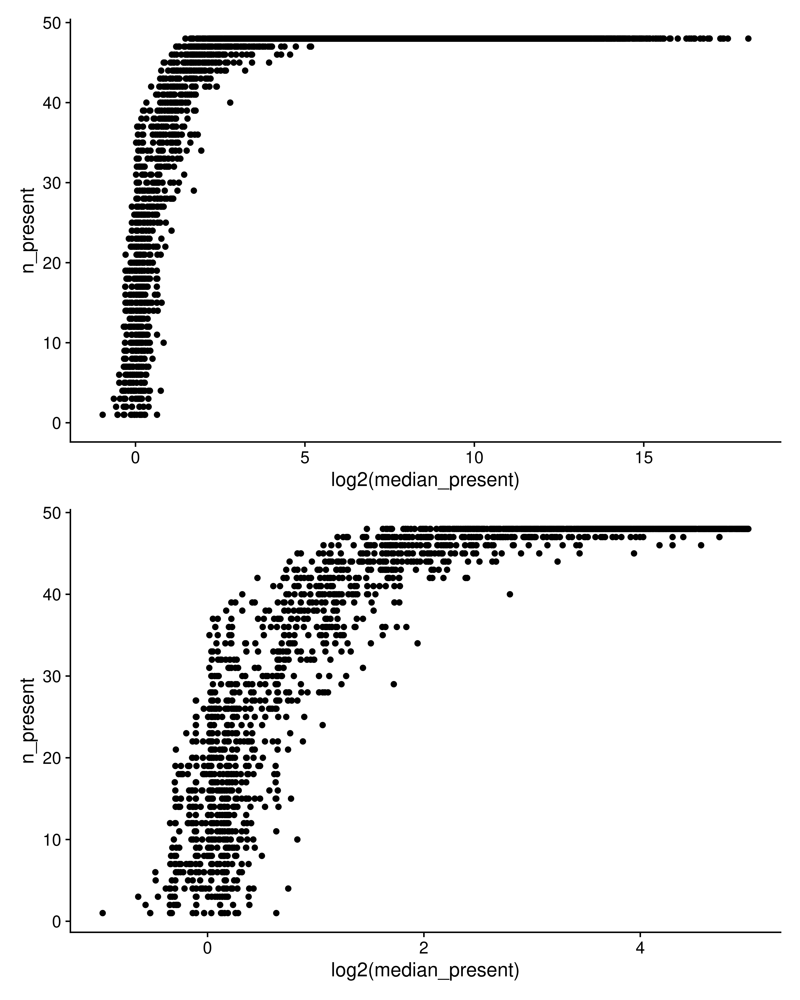
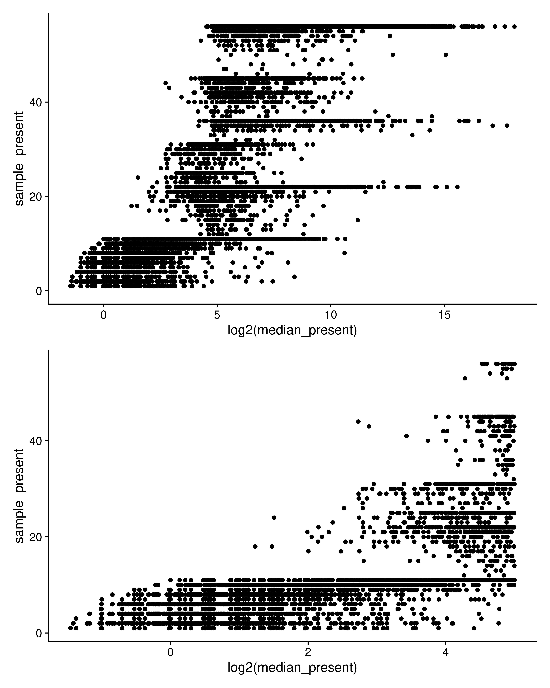
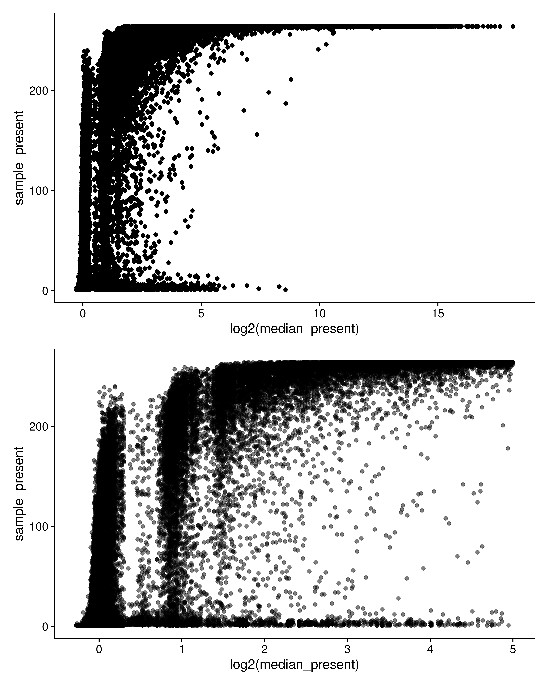
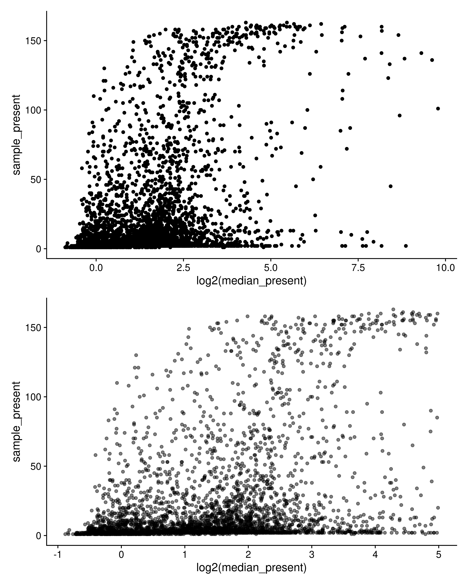

## Yeast

<!-- -->

```
## 
## 	Kendall's rank correlation tau
## 
## data:  yeast_test_cor$median_present and yeast_test_cor$sample_present
## z = 40.017, p-value < 2.2e-16
## alternative hypothesis: true tau is not equal to 0
## sample estimates:
##       tau 
## 0.8298096
```

So here I've taken the Gierlinski Yeast data set, normalized it, and then counted how many samples a value was present in, and what the median value was across all samples (all) and where present (present).

I trimmed to a median_present <= 32, and then run a correlation test between # samples present and median_present using Kendall-tau.

So definitely a relationship in this case.

Will be doing up the rest this morning.

## Brainson


<!-- -->

```
## 
## 	Kendall's rank correlation tau
## 
## data:  brainsonrnaseq_test_cor$median_present and brainsonrnaseq_test_cor$sample_present
## z = 118.06, p-value < 2.2e-16
## alternative hypothesis: true tau is not equal to 0
## sample estimates:
##     tau 
## 0.65447
```

## Tumor

<!-- -->

```
## 
## 	Kendall's rank correlation tau
## 
## data:  adeno_test_cor$median_present and adeno_test_cor$sample_present
## z = 155.53, p-value < 2.2e-16
## alternative hypothesis: true tau is not equal to 0
## sample estimates:
##       tau 
## 0.5555231
```

## NSCLC Metabolomics

<!-- -->

```
## 
## 	Kendall's rank correlation tau
## 
## data:  nsclc_test_cor$median_present and nsclc_test_cor$sample_present
## z = 21.445, p-value < 2.2e-16
## alternative hypothesis: true tau is not equal to 0
## sample estimates:
##       tau 
## 0.2505018
```

Sooo, this one is kinda weird.
